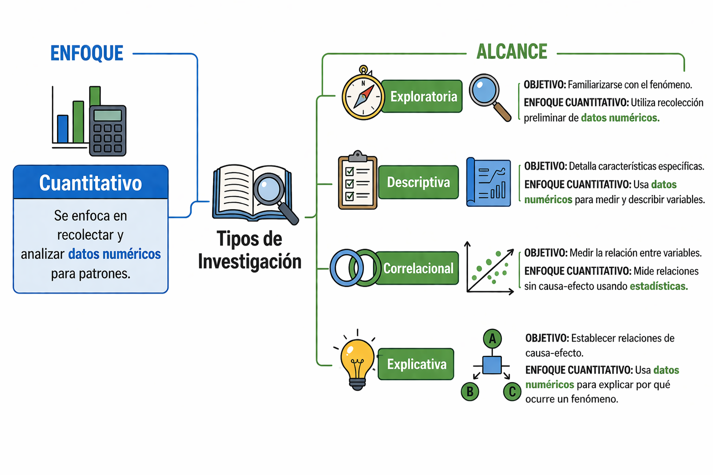
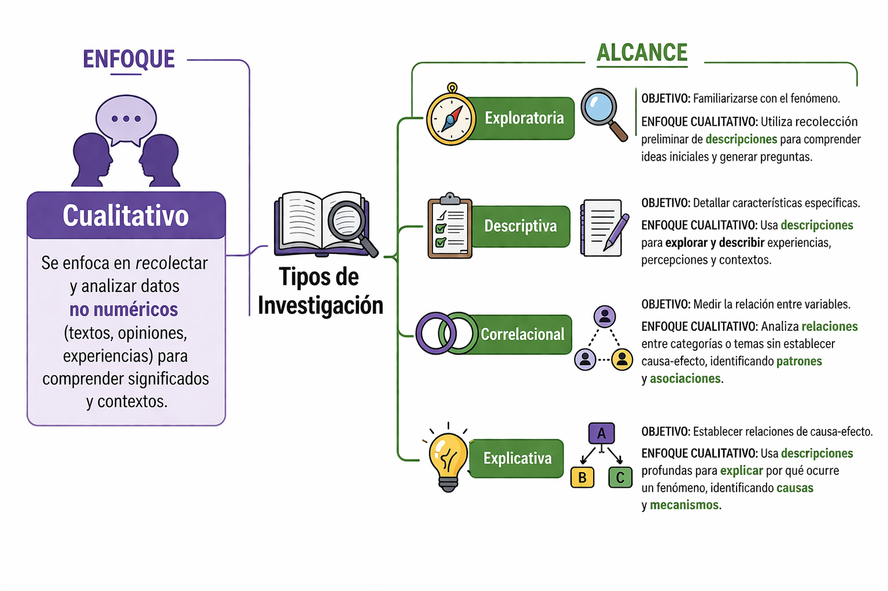

## Andrés Felipe Flórez Rivera

::: columns

::: column

<div style="font-size: 26px;">

::: {.fragment data-fragment-index="1"}
**Educación**
:::

::: {.fragment data-fragment-index="2"}
- **Pregrado en Estadística**<br>
  Universidad Nacional de Colombia.
:::

::: {.fragment data-fragment-index="3"}
- **Maestría en Estadística**<br>
  Universidad Nacional de Colombia.
:::

::: {.fragment data-fragment-index="4"}
- **Doctorado en Ciencias-Estadística**<br>
  Universidad de São Paulo, Brasil.
:::

::: {.fragment data-fragment-index="5"}
- **Postdoctorado en Inteligencia Artificial**<br>
  Universidad de São Paulo, Brasil.
:::

::: {.fragment data-fragment-index="6"}
**Líneas de interés**

- **Estadística Bayesiana.**
- **Inteligencia Artificial.**  
:::
</div>

:::

::: column

<div style="font-size: 26px;">

::: {.fragment data-fragment-index="7"}
**Experiencia profesional**
:::

::: {.fragment data-fragment-index="8"}
- **Lead Data Scientist** – Funcional Health Tech<br>
  Aug 2024 – Mar 2026 · São Paulo, Brasil
:::

::: {.fragment data-fragment-index="9"}
- **Data Science Specialist** – Funcional Health Tech<br>
  Oct 2020 – Aug 2024 · São Paulo, Brasil
:::

::: {.fragment data-fragment-index="10"}
- **Data Analytics Consultant** – Pronóstica SAS<br>
  Nov 2015 – Jan 2016 · Medellín, Colombia
:::

::: {.fragment data-fragment-index="11"}
- **Power User BO4-SAP** – Grupo Empresarial Nutresa<br>
  Feb 2013 – Oct 2015 · Medellín, Colombia
:::

::: {.fragment data-fragment-index="12"}
- **Information Manager** – UNE Telecomunicaciones<br>
  Mar 2011 – Feb 2013 · Medellín, Colombia
:::

::: {.fragment data-fragment-index="13"}
- **Statistics Trainee** – Flores El Trigal<br>
  Feb 2010 – Aug 2010 · Rionegro, Colombia
:::

</div>

:::

:::

## Pasos y tipo de investigación

<div class="fragment fade-up info-box"  style="margin-top: 100px;" data-fragment-index="1">
<h3 class="fragment fade-in" data-fragment-index="1">¿Qué es la investigación?</h3>
<ul>
<li class="fragment fade-in" data-fragment-index="2"style="text-align: justify;">
Es un proceso organizado que busca responder preguntas o resolver problemas mediante la recolección y análisis de datos.
</li>
<li class="fragment fade-in" data-fragment-index="3"style="text-align: justify;">
La investigación permite generar conocimiento y tomar decisiones en cualquier disciplina.
</li>
</ul >
</div>

## Características de la investigación


<div class=twocol>
<div class="card fragment fade-up crispdm-card--gray" data-fragment-index="1">
<ul>
<li class="fragment fade-up" data-fragment-index="2">
Es ordenada (sigue pasos).
</li>
<li class="fragment fade-up" data-fragment-index="3">
Es objetiva (se basa en datos, no en opiniones).
</li>
<li class="fragment fade-up" data-fragment-index="4">
Es verificable (otros pueden replicar el proceso).
</li>
<li class="fragment fade-up" data-fragment-index="5">
Busca resolver problemas o generar conocimiento.
</li>
</ul>
</div>

<div class="card fragment fade-up crispdm-card--gray" data-fragment-index="6">
<h3>Por ejemplo:</h3>

<ul>
<li class="fragment fade-in" data-fragment-index="7" style="font-size: 30px;">**Agronomía**: mejora de cultivos, suelos y producción.</li>
<li class="fragment fade-in" data-fragment-index="8" style="font-size: 30px;">**Biología**: estudio de organismos y ecosistemas.</li>
<li class="fragment fade-in" data-fragment-index="9" style="font-size: 30px;">**Salud**: desarrollo de tratamientos y medicamentos.</li>
<li class="fragment fade-in" data-fragment-index="10" style="font-size: 30px;">**Economía**: análisis de mercados y producción.</li>
<li class="fragment fade-in" data-fragment-index="11" style="font-size: 30px;">**Medio ambiente**: evaluación del impacto ambiental.</li>
</ul>

</div>
</div>


## Pasos de la investigación
<div class="twocol">

<div class="card fragment fade-up crispdm-card--gray"  data-fragment-index="1">
<p style="font-size: 32px; text-align: justify;">
Los pasos de la investigación son un conjunto de etapas organizadas y secuenciales que guían el proceso científico desde la identificación de un problema hasta la obtención de conclusiones basadas en datos.
</p><br>
<h3 class="fragment" style="font-size: 34px;" data-fragment-index="2">Este proceso permite:</h3>
<ul style="padding-left: 30px;">
<li class="fragment" style="font-size: 32px;" data-fragment-index="3">Garantizar orden y coherencia.</li>
<li class="fragment" style="font-size: 32px;" data-fragment-index="4">Obtener resultados confiables.</li>
<li class="fragment" style="font-size: 32px;" data-fragment-index="5">Generar conocimiento válido.</li>
</ul>
</div>

<div class="container">
<div class="fragment box-list" style="background: #a78bfa;" data-fragment-index="6">
1. Observación del problema.
</div>
<div class="fragment box-list" style="background: #3b82f6;" data-fragment-index="8">
2. Planteamiento de la pregunta.    
</div>

<div class="fragment box-list" style="background: #59A14F;" data-fragment-index="9">
3. Formulación de hipótesis.
</div>

<div class="fragment box-list" style="background: #F28E2B;" data-fragment-index="10">
4. Experimentación.
</div>

<div class="fragment box-list" style="background: #B07AA1;" data-fragment-index="11">
5. Análisis de datos.
</div>

<div class="fragment box-list" style="background: #76B7B2;" data-fragment-index="12">
6. Toma de decisiones.
</div>

</div>

</div>


## Observación del problema

<p class="fragment" data-fragment-index="1" style="font-size: 34px; text-align: justify;">
Es la identificación y **descripción inicial** de una situación, **fenómeno** o **problema** que requiere ser estudiado.</p>
<p class="fragment" data-fragment-index="2" style="font-size: 34px; text-align: justify;">
Implica **observar la realidad de manera crítica**, detectar patrones o cambios relevantes y **delimitar qué aspecto específico se desea analizar**, sirviendo como punto de partida para todo el proceso de investigación.
</p><br>
<h4 class="fragment" data-fragment-index="3">
Ejemplos:
</h4>
<ul style="font-size: 34px; margin-left: 60px;">
<li class="fragment" data-fragment-index="4">
Disminución de la producción agrícola.
</li>
<li class="fragment" data-fragment-index="5">
Bajo rendimiento académico.
</li>
<li class="fragment" data-fragment-index="6">
Aumento de casos de una enfermedad en una población.
</li>
</ul>


## Planteamiento de la pregunta
<p class="fragment" data-fragment-index="1" style="font-size: 34px; text-align: justify;">
Es el paso en el que se **formula** de manera clara, específica y medible lo que se **desea investigar**. Implica transformar el problema identificado en una **pregunta concreta**, delimitando:
</p>
<ul style="font-size: 34px; margin-left: 60px;">
<li class="fragment" data-fragment-index="2">
la población o fenómeno de interés.
</li>
<li class="fragment" data-fragment-index="3">
las variables involucradas.
</li>
<li class="fragment" data-fragment-index="4">
el posible tipo de relación entre ellas.
</li>
</ul>

<h4 class="fragment" data-fragment-index="5">
Se pantean preguntas como:
</h4>

<ul style="font-size: 34px; margin-left: 60px;">
<li class="fragment" data-fragment-index="6">
¿Cómo influye el fertilizante en la producción?
</li>
<li class="fragment" data-fragment-index="7">
¿Qué factores afectan el rendimiento académico?
</li>
</ul>


## Formulación de hipótesis
<p class="fragment" data-fragment-index="1" style="font-size: 34px; text-align: justify;">
Es la propuesta de una explicación tentativa o posible respuesta a la pregunta de investigación.
</p>
<p class="fragment" data-fragment-index="2" style="font-size: 34px; text-align: justify;">
Se basa en conocimientos previos, teoría o evidencia, y establece una relación esperada entre variables, que posteriormente será evaluada con datos permitiendo:
</p>
<ul style="font-size: 34px; margin-left: 60px;">
<li class="fragment" data-fragment-index="3">Orientar el diseño del estudio </li>
<li class="fragment" data-fragment-index="4">Definir qué variables se deben medir </li>
<li class="fragment" data-fragment-index="5">Permitir la verificación mediante análisis estadístico </li>
</ul>
<h4 class="fragment" data-fragment-index="6">
Algunas hipótesis pueden ser:
</h4>
<ul style="font-size: 34px; margin-left: 60px;">
<li class="fragment" data-fragment-index="7">El fertilizante aumenta la producción.</li>
<li class="fragment" data-fragment-index="8">Las horas luz aumentan en 5cm el crescimiento del tallo</li>
</ul>


## Experimentación

<p class="fragment" data-fragment-index="1" style="font-size: 34px; text-align: justify;">
Se define cómo se obtendrán los datos para evaluar la hipótesis. Implica diseñar un procedimiento sistemático para recolectar información, controlando las condiciones y asegurando que los datos sean válidos y confiables.
</p>
<h4 class="fragment" data-fragment-index="2">
¿Qué implica?
</h4>

<ul style="font-size: 34px; margin-left: 60px;">
<li class="fragment" data-fragment-index="3">Seleccionar el tipo de estudio (experimental u observacional)</li>
<li class="fragment" data-fragment-index="4">Definir la población o muestra</li>
<li class="fragment" data-fragment-index="5">Establecer las variables a medir</li>
</ul>
<h4 class="fragment" data-fragment-index="6">
Ejemplos
</h4>
<ul style="font-size: 34px; margin-left: 60px;">
<li class="fragment" data-fragment-index="7">Comparar el crecimiento de flores usando distintos tipos de fertilizante.</li>
<li class="fragment" data-fragment-index="8">Evaluar el efecto de diferentes cantidades de luz en el crecimiento del tallo.</li>
<li class="fragment" data-fragment-index="9">Evaluar el efecto de distintos tipos de suelo en el crecimiento de plantas.</li>
</ul>

## Análisis de datos
<p class="fragment" data-fragment-index="1" style="font-size: 34px; text-align: justify;">
Se organizan, procesan e interpretan los datos recolectados. Implica aplicar **herramientas estadísticas** para **resumir** la información, **identificar** patrones o tendencias, **explorar** relaciones entre variables y evaluar la hipótesis planteada.
</p>

<h4 class="fragment" data-fragment-index="2">
Ejemplos
</h4>
<ul style="font-size: 34px; margin-left: 60px;">
<li class="fragment" data-fragment-index="3">Elaborar tablas de frecuencia y gráficos.</li>
<li class="fragment" data-fragment-index="4">Calcular medidas descriptivas.</li>
<li class="fragment" data-fragment-index="5">Comparar rendimientos entre tratamientos.</li>
</ul>

## Conclusiones y toma de decisiones

<p class="fragment" data-fragment-index="1" style="font-size: 34px; text-align: justify;">
Se interpretan los resultados obtenidos y se responde la pregunta de investigación. Se analiza la evidencia para aceptar o rechazar la hipótesis y tomar decisiones basadas en los datos.
</p>
<h4 class="fragment" data-fragment-index="2">
¿Qué implica?
</h4>
<ul style="font-size: 34px; margin-left: 60px;"
<li class="fragment" data-fragment-index="3">Interpretar los resultados del análisis</li>
<li class="fragment" data-fragment-index="4">Evaluar si la hipótesis es consistente con los datos</li>
<li class="fragment" data-fragment-index="5">Formular conclusiones claras y justificadas</li>
<li class="fragment" data-fragment-index="6">Apoyar la toma de decisiones con evidencia</li>
</ul>
<h4 class="fragment" data-fragment-index="7">
Ejemplos
</h4>
<ul style="font-size: 34px; margin-left: 60px;">
<li class="fragment" data-fragment-index="8">El ambiente de estudio adecuado mejoró el rendimiento académico</li>
<li class="fragment" data-fragment-index="9">Se determina cuál tratamiento es mejor para la producción</li>
</ul>


## Ilustración:

<ul style="font-size: 34px; margin-left: 60px;">
<li class="fragment" data-fragment-index="1">Problema: baja producción de maíz</li>
<li class="fragment" data-fragment-index="2">Pregunta: ¿El fertilizante mejora la producción?</li>
<li class="fragment" data-fragment-index="3">Hipótesis:

::: {.fragment data-fragment-index="4"}
$$H_{0}: \mu_{fertilizado} - \mu_{sin-fertilizar} = 0$$
:::

::: {.fragment data-fragment-index="5"}
$$H_{1}: \mu_{fertilizado} - \mu_{sin-fertilizar} > 0$$
:::

</li>
<li class="fragment" data-fragment-index="6">Experimentación: siembra en parcelas con y sin fertilizante.</li>
<li class="fragment" data-fragment-index="7">Análisis: comparación de medias (ANOVA)</li>
<li class="fragment" data-fragment-index="8">Conclusión: determinar si el fertilizante mejora la producción</li>
</ul>

## Enfoque y Alcance

<div class="twocol" style="margin-top: 100px; align-items: stretch;">

<div class="card fragment fade-up evolucion-card" data-fragment-index="1"
     style="background:#f8fafc; border:1px solid #e5e7eb; border-top: 6px solid #60a5fa; border-radius: 22px; padding: 26px 28px; box-shadow: 0 8px 22px rgba(0,0,0,0.05);">
<h3 style="margin-bottom:16px; font-size: 1.35em;">Investigación según enfoque</h3>
La investigación según enfoque se refiere a **la forma** en que se **recolectan**, **analizan **e **interpretan** los **datos** para estudiar un fenómeno.
</div>

<div class="card fragment fade-up autores-card" data-fragment-index="2"
     style="top:80; background:#fafaf9; border:1px solid #e5e7eb; border-top: 6px solid #34d399; border-radius: 22px; padding: 26px 28px; box-shadow: 0 8px 22px rgba(0,0,0,0.05);">
<h3 style="margin-top:0; margin-bottom:16px; font-size: 1.35em;">Investigación según alcance</h3>
La investigación según alcance se refiere al **nivel de profundidad** o hasta dónde se quiere llegar **en el estudio** de un fenómeno. Es decir, indica qué tanto se va a investigar o explicar.

</div>

</div>


## Investigación según enfoque

<div class="fragment fade-up info-box"  style="margin-top: 100px;" data-fragment-index="1">
<p class="fragment fade-in" data-fragment-index="1">Indica cómo se realiza el estudio. Es decir, el enfoque determina si la investigación:</p>
<ul style="font-size: 36px; margin-left: 60px;">
<li class="fragment fade-in" data-fragment-index="2"style="text-align: justify;">
**Usa datos numéricos:** Enfoque cuantitativo.
</li>
<li class="fragment fade-in" data-fragment-index="3"style="text-align: justify;">
**Usa descripciones:** Enfoque cualitativo.
</li>
<li class="fragment fade-in" data-fragment-index="4"style="text-align: justify;">
**Combina ambos (datos numéricos y descripciones):** Enfoque mixto.
</li>
</ul >
</div>


## Según enfoque: investigación cuantitativa

<p class="fragment" data-fragment-index="1" style="font-size: 34px; text-align: justify; margin-top: 80px;">
Es un tipo de investigación que se basa en la recolección y **análisis de datos numéricos** para responder preguntas o comprobar hipótesis. Utiliza mediciones, cálculos y herramientas estadísticas.
</p>
<h4 class="fragment" data-fragment-index="2">
Ejemplo:
</h4>
<ul style="font-size: 34px; margin-left: 60px;">
<li class="fragment" data-fragment-index="3">**Pregunta:** ¿El tiempo de estudio influye en las calificaciones?</li>
<li class="fragment" data-fragment-index="4">**Datos:** horas de estudio y notas.</li>
<li class="fragment" data-fragment-index="5">**Análisis:** comparación de promedios.</li>
<li class="fragment" data-fragment-index="6">**Resultado:** se determina si existe relación entre ambas variables.</li>
</ul>


## Según enfoque: investigación cualitativa

<p class="fragment" data-fragment-index="1" style="font-size: 34px; text-align: justify; margin-top: 80px;">
Es un tipo de investigación que busca describir y comprender fenómenos a partir de observaciones, percepciones o experiencias, sin centrarse en mediciones numéricas.
</p>
<h4 class="fragment" data-fragment-index="2">
Ejemplo:
</h4>
<ul style="font-size: 34px; margin-left: 60px;">
<li class="fragment" data-fragment-index="3">Describir el estado de las plantas (color, aspecto, daño)</li>
<li class="fragment" data-fragment-index="4">Identificar tipos de suelo según sus características</li>
<li class="fragment" data-fragment-index="5">Registrar la presencia de plagas y su comportamiento</li>
</ul>
<p class="fragment" data-fragment-index="6" style="font-size: 34px; text-align: justify;">
*No busca medir cuánto, sino comprender cómo y por qué ocurre un fenómeno.*
</p>

## Según enfoque: Investigación mixta

<p class="fragment" data-fragment-index="1" style="font-size: 34px; text-align: justify; margin-top: 80px;">
Es aquella que combina el enfoque cuantitativo y cualitativo, utilizando tanto datos numéricos como descriptivos para obtener un análisis más completo.
</p>
<h4 class="fragment" data-fragment-index="2">
Ejemplo:
</h4>
<ul style="font-size: 34px; margin-left: 60px;">
<li class="fragment" data-fragment-index="3">Medir la producción del cultivo (cuantitativa).</li>
<li class="fragment" data-fragment-index="4">Evaluar características del cultivo como color, tamaño o presencia de plagas (cualitativa).</li>
<li class="fragment" data-fragment-index="5">Estudiantes con mas horas de estudio (cuantitativa).</li>
<li class="fragment" data-fragment-index="6">Percepción de la calidad educativa (cualitativa).</li>
</ul>
<p class="fragment" data-fragment-index="7" style="font-size: 34px; text-align: justify;">
*No es hacer dos estudios separados, sino integrar ambos en uno solo.*
</p>


## Investigación según alcance

<div class="fragment fade-up info-box"  style="margin-top: 100px;" data-fragment-index="1">
<p class="fragment fade-in" data-fragment-index="1">
Se refiere al nivel de profundidad o hasta dónde se quiere llegar en el estudio de un fenómeno. Es decir, indica qué tanto se va a investigar o explicar, pudiendo ser:
</p>
<ul style="font-size: 36px; margin-left: 60px;">
<li class="fragment fade-in" data-fragment-index="2"style="text-align: justify;">
**Exploratoria**: se aproxima al problema y lo reconoce.
</li>
<li class="fragment fade-in" data-fragment-index="3"style="text-align: justify;">
**Descriptiva**: caracteriza el fenómeno.
</li>
<li class="fragment fade-in" data-fragment-index="4"style="text-align: justify;">
**Correlacional**: analiza la relación entre variables.
</li>
<li class="fragment fade-in" data-fragment-index="5"style="text-align: justify;">
**Explicativa**: identifica causas y efectos.
</li>
</ul >
</div>


## Según alcance: investigación exploratoria

<p class="fragment" data-fragment-index="1" style="font-size: 34px; text-align: justify;">
Es un tipo de investigación que se realiza cuando el problema ha sido poco estudiado o existe escasa información. Su propósito es comprender el fenómeno, identificar variables relevantes y generar ideas para estudios posteriores. No busca conclusiones definitivas, sino:
</p>
<ul style="font-size: 34px; margin-left: 60px;">
<li class="fragment" data-fragment-index="2">Explorar el problema</li>
<li class="fragment" data-fragment-index="3">Identificar posibles variables</li>
<li class="fragment" data-fragment-index="4">Plantear preguntas e hipótesis iniciales</li>
</ul>
<h4 class="fragment" data-fragment-index="5">
Algunos ejemplos:
</h4>
<ul style="font-size: 34px; margin-left: 60px;">
<li class="fragment" data-fragment-index="6">Investigar tendencias de consumo en un mercado emergente.</li>
<li class="fragment" data-fragment-index="7">Explorar hábitos de vida en una población poco estudiada.</li>
<li class="fragment" data-fragment-index="8">Identificar la presencia de una plaga desconocida.</li>
</ul>


## Según alcance: investigación descriptiva 

<p class="fragment" data-fragment-index="1" style="font-size: 34px; text-align: justify;">
Tiene como objetivo detallar y caracterizar un fenómeno, identificando sus propiedades, características y comportamientos. Se enfoca en responder preguntas como ¿**cómo es**?, ¿**cómo se presenta**? y ¿**qué características tiene**?, sin buscar explicar sus causas.
</p>

<ul style="font-size: 34px; margin-left: 60px;">
<li class="fragment" data-fragment-index="2">Se usa cuando el fenómeno ya es conocido</li>
<li class="fragment" data-fragment-index="3">Busca detallar y caracterizar</li>
<li class="fragment" data-fragment-index="4">Resultado: información organizada del fenómeno</li>
</ul>
<h4 class="fragment" data-fragment-index="5">
Algunos ejemplos:
</h4>
<ul style="font-size: 34px; margin-left: 60px;">
<li class="fragment" data-fragment-index="6">Analizar características del suelo (textura, humedad).</li>
<li class="fragment" data-fragment-index="7">Analizar características demográficas de una población.</li>
<li class="fragment" data-fragment-index="8">Describir el rendimiento académico de estudiantes.</li>
</ul>

## Según alcance: investigación correlacional

<p class="fragment" data-fragment-index="1" style="font-size: 34px; text-align: justify;">
La investigación correlacional tiene como objetivo **identificar y medir la relación entre dos o más variables**, evaluando si estas cambian de manera conjunta. Es importante destacar que **no establece relaciones de causa y efecto**, sino que únicamente indica la existencia de asociación entre ellas.
</p>

<ul style="font-size: 34px; margin-left: 60px;">
<li class="fragment" data-fragment-index="2">Analiza la relación entre variables</li>
<li class="fragment" data-fragment-index="3">Evalúa si las variables cambian conjuntamente</li>
<li class="fragment" data-fragment-index="4">Permite identificar asociaciones entre fenómenos</li>
</ul>
<h4 class="fragment" data-fragment-index="5">
Algunos ejemplos:
</h4>
<ul style="font-size: 34px; margin-left: 60px;">
<li class="fragment" data-fragment-index="6">Relación entre lluvia y producción agrícola.</li>
<li class="fragment" data-fragment-index="7">Relación entre uso de fertilizante y crecimiento de plantas.</li>
<li class="fragment" data-fragment-index="8">Relación entre temperatura y desarrollo de la planta.</li>
</ul>

## Según alcance: investigación explicativa

<p class="fragment" data-fragment-index="1" style="font-size: 34px; text-align: justify;">
La investigación explicativa busca **identificar las causas de un fenómeno**, explicando por qué ocurre y bajo qué condiciones, mediante el establecimiento de relaciones de causa y efecto.
</p>

<ul style="font-size: 34px; margin-left: 60px;">
<li class="fragment" data-fragment-index="2">Busca causas.</li>
<li class="fragment" data-fragment-index="3">Responde por qué ocurre.</li>
<li class="fragment" data-fragment-index="4">Suele implicar experimentos o diseños más rigurosos.</li>
</ul>
<h4 class="fragment" data-fragment-index="5">
Algunos ejemplos:
</h4>
<ul style="font-size: 34px; margin-left: 60px;">
<li class="fragment" data-fragment-index="10">Estudiar las causas de una enfermedad.</li>
<li class="fragment" data-fragment-index="12">Determinar por qué un fertilizante aumenta la producción.</li>
<li class="fragment" data-fragment-index="13">Analizar las causas de una plaga en un cultivo.</li>
<li class="fragment" data-fragment-index="14">Evaluar el efecto del riego en el crecimiento de plantas.</li>
</ul>


## Resumen enfoque cuantitativo

<div style="text-align: center;">

</div>

## Resumen enfoque cualitativo

<div style="text-align: center;">

</div>


## Conclusiones

<p class="fragment" data-fragment-index="1" style="font-size: 34px; text-align: justify;">
La investigación es un proceso que permite generar conocimiento a partir del análisis de datos.
</p>

<div class=twocol>
<div class="card fragment fade-up crispdm-card--gray" data-fragment-index="1">
<h4>Según enfoque (cómo se investiga)</h4>
<ul>
<li class="fragment fade-up" data-fragment-index="2">
**Cuantitativo**: mide fenómenos con datos numéricos.
</li>
<li class="fragment fade-up" data-fragment-index="3">
**Cualitativo**: describe y comprende características.
</li>
<li class="fragment fade-up" data-fragment-index="4">
Es verificable (otros pueden replicar el proceso).
</li>
<li class="fragment fade-up" data-fragment-index="5">
**Mixto**: combina ambos enfoques
</li>
</ul>
</div>

<div class="card fragment fade-up crispdm-card--gray" data-fragment-index="6">
<h4>Según alcance (hasta dónde se investiga)</h4>

<ul>
<li class="fragment fade-in" data-fragment-index="7" style="font-size: 30px;">Exploratoria: permite conocer un problema.</li>
<li class="fragment fade-in" data-fragment-index="8" style="font-size: 30px;">Descriptiva: caracteriza un fenómeno.</li>
<li class="fragment fade-in" data-fragment-index="9" style="font-size: 30px;">Correlacional: identifica relaciones entre variables.</li>
<li class="fragment fade-in" data-fragment-index="10" style="font-size: 30px;">Explicativa: determina causas y efectos.</li>
<li class="fragment fade-in" data-fragment-index="11" style="font-size: 30px;">Predictiva: anticipa resultados futuros.</li>
</ul>

</div>
</div>


## Definiciones Iniciales en estadística {.center .middle}


## 

::: {.callout-note style="margin-top: 150px;text-align:justify"}

# ¿Que es la estadística? {auto-animate=true }

<ul style="font-size: 34px; text-align: justify;">
<li class="fragment fade-up" data-fragment-index="1">
Es una rama de las matemáticas que permite **recolectar, analizar e interpretar datos**.
</li>
<li class="fragment fade-up" data-fragment-index="2">
Es fundamental en la ciencia para **tomar decisiones basadas en evidencia**.   
</li>
<li class="fragment fade-up" data-fragment-index="3">
Se basa en el estudio de **muestras** para hacer inferncias sobre **poblaciones**.
</li>
</ul>

:::


## Tipos de estadística

La estadística se divide en dos grandes ramas:

<div class="card-stack">

<div class="card fragment fade-up evolucion-card" data-fragment-index="1"
     style="background:#f8fafc; border:1px solid #e5e7eb; border-top: 6px solid #60a5fa; border-radius: 22px; padding: 26px 28px; box-shadow: 0 8px 22px rgba(0,0,0,0.05);">

<h4 style="margin-bottom:16px; font-size: 1.35em;">Estadística descriptiva</h4>

<p class="fragment fade-in" style="font-size: 30px; text-align: justify;" data-fragment-index="1">
La estadística descriptiva es la rama de la estadística que se encarga de **organizar**, **resumir** y **presentar datos**, utilizando **tablas**, **gráficos** y medidas numéricas como la **media**, **mediana**, **moda**, **varianza** y **desviación estándar**, con el fin de describir sus características sin realizar generalizaciones.
</p>

<ul style="font-size: 30px; text-align: justify;">
<li class="fragment fade-up" data-fragment-index="2">
**Ejemplo:** promedio de notas, histogramas, tablas de frecuencia.
</li>
</ul> 

</div>

<div class="card fragment fade-up evolucion-card" data-fragment-index="3"
     style="background:#f8fafc; border:1px solid #e5e7eb; border-top: 6px solid #60a5fa; border-radius: 22px; padding: 26px 28px; box-shadow: 0 8px 22px rgba(0,0,0,0.08);">

<h4 style="margin-bottom:16px; font-size: 1.35em;">Estadística inferencial</h4>
<p class="fragment fade-in" style="font-size: 30px; text-align: justify;" data-fragment-index="3">
la estadística inferencial es la rama de la estadística que permite obtener conclusiones y tomar decisiones sobre una población a partir de una muestra, mediante el uso de medidas como estimaciones, intervalos de confianza, pruebas de hipótesis y modelos probabilísticos.
</p>

<ul style="font-size: 30px; text-align: justify;">
<li class="fragment fade-up" data-fragment-index="4">
Estimar el promedio de estudiantes de toda una universidad.
</li>
<li class="fragment fade-up" data-fragment-index="5">  
Evaluar si un medicamento es efectivo.  
</li>
<li class="fragment fade-up" data-fragment-index="6">  
Realizar una prueba de hipótesis. 
</li>
</ul> 

</div>

</div>

## Descriptiva vs Inferencial 

<p class="fragment" data-fragment-index="1" style="font-size: 34px; text-align: justify;">
Los tipos de Estadística, **descriptiva** e **inferencial**, son **complementarios** en el análisis de datos: 
</p>
<ul style="font-size: 34px; text-align: justify;">
<li class="fragment fade-up" data-fragment-index="2">
La primera permite organizar, resumir y comprender la información mediante medidas numéricas.
</li>
<li class="fragment fade-up" data-fragment-index="3">
La segunda posibilita interpretar, generalizar resultados y tomar decisiones sobre una población. 
</li>
</ul>


<p class="fragment" data-fragment-index="4" style="font-size: 34px; text-align: justify;">
La estadística descriptiva resume los datos, mientras que la inferencial permite sacar conclusiones y tomar decisiones, siendo ambas esenciales en el análisis cuantitativo.
</p>

## Definiciones Iniciales en estadística


<div class="card fragment fade-up " data-fragment-index="1"
     style="margin-top: 100px; background:#f8fafc; border:1px solid #e5e7eb; border-top: 6px solid #60a5fa; border-radius: 22px; padding: 26px 28px; box-shadow: 0 8px 22px rgba(0,0,0,0.05);">

<h4 style="margin-bottom:16px; font-size: 1.35em;">Bioestadística</h4>

<p class="fragment fade-in" style="font-size: 30px; text-align: justify;" data-fragment-index="1">
Es una herramienta fundamental para el análisis de datos en las **ciencias de la vida**, ya que permite interpretar **fenómenos biológicos**, evaluar procesos de salud y optimizar la producción agrícola mediante el uso de métodos estadísticos. Su **aplicación** en áreas como la **medicina**, la *biología* y la **Agronomía** contribuye a la toma de decisiones basadas en evidencia y al desarrollo científico.
</p>
</div>


## Definiciones Iniciales en estadística

<div class="card fragment fade-up " data-fragment-index="1"
     style="margin-top: 90px; background:#f8fafc; border:1px solid #e5e7eb; border-top: 6px solid #60a5fa; border-radius: 22px; padding: 26px 28px; box-shadow: 0 8px 22px rgba(0,0,0,0.05);">

<h4 style="margin-bottom:16px; font-size: 1.35em;">Población</h4>

<p class="fragment fade-in" style="font-size: 30px; text-align: justify;" data-fragment-index="1">
Es el conjunto total de elementos, individuos o unidades de estudio que comparten una o varias características de interés dentro de una investigación. La población puede ser finita o infinita y constituye el universo sobre el cual se desean obtener conclusiones. A seguir algunos ejemplos:
</p>

<ul style="margin-left: 60px; font-size: 30px; text-align: justify;">
<li class="fragment fade-up" data-fragment-index="2">
Todos los estudiantes de una universidad.
</li>
<li class="fragment fade-up" data-fragment-index="3">
Todos los cultivos de maíz en una finca.
</li>
<li class="fragment fade-up" data-fragment-index="4">
Todos los pacientes de un hospital.
</li>
<li class="fragment fade-up" data-fragment-index="5">
Todos los habitantes de una ciudad.
</li>
</ul>
</div>


## Definiciones Iniciales en estadística

<div class="card fragment fade-up " data-fragment-index="1"
     style="margin-top: 90px; background:#f8fafc; border:1px solid #e5e7eb; border-top: 6px solid #60a5fa; border-radius: 22px; padding: 26px 28px; box-shadow: 0 8px 22px rgba(0,0,0,0.05);">

<h4 style="margin-bottom:16px; font-size: 1.35em;">Muestra</h4>

<p class="fragment fade-in" style="font-size: 30px; text-align: justify;" data-fragment-index="1">
Es un **subconjunto** representativo de la **población**, seleccionado con el propósito de **analizar** sus **características** y hacer **inferencias** sobre el total de la población, especialmente cuando no es posible estudiar todos sus elementos, por ejemplo:
</p>

<ul style="margin-left: 60px; font-size: 30px; text-align: justify;">
<li class="fragment fade-up" data-fragment-index="2">
100 estudiantes seleccionados.
</li>
<li class="fragment fade-up" data-fragment-index="3">
20 parcelas de cultivo analizadas.
</li>
<li class="fragment fade-up" data-fragment-index="4">
50 pacientes encuestados.
</li>
<li class="fragment fade-up" data-fragment-index="5">
200 personas de una ciudad.
</li>
</ul>
</div>


## Definiciones Iniciales en estadística
::: {.fragment} 
- **Censo:** un censo es un método de recolección de datos que consiste en estudiar y obtener información de todos los elementos que conforman una población, sin recurrir a muestras, con el fin de describir sus características de manera completa y precisa.
:::
::: {.fragment}
**Ejemplos:** 
:::
::: {.fragment}
- Contar todos los habitantes de un país.
- Registrar todos los estudiantes de una universidad.
- Evaluar todos los cultivos de una finca.
- Analizar todos los empleados de una empresa.
:::

## Definiciones Iniciales en estadística
::: {.fragment} 
- **Variable:** es una característica o atributo que puede tomar diferentes valores en los elementos de una población o muestra. 
Las variables pueden ser cualitativas o cuantitativas, y son la base para el análisis estadístico.
:::
::: {.fragment}
**Ejemplos:**
:::
::: {.fragment}
- Edad.
- Estatura.
- Tipo de cultivo.
- Nivel de ingreso.
:::

## Definiciones Iniciales en estadística
::: {.fragment}
- **Dato:** es el valor específico que toma una variable para un individuo o unidad de estudio. 
Los datos constituyen la materia prima del análisis estadístico y pueden presentarse en forma numérica o categórica.  
:::
::: {.fragment}
**Ejemplos:** 
::: 
::: {.fragment}
- Edad = 21 años
- Estatura = 1.70 m
- Peso = 65 kg
- Cultivo = maíz
- Ingreso = $1.500.000
:::

## Definiciones Iniciales en estadística
::: {.fragment}
- **Parámetro:** Es una medida numérica que describe una característica de la población, como la media o la proporción, y generalmente es desconocida, por lo que se estima a partir de una muestra.
:::
::: {.fragment} 
**Ejemplos:**
::: 
::: {.fragment}
- Promedio de edad de todos los estudiantes.
- Producción promedio de toda una finca.
- Porcentaje total de pacientes recuperados.
- Ingreso promedio de una ciudad.
:::

## Definiciones Iniciales en estadística
::: {.fragment}
- **Estadístico:** es una medida numérica calculada a partir de los datos de una muestra, utilizada para describirla y para estimar parámetros poblacionales.
:::
::: {.fragment}
**Ejemplos:**
:::
::: {.fragment}
- Promedio de edad de 100 estudiantes.
- Producción promedio de 20 parcelas.
- Porcentaje de recuperación en 50 pacientes.
- Ingreso promedio de 200 personas.
:::

## Tipos de variables  
::: {.fragment}
- Las variables son características o atributos que pueden tomar diferentes valores en los elementos de una población o muestra, y son fundamentales para el análisis estadístico, ya que permiten describir, comparar y establecer relaciones entre los datos.
- Las variables pueden ser clasificadas en variables cuantitativas y variables cualitativas.
:::

## Tipos de variables
::: {.fragment}
- **Variables cuantitativas:**  las variables cuantitativas se atribuyen a mediciones numéricas y se pueden clasificar en variables cuantitativas continuas y cuantitativas discretas.
:::
::: {.fragment}
**Ejemplos:**
:::
::: {.fragment}
- Edad (años).
- Peso (kg).
- Número de hijos.
- Temperatura (°C).
- Número de estudiantes en un salón.
:::

## Tipos de variables
::: {.fragment}
- **Variable cuantitativa continua: ** es una variable que puede tomar cualquier valor dentro de un intervalo de números reales, incluyendo valores decimales, ya que resulta de mediciones. 
Este tipo de variable se caracteriza por tener infinitos valores posibles entre dos puntos.
::: 
::: {.fragment}
- **Ejemplos:**
:::
::: {.fragment}
 - Peso. 
 - Promedio académico.
 - Tiempo de estudio (horas).
 - Producción de un cultivo (toneladas).
:::

## Tipos de variables  
:::{.fragment}
- **Variable cuantitativa discreta:** es aquella que toma valores numéricos enteros y contables, sin admitir valores intermedios o decimales, ya que resulta de un proceso de conteo.  
:::
::: {.fragment}
**Ejemplos:**
:::
::: {.fragment}
- Número de hijos (0, 1, 2, 3…)
- Número de estudiantes en un salón.
- Cantidad de carros en un parqueadero.
- Número de llamadas recibidas.
:::

## Tipos de variables
::: {.fragment}
- **Variables cualitativas:**  son variables que no toman valores numéricos sino que se refieren a atributos, clases o categorías y pueden clasificarse en nominales y ordinales.
:::
::: {.fragment}
**Ejemplos:**
:::
::: {.fragment}
- Género (masculino, femenino, otro).
- Estado civil (soltero, casado, divorciado).
- Color de ojos (azul, café, verde).
- Nivel educativo (primaria, secundaria, universidad)
:::

## Tipos de variables  
::: {.fragment}
- **Variable cualitativa nominal:** son atributos que se clasifican en grupos, pero ninguno es mayor o mejor que otro.  
:::
::: {.fragment}
**Ejemplos:**
:::
::: {.fragment}
- Color de ojos.
- Color de la flor.
- Género.
- Tipo de suelo.
:::

## Tipos de variables
::: {.fragment}
- **Variable cualitativa ordinal:**  son variables donde la categoría tiene un orden o una jerarquía.
:::
::: {.fragment}  
**Ejemplos:**
:::
::: {.fragment}
- Nivel de calidad (bajo, medio, alto).
- Clasificaciones (oro, plata, bronce).
- Rendimiento académico (insuficiente, regular, bien, muy bien, excelente).
:::

## Tipos de variables  
### Ejercicio
::: {.fragment} 
- Clasifica las variables
:::
::: {.fragment}
1. Peso del recién nacido.  
2. Numero de hojas.  
3. Altura de las plantas.  
4. Color de ojos.  
5. Nivel de satisfacción.  
6. Peso del fruto.  
:::

## Tipos de variables
### Solución
::: {.fragment}
1. Peso del recién nacido: variable cuantitativa continua.
2. Numero de hojas: variable cuantitativa discreta.
3. Altura de las plantas: variable cuantitativa continua.
4. Color de ojos: variable cualitativa nominal.
5. Nivel de satisfacción: variable cualitativa ordinal.
6. Peso del fruto: variable cuantitativa continua.
:::

## Escalas de medición  
::: {.fragment}
- Las escalas de medición son formas de clasificar y medir las variables según el tipo de información que representan.  
Nos indican como podemos analizar los datos.
:::
::: {.fragment}
- Las escalas de medición mas utilizadas son:
:::
::: {.fragment}
1. Escala nominal.  
2. Escala ordinal.  
3. Escala de intervalo.  
4. Escala de razón.  
:::

## Escalas de medición 
::: {.fragment} 
1. **Escala nominal**: la escala nominal clasifica los datos en categorías sin un orden.  
:::
::: {.fragment}
Ejemplos:  
:::
::: {.fragment}
- Tipo de cultivo: maíz, arroz, café.  
- Presencia de plaga: si, no. 
- Tipo de sangre: A, B, AB, O.  
:::

## Escalas de medición 
::: {.fragment} 
2. **Escala ordinal**: la escala ordinal clasifica los datos en categorías con orden, pero sin medir la diferencia exacta entre ellas.  
:::
::: {.fragment}
**Ejemplos:**  
:::
::: {.fragment}
- Nivel de calidad: bajo, medio, alto.  
- Clasificación: primer lugar, segundo lugar, tercer lugar.  
- Nivel de humedad: bajo, medio, alto.  
:::

## Escalas de medición
::: {.fragment}  
3. **Escala de intervalo**: la escala de intervalo permite medir diferencias entre valores, pero no tiene un cero real.  
:::
::: {.fragment}
**Ejemplos:**  
:::
::: {.fragment}
- Temperatura en grados Celsius o Fahrenheit.  
- Años del calendario.  
- Hora del día.  
**El cero no significa ausencia total.**
:::

## Escalas de medición 
::: {.fragment} 
4. **Escala de razón**: la escala de razón permite diferencias y además tiene un cero real (ausencia total).  
:::
::: {.fragment}
**Ejemplos:**  
:::
::: {.fragment}
- Altura de plantas.  
- Ingresos.  
- Edad.  
- Peso.  
**La escala de razón tiene cero real, mientras que la escala de intervalo no.**
:::

## Escalas de medición  
::: {.fragment}
- Clasifique las siguientes variables según su escala de medición.  
:::
::: {.fragment}  
1. Color de ojos.  
2. Nivel de satisfacción (bajo, medio, alto)  
3. Temperatura (◦C)  
4. Edad. 
5. Tipo de sangre. 
6. Puesto en una competencia.  
7. Ingreso mensual.  
8. Día del año.  
:::

## Escalas de medición
### Solución  
::: {.fragment}
1. Color de ojos: escala nominal.
2. Nivel de satisfacción: escala ordinal.
3. Temperatura: escala de intervalo.  
4. Edad: escala de razón.
5. Tipo de sangre: escala nominal.
6. Puesto en una competencia: escala ordinal.
7. Ingreso mensual: escala de razón.
8. Día del año: escala de intervalo.
:::


## Clase 2 {.center .middle}


## Estadística descriptiva de una variable
La estadística descriptiva de una variable es el conjunto de métodos y técnicas que permiten organizar, resumir y describir los datos obtenidos de una sola característica o variable, con el fin de facilitar su interpretación.


## Estadística descriptiva de una variable
Las técnicas y métodos mas utilizados son:  
- Tablas de frecuencia.  
- Gráficos (barras, histogramas, gráficos circulares y otros).  
- Medidas estadísticas como la media, mediana, moda, varianza y desviación estándar.  
- Su objetivo principal es presentar la información de manera clara y comprensible, sin realizar inferencias o conclusiones más allá de los datos analizados.


## Presentación tabular y gráfica  
Las tablas de frecuencias y los gráficos (circulares, de barras) permiten conocer la distribución (ya sea en una población o en una muestra) de los valores de una variable categórica. La distribución de los valores de la variable dentro de las diferentes categorías se puede expresar en cantidades, en proporciones o en porcentajes. 


## Presentación tabular y gráfica  
Para representar gráficamente la distribución de los datos correspondientes a una variable numérica (discreta o continua) también se utilizan tablas de frecuencias y un gráfico.
Aunque es posible hacer tablas de frecuencia y gráficos con pocos datos, su uso es mas recomendable cuando se tiene una mayor cantidad de información, ya que permite una mejor interpretación.


## Presentación tabular y gráfica
Pasos para construir una tabla de frecuencias  
Los datos pueden agruparse en el numero de clases o intervalos que se desee; sin embargo es recomendable utilizar criterios como la raíz cuadrada del tamaño de la muestra o la formula de Sturges para definir una cantidad apropiada de intervalos.  
Formulas para determinar el numero de clases:  
- $k=\sqrt{n}$, donde k es el numero de clases y n es el tamaño de la muestra o numero de datos.  
- $k=1+3.3322\log_{10}(n)$, donde k es el numero de clases y n es el tamaño de muestra o numero de datos.


## Presentación tabular y gráfica
- Primer paso  
Determinar el numero de clases con las que se desea construir la tabla de frecuencias, ya sea arbitrariamente o por las formulas mencionadas anteriormente, un numero razonable de clases puede ser entre 5 y 20 clases, si el resultado al aplicar las formulas da un numero decimal se redondea al entero mayor mas cercano.  

## Presentación tabular y gráfica
- Segundo paso  
Después de se tenga el numero de clases establecido, se procede a hallar el máximo y mínimo de los datos, para hallar el rango.
El rango se calcula como:
$$ 𝑅𝑎𝑛𝑔𝑜:𝑅=𝑀𝑎𝑥𝑖𝑚𝑜−𝑚𝑖𝑛𝑖𝑚𝑜 $$

## Presentación tabular y gráfica

- Tercer paso  
Determinar la amplitud del intervalo.  
$$ Amplitud: A= \frac{R}{k} $$
La amplitud determina el ancho del intervalo donde van a ir las frecuencias en la tabla, por lo general se utilizan intervalos o clases de la misma longitud, aunque esto depende de la naturaleza de las variables que entran en el estudio.  
La amplitud del intervalo se puede redondear también si se desea.


## Presentación tabular y gráfica
- Cuarto paso  
Al mínimo de los datos se le suma la amplitud y se van armando las clases hasta cubrir el ultimo dato para ubicar las frecuencias.  
En una tabla de frecuencias se deben colocar los siguientes elementos:  
1. Marca de clase: es el punto medio del intervalo, se calcula como la suma del valor mínimo mas el valor máximo de la clase y el resultado se divide por 2 y se hace para cada intervalo, normalmente se denota como $𝑥_𝑖$ en la tabla.

## Presentación tabular y gráfica  
2. Frecuencia absoluta $𝑓_𝑖$ : es la cantidad de veces que un dato  pertenece a un intervalo o una clase.  
3. Frecuencia acumulada $𝐹_𝑖$: es cuando se va sumando en cada clase la frecuencia absoluta, en el ultimo intervalo tiene que dar el numero total de datos.  
4. Frecuencia relativa $ℎ_𝑖$: se calcula como la fracción entre la frecuencia absoluta y el total de datos para cada intervalo.  

## Presentación tabular y gráfica  
5. Frecuencia relativa acumulada $𝐻_𝑖$: se calcula como la suma parcial de las frecuencias relativas en cada intervalo, en el ultimo intervalo tiene que dar 1.  
6. Porcentaje %: se calcula como la frecuencia relativa multiplicada por 100%.  
7. % acumulado: es la suma parcial de los porcentajes en cada intervalo , en el ultimo intervalo tiene que dar el 100%.  

## Presentación tabular y gráfica
Ejemplo1 (Variable cuantitativa discreta)  
Se entrevistan 1.000 familias de la Ciudad de Buenos Aires, para saber cuántos hijos tiene cada familia. Nuestros datos son de la forma 0, 0, 3, 1, 1, 1, 2, 2, 2, 3, 1, 1, 2, 0, 0, 0, 2, 1, 8, 1, 1, 2, 3, 0, 0, 0...  
Cada número es la cantidad de hijos de cada una de las familias entrevistadas.   

## Presentación tabular y gráfica  
Es necesario resumir la información: 250 familias no tienen hijos, 200 tienen 1 hijo, 300 tienen 2 hijos, 160 tienen 3 hijos, 50 tienen 4 hijos, 20 tienen 5 hijos, 10 tienen 6 hijos, 7 tienen 7 hijos, 2 familias tienen 8 hijos y una familia tiene 9 hijos.  
Podemos presentar el resumen mediante la siguiente tabla de frecuencias

Presentación tabular y gráfica  
---

```{r}

#| echo: false

library(knitr)
library(kableExtra)

hijos <- 0:9
fi <- c(250, 200, 300, 160, 50, 20, 10, 7, 2, 1)

Fi <- cumsum(fi)
hi <- fi / sum(fi)
Hi <- cumsum(hi)
porcentaje <- hi * 100
porcentaje_acum <- Hi * 100

tabla <- data.frame(
  "Cantidad de hijos" = hijos,
  "Frecuencia fi" = fi,
  "Frecuencia acumulada Fi" = Fi,
  "Frecuencia relativa hi" = round(hi,3),
  "Frecuencia relativa acumulada Hi" = round(Hi,3),
  "Porcentaje %" = round(porcentaje,1),
  "Porcentaje acumulado %" = round(porcentaje_acum,1)
)

kable(tabla, align = "c", caption = "Tabla de frecuencias") %>%
  kable_styling(
    full_width = FALSE,
    position = "center",
    font_size = 18
  ) %>%
  row_spec(0, bold = TRUE, color = "white", background = "#2E7D32") %>%  # encabezado verde elegante
  kable_paper("striped", full_width = FALSE) %>%  # filas alternadas
  column_spec(1:ncol(tabla), width = "3cm")
  # Fila de totales
total_fila <- data.frame(
  "Cantidad de hijos" = "Total",
  "Frecuencia fi" = sum(fi),
  "Frecuencia acumulada Fi" = "",
  "Frecuencia relativa hi" = "",
  "Frecuencia relativa acumulada Hi" = "",
  "Porcentaje %" = round(sum(porcentaje),1),
  "Porcentaje acumulado %" = ""
)

# Unir con la tabla original
tabla <- rbind(tabla, total_fila)


