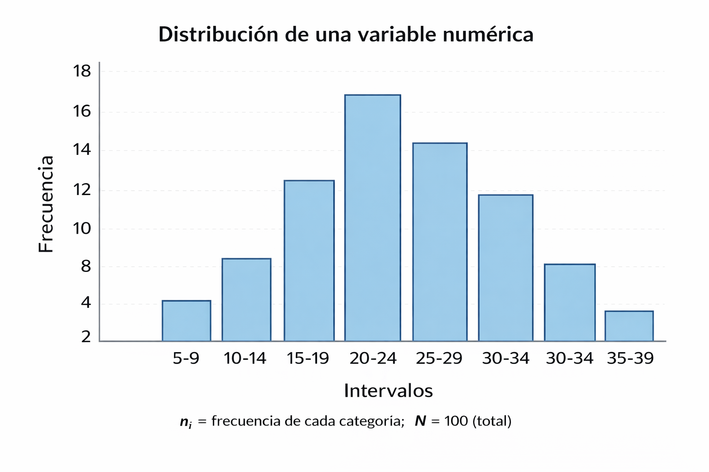
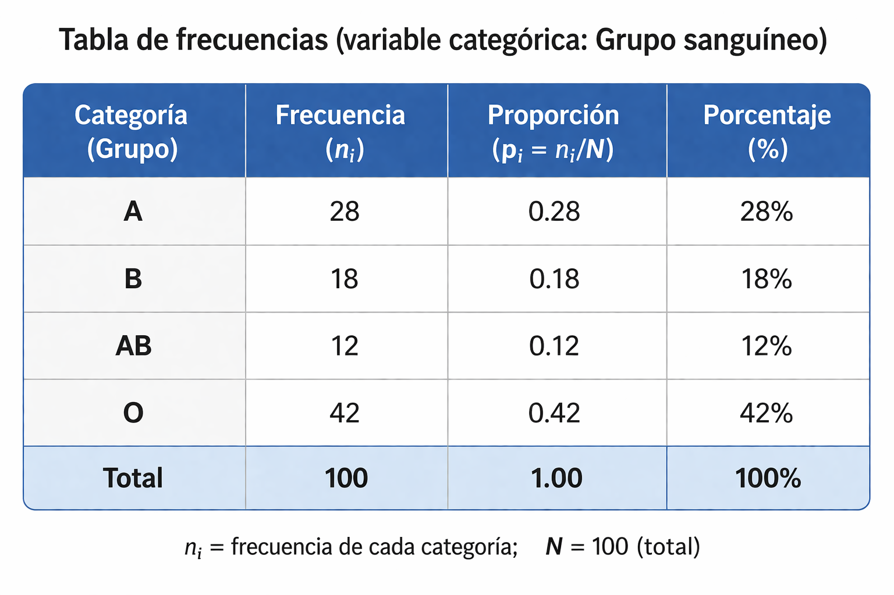
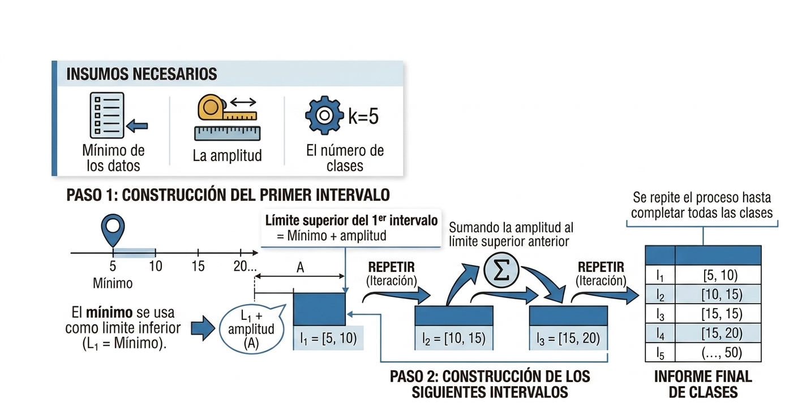

## Contenido

<div style="display: grid; grid-template-columns: 1fr 1fr; gap: 48px; margin-top: 15px; font-size: 30px; align-items: start;">
<div>
<h3 class="fragment fade-in" data-fragment-index="1" style="font-size: 36px; margin-bottom: 14px;">Presentación tabular</h3>
<ul>
<li class="fragment fade-in" data-fragment-index="2">Tabla de frecuencias.</li>
<li class="fragment fade-in" data-fragment-index="3">Elementos: $f_i$, $F_i$, $h_i$, $H_i$, %.</li>
<li class="fragment fade-in" data-fragment-index="4">Pasos para construirla.</li>
</ul>

<h3 class="fragment fade-in" data-fragment-index="5" style="font-size: 36px; margin-top: 28px; margin-bottom: 14px;">Ejemplos prácticos</h3>
<ul>
<li class="fragment fade-in" data-fragment-index="6">Variable cuantitativa discreta.</li>
<li class="fragment fade-in" data-fragment-index="7">Variable cualitativa nominal.</li>
<li class="fragment fade-in" data-fragment-index="8">Variable cuantitativa continua.</li>
</ul>
</div>

<div>
<h3 class="fragment fade-in" data-fragment-index="9" style="font-size: 36px; margin-bottom: 14px;">Presentación gráfica</h3>
<ul>
<li class="fragment fade-in" data-fragment-index="10">Gráfico de barras.</li>
<li class="fragment fade-in" data-fragment-index="11">Histograma.</li>
<li class="fragment fade-in" data-fragment-index="12">Polígono de frecuencias.</li>
<li class="fragment fade-in" data-fragment-index="13">Gráfico circular y de líneas.</li>
</ul>

<h3 class="fragment fade-in" data-fragment-index="14" style="font-size: 36px; margin-top: 28px; margin-bottom: 14px;">Tipos de distribuciones</h3>
<ul>
<li class="fragment fade-in" data-fragment-index="15">Distribución simétrica.</li>
<li class="fragment fade-in" data-fragment-index="16">Asimétrica positiva y negativa.</li>
</ul>
</div>

</div>

##

<div class="fragment fade-up info-box"  style="margin-top: 100px; padding-right: 30px;" data-fragment-index="1">
<h3 class="fragment fade-in" data-fragment-index="1">Estadística descriptiva de una variable</h3>

<p class="fragment fade-in" data-fragment-index="2" style="text-align: justify;">
La estadística descriptiva de una variable es el **conjunto de métodos y técnicas** que permiten **organizar, resumir y describir los datos** obtenidos de una sola característica o variable, con el fin de facilitar su interpretación.
</p>
</div>


## Las técnicas y métodos mas utilizados son:


<div class="card fragment fade-up crispdm-card--gray" data-fragment-index="1">
<ul>
<li class="fragment fade-up" data-fragment-index="2" style="font-size: 34px;">
Tablas de frecuencias.
</li>
<li class="fragment fade-up" data-fragment-index="3" style="font-size: 34px;">
Gráficos (barras, histogramas, gráficos circulares y otros).
</li>
<li class="fragment fade-up" data-fragment-index="4" style="font-size: 34px;">
Medidas estadísticas como la media, mediana, moda, varianza y desviación estándar.
</li>
</ul>
</div>

<div class="card fragment fade-up crispdm-card--gray" data-fragment-index="5" style="margin-top: 40px;">
<h4>Su objetivo principal es:</h4>

<ul>
<li class="fragment fade-in" data-fragment-index="6" style="font-size: 34px;">
<strong>Presentar</strong> la información de manera <strong>clara y comprensible</strong>, sin realizar inferencias o conclusiones más allá de los datos analizados.
</li>
</ul>
</div>


## Presentación tabular y gráfica  

<div class="twocol">

<div class="card fragment fade-up crispdm-card--gray" data-fragment-index="1">
<ul>
  <li class="fragment fade-up" data-fragment-index="2" style="font-size: 30px; text-align: justify;">
    Permiten describir la <strong>distribución de una variable</strong>
  </li>
  <li class="fragment fade-up" data-fragment-index="3" style="font-size: 30px; text-align: justify;">
    Se puede expresar en:
    <ul>
      <li class="fragment fade-up" data-fragment-index="4" style="font-size: 30px; text-align: justify;">Cantidades</li>
      <li class="fragment fade-up" data-fragment-index="5" style="font-size: 30px; text-align: justify;">Proporciones</li>
      <li class="fragment fade-up" data-fragment-index="6" style="font-size: 30px; text-align: justify;">Porcentajes</li>
    </ul>
  </li>
  <li class="fragment fade-up" data-fragment-index="7" style="font-size: 30px; text-align: justify;">
    Se aplican a:
    <ul>
      <li class="fragment fade-up" data-fragment-index="8" style="font-size: 30px; text-align: justify;">Variables categóricas</li>
      <li class="fragment fade-up" data-fragment-index="9" style="font-size: 30px; text-align: justify;">Variables numéricas</li>
    </ul>
  </li>
</ul>
</div>

<div class="card fragment fade-up crispdm-card--gray" data-fragment-index="10" style="text-align: center;">
<center>


</center>
</div>

</div>

## Presentación tabular
<div class="twocol">
<div class="card fragment fade-up crispdm-card--gray" data-fragment-index="1">
<ul>
<h2 class="fragment fade-in" data-fragment-index="2" style="font-size: 30px;">
<strong>Tabla de frecuencias</strong>
</h2>
  <li class="fragment fade-up" data-fragment-index="3" style="font-size: 28px; text-align: justify;">Representación tabular de los datos de una variable</li>
  <li class="fragment fade-up" data-fragment-index="4" style="font-size: 28px; text-align: justify;">Muestra la frecuencia de cada valor o intervalo</li>
  <li class="fragment fade-up" data-fragment-index="5" style="font-size: 28px; text-align: justify;">Organiza grandes cantidades de información</li>
  <li class="fragment fade-up" data-fragment-index="6" style="font-size: 28px; text-align: justify;">Permite identificar patrones o tendencias</li>
  <li class="fragment fade-up" data-fragment-index="7" style="font-size: 28px; text-align: justify;">Permite analizar el comportamiento de los datos</li>
</ul>
</div>

<div class="card fragment fade-up crispdm-card--gray" data-fragment-index="8">
<h3 class="fragment fade-in" data-fragment-index="9" style="font-size: 30px;">
<strong>Elementos principales de una tabla de frecuencias</strong>
</h3>
<ul>
<li class="fragment fade-in" data-fragment-index="11" style="font-size: 28px;"><strong>Datos o clases:</strong> valores individuales o intervalos.</li>
<li class="fragment fade-in" data-fragment-index="12" style="font-size: 28px;"><strong>Frecuencia absoluta ($f_i$):</strong> número de veces que aparece un dato.</li>
<li class="fragment fade-in" data-fragment-index="13" style="font-size: 28px;"><strong>Frecuencia acumulada ($F_i$):</strong> suma progresiva de las frecuencias absolutas.</li>
<li class="fragment fade-in" data-fragment-index="14" style="font-size: 28px;"><strong>Frecuencia relativa ($h_i$):</strong> proporción o porcentaje respecto al total.</li>
<li class="fragment fade-in" data-fragment-index="15" style="font-size: 28px;"><strong>Frecuencia relativa acumulada ($H_i$):</strong> suma progresiva de las frecuencias relativas.</li>
</ul>
</div>
</div>


## Pasos para construir una tabla de frecuencias 

<ul>
<li class="fragment" style="background: #a78bfa; color: white; font-size: 34px;">
1. Determinar el número de clases o intervalos.
</li>

<li class="fragment" style="background: #3b82f6; color: white; font-size: 34px;">
2. Hallar el rango.
</li>

<li class="fragment" style="background: #59A14F; color: white; font-size: 34px;">
3. Determinar la amplitud del intervalo.
</li>

<li class="fragment" style="background: #F28E2B; color: white; font-size: 34px;">
4. Armar los intervalos
</li>

<li class="fragment" style="background: #B07AA1; color: white; font-size: 34px;">
5. Ubicar las frecuencias en los intervalos.
</li>

<li class="fragment" style="background: #76B7B2; color: white; font-size: 34px;">
6. Llenar la tabla de frecuencias.
</li>
</ul>

## 1. Determinar el número de clases o intervalos

<div style="margin-top: 30px;">
<p class="fragment fade-up" data-fragment-index="1" style="font-size: 30px;text-align: justify;">
Los datos pueden agruparse en el numero de clases o intervalos que se desee; sin embargo es recomendable utilizar criterios como la **raíz cuadrada del tamaño de la muestra** o la **formula de Sturges** para definir una cantidad apropiada de intervalos.
</p>
<br>
<div class="card fragment fade-up crispdm-card--gray" data-fragment-index="4">
<ul>
<li class="fragment fade-in" data-fragment-index="5" style="font-size: 30px;">
**Formulas para determinar el numero de clases:**  
</li>
<li class="fragment fade-in" data-fragment-index="6" style="font-size: 30px;">
$k=\sqrt{n}$, donde $k$ es el numero de clases y $n$ es el tamaño de la muestra o numero de datos.
</li>
<li class="fragment fade-in" data-fragment-index="7" style="font-size: 30px;">
$k=1+3.3322\log_{10}(n)$, donde $k$ es el numero de clases y $n$ es el tamaño de la muestra o numero de datos.
</li>
</ul>
</div>
<p class="fragment fade-up" data-fragment-index="8" style="font-size: 26px;text-align: justify;">
*Un numero razonable de clases puede ser entre 5 y 20 clases, si el resultado al aplicar las formulas da un numero decimal se redondea al entero mayor mas cercano.*
</p>
</div>

## 2. Hallar el rango
<div class="fragment fade-up info-box"  style="margin-top: 100px; padding-right: 50px;" data-fragment-index="1">
<p class="fragment fade-in" data-fragment-index="2"style="text-align: justify;">
Después de que se tenga el numero de clases establecido, se procede a hallar el máximo y mínimo de los datos, para hallar el rango.
</p >
<p class="fragment fade-in" data-fragment-index="3"style="text-align: justify;">
El rango se calcula como:
$$ 𝑅𝑎𝑛𝑔𝑜:𝑅=𝑀𝑎𝑥𝑖𝑚𝑜−M𝑖𝑛𝑖𝑚𝑜 $$
</p>
</div>

## 3. Determinar la amplitud del intervalo
<div class="fragment fade-up info-box"  style="margin-top: 70px;" data-fragment-index="1">
<p class="fragment fade-in" data-fragment-index="2" style="text-align: center;">
$$ Amplitud: A= \frac{R}{k} $$
</p>
<ul>
<li class="fragment fade-in" data-fragment-index="3"style="text-align: justify;">Determinar el ancho de cada intervalo o clase,</li>
<li class="fragment fade-in" data-fragment-index="4"style="text-align: justify;">Definir dónde se agrupan las frecuencias en la tabla.</li>
<li class="fragment fade-in" data-fragment-index="5"style="text-align: justify;">Generalmente se usan intervalos de igual longitud.</li>
<li class="fragment fade-in" data-fragment-index="6"style="text-align: justify;">Puede redondearse para facilitar la interpretación.</li>
</ul>
</div>

## 4. Armar los intervalos

<center>

</center>

## Ubicar y registrar las frecuencias 

<div class="twocol" style="margin-top: 80px;">

<div class="card fragment fade-up crispdm-card--gray" data-fragment-index="1">
<h2 class="fragment" data-fragment-index="1" style="font-size: 36px;">
5. Ubicar las frecuencias
</h2>
<ul style="font-size: 26px; line-height: 1.5; padding-left: 28px; margin: 0;">
<li class="fragment" data-fragment-index="2">Se cuentan los datos que pertenecen a cada intervalo.</li>
<li class="fragment" data-fragment-index="3">Ese conteo determina la frecuencia de cada clase.</li>
</ul>
</div>


<div class="card fragment fade-up crispdm-card--gray" data-fragment-index="4">
<h2 class="fragment" data-fragment-index="4" style="font-size: 36px; margin-top: 20; margin-bottom: 18px;">
6. Llenar la tabla de frecuencias
</h2>
<ul style="font-size: 26px; line-height: 1.5; padding-left: 28px; margin: 0;">
<li class="fragment" data-fragment-index="5">Se registran las frecuencias en la tabla.</li>
<li class="fragment" data-fragment-index="6">Se completa cada elemento correspondiente.</li>
</ul>
</div>
</div>


## Elementos de la tabla de frecuencias
<div class="twocol" style="margin-top: 80px;">

<div class="card fragment fade-up crispdm-card--gray" data-fragment-index="1">

<ol>
<li class="fragment fade-up" data-fragment-index="2" style="font-size: 30px;">
**Marca de clase $𝑥_𝑖$:** 
<ul>
<li class="fragment fade-up" data-fragment-index="3">Es el punto medio del intervalo.</li>
<li class="fragment fade-up" data-fragment-index="4">Se calcula como la suma del valor mínimo mas el valor máximo de la clase,</li>
<li class="fragment fade-up" data-fragment-index="5">El resultado se divide por 2.</li>
</ul> 
</li>
</ol>
</div>


<div class="card fragment fade-up crispdm-card--gray" data-fragment-index="4">
<ol start="2">
<li class="fragment fade-in" data-fragment-index="6" style="font-size: 30px;">
**Frecuencia absoluta $𝑓_𝑖$:** es la cantidad de veces que un dato  pertenece a un intervalo o una clase. 
</li>
<li class="fragment fade-in" data-fragment-index="7" style="font-size: 30px;">
**Frecuencia acumulada $𝐹_𝑖$:** es la suma progresiva de las frecuencias absolutas desde el primer valor o clase hasta el ultimo.
<ul>
<li class="fragment fade-in" data-fragment-index="8" style="font-size: 30px;">
En el ultimo intervalo tiene que dar el numero total de datos.
</li>
</ul>
</li>

</ol>
</div>
</div>


## Elementos de la tabla de frecuencias
<div class="twocol">
<div class="card fragment fade-up crispdm-card--gray" data-fragment-index="1">

<ol start="4">
<li class="fragment fade-up" data-fragment-index="2" style="font-size: 30px;">
**Frecuencia relativa $ℎ_𝑖$:** proporción o fracción que representa nro de veces que aparece un valor con respecto al total de datos.
<ul>
<li class="fragment fade-up" data-fragment-index="3" style="font-size: 30px;">
Se obtiene dividiendo la frecuencia absoluta $f_i$ entre el número total de datos $n$.
</li>
</ul>
</li>

<li class="fragment fade-up" data-fragment-index="4" style="font-size: 30px;">
**Frecuencia relativa acumulada $𝐻_𝑖$:** es la suma progresiva de las frecuencias relativas desde el primer valor hasta el ultimo. 
</li>
<ul>
<li class="fragment fade-in" data-fragment-index="5" style="font-size: 30px;">
En el ultimo intervalo tiene que dar 1.
</li> 
</ul>
</ol>
</div>
<div class="card fragment fade-up crispdm-card--gray" data-fragment-index="6">
<ol start="6">
<li class="fragment fade-in" data-fragment-index="7" style="font-size: 30px;">
**Porcentaje %:** se calcula como la frecuencia relativa multiplicada por 100%.  
</li>
<li class="fragment fade-in" data-fragment-index="8" style="font-size: 30px;">
**% acumulado:** es la suma progresiva de los porcentajes en cada intervalo.
</li>
<ul>
<li class="fragment fade-in" data-fragment-index="9" style="font-size: 30px;">
En el ultimo intervalo tiene que dar el 100%.
</li>
</ul>
</ol>
</div>
</div>

## Ejemplo 1 

<h4 class="fragment fade-in" data-fragment-index="1" style="margin-top:80px">Variable cuantitativa discreta:</h4>
<p class="fragment fade-in" data-fragment-index="2" style="text-align: justify; font-size: 34px;">
Se entrevistan 1.000 familias de la Ciudad de Buenos Aires, para saber cuántos hijos tiene cada familia. Los datos son: 0, 0, 3, 1, 1, 1, 2, 2, 2, 3, 1, 1, 2, 0, 0, 0, 2, 1, 8, 1, 1, 2, 3,... Donde cada número es la cantidad de hijos de cada una de las familias entrevistadas. 
</p>


##  Resultados

<div class="twocol">

<div class="fragment fade-in" data-fragment-index="1" style="max-width:800px; margin:auto; font-family:Arial;">
<p class="fragment fade-in" data-fragment-index="1" style="text-align: justify; font-size: 28px;">
Debido a que la muestra es grande, es necesario resumir la información:
</p>

<table class="fragment fade-in" data-fragment-index="3" style="width:100%; border-collapse:collapse; font-size:24px;">
<tr style="background:#0b84c6; color:white;">
<th style="padding:10px;">Número de hijos</th>
<th style="padding:10px;">Número de familias</th>
</tr>

<tr><td style="padding:8px;">0</td><td>250</td></tr>
<tr><td style="padding:8px;">1</td><td>200</td></tr>
<tr><td style="padding:8px;">2</td><td>300</td></tr>
<tr><td style="padding:8px;">3</td><td>160</td></tr>
<tr><td style="padding:8px;">4</td><td>50</td></tr>
<tr><td style="padding:8px;">5</td><td>20</td></tr>
<tr><td style="padding:8px;">6</td><td>10</td></tr>
<tr><td style="padding:8px;">7</td><td>7</td></tr>
<tr><td style="padding:8px;">8</td><td>2</td></tr>
<tr><td style="padding:8px;">9</td><td>1</td></tr>
</table>
</div>

<div>
<ul >
<li class="fragment fade-in" data-fragment-index="4" style="text-align: justify; font-size: 28px;">
En este caso **no es necesario** determinar el número de clases o intervalos, ya que la variable es **cuantitativa discreta** y los datos se pueden agrupar por su valor individual.
</li>
<li class="fragment fade-in" data-fragment-index="5" style="text-align: justify; font-size: 28px;">
Aplicando los pasos para construir la tabla de frecuencias, se obtiene la siguiente tabla:
</li>
</ul >
</div>

</div>


## 
```{r, echo=FALSE, warning=FALSE, message=FALSE}

library(knitr)
library(kableExtra)

# Datos
hijos <- 0:9
fi <- c(250, 200, 300, 160, 50, 20, 10, 7, 2, 1)

# Cálculos
Fi <- cumsum(fi)
hi <- fi / sum(fi)
Hi <- cumsum(hi)
porcentaje <- hi * 100
porcentaje_acum <- Hi * 100

# Tabla
tabla <- data.frame(
  "Cantidad de hijos" = hijos,
  "fi" = fi,
  "Fi" = Fi,
  "hi" = round(hi,3),
  "Hi" = round(Hi,3),
  "Porcentaje %" = round(porcentaje,1),
  "Porcentaje.acumulado" = round(porcentaje_acum,1)
)

# Fila total
total_fila <- data.frame(
  "Cantidad de hijos" = "Total",
  "fi" = sum(fi),
  "Fi" = "",
  "hi" = 1,
  "Hi" = "",
  "Porcentaje %" = 100,
  "Porcentaje.acumulado" = ""
)

tabla <- rbind(tabla, total_fila)

colnames(tabla) <- c(
  "Nro. Hijos",
  "\\(f_{i}\\)",
  "\\(F_{i}\\)",
  "\\(h_{i}\\)",
  "\\(H_{i}\\)",
  "%",
  "% Acum"
)

# TABLA PRO
tabla %>%
kbl(align = "c", escape = FALSE) %>%
  kable_styling(
    bootstrap_options = c("striped", "condensed"),
    full_width = FALSE,
    font_size = 26
  ) %>%
  row_spec(0, bold = TRUE, color = "white", background = "#0b84c6") %>%  # encabezado oscuro elegante
  row_spec(nrow(tabla), bold = TRUE, background = "#8fbdf1") %>%         # fila total destacada
  kable_paper("striped", full_width = TRUE) %>%                          # filas alternadas
  column_spec(1, bold = TRUE) %>%                                        # primera columna resaltada
  column_spec(2:ncol(tabla), width = "4cm")                              # columnas más anchas

```

## Hallazgos
<div class="fragment fade-up info-box"  style="margin-top: 100px; padding-right:50px" data-fragment-index="1">
<ul>
<li class="fragment fade-in" data-fragment-index="2" style="text-align: justify; font-size: 28px;">
El número de hijos más común es 2, con una frecuencia absoluta de 300 familias, lo que representa el 30% de la muestra, seguido por 0 hijos con 250 familias (25%) y 1 hijo con 200 familias (20%).
</li> 
<li class="fragment fade-in" data-fragment-index="3" style="text-align: justify; font-size: 28px;">  
Sumando los primeros 4 primeros porcentajes, se obtiene que el 91% de las familias tienen entre 0 y 3 hijos y el 9% restante tienen entre 4 y 9 hijos.
</li>
<li class="fragment fade-in" data-fragment-index="4" style="text-align: justify; font-size: 28px;">
Segun el estudio pocas familias tienen 4 o más hijos, lo que puede indicar una tendencia hacia familias más pequeñas en la Ciudad de Buenos Aires.
</li>
</ul >
</div>

## Ejemplo 2
<h4 class="fragment fade-in" data-fragment-index="1" style="margin-top:80px">Variable cualitativa nominal:</h4>
<p class="fragment fade-in" data-fragment-index="2" style="text-align: justify; font-size: 34px;">
Se hizo una encuesta a 200 estudiantes de la universidad nacional  para conocer cual color de ojos era el mas predominante. Los resultados fueron los siguientes: 
</p>
<ul style="padding-left: 50px">
<li class="fragment fade-in" data-fragment-index="3"style="text-align: justify; font-size: 28px;">
Café: 90
</li>
<li class="fragment fade-in" data-fragment-index="4"style="text-align: justify; font-size: 28px;">
Negro: 60
</li>
<li class="fragment fade-in" data-fragment-index="5"style="text-align:  justify; font-size: 28px;" >
Azul: 25
</li>
<li class="fragment fade-in" data-fragment-index="6"style="text-align: justify; font-size: 28px;">
Verde: 15
</li>
<li class="fragment fade-in" data-fragment-index="7"style="text-align: justify; font-size: 28px;">
Miel:10
</li>
</ul >

## Tabla de frecuencias

<ul>
<li class="fragment fade-in" data-fragment-index="1" style="text-align: justify; font-size: 30px;">
En este caso no es necesario determinar el número de clases o intervalos, ya que la variable es cualitativa nominal y los datos se pueden agrupar por categorías.
</li>
<li class="fragment fade-in" data-fragment-index="2" style="text-align: justify; font-size: 30px;">
Aplicando los pasos para construir la tabla de frecuencias, se obtiene la siguiente tabla:
</li>
</ul >

:::{.fragment}
```{r, echo=FALSE, warning=FALSE, message=FALSE}

library(knitr)
library(kableExtra)

# Datos
ojos <- c("Café", "Negro", "Azul", "Verde", "Miel")
fi <- c(90, 60, 25, 15, 10)

# Cálculos
Fi <- cumsum(fi)
hi <- fi / sum(fi)
Hi <- cumsum(hi)
porcentaje <- hi * 100
porcentaje_acum <- Hi * 100

# Tabla
tabla <- data.frame(
  "Color de Ojos" = ojos,
  "fi" = fi,
  "Fi" = Fi,
  "hi" = sprintf("%.3f", hi),              # formato exacto
  "Hi" = sprintf("%.3f", Hi),
  "Porcentaje" = paste0(round(porcentaje,1), "%"),
  "Porcentaje.Acumulado" = paste0(round(porcentaje_acum,1), "%")
)

# Fila total
total_fila <- data.frame(
  "Color de Ojos" = "Total",
  "fi" = sum(fi),
  "Fi" = "",
  "hi" = "1.000",
  "Hi" = "",
  "Porcentaje" = "100%",
  "Porcentaje.Acumulado" = ""
)

tabla <- rbind(tabla, total_fila)

colnames(tabla) <- c(
  "Color",
  "\\(f_{i}\\)",
  "\\(F_{i}\\)",
  "\\(h_{i}\\)",
  "\\(H_{i}\\)",
  "%",
  "% Acum"
)

# TABLA ESTILO EXACTO 
kable(tabla, align = "c") %>%
  kable_styling(
    full_width = TRUE,
    position = "center",
    font_size = 26
  ) %>%
  row_spec(0, bold = TRUE, color = "white", background = "#0b84c6") %>%  # azul encabezado
  row_spec(1:(nrow(tabla)-1), background = "#ffffff") %>%                # gris claro uniforme
  row_spec(nrow(tabla), bold = TRUE, background = "#8fbdf1") %>%         # total gris más fuerte
  column_spec(1, bold = TRUE)       

```
:::

## Hallazgos
<div class="fragment fade-up info-box"  style="margin-top: 100px;" data-fragment-index="1">
<ul>
<li class="fragment fade-in" data-fragment-index="2" style="text-align: justify; font-size: 28px;">
El color de ojos más común entre los estudiantes encuestados es el café, con una frecuencia absoluta de 90 estudiantes, lo que representa el 45% de la muestra, seguido por el color negro con 60 estudiantes (30%), el azul con 25 estudiantes (12.5%), el verde con 15 estudiantes (7.5%) y el miel con 10 estudiantes (5%).
</li>
<li class="fragment fade-in" data-fragment-index="3" style="text-align: justify; font-size: 28px;">
Los colores de ojos que mas predominaron fueron el café y el negro, con una participación del 75% en total.
</li>
</ul >
</div>

## Ejemplo 3

<h4 class="fragment fade-in" data-fragment-index="1" style="margin-top: 100px;">Variable cuantitativa continua:</h4>
<p class="fragment fade-in" data-fragment-index="2" style="text-align: justify; font-size: 34px;">
Los siguientes datos corresponden a las alturas de plantas (en cm) de 100 cultivos de maíz evaluados por estudiantes en un ensayo experimental. Las alturas son datos continuos, ya que la altura se mide y puede tomar cualquier valor dentro de un intervalo: 60, 60.5, 61, 61, 61.5, 63.5, 63.5, 63.5, 64, 64, 64, 64....
</p>


## 
<div class="fragment fade-up info-box" style="margin-top: 100px; font-size: 30px;" data-fragment-index="1">
  Para organizar y resumir esta información, se procede a construir una tabla de frecuencias agrupando las alturas en intervalos, para eso se determina:
<ul style="padding-left: 50px;">
<li class="fragment fade-in" data-fragment-index="2">
el número de clases,
</li>
<li class="fragment fade-in" data-fragment-index="3">
el rango,  
</li>
<li class="fragment fade-in" data-fragment-index="4">
la amplitud del intervalo,
</li>
<li class="fragment fade-in" data-fragment-index="5">
se arman los intervalos,
</li>
<li class="fragment fade-in" data-fragment-index="6">
se ubican las frecuencias en cada intervalo,
</li>
<li class="fragment fade-in" data-fragment-index="7">
se llena la tabla de frecuencias.
</li>
</ul>
</div>

## Pasos para construir la tabla de frecuencias

<div class="fragment fade-up info-box" style="margin-top: 100px; font-size: 30px;" data-fragment-index="1">
<ol>
<li class="fragment fade-in" data-fragment-index="2">
Determinar el número de clases o intervalos. En el caso de este ejemplo, $𝑛=100$:  
$$k=\sqrt{100}=10$$
$$k=1+3.3322\log_{10}(100)=7.644≈8$$
Tomaremos 8 intervalos para este ejemplo, por lo tanto $k=8$.
</li>
<li class="fragment fade-in" data-fragment-index="3">
Hallar el rango, el valor mínimo es 60 y el valor máximo es 74, por lo tanto el rango se calcula como:  
$$ 𝑅𝑎𝑛𝑔𝑜: R = 74 - 60 = 14 $$
</li>
</ol>
</div>

## Pasos para construir la tabla de frecuencias

<div class="fragment fade-up info-box" style="margin-top: 100px; font-size: 28px;" data-fragment-index="1">
<ol start="3">
<li class="fragment fade-in" data-fragment-index="2">
Determinar la amplitud del intervalo. La amplitud se calcula como:
$$ A = \frac{R}{k} = \frac{14}{8} = 1.75 $$
Redondeando a un número más conveniente, se puede tomar una amplitud de 2 cm.
</li>
<li class="fragment fade-in" data-fragment-index="3"> 
Armar los intervalos.
<ul>
<li>El primer intervalo se establece desde el mínimo (60 cm) hasta el mínimo más la amplitud (62 cm), es decir, [60, 62).</li>
<li>El segundo intervalo será [62, 64), el tercero [64, 66), el cuarto [66, 68), el quinto [68, 70), el sexto [70, 72), el séptimo [72, 74) y el octavo [74, 76).
</li>
</ul>
</li>
</ol>
</div>

## Pasos para construir la tabla de frecuencias
  
<div class="fragment fade-up info-box" style="margin-top: 100px; font-size: 28px;" data-fragment-index="1">
<ol start="5">
<li class="fragment fade-in" data-fragment-index="2">
Ubicar las frecuencias en los intervalos.
<ul>
<li>Se cuenta cuántas alturas caen dentro de cada intervalo,</li>
<li>se registra esa cantidad como la frecuencia absoluta $f_i$ para cada intervalo.</li>
</ul>  
</li>
<li class="fragment fade-in" data-fragment-index="3">
Llenar la tabla de frecuencias.  
<ul>
<li>Se completa la tabla de frecuencias con los elementos correspondientes (marca de clase, frecuencia absoluta, frecuencia acumulada, frecuencia relativa, etc.).</li>
</ul>  
</li>
</ol>
</div>

## Tabla de Frecuencias

<p style="font-size: 30px;text-align: justify;" class="fragment fade-in" data-fragment-index="1">
Haciendo todos los cálculos la tabla de frecuencias queda de la siguiente forma:
</p>

:::{.fragment}
```{r, echo=FALSE, warning=FALSE, message=FALSE}
library(knitr)
library(kableExtra)
tabla <- data.frame(
  Intervalo = c("[60-62)", "[62-64)", "[64-66)", "[66-68)", "[68-70)", "[70-72)", "[72-74)", "[74-76)"),
  xi = c(61, 63, 65, 67, 69, 71, 73, 75),
  fi = c(5, 3, 15, 40, 17, 12, 7, 1),
  Fi = c(5, 8, 23, 63, 80, 92, 99, 100),
  hi = c(0.05, 0.03, 0.15, 0.40, 0.17, 0.12, 0.07, 0.01),
  Hi = c(0.05, 0.08, 0.23, 0.63, 0.80, 0.92, 0.99, 1.00),
  Porcentaje = c("5%", "3%", "15%", "40%", "17%", "12%", "7%", "1%"),
  P.Acumulado = c("5%", "8%", "23%", "63%", "80%", "92%", "99%", "100%"),
  stringsAsFactors = FALSE
)

# 🔹 Crear fila Total (sin dplyr)
fila_total <- data.frame(
  Intervalo = "Total",
  xi = "",
  fi = sum(tabla$fi),
  Fi = "",
  hi = sum(tabla$hi),
  Hi = "",
  Porcentaje = "100%",
  P.Acumulado = "",
  stringsAsFactors = FALSE
)

# 🔹 Unir tablas (base R)
tabla_final <- rbind(tabla, fila_total)

colnames(tabla_final) <- c(
  "Intervalo",
  "\\(x_{i}\\)",
  "\\(f_{i}\\)",
  "\\(F_{i}\\)",
  "\\(h_{i}\\)",
  "\\(H_{i}\\)",
  "%",
  "% Acum"
)

# 🔹 Mostrar tabla
tabla_final %>%
  kbl(align = "c", escape = FALSE) %>%
  kable_styling(
    bootstrap_options = c("striped", "condensed"),
    full_width = FALSE,
    font_size = 26
  ) %>%
  row_spec(0, bold = TRUE, background = "#0b2c6b", color = "white") %>%
  row_spec(nrow(tabla_final), bold = TRUE, background = "#0b2c6b", color = "white") %>%
  column_spec(1, width = "7em") %>%
  column_spec(2:8, width = "5em")

```
:::


## Hallazgos
<div class="fragment fade-up info-box" style="margin-top: 100px; font-size: 28px;" data-fragment-index="1">
  <ul>
    <li class="fragment fade-in" data-fragment-index="2">
      El intervalo con la mayor frecuencia absoluta es [66-68), con 40 plantas de maíz, lo que representa el 40% de la muestra.
    </li>
    <li class="fragment fade-in" data-fragment-index="3">
      El 80% de las plantas tienen alturas menores a 70 cm, mientras que el 20% restante tienen alturas mayores a 70 cm.
    </li>
    <li class="fragment fade-in" data-fragment-index="4">
      La distribución de las alturas muestra una mayor concentración en los intervalos [64-66), [66-68) y [68-70) indicando que la mayoría de las plantas se encuentran en esa franja de altura, con un 72%.
    </li>
  </ul>
</div>

## {.middle .center}
<center>
<h2>Análisis Gráfico</h2>
</center>

## ¿Qué es una gráfica en estadística?


<div class="fragment fade-up info-box"  data-fragment-index="1" style="margin-top: 100px;" >
Una gráfica es una **representación visual** de los datos que permite:

<ul>
<li class="fragment"  data-fragment-index="2" >Resumir información de forma clara.</li>
<li class="fragment"  data-fragment-index="3" >Facilita el análisis.</li>
<li class="fragment"  data-fragment-index="4" >Permite interpretar los datos rápidamente.</li>
</ul >
</div>

## Objetivo de las gráficas

<div class="twocol">
<div class="card fragment fade-up crispdm-card--gray" data-fragment-index="1">
<ul>
<h3 class="fragment fade-in" data-fragment-index="2" style="font-size: 34px;">
<strong>¿Cuál es el objetivo de una gráfica?</strong>
</h3>
<li class="fragment fade-up" data-fragment-index="3" style="font-size: 28px;">
Facilitar la comprensión de grandes cantidades de datos.
</li>
<li class="fragment fade-up" data-fragment-index="4" style="font-size: 28px;">
Identificar patrones, tendencias y relaciones.
</li>
<li class="fragment fade-up" data-fragment-index="5" style="font-size: 28px;">
Comparar diferentes conjuntos de datos.  
</li>
<li class="fragment fade-up" data-fragment-index="6" style="font-size: 28px;">
Apoyar la toma de decisiones.
</li>
<li class="fragment fade-up" data-fragment-index="7" style="font-size: 28px;">
Comunicar información de manera visual y efectiva.
</li>
</ul>
</div>

<div class="card fragment fade-up crispdm-card--gray" data-fragment-index="8">
<h3 class="fragment fade-in" data-fragment-index="8" style="font-size: 34px;">
<strong>Principales tipos de gráficas en estadística:</strong>
</h3>
<ul>
<li class="fragment fade-in" data-fragment-index="9" style="font-size: 28px;">
<strong>Gráfico de barras</strong>
</li>
<li class="fragment fade-in" data-fragment-index="10" style="font-size: 28px;">
<strong>Histograma</strong>
</li>
<li class="fragment fade-in" data-fragment-index="11" style="font-size: 28px;">
<strong>Polígono de frecuencias</strong>
</li>
<li class="fragment fade-in" data-fragment-index="12" style="font-size: 28px;">
<strong>Gráfico circular (pastel)</strong>
</li>
<li class="fragment fade-in" data-fragment-index="13" style="font-size: 28px;">
<strong>Gráfico de líneas</strong> 
</li>

</ul>
</div>
</div>

## Gráfico de barras

<div class="twocol">

<div class="fragment fade-up info-box" style="text-align:justify; margin-top: 100px; font-size: 30px;" data-fragment-index="1">
<ul>
<li class="fragment fade-in" data-fragment-index="2" style="text-align:justify;">
Representa datos mediante barras separadas, permitiendo comparar diferentes categorías.
</li>
<li class="fragment fade-in" data-fragment-index="4">
Altura de la barra = valor o frecuencia
</li>
<li class="fragment fade-in" data-fragment-index="5">
<b>Ejemplo:</b> Rendimiento de cultivos (ton/ha) en una finca.
</li>
</ul>
</div> 

<div class="fragment" data-fragment-index="7" style="margin-top:60px;width:130%" >
```{r echo=FALSE}
fig.width=8
fig.height=5
cultivos <- c("Maíz", "Arroz", "Trigo", "Café")
rendimiento <- c(4.5, 5.2, 3.8, 2.1)

library(ggplot2)

datos <- data.frame(
  cultivo = cultivos,
  rendimiento = rendimiento
)

ggplot(datos, aes(x = cultivo, y = rendimiento, fill = cultivo)) +
  geom_bar(stat = "identity") +
  labs(title = "Rendimiento por cultivo",
       x = "Cultivos",
       y = "Toneladas por hectárea") +
  theme_minimal() +
  theme(legend.position = "none",
        plot.title = element_text(size = 16, face = "bold"))

```

</div>

</div>

## Histograma

<div class="twocol">

<div class="fragment fade-up info-box" style="margin-top: 100px; font-size: 25px;" data-fragment-index="1">
<ul>
<li class="fragment fade-in" data-fragment-index="2">
Representa la distribución de una variable **cuantitativa continua** mediante barras unidas.
</li>
<li class="fragment fade-in" data-fragment-index="4">
Permite observar la forma de la distribución (simétrica, sesgada, etc.) y ver que intervalo o categoría tiene mayor frecuencia.
</li>
<li class="fragment fade-in" data-fragment-index="5">
<b>Ejemplo:</b> Las calificaciones de 10 estudiantes en un examen final fueron 60, 62, 65, 70, 72, 75, 78, 80, 85, 90.
</li>
</ul>
</div> 

<div class="fragment" data-fragment-index="7" style="margin-top:60px;width:130%" >
```{r echo=FALSE}
fig.width=8
fig.height=5
datos <- c(60, 62, 65, 70, 72, 75, 78, 80, 85, 90)

hist(datos,
     col = "#66CDAA",
     main = "Distribución de valores",
     xlab = "Valores",
     ylab = "Frecuencia",
     breaks = 5,
     border = "white",
     cex.main = 1.5,
     cex.lab = 1.2,
     cex.axis = 1.1)

```

</div>

</div>

## Polígono de frecuencias
<div class="twocol">

<div class="fragment fade-up info-box" style="margin-top: 100px; font-size: 28px;" data-fragment-index="1">

<ul >
<li class="fragment fade-in" data-fragment-index="2" style="text-aling:justify;">
Se construye uniendo con líneas los puntos medios de los intervalos de una distribución de datos. 
</li>

<li class="fragment fade-in" data-fragment-index="4">
Permite ver la forma, concentración y tendencia de los datos.
</li>
<li class="fragment fade-in" data-fragment-index="5">
<b>Ejemplo:</b> Altura de las plantas.
</li>
</ul>
</div> 

<div class="fragment" data-fragment-index="7" style="margin-top:60px;width:130%" >
```{r echo=FALSE}
fig.width=10
fig.height=7
datos <- c(60, 62, 65, 70, 72, 73, 74, 75, 78, 80, 85, 90)

# Crear histograma
h <- hist(datos,
          col = "lightgreen",
          main = "Polígono de Frecuencias",
          xlab = "Valores",
          ylab = "Frecuencia",
          breaks = 5,
          border = "white")

# Agregar polígono
lines(h$mids, h$counts,
      type = "o",
      col = "darkgreen",
      lwd = 2,
      pch = 16)
```
</div>
</div>


## Gráfico circular (pie plot)

<div class="twocol">

<div class="fragment fade-up info-box" style="height: 300px; margin-top: 100px; font-size: 28px;" data-fragment-index="1">

<ul>
<li class="fragment fade-in" data-fragment-index="2">
Muestra proporciones o porcentajes de un total.
</li>
<li class="fragment fade-in" data-fragment-index="4">
Permite identificar qué categoría tiene mayor participación.
</li>
<li class="fragment fade-in" data-fragment-index="5">
<b>Ejemplo:</b> Uso del suelo
</li>
</ul>

</div> 

<div class="fragment" data-fragment-index="7" style="margin-top:60px;width:90%" >
```{r echo=FALSE, fig.width=8, fig.height=8}

library(ggplot2)

uso_suelo <- c(50, 30, 15, 5)
tipos <- c("Cultivo", "Pastoreo", "Bosque", "Otros")

df <- data.frame(tipos, uso_suelo)

ggplot(df, aes(x = 2, y = uso_suelo, fill = tipos)) +
  geom_col(color = "white") +
  coord_polar(theta = "y") +
  xlim(0.5, 2.5) +  # crea el hueco (donut)
  geom_text(aes(label = paste0(uso_suelo, "%")),
            position = position_stack(vjust = 0.5),
            color = "white",
            size = 5) +
  labs(title = "Distribución del uso del suelo", fill = "") +
  theme_void() +
  theme(
    plot.title = element_text(size = 18, face = "bold", hjust = 0.5),
    legend.position = "right"
  )
```
</div>
</div>

## Gráfico de líneas
<div class="twocol">

<div class="fragment fade-up info-box" style="height: 250px; margin-top: 100px; font-size: 28px;" data-fragment-index="1">
<ul>
<li class="fragment fade-in" data-fragment-index="2">
Se usa para mostrar tendencias a lo largo del tiempo.
</li>
<li class="fragment fade-in" data-fragment-index="4">
Permite observar aumentos y disminuciones
</li>
<li class="fragment fade-in" data-fragment-index="5">
<b>Ejemplo:</b> Producción anual de maíz.
</li>

</ul>
</div> 

<div class="fragment" data-fragment-index="7" style="height: 200px; margin-top:60px;width:130%" >
```{r echo=FALSE}

library(ggplot2)

años <- c(2018, 2019, 2020, 2021, 2022)
produccion <- c(10, 12, 15, 14, 18)

df <- data.frame(años, produccion)

ggplot(df, aes(x = años, y = produccion)) +
  geom_line(color = "#FF8C00", linewidth = 1.5) +
  geom_point(color = "#FF8C00", size = 3) +
  geom_text(aes(label = produccion), vjust = -1, size = 5) +
  labs(
    title = "Producción de maíz por año",
    x = "Año",
    y = "Toneladas"
  ) +
  ylim(0, 20) +
  theme_minimal(base_size = 16) +
  theme(
    plot.title = element_text(face = "bold", size = 18),
    axis.title = element_text(face = "bold"),
    panel.grid.minor = element_blank()
  )
```

</div>

</div>

## Conclusión
<div class="fragment fade-up info-box"  style="margin-top: 100px;" data-fragment-index="1">

<p style="text-align: justify; padding-right:50px">
Las gráficas, tanto en **contextos generales** como en las ciencias agrarias, **permiten** analizar datos de manera visual, **identificar patrones importantes** y apoyar la toma de decisiones en procesos productivos y científicos.
</p>

</div>

## ¿Cómo interpretar una gráfica?
<div class="fragment fade-up info-box"  style="margin-top: 100px;" data-fragment-index="1">
<ul>
<li class="fragment fade-in" data-fragment-index="3" style="text-align: justify;">
Identificar la forma de la distribución.
</li>
<li class="fragment fade-in" data-fragment-index="5" style="text-align: justify;">
Observar dónde se concentran los datos.
</li>
<li class="fragment fade-in" data-fragment-index="6" style="text-align: justify;">
Detectar simetría o asimetría.
</li>
<li class="fragment fade-in" data-fragment-index="7" style="text-align: justify;">
Analizar valores extremos.
</li>
<li class="fragment fade-in" data-fragment-index="8" style="text-align: justify;">
Relacionar con el contexto del problema.
</li>

</ul >
</div>


## {.center }

<center>
<h2> Distribuciones </h2>
</center>


## Tipos de distribuciones

<div class="twocol">
<div class="fragment fade-up info-box" style="margin-top: 100px; font-size: 30px;" data-fragment-index="1">
<h3 class="fragment fade-in" data-fragment-index="2" >Distribución simétrica</h3>
<ul>
<li class="fragment fade-in" data-fragment-index="3">
<b>Características:</b>
</li>
<ul>
<li class="fragment fade-in" data-fragment-index="4">
Forma de “campana”.
</li>
<li class="fragment fade-in" data-fragment-index="5">
Media ≈ mediana ≈ moda.
</li>
<li class="fragment fade-in" data-fragment-index="6">
Igual comportamiento a ambos lados.
</li>
</ul>
<li class="fragment fade-in" data-fragment-index="7">
<b>Ejemplo:</b> Se mide la altura (en cm) de 100 plantas de maíz en condiciones uniformes de suelo, riego y fertilización.
</li>
</ul>
</div> 

<div class="fragment" data-fragment-index="9" style="margin-top:60px;width:130%" >
```{r echo=FALSE}
fig.width=10
fig.height=7
set.seed(123)
library(ggplot2)

altura <- rnorm(100, mean = 150, sd = 10)
df <- data.frame(altura)

ggplot(df, aes(x = altura)) +
  geom_histogram(
    aes(y = ..density..),
    bins = 10,
    fill = "#3CB371",
    color = "white",
    alpha = 0.7
  ) +
  geom_density(
    color = "#1B5E20",
    linewidth = 1.5
  ) +
  labs(
    title = "Distribución de la altura de plantas de maíz",
    x = "Altura (cm)",
    y = "Densidad"
  ) +
  theme_minimal(base_size = 16)

```

</div>

</div>

## Interpretación
<div class="fragment fade-up info-box"  style="margin-top: 100px;" data-fragment-index="1">
<ul>
<li class="fragment fade-in" data-fragment-index="2"style="text-align: justify;">
La mayoría de las plantas tienen alturas cercanas a 150 cm.
</li>
<li class="fragment fade-in" data-fragment-index="3"style="text-align: justify;">
La distribución es simétrica, indicando crecimiento uniforme.
</li>
<li class="fragment fade-in" data-fragment-index="4"style="text-align: justify;">
Hay pocas plantas muy pequeñas o muy grandes.
</li>
<li class="fragment fade-in" data-fragment-index="5"style="text-align: justify;">
Esto sugiere que el cultivo está en condiciones homogéneas.
</li>
</ul >
</div>

## Tipos de distribuciones

<div class="twocol">
<div class="fragment fade-up info-box" style="margin-top: 50px; font-size: 28px;" data-fragment-index="1">
<h3 class="fragment fade-in" data-fragment-index="2">Distribución asimétrica positiva</h3>
<p class="fragment fade-in" data-fragment-index="2" style="text-align: justify;">Los datos se concentran en las primeras categorías (valores bajos) y hay una “cola” hacia la derecha.</p>
<ul>
<li class="fragment fade-in" data-fragment-index="3">
<b>Características:</b>
</li>
<ul>
<li class="fragment fade-in" data-fragment-index="4">
Cola hacia valores altos
</li>
<li class="fragment fade-in" data-fragment-index="5">
Media > mediana.
</li>
<li class="fragment fade-in" data-fragment-index="6">
Pocos valores grandes influyen en el promedio.
</li>
</ul>
<li class="fragment fade-in" data-fragment-index="7">
<b>Ejemplo:</b> Ingresos de una muestra de 80 personas de una empresa.
</li>
</ul>
</div> 

<div class="fragment" data-fragment-index="9" style="margin-top:60px;width:140%" >
```{r echo=FALSE}
fig.width=10
fig.height=7
set.seed(123)

# Datos concentrados + algunos valores altos (sin huecos grandes)
library(ggplot2)

ingresos <- c(rnorm(90, mean = 1000, sd = 150),
              1500, 1800, 2000, 2500)

df <- data.frame(ingresos)
ggplot(df, aes(x = ingresos)) +
  geom_histogram(
    bins = 12,
    fill = "#4A90E2",
    color = "white",
    alpha = 0.8
  ) +
  geom_vline(xintercept = mean(ingresos),
             color = "red",
             linewidth = 1.2,
             linetype = "dashed") +
  annotate("text",
           x = mean(ingresos),
           y = 15,
           label = "Media",
           color = "red",
           vjust = -1) +
  labs(
    title = "Distribución de ingresos",
    subtitle = "Presencia de valores atípicos altos",
    x = "Ingresos",
    y = "Frecuencia"
  ) +
  theme_minimal(base_size = 16)

```

</div>

</div>

## Interpretación
<div class="fragment fade-up info-box"  style="margin-top: 100px;" data-fragment-index="1">
<ul>
<li class="fragment fade-in" data-fragment-index="2"style="text-align: justify;">
La mayoría de los datos se concentra en valores bajos y medios.
</li>
<li class="fragment fade-in" data-fragment-index="3"style="text-align: justify;">
Los valores disminuyen gradualmente hacia la derecha.
</li>
<li class="fragment fade-in" data-fragment-index="4"style="text-align: justify;">
Se observa una cola hacia la derecha.
</li>
<li class="fragment fade-in" data-fragment-index="5"style="text-align: justify;">
La distribución presenta asimetría positiva.
</li>
</ul >
</div>

## Tipos de distribuciones

<div class="twocol">
<div class="fragment fade-up info-box" style="padding-right: 50px; margin-top: 50px; font-size: 25px;" data-fragment-index="1">
<h3 class="fragment fade-in" data-fragment-index="2">Distribución asimétrica negativa</h3>
<p class="fragment fade-in" data-fragment-index="2" style="text-align: justify;">La asimetría negativa ocurre cuando los datos se concentran en valores altos y presentan una cola hacia los valores bajos.</p>

<ul>
<li class="fragment fade-in" data-fragment-index="3">
<b>Características:</b>
</li>
<ul>
<li class="fragment fade-in" data-fragment-index="4">
La cola se extiende hacia la izquierda.
</li>
<li class="fragment fade-in" data-fragment-index="5">
Media < mediana.
</li>
<li class="fragment fade-in" data-fragment-index="6">
Existen pocos valores bajos que afectan la distribución.
</li>
</ul>
<li class="fragment fade-in" data-fragment-index="7" style="text-align:justify">
<b>Ejemplo:</b> Producción de un cultivo (toneladas por hectárea), donde la mayoría de los terrenos tiene alta producción, pero algunos presentan rendimientos bajos.
</li>
</ul>
</div> 

<div class="fragment" data-fragment-index="9" style="margin-top:60px;width:140%" >
```{r echo=FALSE}
library(ggplot2)

produccion <- c(rnorm(90, mean = 20, sd = 2),
                12, 10, 8, 6)

df <- data.frame(produccion)

ggplot(df, aes(x = produccion)) +
  geom_histogram(
    aes(y = ..density..),
    bins = 12,
    fill = "#3CB371",   # verde consistente
    color = "white",
    alpha = 0.8
  ) +
  geom_density(
    color = "#1B5E20",  # verde oscuro
    linewidth = 1.5
  ) +
  geom_vline(
    xintercept = mean(produccion),
    color = "#1C3D5A",  # azul oscuro (consistente con ingresos)
    linewidth = 1.2,
    linetype = "dashed"
  ) +
  labs(
    title = "Producción de cultivo",
    subtitle = "Presencia de valores atípicos bajos",
    x = "Toneladas",
    y = "Densidad"
  ) +
  theme_minimal(base_size = 16) +
  theme(
    plot.title = element_text(face = "bold"),
    panel.grid.minor = element_blank()
  )
```

</div>

</div>

## Interpretación
<div class="fragment fade-up info-box"  style="margin-top: 100px;" data-fragment-index="1">
<ul>
<li class="fragment fade-in" data-fragment-index="2"style="text-align: justify;">
La mayoría de los valores se concentra en producciones altas.
</li>
<li class="fragment fade-in" data-fragment-index="3"style="text-align: justify;">
Existen pocos valores bajos que generan una cola hacia la izquierda.
</li>
<li class="fragment fade-in" data-fragment-index="4"style="text-align: justify;">
La distribución presenta asimetría negativa.
</li>
<li class="fragment fade-in" data-fragment-index="5"style="text-align: justify;">
El gráfico indica que la mayoría de los cultivos tiene buen rendimiento, pero en algunos casos presentan bajo desempeño.
</li>
</ul >
</div>

## Conclusiones presentación gráfica
<div class="fragment fade-up info-box"  style="padding-right:50px; margin-top: 100px;" data-fragment-index="1">
<p class="fragment fade-in" data-fragment-index="2" style="text-align: justify;">
La forma de una gráfica permite entender cómo se comportan los datos, identificar posibles problemas (valores atípicos) y tomar decisiones más informadas, especialmente en áreas como la agronomía donde la variabilidad es clave.
</p>
</div>

## Conclusiones finales presentación tabular y gráfica
<div class="twocol">
<div class="card fragment fade-up crispdm-card--gray" data-fragment-index="1">
<ul>
<li class="fragment fade-up" data-fragment-index="2" style="text-align: justify; font-size: 30px;">
La presentación tabular permite organizar los datos de manera estructurada, facilitando su lectura y análisis detallado.
</li>
<li class="fragment fade-up" data-fragment-index="3" style="text-align: justify; font-size: 30px;">
La presentación gráfica complementa las tablas al representar la información de forma visual, permitiendo identificar patrones, tendencias y comportamientos de manera rápida.
</li>
<li class="fragment fade-up" data-fragment-index="4" style="text-align: justify; font-size: 30px;">
El uso conjunto de tablas y gráficas mejora la comprensión de los datos y facilita la interpretación de la información.
</li>

</ul>
</div>
<div class="card fragment fade-up crispdm-card--gray" data-fragment-index="4">
<ul>
<li class="fragment fade-in" data-fragment-index="5" style="text-align: justify; font-size: 30px;">
Las gráficas permiten detectar características importantes como la simetría, la asimetría y la presencia de valores atípicos.
</li>
<li class="fragment fade-in" data-fragment-index="6" style="text-align: justify; font-size: 30px;">
Una adecuada presentación de los datos es fundamental para apoyar la toma de decisiones en diferentes áreas, como la agronomía y otras disciplinas.
</li>
</ul>
</div>
</div>

## Ejercicio

<div class="twocol" style="margin-top: 20px;">

<div>
<p style="font-size: 26px; text-align: justify;">
Se registró el <strong>peso de la mazorca (g)</strong> en 30 plantas de maíz seleccionadas aleatoriamente en un ensayo experimental:
</p>
<table style="width:100%; border-collapse:collapse; font-size:24px; margin-top:10px;">
<tr style="background:#0b84c6; color:white;">
<th style="padding:6px;">Obs.</th><th style="padding:6px;">Peso (g)</th>
<th style="padding:6px;">Obs.</th><th style="padding:6px;">Peso (g)</th>
<th style="padding:6px;">Obs.</th><th style="padding:6px;">Peso (g)</th>
</tr>
<tr><td style="padding:5px; text-align:center;">1</td><td style="padding:5px; text-align:center;">182</td><td style="padding:5px; text-align:center;">11</td><td style="padding:5px; text-align:center;">225</td><td style="padding:5px; text-align:center;">21</td><td style="padding:5px; text-align:center;">250</td></tr>
<tr style="background:#f0f4ff;"><td style="padding:5px; text-align:center;">2</td><td style="padding:5px; text-align:center;">195</td><td style="padding:5px; text-align:center;">12</td><td style="padding:5px; text-align:center;">228</td><td style="padding:5px; text-align:center;">22</td><td style="padding:5px; text-align:center;">255</td></tr>
<tr><td style="padding:5px; text-align:center;">3</td><td style="padding:5px; text-align:center;">200</td><td style="padding:5px; text-align:center;">13</td><td style="padding:5px; text-align:center;">230</td><td style="padding:5px; text-align:center;">23</td><td style="padding:5px; text-align:center;">260</td></tr>
<tr style="background:#f0f4ff;"><td style="padding:5px; text-align:center;">4</td><td style="padding:5px; text-align:center;">204</td><td style="padding:5px; text-align:center;">14</td><td style="padding:5px; text-align:center;">233</td><td style="padding:5px; text-align:center;">24</td><td style="padding:5px; text-align:center;">265</td></tr>
<tr><td style="padding:5px; text-align:center;">5</td><td style="padding:5px; text-align:center;">208</td><td style="padding:5px; text-align:center;">15</td><td style="padding:5px; text-align:center;">235</td><td style="padding:5px; text-align:center;">25</td><td style="padding:5px; text-align:center;">270</td></tr>
<tr style="background:#f0f4ff;"><td style="padding:5px; text-align:center;">6</td><td style="padding:5px; text-align:center;">212</td><td style="padding:5px; text-align:center;">16</td><td style="padding:5px; text-align:center;">238</td><td style="padding:5px; text-align:center;">26</td><td style="padding:5px; text-align:center;">275</td></tr>
<tr><td style="padding:5px; text-align:center;">7</td><td style="padding:5px; text-align:center;">215</td><td style="padding:5px; text-align:center;">17</td><td style="padding:5px; text-align:center;">240</td><td style="padding:5px; text-align:center;">27</td><td style="padding:5px; text-align:center;">280</td></tr>
<tr style="background:#f0f4ff;"><td style="padding:5px; text-align:center;">8</td><td style="padding:5px; text-align:center;">218</td><td style="padding:5px; text-align:center;">18</td><td style="padding:5px; text-align:center;">243</td><td style="padding:5px; text-align:center;">28</td><td style="padding:5px; text-align:center;">285</td></tr>
<tr><td style="padding:5px; text-align:center;">9</td><td style="padding:5px; text-align:center;">220</td><td style="padding:5px; text-align:center;">19</td><td style="padding:5px; text-align:center;">245</td><td style="padding:5px; text-align:center;">29</td><td style="padding:5px; text-align:center;">290</td></tr>
<tr style="background:#f0f4ff;"><td style="padding:5px; text-align:center;">10</td><td style="padding:5px; text-align:center;">223</td><td style="padding:5px; text-align:center;">20</td><td style="padding:5px; text-align:center;">248</td><td style="padding:5px; text-align:center;">30</td><td style="padding:5px; text-align:center;">295</td></tr>
</table>
</div>

<div>
<div class="card crispdm-card--gray" style="font-size: 26px; margin-bottom: 20px;">
<h4 style="margin-bottom: 10px;">Con los datos anteriores:</h4>
<ol>
<li style="margin-bottom: 8px;">Determinar el número de clases $k$ usando la fórmula de Sturges y la raíz cuadrada de $n$.</li>
<li style="margin-bottom: 8px;">Calcular el rango $R$, la amplitud $A$ y construir los intervalos.</li>
<li style="margin-bottom: 8px;">Elaborar la tabla de frecuencias completa con $x_i$, $f_i$, $F_i$, $h_i$, $H_i$ y %.</li>
<li style="margin-bottom: 8px;">Construir el histograma de frecuencias absolutas.</li>
</ol>
</div>
<div class="card crispdm-card--gray" style="font-size: 25px;">
<h4 style="margin-bottom: 6px;">Preguntas de análisis:</h4>
<ul>
<li>¿En qué intervalo se concentra la mayor cantidad de mazorcas?</li>
<li>¿Qué porcentaje de plantas produjo mazorcas con peso mayor a 240 g?</li>
<li>¿Qué forma tiene la distribución? ¿Simétrica o asimétrica?</li>
</ul>
</div>
</div>

</div>
