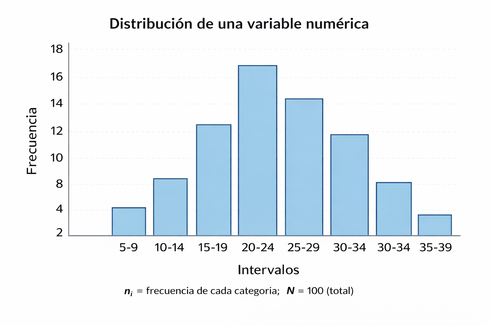
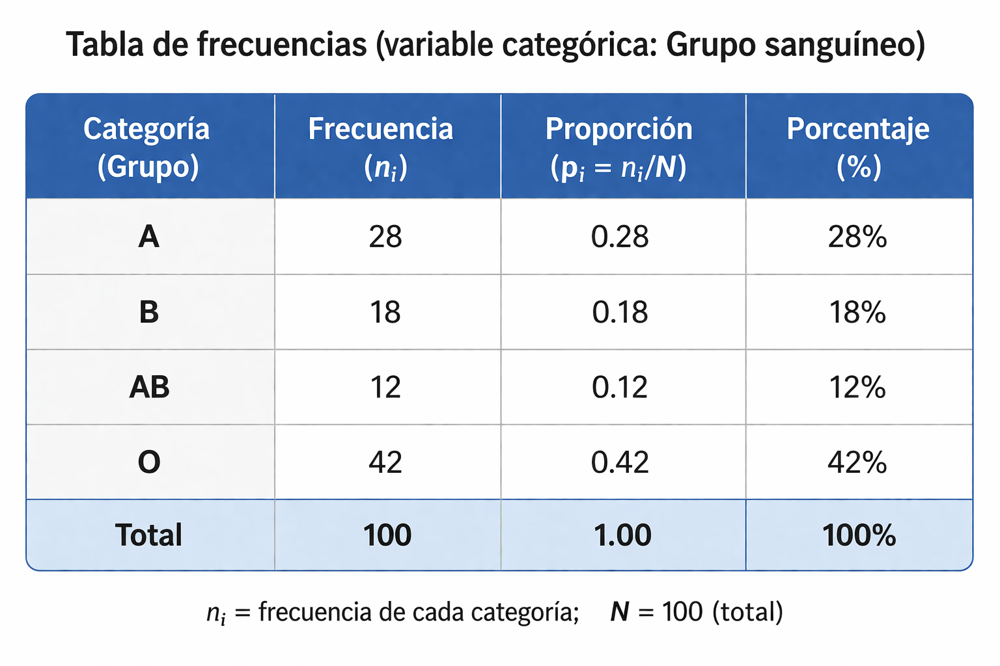
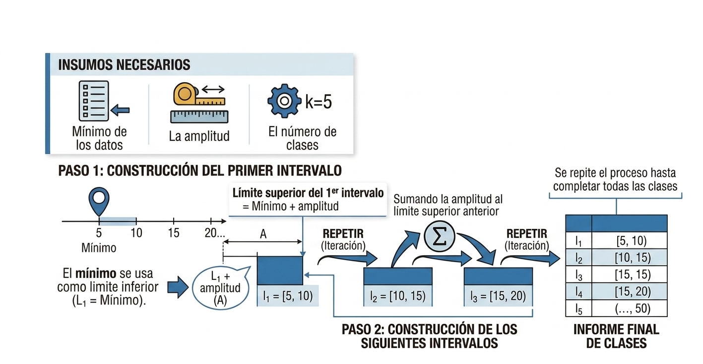

## Contenido

<h3 class="fragment fade-in" data-fragment-index="1" style="font-size: 36px; margin-bottom: 14px;">Presentación tabular</h3>
<ul>
<li class="fragment fade-in" data-fragment-index="2">Tabla de frecuencias.</li>
<li class="fragment fade-in" data-fragment-index="3">Elementos: $f_i$, $F_i$, $h_i$, $H_i$, %.</li>
<li class="fragment fade-in" data-fragment-index="4">Pasos para construirla.</li>
</ul>

<h3 class="fragment fade-in" data-fragment-index="5" style="font-size: 36px; margin-top: 28px; margin-bottom: 14px;">Ejemplos prácticos</h3>
<ul>
<li class="fragment fade-in" data-fragment-index="6">Variable cuantitativa discreta.</li>
<li class="fragment fade-in" data-fragment-index="7">Variable cualitativa nominal.</li>
<li class="fragment fade-in" data-fragment-index="8">Variable cuantitativa continua.</li>
</ul>

<h3 class="fragment fade-in" data-fragment-index="9" style="font-size: 36px; margin-bottom: 14px;">Presentación gráfica</h3>
<ul>
<li class="fragment fade-in" data-fragment-index="10">Gráfico de barras.</li>
<li class="fragment fade-in" data-fragment-index="11">Histograma.</li>
<li class="fragment fade-in" data-fragment-index="12">Polígono de frecuencias.</li>
<li class="fragment fade-in" data-fragment-index="13">Gráfico circular y de líneas.</li>
</ul>

<h3 class="fragment fade-in" data-fragment-index="14" style="font-size: 36px; margin-top: 28px; margin-bottom: 14px;">Tipos de distribuciones</h3>
<ul>
<li class="fragment fade-in" data-fragment-index="15">Distribución simétrica.</li>
<li class="fragment fade-in" data-fragment-index="16">Asimétrica positiva y negativa.</li>
</ul>

##

<h3 class="fragment fade-in" data-fragment-index="1">Estadística descriptiva de una variable</h3>

La estadística descriptiva de una variable es el **conjunto de métodos y técnicas** que permiten **organizar, resumir y describir los datos** obtenidos de una sola característica o variable, con el fin de facilitar su interpretación.

## Las técnicas y métodos mas utilizados son:

<ul>
<li class="fragment fade-up" data-fragment-index="2" style="font-size: 34px;">
Tablas de frecuencias.
</li>
<li class="fragment fade-up" data-fragment-index="3" style="font-size: 34px;">
Gráficos (barras, histogramas, gráficos circulares y otros).
</li>
<li class="fragment fade-up" data-fragment-index="4" style="font-size: 34px;">
Medidas estadísticas como la media, mediana, moda, varianza y desviación estándar.
</li>
</ul>

<h4>Su objetivo principal es:</h4>

<ul>
<li class="fragment fade-in" data-fragment-index="6" style="font-size: 34px;">
<strong>Presentar</strong> la información de manera <strong>clara y comprensible</strong>, sin realizar inferencias o conclusiones más allá de los datos analizados.
</li>
</ul>

## Presentación tabular y gráfica  

<ul>
  <li class="fragment fade-up" data-fragment-index="2" style="font-size: 30px; text-align: justify;">
    Permiten describir la <strong>distribución de una variable</strong>
  </li>
  <li class="fragment fade-up" data-fragment-index="3" style="font-size: 30px; text-align: justify;">
    Se puede expresar en:
    <ul>
      <li class="fragment fade-up" data-fragment-index="4" style="font-size: 30px; text-align: justify;">Cantidades</li>
      <li class="fragment fade-up" data-fragment-index="5" style="font-size: 30px; text-align: justify;">Proporciones</li>
      <li class="fragment fade-up" data-fragment-index="6" style="font-size: 30px; text-align: justify;">Porcentajes</li>
    </ul>
  </li>
  <li class="fragment fade-up" data-fragment-index="7" style="font-size: 30px; text-align: justify;">
    Se aplican a:
    <ul>
      <li class="fragment fade-up" data-fragment-index="8" style="font-size: 30px; text-align: justify;">Variables categóricas</li>
      <li class="fragment fade-up" data-fragment-index="9" style="font-size: 30px; text-align: justify;">Variables numéricas</li>
    </ul>
  </li>
</ul>

## Presentación tabular

<ul>
<h2 class="fragment fade-in" data-fragment-index="2" style="font-size: 30px;">
<strong>Tabla de frecuencias</strong>
</h2>
  <li class="fragment fade-up" data-fragment-index="3" style="font-size: 28px; text-align: justify;">Representación tabular de los datos de una variable</li>
  <li class="fragment fade-up" data-fragment-index="4" style="font-size: 28px; text-align: justify;">Muestra la frecuencia de cada valor o intervalo</li>
  <li class="fragment fade-up" data-fragment-index="5" style="font-size: 28px; text-align: justify;">Organiza grandes cantidades de información</li>
  <li class="fragment fade-up" data-fragment-index="6" style="font-size: 28px; text-align: justify;">Permite identificar patrones o tendencias</li>
  <li class="fragment fade-up" data-fragment-index="7" style="font-size: 28px; text-align: justify;">Permite analizar el comportamiento de los datos</li>
</ul>

<h3 class="fragment fade-in" data-fragment-index="9" style="font-size: 30px;">
<strong>Elementos principales de una tabla de frecuencias</strong>
</h3>
<ul>
<li class="fragment fade-in" data-fragment-index="11" style="font-size: 28px;"><strong>Datos o clases:</strong> valores individuales o intervalos.</li>
<li class="fragment fade-in" data-fragment-index="12" style="font-size: 28px;"><strong>Frecuencia absoluta ($f_i$):</strong> número de veces que aparece un dato.</li>
<li class="fragment fade-in" data-fragment-index="13" style="font-size: 28px;"><strong>Frecuencia acumulada ($F_i$):</strong> suma progresiva de las frecuencias absolutas.</li>
<li class="fragment fade-in" data-fragment-index="14" style="font-size: 28px;"><strong>Frecuencia relativa ($h_i$):</strong> proporción o porcentaje respecto al total.</li>
<li class="fragment fade-in" data-fragment-index="15" style="font-size: 28px;"><strong>Frecuencia relativa acumulada ($H_i$):</strong> suma progresiva de las frecuencias relativas.</li>
</ul>

## Pasos para construir una tabla de frecuencias 

<ul>
<li class="fragment" style="background: #a78bfa; color: white; font-size: 34px;">
1. Determinar el número de clases o intervalos.
</li>

<li class="fragment" style="background: #3b82f6; color: white; font-size: 34px;">
2. Hallar el rango.
</li>

<li class="fragment" style="background: #59A14F; color: white; font-size: 34px;">
3. Determinar la amplitud del intervalo.
</li>

<li class="fragment" style="background: #F28E2B; color: white; font-size: 34px;">
4. Armar los intervalos
</li>

<li class="fragment" style="background: #B07AA1; color: white; font-size: 34px;">
5. Ubicar las frecuencias en los intervalos.
</li>

<li class="fragment" style="background: #76B7B2; color: white; font-size: 34px;">
6. Llenar la tabla de frecuencias.
</li>
</ul>

## 1. Determinar el número de clases o intervalos

Los datos pueden agruparse en el numero de clases o intervalos que se desee; sin embargo es recomendable utilizar criterios como la **raíz cuadrada del tamaño de la muestra** o la **formula de Sturges** para definir una cantidad apropiada de intervalos.

 

<ul>
<li class="fragment fade-in" data-fragment-index="5" style="font-size: 30px;">
**Formulas para determinar el numero de clases:**  
</li>
<li class="fragment fade-in" data-fragment-index="6" style="font-size: 30px;">
$k=\sqrt{n}$, donde $k$ es el numero de clases y $n$ es el tamaño de la muestra o numero de datos.
</li>
<li class="fragment fade-in" data-fragment-index="7" style="font-size: 30px;">
$k=1+3.3322\log_{10}(n)$, donde $k$ es el numero de clases y $n$ es el tamaño de la muestra o numero de datos.
</li>
</ul>

*Un numero razonable de clases puede ser entre 5 y 20 clases, si el resultado al aplicar las formulas da un numero decimal se redondea al entero mayor mas cercano.*

## 2. Hallar el rango

Después de que se tenga el numero de clases establecido, se procede a hallar el máximo y mínimo de los datos, para hallar el rango.

El rango se calcula como:
$$ 𝑅𝑎𝑛𝑔𝑜:𝑅=𝑀𝑎𝑥𝑖𝑚𝑜−M𝑖𝑛𝑖𝑚𝑜 $$

## 3. Determinar la amplitud del intervalo

$$ Amplitud: A= \frac{R}{k} $$

<ul>
<li class="fragment fade-in" data-fragment-index="3"style="text-align: justify;">Determinar el ancho de cada intervalo o clase,</li>
<li class="fragment fade-in" data-fragment-index="4"style="text-align: justify;">Definir dónde se agrupan las frecuencias en la tabla.</li>
<li class="fragment fade-in" data-fragment-index="5"style="text-align: justify;">Generalmente se usan intervalos de igual longitud.</li>
<li class="fragment fade-in" data-fragment-index="6"style="text-align: justify;">Puede redondearse para facilitar la interpretación.</li>
</ul>

## 4. Armar los intervalos

## Ubicar y registrar las frecuencias 

<h2 class="fragment" data-fragment-index="1" style="font-size: 36px;">
5. Ubicar las frecuencias
</h2>
<ul style="font-size: 26px; line-height: 1.5; padding-left: 28px; margin: 0;">
<li class="fragment" data-fragment-index="2">Se cuentan los datos que pertenecen a cada intervalo.</li>
<li class="fragment" data-fragment-index="3">Ese conteo determina la frecuencia de cada clase.</li>
</ul>

<h2 class="fragment" data-fragment-index="4" style="font-size: 36px; margin-top: 20; margin-bottom: 18px;">
6. Llenar la tabla de frecuencias
</h2>
<ul style="font-size: 26px; line-height: 1.5; padding-left: 28px; margin: 0;">
<li class="fragment" data-fragment-index="5">Se registran las frecuencias en la tabla.</li>
<li class="fragment" data-fragment-index="6">Se completa cada elemento correspondiente.</li>
</ul>

## Elementos de la tabla de frecuencias

<ol>
<li class="fragment fade-up" data-fragment-index="2" style="font-size: 30px;">
**Marca de clase $𝑥_𝑖$:** 
<ul>
<li class="fragment fade-up" data-fragment-index="3">Es el punto medio del intervalo.</li>
<li class="fragment fade-up" data-fragment-index="4">Se calcula como la suma del valor mínimo mas el valor máximo de la clase,</li>
<li class="fragment fade-up" data-fragment-index="5">El resultado se divide por 2.</li>
</ul> 
</li>
</ol>

<ol start="2">
<li class="fragment fade-in" data-fragment-index="6" style="font-size: 30px;">
**Frecuencia absoluta $𝑓_𝑖$:** es la cantidad de veces que un dato  pertenece a un intervalo o una clase. 
</li>
<li class="fragment fade-in" data-fragment-index="7" style="font-size: 30px;">
**Frecuencia acumulada $𝐹_𝑖$:** es la suma progresiva de las frecuencias absolutas desde el primer valor o clase hasta el ultimo.
<ul>
<li class="fragment fade-in" data-fragment-index="8" style="font-size: 30px;">
En el ultimo intervalo tiene que dar el numero total de datos.
</li>
</ul>
</li>

</ol>

## Elementos de la tabla de frecuencias

<ol start="4">
<li class="fragment fade-up" data-fragment-index="2" style="font-size: 30px;">
**Frecuencia relativa $ℎ_𝑖$:** proporción o fracción que representa nro de veces que aparece un valor con respecto al total de datos.
<ul>
<li class="fragment fade-up" data-fragment-index="3" style="font-size: 30px;">
Se obtiene dividiendo la frecuencia absoluta $f_i$ entre el número total de datos $n$.
</li>
</ul>
</li>

<li class="fragment fade-up" data-fragment-index="4" style="font-size: 30px;">
**Frecuencia relativa acumulada $𝐻_𝑖$:** es la suma progresiva de las frecuencias relativas desde el primer valor hasta el ultimo. 
</li>
<ul>
<li class="fragment fade-in" data-fragment-index="5" style="font-size: 30px;">
En el ultimo intervalo tiene que dar 1.
</li> 
</ul>
</ol>

<ol start="6">
<li class="fragment fade-in" data-fragment-index="7" style="font-size: 30px;">
**Porcentaje %:** se calcula como la frecuencia relativa multiplicada por 100%.  
</li>
<li class="fragment fade-in" data-fragment-index="8" style="font-size: 30px;">
**% acumulado:** es la suma progresiva de los porcentajes en cada intervalo.
</li>
<ul>
<li class="fragment fade-in" data-fragment-index="9" style="font-size: 30px;">
En el ultimo intervalo tiene que dar el 100%.
</li>
</ul>
</ol>

