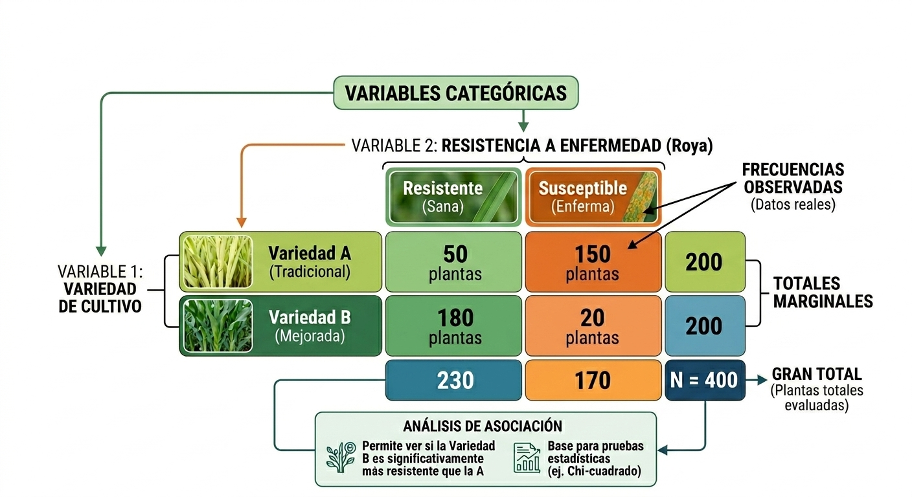
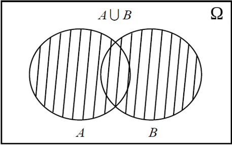
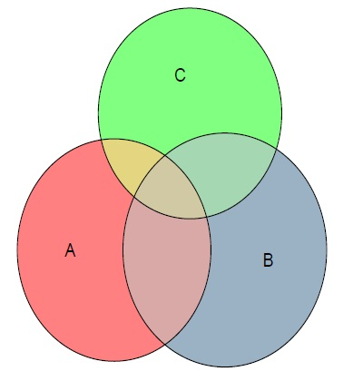
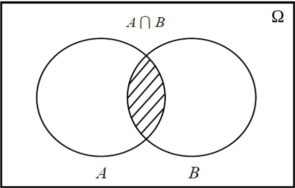
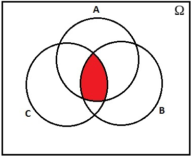
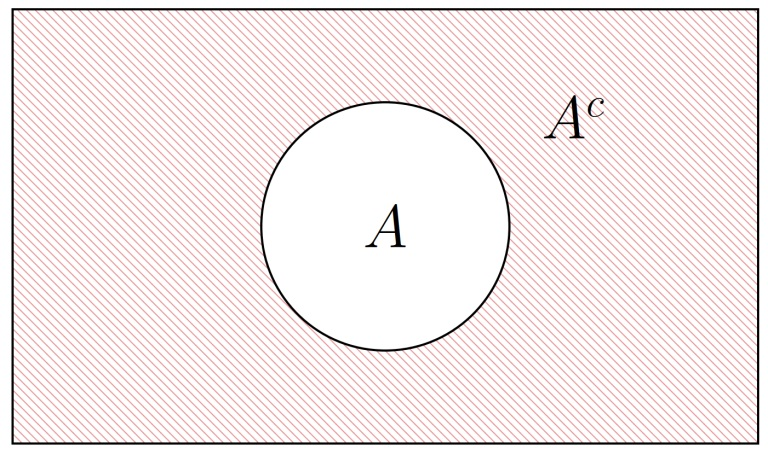

## Clase 5 {.center .middle}

<div style="text-align: center; margin-top: 40px;">
<p style="font-size: 52px; font-weight: bold; color: #3b82f6;">Estadística Descriptiva Bivariada</p>
<p style="font-size: 36px; color: #1b4d2e; font-weight: 600; margin-top: 10px;">y Probabilidad</p>
<p style="font-size: 26px; color: #6b7280; margin-top: 20px;">Tablas, gráficos, medidas de asociación y experimentos aleatorios</p>
<p style="font-size: 24px; color: #9ca3af; margin-top: 30px;">Bioestadística Fundamental — Departamento de Estadística, UNAL Bogotá</p>
</div>


## Contenido

<div style="display: grid; grid-template-columns: 1fr 1fr 1fr; gap: 28px; margin-top: 14px; font-size: 26px; align-items: start;">
<div>
<h3 class="fragment fade-in" data-fragment-index="1" style="font-size: 30px; margin-bottom: 12px; color: #1b4d2e;">Parte I: Estadística bivariada</h3>
<ul>
<li class="fragment fade-in" data-fragment-index="2">Tablas de contingencia.</li>
<li class="fragment fade-in" data-fragment-index="3">Proporciones por fila y columna.</li>
<li class="fragment fade-in" data-fragment-index="4">Chi-cuadrado de independencia.</li>
<li class="fragment fade-in" data-fragment-index="5">Barras agrupadas, apiladas y mosaicos.</li>
<li class="fragment fade-in" data-fragment-index="6">Boxplot y diagrama de dispersión.</li>
</ul>
</div>

<div>
<h3 class="fragment fade-in" data-fragment-index="7" style="font-size: 30px; margin-bottom: 12px; color: #1a3a6b;">Parte II: Medidas de asociación</h3>
<ul>
<li class="fragment fade-in" data-fragment-index="8">Covarianza.</li>
<li class="fragment fade-in" data-fragment-index="9">Correlación de Pearson.</li>
<li class="fragment fade-in" data-fragment-index="10">Correlación de Spearman.</li>
<li class="fragment fade-in" data-fragment-index="11">Limitaciones e interpretación.</li>
</ul>
</div>

<div>
<h3 class="fragment fade-in" data-fragment-index="12" style="font-size: 30px; margin-bottom: 12px; color: #7a1515;">Parte III: Probabilidad</h3>
<ul>
<li class="fragment fade-in" data-fragment-index="13">Experimento aleatorio.</li>
<li class="fragment fade-in" data-fragment-index="14">Espacio muestral.</li>
<li class="fragment fade-in" data-fragment-index="15">Eventos: definición y ejemplos.</li>
<li class="fragment fade-in" data-fragment-index="16">Unión, intersección y complemento.</li>
<li class="fragment fade-in" data-fragment-index="17">Propiedades de los eventos.</li>
</ul>
</div>
</div>

## ¿Qué estudia la estadística descriptiva bivariada?

<div class="fragment fade-up info-box" style="margin-top: 90px; padding-right: 40px;" data-fragment-index="1">
<p class="fragment fade-in" data-fragment-index="2" style="text-align: justify; font-size: 30px;">
Es el conjunto de técnicas que permiten <strong>organizar, resumir y visualizar de manera conjunta</strong> dos variables observadas en los mismos individuos, unidades experimentales o elementos de estudio.
</p>
<p class="fragment fade-in" data-fragment-index="3" style="text-align: justify; font-size: 28px;">
Su propósito es describir si existe relación, cómo es esa relación y qué tan fuerte parece ser.
</p>
</div>

## ¿Por qué estudiar dos variables al mismo tiempo?

<ul>
<li class="fragment bullet-purple">Porque una variable puede ayudar a explicar el comportamiento de otra.</li>
<li class="fragment bullet-blue">Porque permite comparar subgrupos dentro de una población.</li>
<li class="fragment bullet-green">Porque ayuda a detectar asociaciones útiles en investigación y toma de decisiones.</li>
<li class="fragment bullet-orange">Porque resume mejor la información que analizar variables por separado.</li>
</ul>

## Tipos de análisis bivariado según las variables

<div class="twocol">
<div class="card fragment fade-up crispdm-card--gray" data-fragment-index="1" style="margin-top:50px;">
<ul>
<li class="fragment fade-up" data-fragment-index="2" style="font-size: 29px;">
<strong>Cualitativa + cualitativa</strong>
</li>
<li class="fragment fade-up" data-fragment-index="3" style="font-size: 29px;">
Se usan tablas de contingencia y gráficos de barras o mosaicos.
</li>
<li class="fragment fade-up" data-fragment-index="4" style="font-size: 29px;">
Ejemplo: sexo y hábito de fumar.
</li>
</ul>
</div>

<div class="card fragment fade-up crispdm-card--gray" data-fragment-index="5" style="margin-top:50px;">
<ul>
<li class="fragment fade-in" data-fragment-index="6" style="font-size: 29px;">
<strong>Cuantitativa + cualitativa</strong>
</li>
<li class="fragment fade-in" data-fragment-index="7" style="font-size: 29px;">
Se usan resúmenes por grupo y boxplots.
</li>
<li class="fragment fade-in" data-fragment-index="8" style="font-size: 29px;">
Ejemplo: rendimiento según fertilizante.
</li>
<li class="fragment fade-in" data-fragment-index="9" style="font-size: 29px;">
<strong>Cuantitativa + cuantitativa</strong>: dispersión y correlación.
</li>
</ul>
</div>
</div>

## Tabla de contingencia

<div class="block-definition fragment fade-up" data-fragment-index="1" style="margin-top:50px;">
  <div class="block-title">Definición</div>
  <div class="block-body">
<p>
Una <strong>tabla de contingencia</strong> es una tabla de doble entrada que resume la **distribución conjunta** de dos variables cualitativas mediante frecuencias absolutas o relativas.
</p>
  </div>
</div>

<div class="twocol">
<div class="card fragment fade-up crispdm-card--gray" data-fragment-index="3">
<ul>
<li class="fragment fade-up" data-fragment-index="3" style="font-size: 28px;">Filas: categorías de una variable.</li>
<li class="fragment fade-up" data-fragment-index="4" style="font-size: 28px;">Columnas: categorías de la otra variable.</li>
<li class="fragment fade-up" data-fragment-index="5" style="font-size: 28px;">Celdas internas: frecuencias conjuntas.</li>
</ul>
</div>

<div class="card fragment fade-up crispdm-card--gray" data-fragment-index="6">
<ul>
<li class="fragment fade-in" data-fragment-index="7" style="font-size: 28px;">Totales por fila: marginales fila.</li>
<li class="fragment fade-in" data-fragment-index="8" style="font-size: 28px;">Totales por columna: marginales columna.</li>
<li class="fragment fade-in" data-fragment-index="9" style="font-size: 28px;">Total general: tamaño de la muestra.</li>
</ul>
</div>
</div>

## Elementos de una tabla de contingencia

<div style="text-align: center;">
  
</div>


## Ejemplo: actividad física y calidad del sueño

<div class="twocol">

<div class="card fragment fade-up crispdm-card--gray" data-fragment-index="1" style="margin-top: 50px;">
<p class="fragment fade-in" data-fragment-index="2" style="font-size: 28px; text-align: justify;">
En una muestra de 120 estudiantes se registran dos variables:
</p>
<ul>
<li class="fragment fade-in" data-fragment-index="3" style="font-size: 28px;">Actividad física semanal: <strong>Baja</strong>, <strong>Media</strong>, <strong>Alta</strong>.</li>
<li class="fragment fade-in" data-fragment-index="4" style="font-size: 28px;">Calidad del sueño: <strong>Mala</strong>, <strong>Regular</strong>, <strong>Buena</strong>.</li>
</ul>
<p class="fragment fade-in" data-fragment-index="5" style="font-size: 28px; text-align: justify;">
Queremos describir si ambas variables parecen estar asociadas.
</p>
</div>

<table class="fragment fade-in slide-table" data-fragment-index="6" style="max-width: 760px; font-size: 18px; margin-top: 70px;">

  <thead>
    <tr>
      <th style="background:#1e40af;color:white;padding:16px 18px;text-align:left;">Actividad física</th>
      <th style="background:#1e40af;color:white;padding:16px 18px;">Mala</th>
      <th style="background:#1e40af;color:white;padding:16px 18px;">Regular</th>
      <th style="background:#1e40af;color:white;padding:16px 18px;">Buena</th>
      <th style="background:#1e40af;color:white;padding:16px 18px;">Total</th>
    </tr>
  </thead>

  <tbody>
    <tr style="background:#f8fafc;">
      <td style="padding:14px 18px;font-weight:bold;text-align:left;">Baja</td>
      <td style="padding:14px 18px;">18</td>
      <td style="padding:14px 18px;">12</td>
      <td style="padding:14px 18px;">6</td>
      <td style="padding:14px 18px;font-weight:bold;">36</td>
    </tr>

    <tr style="background:#ffffff;">
      <td style="padding:14px 18px;font-weight:bold;text-align:left;">Media</td>
      <td style="padding:14px 18px;">10</td>
      <td style="padding:14px 18px;">18</td>
      <td style="padding:14px 18px;">14</td>
      <td style="padding:14px 18px;font-weight:bold;">42</td>
    </tr>

    <tr style="background:#f8fafc;">
      <td style="padding:14px 18px;font-weight:bold;text-align:left;">Alta</td>
      <td style="padding:14px 18px;">4</td>
      <td style="padding:14px 18px;">12</td>
      <td style="padding:14px 18px;">26</td>
      <td style="padding:14px 18px;font-weight:bold;">42</td>
    </tr>

    <tr style="background:#dbeafe;font-weight:bold;color:#1e3a8a;">
      <td style="padding:16px 18px;text-align:left;">Total</td>
      <td style="padding:16px 18px;">32</td>
      <td style="padding:16px 18px;">42</td>
      <td style="padding:16px 18px;">46</td>
      <td style="padding:16px 18px;">120</td>
    </tr>
  </tbody>
</table>


</div>


## Proporciones


<div class="twocol">

<div class="card fragment fade-up crispdm-card--gray" data-fragment-index="1" >
<h4>Proporciones por fila</h4>
<table class="slide-table" style="max-width: 760px; font-size: 18px;">

  <thead>
    <tr>
      <th style="background:#1e40af;color:white;padding:16px 18px;text-align:left;">Calidad del sueño</th>
      <th style="background:#1e40af;color:white;padding:16px 18px;">Mala</th>
      <th style="background:#1e40af;color:white;padding:16px 18px;">Regular</th>
      <th style="background:#1e40af;color:white;padding:16px 18px;">Buena</th>
    </tr>
  </thead>

  <tbody>
    <tr style="background:#f8fafc;">
      <td style="padding:14px 18px;font-weight:bold;text-align:left;">Baja</td>
      <td style="padding:14px 18px;">56.3%</td>
      <td style="padding:14px 18px;">28.6%</td>
      <td style="padding:14px 18px;">13.0%</td>
    </tr>

    <tr style="background:#ffffff;">
      <td style="padding:14px 18px;font-weight:bold;text-align:left;">Media</td>
      <td style="padding:14px 18px;">31.3%</td>
      <td style="padding:14px 18px;">42.9%</td>
      <td style="padding:14px 18px;">30.4%</td>
    </tr>

    <tr style="background:#f8fafc;">
      <td style="padding:14px 18px;font-weight:bold;text-align:left;">Alta</td>
      <td style="padding:14px 18px;">12.5%</td>
      <td style="padding:14px 18px;">28.6%</td>
      <td style="padding:14px 18px;">56.5%</td>
    </tr>

    <tr style="background:#dbeafe;font-weight:bold;color:#1e3a8a;">
      <td style="padding:16px 18px;text-align:left;">Total</td>
      <td style="padding:16px 18px;">100%</td>
      <td style="padding:16px 18px;">100%</td>
      <td style="padding:16px 18px;">100%</td>
    </tr>
  </tbody>
</table>
</div>

<div class="card fragment fade-up crispdm-card--gray" data-fragment-index="2" >
<h4>Proporciones por columna</h4>
<table class="slide-table" style="max-width: 760px; font-size: 18px;">

  <thead>
    <tr>
      <th style="background:#1e40af;color:white;padding:16px 18px;text-align:left;">Calidad del sueño</th>
      <th style="background:#1e40af;color:white;padding:16px 18px;">Mala</th>
      <th style="background:#1e40af;color:white;padding:16px 18px;">Regular</th>
      <th style="background:#1e40af;color:white;padding:16px 18px;">Buena</th>
      <th style="background:#1e40af;color:white;padding:16px 18px;">Total</th>
    </tr>
  </thead>

  <tbody>
    <tr style="background:#f8fafc;">
      <td style="padding:14px 18px;font-weight:bold;text-align:left;">Baja</td>
      <td style="padding:14px 18px;">50.0%</td>
      <td style="padding:14px 18px;">33.3%</td>
      <td style="padding:14px 18px;">16.7%</td>
      <td style="padding:14px 18px;font-weight:bold;">100%</td>
    </tr>

    <tr style="background:#ffffff;">
      <td style="padding:14px 18px;font-weight:bold;text-align:left;">Media</td>
      <td style="padding:14px 18px;">23.8%</td>
      <td style="padding:14px 18px;">42.9%</td>
      <td style="padding:14px 18px;">33.3%</td>
      <td style="padding:14px 18px;font-weight:bold;">100%</td>
    </tr>

    <tr style="background:#f8fafc;">
      <td style="padding:14px 18px;font-weight:bold;text-align:left;">Alta</td>
      <td style="padding:14px 18px;">9.5%</td>
      <td style="padding:14px 18px;">28.6%</td>
      <td style="padding:14px 18px;">61.9%</td>
      <td style="padding:14px 18px;font-weight:bold;">100%</td>
    </tr>

    <tr style="background:#dbeafe;font-weight:bold;color:#1e3a8a;">
      <td style="padding:16px 18px;text-align:left;">Total</td>
      <td style="padding:16px 18px;">100%</td>
      <td style="padding:16px 18px;">100%</td>
      <td style="padding:16px 18px;">100%</td>
      <td style="padding:16px 18px;">100%</td>
    </tr>
  </tbody>
</table>

</div>
</div>

<h4 class="fragment fade-up" data-fragment-index="3">Algunas conclusiones:</h4>
<ul>
<li class="fragment fade-up" data-fragment-index="4" style="font-size: 30px;">
Entre quienes tienen actividad física baja, la mitad reporta sueño malo.
</li>
<li class="fragment fade-up" data-fragment-index="5" style="font-size: 30px;">
Entre quienes tienen actividad física alta, 61.9% reporta sueño bueno.
</li>
<li class="fragment fade-up" data-fragment-index="6" style="font-size: 30px; text-align: justify;">
Esto sugiere una asociación positiva entre mayor actividad física y mejor calidad del sueño.
</li>
</ul>

## ¿Por qué no basta con los totales?

<div class="card fragment fade-up crispdm-card--gray" data-fragment-index="1" style="margin-top: 55px; text-align: justify;">
<ul>
<li class="fragment fade-up" data-fragment-index="2" style="font-size: 29px; text-align: justify;">
Los totales marginales muestran cuánto hay de cada categoría por separado.
</li>
<li class="fragment fade-up" data-fragment-index="3" style="font-size: 29px; text-align: justify;">
Pero la <strong>asociación</strong> entre variables aparece en la comparación de las frecuencias conjuntas.
</li>
<li class="fragment fade-up" data-fragment-index="4" style="font-size: 29px; text-align: justify;">
Dos tablas pueden tener los mismos marginales y, sin embargo, relaciones internas muy diferentes.
</li>
<li class="fragment fade-up" data-fragment-index="5" style="font-size: 29px; text-align: justify;">
Utilizamos algunos de los siguientes test estadísticos para concluir sobre el fenómeno en estudio:
<ul>
<li class="fragment fade-up" data-fragment-index="6"><strong>Independencia:</strong> Chi-cuadrado o test exacto de Fisher (muestras pequeñas).
</li>
<li class="fragment fade-up" data-fragment-index="7"><strong>Homogeneidad:</strong> Chi-cuadrado(dos poblaciones) o test exacto de Fisher.
</li>
<li class="fragment fade-up" data-fragment-index="8"><strong>Simetría (tablas cuadradas n×n):</strong> Test de McNemar (para 2×2 pareadas), Test de simetría de Bowker (extensión de McNemar para n×n) y Test de Stuart-Maxwell (homogeneidad marginal).
</li>
</ul>
</li>
</ul>
</div>

## Chi-cuadrado de independencia
<p class="fragment fade-up" data-fragment-index="2" style="font-size:28px">Evalúa si dos variables categóricas son independientes o están asociadas.</p>

<div class=twocol>
<div class="card fragment fade-up crispdm-card--gray" data-fragment-index="1" style="font-size:28px">

<h4 class="fragment fade-up" data-fragment-index="4">Hipótesis</h4>
<p class="fragment fade-up" data-fragment-index="5" style="font-size:24px">
$H_0$: Las variables son independientes. <br>
$H_1$: Las variables no son independientes.
</p><br>
<h4 class="fragment fade-up" data-fragment-index="6"> Estadístico de prueba</h4>
<p class="fragment fade-up" data-fragment-index="7" style="font-size:24px">
$$
\chi^2 = \sum_{i=1}^{n} \sum_{j=1}^{m} \frac{(O_{ij} - E_{ij})^2}{E_{ij}}
$$
</p>
<h4 class="fragment fade-up" data-fragment-index="8">Frecuencia esperada</h4>
<p class="fragment fade-up" data-fragment-index="9" style="font-size:28px">
$$
E_{ij} = \frac{(T_{i\cdot})(T_{\cdot j})}{T}
$$</p>
<p class="fragment fade-up" data-fragment-index="9" style="font-size:24px">
Donde: $T_{i\cdot}$ es el total fila, $T_{\cdot j}$ es el total columna y $T$ es el total general.</p>
</div>

<div class="card fragment fade-up crispdm-card--gray" data-fragment-index="10" style="font-size:28px">
<h4 class="fragment fade-up" data-fragment-index="11">Grados de libertad</h4>
<p class="fragment fade-up" data-fragment-index="11">
$$
gl = (n - 1)(m - 1)
$$
</p>
<p class="fragment fade-up" data-fragment-index="12" style="font-size:24px">
**Región crítica,** Con $\alpha$ el nivel de significancia:</p>
<p class="fragment fade-up" data-fragment-index="13" style="font-size:24px">
$$
\text{Región crítica: } \chi^2_{\text{obs}} > \chi^2_{\alpha, gl}
$$
donde $\chi^2_{\alpha,, gl}$ es el valor crítico de la distribución Chi-cuadrado con $gl$ grados de libertad.
</p><br>
<h4 class="fragment fade-up" data-fragment-index="14">Regla de decisión</h4>

<p class="fragment fade-up" data-fragment-index="15" style="font-size:24px">
Si $\chi^2_{\text{obs}} > \chi^2_{\alpha,, gl}$ → Rechazar $H_0$<br>
Si $\chi^2_{\text{obs}} \leq \chi^2_{\alpha,, gl}$ → No rechazar $H_0$
</p>
</div>
</div>


## Ejemplo

<p class="fragment fade-up" data-fragment-index="1" style="font-size:28px">
Evaluar si existe asociación entre el **tipo de fertilización** y la **presencia de enfermedad** en cultivos fríos (papa) en Colombia. Se observan los siguientes datos:
</p>
<div class="twocol">

<div class="card fragment fade-up crispdm-card--gray" data-fragment-index="2" style="font-size:28px">
<table class="slide-table" style="max-width: 700px; font-size: 24px;">

  <thead>
    <tr style="background-color: #2f4aa0; color: white; text-align: center; font-size:24px">
      <th style="padding: 14px;">Fertilización</th>
      <th>Enfermedad: Sí</th>
      <th>Enfermedad: No</th>
      <th>Total</th>
    </tr>
  </thead>

  <tbody>
    <tr style="background-color: #f2f2f2; text-align: center;">
      <td style="text-align: left; padding: 12px;"><strong>A</strong></td>
      <td>30</td>
      <td>20</td>
      <td><strong>50</strong></td>
    </tr>

    <tr style="background-color: #ffffff; text-align: center;">
      <td style="text-align: left; padding: 12px;"><strong>B</strong></td>
      <td>15</td>
      <td>35</td>
      <td><strong>50</strong></td>
    </tr>

    <tr style="background-color: #dbe3f1; text-align: center; font-weight: bold; color: #2f4aa0;">
      <td style="text-align: left; padding: 12px;">Total</td>
      <td>45</td>
      <td>55</td>
      <td>100</td>
    </tr>
  </tbody>

</table>
<h4 class="fragment fade-up" data-fragment-index="11">Hipótesis</h4>
<p class="fragment fade-up" data-fragment-index="11" style="font-size:24px">
$H_0$: fertilización y enfermedad son independientes  
$H_1$: Existe asociación entre las variables
</p>
<h4 class="fragment fade-up" data-fragment-index="12">Frecuencias esperadas</h4>
<p class="fragment fade-up" data-fragment-index="13" style="font-size:20px">
$$
E_{11} = \frac{50 \times 45}{100} = 22.5 \quad
E_{12} = \frac{50 \times 55}{100} = 27.5
$$</p>
<p class="fragment fade-up" data-fragment-index="13" style="font-size:20px">
$$
E_{21} = \frac{50 \times 45}{100} = 22.5 \quad
E_{22} = \frac{50 \times 55}{100} = 27.5
$$
</p>
</div>

<div class="card fragment fade-up crispdm-card--gray" data-fragment-index="14" style="font-size:28px">
<h4 class="fragment fade-up" data-fragment-index="15">Estadístico de prueba</h4>
<p class="fragment fade-up" data-fragment-index="16" style="font-size:20px">
$$
\chi^2 = \frac{(30-22.5)^2}{22.5} + \frac{(20-27.5)^2}{27.5} + \frac{(15-22.5)^2}{22.5} + \frac{(35-27.5)^2}{27.5}
$$
</p>
<p class="fragment fade-up" data-fragment-index="16" style="font-size:20px">
$$
\chi^2_{obs} \approx 9.09
$$
</p>
<h4 class="fragment fade-up" data-fragment-index="17">Región crítica</h4>
<p class="fragment fade-up" data-fragment-index="18" style="font-size:20px">
$$
gl = (2-1)(2-1) = 1
$$
Para $\alpha = 0.05$ tenemos que: <a href="http://labrad.fisica.edu.uy/docs/tabla_chi_cuadrado.pdf" target="_blank">Tabla</a>
$$
\chi^2_{0.05,1} = 3.84
$$
</p>
<h4 class="fragment fade-up" data-fragment-index="19">Regla de decisión</h4>
<p class="fragment fade-up" data-fragment-index="20" style="font-size:20px">
Si $\chi^2_{\text{obs}} > \chi^2_{\alpha, gl}$ → Rechazar $H_0$  
Si $\chi^2_{\text{obs}} \leq \chi^2_{\alpha, gl}$ → No rechazar $H_0$  
</p>
</div>
</div>

## {.center .middle}

<div style="text-align: center; margin-top: 60px;">
<p style="font-size: 44px; font-weight: bold; color: #1a3a6b;">Gráficos Bivariados</p>
<p style="font-size: 28px; color: #6b7280; margin-top: 20px;">Barras, mosaicos, boxplots y diagramas de dispersión</p>
</div>

## Barras agrupadas

<div class="twocol">
<div class="card fragment fade-up crispdm-card--gray" data-fragment-index="1" style="margin-top:50px;">
<ul>
<li class="fragment fade-up" data-fragment-index="2" style="font-size: 28px;">Comparan categorías lado a lado.</li>
<li class="fragment fade-up" data-fragment-index="3" style="font-size: 28px;">Son útiles para contrastar frecuencias o porcentajes.</li>
<li class="fragment fade-up" data-fragment-index="4" style="font-size: 28px;">Facilitan ver diferencias entre grupos.</li>
</ul>

<p class="fragment fade-in" data-fragment-index="5" style="font-size: 29px; text-align: justify;">
Por ejemplo, grafiquemos para cada nivel de actividad física las tres barras de sueño malo, regular y bueno.
</p>
</div>

<div class="card fragment fade-up crispdm-card--gray" data-fragment-index="6" style="margin-top:50px;">

```{r, echo=FALSE}
# Librerías
library(ggplot2)

# Datos
datos <- data.frame(
  Actividad = rep(c("Baja", "Media", "Alta"), each = 3),
  Sueno = rep(c("Mala", "Regular", "Buena"), times = 3),
  Frecuencia = c(18, 12, 6,
                 10, 18, 14,
                 4, 12, 26)
)

# Gráfico de barras agrupadas
ggplot(datos, aes(x = Actividad, y = Frecuencia, fill = Sueno)) +
  geom_bar(stat = "identity", position = "dodge") +
  scale_fill_manual(values = c("#d95f02", "#7570b3", "#1b9e77")) +
  labs(
    title = "Calidad de sueño según nivel de actividad física",
    x = "Nivel de actividad física",
    y = "Frecuencia",
    fill = "Calidad del sueño"
  ) +
  theme_minimal(base_size = 14) +
  theme(
    plot.title = element_text(face = "bold"),
    legend.position = "top"
  )
```
</div>
</div>

## Barras apiladas

<div class="twocol">
<div class="card fragment fade-up crispdm-card--gray" data-fragment-index="1" style="margin-top:50px;">
<ul>
<li class="fragment fade-up" data-fragment-index="2" style="font-size: 28px;">Muestran la composición interna de cada grupo.</li>
<li class="fragment fade-up" data-fragment-index="3" style="font-size: 28px;">Son útiles cuando interesa comparar proporciones.</li>
<li class="fragment fade-up" data-fragment-index="4" style="font-size: 28px;">Conviene usar barras de igual altura cuando se comparan porcentajes.</li>
</ul>
<p class="fragment fade-in" data-fragment-index="5" style="font-size: 29px; text-align: justify;">
Permiten ver rápidamente si cambia la distribución de una variable de acuerdo con la otra.
</p>
</div>

<div class="card fragment fade-up crispdm-card--gray" data-fragment-index="6" style="margin-top:50px;">

```{r, echo=FALSE}
library(ggplot2)
# Datos
datos <- data.frame(
  Actividad = rep(c("Baja", "Media", "Alta"), each = 3),
  Sueno = rep(c("Mala", "Regular", "Buena"), times = 3),
  Frecuencia = c(18, 12, 6,
                 10, 18, 14,
                 4, 12, 26)
)

# Gráfico de barras apiladas
ggplot(datos, aes(x = Actividad, y = Frecuencia, fill = Sueno)) +
  geom_bar(stat = "identity") +
  
  scale_fill_manual(values = c("#d95f02", "#7570b3", "#1b9e77")) +
  
  labs(
    title = "Distribución de la calidad del sueño según actividad física",
    x = "Nivel de actividad física",
    y = "Frecuencia",
    fill = "Calidad del sueño"
  ) +
  
  theme_minimal(base_size = 16) +
  theme(
    plot.title = element_text(face = "bold", hjust = 0.5),
    legend.position = "top"
  )
```

</div>
</div>

## Gráfico mosaico

<div class="twocol">

<div class="card fragment fade-up crispdm-card--gray" data-fragment-index="1" style="margin-top:50px;">
<p class="fragment fade-in" data-fragment-index="2" style="font-size: 29px; text-align: justify;">
El gráfico mosaico representa las categorías de dos variables cualitativas usando rectángulos cuya <strong>área es proporcional a la frecuencia conjunta</strong>.
</p>
<div class="fragment fade-in" data-fragment-index="3" style="margin-top: 20px; font-size: 28px; text-align: justify;">
Es especialmente útil para ver simultáneamente tamaño de grupos y composición interna.
</div>
</div>

<div class="card fragment fade-up crispdm-card--gray" data-fragment-index="4" style="margin-top:50px;">
```{r, echo=FALSE}
# Librerías
library(ggplot2)

# Datos
datos <- data.frame(
  Actividad = rep(c("Baja", "Media", "Alta"), each = 3),
  Sueno = rep(c("Mala", "Regular", "Buena"), times = 3),
  Frecuencia = c(18, 12, 6,
                 10, 18, 14,
                 4, 12, 26)
)

# Gráfico mosaico con ggplot
ggplot(datos, aes(x = Actividad, y = Frecuencia, fill = Sueno)) +
  geom_bar(stat = "identity", position = "fill", width = 1) +
  
  scale_fill_manual(values = c("#d95f02", "#7570b3", "#1b9e77")) +
  
  labs(
    title = "Gráfico mosaico: Actividad física vs calidad del sueño",
    x = "Actividad física",
    y = "Proporción",
    fill = "Calidad del sueño"
  ) +
  
  theme_minimal(base_size = 16) +
  theme(
    plot.title = element_text(face = "bold", hjust = 0.5),
    legend.position = "top"
  )
```
</div>
</div>


## ¿Cuándo usar cada gráfico?

<table class="slide-table" style="max-width: 1000px; font-size: 28px; margin-top: 100px;">

  <thead>
    <tr style="background-color: #2f4aa0; color: white; text-align: center;">
      <th style="padding: 14px;">Objetivo</th>
      <th>Recurso recomendado</th>
    </tr>
  </thead>

  <tbody>
    <tr class="fragment fade-in" data-fragment-index="1" style="background-color: #f2f2f2;">
      <td style="padding: 12px;">Comparar categorías lado a lado</td>
      <td style="text-align: center;"><strong>Barras agrupadas</strong></td>
    </tr>

    <tr class="fragment fade-in" data-fragment-index="2" style="background-color: #ffffff;">
      <td style="padding: 12px;">Ver composición interna</td>
      <td style="text-align: center;"><strong>Barras apiladas</strong></td>
    </tr>

    <tr class="fragment fade-in" data-fragment-index="3" style="background-color: #f2f2f2;">
      <td style="padding: 12px;">Ver frecuencia conjunta y marginal al mismo tiempo</td>
      <td style="text-align: center;"><strong>Mosaico</strong></td>
    </tr>

    <tr class="fragment fade-in" data-fragment-index="4" style="background-color: #ffffff;">
      <td style="padding: 12px;">Resumir tablas pequeñas</td>
      <td style="text-align: center;"><strong>Tabla de contingencia</strong></td>
    </tr>
  </tbody>

</table>

## Ejercicio: elección de gráfico

<div class="twocol">

<div class="card fragment fade-up crispdm-card--gray" data-fragment-index="1">
<p class="fragment fade-in" data-fragment-index="2" style="font-size: 26px; text-align: justify;">
Para cada situación, indique el gráfico bivariado más apropiado y justifique brevemente:
</p>
<ol>
<li class="fragment fade-in" data-fragment-index="3" style="font-size: 25px; text-align: justify;">Comparar la distribución del peso al nacer (kg) entre recién nacidos de madres fumadoras y no fumadoras.</li>
<li class="fragment fade-in" data-fragment-index="4" style="font-size: 25px; text-align: justify;">Describir la relación entre dosis de fertilizante (kg/ha) y rendimiento de maíz (ton/ha) en 50 parcelas.</li>
<li class="fragment fade-in" data-fragment-index="5" style="font-size: 25px; text-align: justify;">Mostrar la composición de causas de mortalidad según grupo de edad (joven, adulto, mayor).</li>
<li class="fragment fade-in" data-fragment-index="6" style="font-size: 25px; text-align: justify;">Comparar el porcentaje de plantas enfermas entre tres tipos de suelo (arcilloso, arenoso, franco).</li>
</ol>
</div>

<div class="card fragment fade-up crispdm-card--gray" data-fragment-index="7">
<p class="fragment fade-in" data-fragment-index="8" style="font-size: 26px; font-weight: bold;">Respuestas:</p>
<ol>
<li class="fragment fade-in" data-fragment-index="9" style="font-size: 24px;"><strong>Boxplot por grupo:</strong> variable cuantitativa vs cualitativa.</li>
<li class="fragment fade-in" data-fragment-index="10" style="font-size: 24px;"><strong>Diagrama de dispersión:</strong> dos variables cuantitativas.</li>
<li class="fragment fade-in" data-fragment-index="11" style="font-size: 24px;"><strong>Barras apiladas o mosaico:</strong> dos cualitativas; interesa la composición interna.</li>
<li class="fragment fade-in" data-fragment-index="12" style="font-size: 24px;"><strong>Barras agrupadas:</strong> dos cualitativas; interesa comparar frecuencias entre grupos.</li>
</ol>
</div>

</div>

## Una variable cuantitativa y otra cualitativa

<div class="twocol">
<div class="card fragment fade-up crispdm-card--gray" data-fragment-index="1" style="margin-top:50px">
<ul>
<li class="fragment fade-up" data-fragment-index="2" style="font-size: 28px;">Interesa comparar una medición numérica entre grupos.</li>
<li class="fragment fade-up" data-fragment-index="3" style="font-size: 28px;">Se calculan medias, medianas y dispersión por categoría.</li>
<li class="fragment fade-up" data-fragment-index="4" style="font-size: 28px;">Ejemplo: presión arterial según dieta.</li>
<li class="fragment fade-in" data-fragment-index="5" style="font-size: 28px;">También pueden compararse mínimos, máximos y rango intercuartílico.</li>

</ul>
</div>


<table class="fragment fade-in slide-table" data-fragment-index="6" style="max-width: 1000px; font-size: 28px; margin-top: 120px;">

  <thead>
    <tr style="background-color: #2f4aa0; color: white;">
      <th style="padding: 14px; font-size:20px; text-align:left;">Tratamiento</th>
      <th>$n$</th>
      <th> $\bar{x}$ (kg) </th>
      <th>$Me$</th>
      <th>$\sigma$</th>
    </tr>
  </thead>

  <tbody>
    <tr style="background-color: #f2f2f2;">
      <td style="text-align:center; padding:12px;"><strong>A</strong></td>
      <td>12</td>
      <td>48.2</td>
      <td>48.0</td>
      <td>3.1</td>
    </tr>

    <tr style="background-color: #ffffff;">
      <td style="text-align:center; padding:12px;"><strong>B</strong></td>
      <td>12</td>
      <td>52.6</td>
      <td>52.1</td>
      <td>2.8</td>
    </tr>

    <tr style="background-color: #f2f2f2;;">
      <td style="text-align:center; padding:12px;">C</td>
      <td>12</td>
      <td>55.4</td>
      <td>55.0</td>
      <td>4.0</td>
    </tr>
  </tbody>

</table>

</div>

## Gráficos para cuantitativa vs cualitativa

<div class="card fragment fade-up crispdm-card--gray" data-fragment-index="1" style="margin-top: 40px;">
<ul>
<li class="fragment fade-up" data-fragment-index="2" style="font-size: 30px;">Boxplot: compara medianas, cuartiles y atípicos.</li>
<li class="fragment fade-up" data-fragment-index="3" style="font-size: 30px;">Diagrama de puntos: útil en muestras pequeñas.</li>
<li class="fragment fade-up" data-fragment-index="4" style="font-size: 30px;">Violín o densidad por grupo: útil si se quiere ver la forma de la distribución.</li>
</ul>
</div>

## ¿Qué muestra un boxplot?

<div class="twocol">
<div class="card fragment fade-up crispdm-card--gray" data-fragment-index="1" style="margin-top: 50px;">
<ul>
<li class="fragment fade-up" data-fragment-index="2" style="font-size: 28px;">Mediana.</li>
<li class="fragment fade-up" data-fragment-index="3" style="font-size: 28px;">Cuartil 1 y cuartil 3.</li>
<li class="fragment fade-up" data-fragment-index="4" style="font-size: 28px;">Rango intercuartílico.</li>
<li class="fragment fade-in" data-fragment-index="6" style="font-size: 28px;">Bigotes.</li>
<li class="fragment fade-in" data-fragment-index="7" style="font-size: 28px;">Valores extremos o atípicos.</li>
<li class="fragment fade-in" data-fragment-index="8" style="font-size: 28px;">Posibles diferencias en simetría entre grupos.</li>
</ul>
</div>

<div class="card fragment fade-up crispdm-card--gray" data-fragment-index="9" style="margin-top: 50px;">

```{r, echo=FALSE}
library(ggplot2)

# Datos simulados coherentes con tu tabla resumen
set.seed(123)

datos <- data.frame(
  Tratamiento = rep(c("A", "B", "C"), each = 12),
  Peso = c(
    rnorm(12, mean = 48.2, sd = 3.1),
    rnorm(12, mean = 52.6, sd = 2.8),
    rnorm(12, mean = 55.4, sd = 4.0)
  )
)

# Boxplot bonito
ggplot(datos, aes(x = Tratamiento, y = Peso, fill = Tratamiento)) +
  geom_boxplot(alpha = 0.8, width = 0.6, outlier.color = "red", outlier.size = 2) +
  
  # Mediana resaltada
  stat_summary(fun = median, geom = "point", size = 3, color = "black") +
  
  scale_fill_manual(values = c("#4C72B0", "#55A868", "#C44E52")) +
  
  labs(
    title = "Distribución del peso por tratamiento",
    subtitle = "Mediana, cuartiles, rango intercuartílico y valores atípicos",
    x = "Tratamiento",
    y = "Peso (kg)"
  ) +
  
  theme_minimal(base_size = 16) +
  theme(
    plot.title = element_text(face = "bold", hjust = 0.5),
    plot.subtitle = element_text(hjust = 0.5),
    legend.position = "none"
  )
```

</div>
</div>

## Ejercicio: interpretación de boxplot

<div class="twocol">

<div class="card fragment fade-up crispdm-card--gray" data-fragment-index="1">
<p class="fragment fade-in" data-fragment-index="2" style="font-size: 26px; text-align: justify;">
Un investigador mide el contenido de proteína (g/100g) en dos variedades de fríjol. El boxplot muestra:
</p>
<table class="slide-table fragment fade-in" data-fragment-index="3" style="font-size: 24px; margin-top: 10px;">
<thead>
<tr><th>Estadístico</th><th>Variedad A</th><th>Variedad B</th></tr>
</thead>
<tbody>
<tr><td>Mínimo</td><td>18</td><td>20</td></tr>
<tr><td>$Q_1$</td><td>21</td><td>23</td></tr>
<tr><td>Mediana</td><td>24</td><td>25</td></tr>
<tr><td>$Q_3$</td><td>27</td><td>26</td></tr>
<tr><td>Máximo</td><td>38</td><td>30</td></tr>
</tbody>
</table>
</div>

<div class="card fragment fade-up crispdm-card--gray" data-fragment-index="4">
<p class="fragment fade-in" data-fragment-index="5" style="font-size: 26px; font-weight: bold;">Preguntas:</p>
<ol>
<li class="fragment fade-in" data-fragment-index="6" style="font-size: 25px;">¿Cuál variedad tiene mayor IQR? Calcúlelo.</li>
<li class="fragment fade-in" data-fragment-index="7" style="font-size: 25px;">¿Qué indica el máximo de 38 en la Variedad A? ¿Podría ser un dato atípico?</li>
<li class="fragment fade-in" data-fragment-index="8" style="font-size: 25px;">¿Cuál variedad es más homogénea? Justifique.</li>
<li class="fragment fade-in" data-fragment-index="9" style="font-size: 25px;">¿Qué variedad elegiría si busca mayor contenido proteico mediano?</li>
</ol>
<div class="block-note fragment fade-up" data-fragment-index="10">
  <div class="block-body" style="font-size: 22px;">
  <strong>Respuestas:</strong> IQR A = 6, IQR B = 3. Variedad A: 38 podría ser atípico ($LS = 27 + 1.5 \times 6 = 36$). Variedad B es más homogénea (IQR menor). Variedad B tiene mediana levemente mayor (25 vs 24).
  </div>
</div>
</div>

</div>

## Dos variables cuantitativas

<div class="fragment fade-up info-box" style="margin-top: 95px;" data-fragment-index="1">
<p class="fragment fade-in" data-fragment-index="2" style="font-size: 30px; text-align: justify;">
Cuando ambas variables son cuantitativas, el interés principal suele ser describir si existe una <strong>relación entre sus valores</strong>, si dicha relación es positiva o negativa, y si parece lineal o no lineal.
</p>
</div>

## Diagrama de dispersión

<div class="twocol">
<div class="card fragment fade-up crispdm-card--gray" data-fragment-index="1" >
<p style="font-size: 28px;">
Representa cada individuo mediante un punto cuyas coordenadas corresponden a los valores observados en las dos variables cuantitativas.
</p>
<ul>
<li class="fragment fade-up" data-fragment-index="2" style="font-size: 28px;">Eje horizontal: valores de la variable X.</li>
<li class="fragment fade-up" data-fragment-index="3" style="font-size: 28px;">Eje vertical: valores de la variable Y.</li>
<li class="fragment fade-up" data-fragment-index="4" style="font-size: 28px;">Cada punto representa una observación.</li>
<li class="fragment fade-up" data-fragment-index="5" style="font-size: 28px;">La nube de puntos sugiere dirección, forma e intensidad.</li>
</ul>
<h4 class="fragment fade-up" data-fragment-index="6">Patrones</h4>
<ul style="font-size: 28px;">
<li class="fragment fade-up" data-fragment-index="6" style="font-size: 28px;">Asociación positiva.</li>
<li class="fragment fade-up" data-fragment-index="7" style="font-size: 28px;">Asociación negativa.</li>
<li class="fragment fade-up" data-fragment-index="8" style="font-size: 28px;">Ausencia aparente de asociación.</li>
</ul>
</div>

<div class="card fragment fade-up crispdm-card--gray" data-fragment-index="9" >
<h4 class="fragment fade-up" data-fragment-index="9">Asociación</h4>
<ul>
<li class="fragment fade-up" data-fragment-index="10" style="font-size: 28px;">Asociación positiva.</li>
<li class="fragment fade-up" data-fragment-index="11" style="font-size: 28px;">Asociación negativa.</li>
<li class="fragment fade-up" data-fragment-index="12" style="font-size: 28px;">Ausencia aparente de asociación.</li>
</ul>
<h4 class="fragment fade-up" data-fragment-index="13">Relación</h4>
<ul>
<li class="fragment fade-in" data-fragment-index="14" style="font-size: 28px;">Relación lineal.</li>
<li class="fragment fade-in" data-fragment-index="15" style="font-size: 28px;">Relación curva o no lineal.</li>
<li class="fragment fade-in" data-fragment-index="16" style="font-size: 28px;">Presencia de subgrupos o atípicos.</li>
</ul>


</div>

</div>

## Patrones que puede mostrar la nube de puntos

<div class="twocol">

<div class="card fragment fade-up crispdm-card--gray" data-fragment-index="5">
<h4 class="fragment fade-up" data-fragment-index="9">Dirección</h4>
<ul>
<li class="fragment fade-in" data-fragment-index="9" style="font-size: 26px;">Positiva<br>Al aumentar $X$, $Y$ tiende a aumentar.</li>
<li class="fragment fade-in" data-fragment-index="10" style="font-size: 26px;">Negativa<br>Al aumentar $X$, $Y$ tiende a disminuir.</li>
</ul>
<h4 class="fragment fade-up" data-fragment-index="11">Forma</h4>
<ul>
<li class="fragment fade-up" data-fragment-index="12" style="font-size: 26px;">Si los puntos siguen aproximadamente una recta, la relación es lineal.</li>
<li class="fragment fade-up" data-fragment-index="13" style="font-size: 26px;">Si los puntos forman una curva, la relación es no lineal.</li>
</ul>
</div>

<div class="fragment fade-up " data-fragment-index="14">
```{r, echo=FALSE, warning=FALSE, message=FALSE, fig.width=11, fig.height=6}
library(ggplot2)
library(dplyr)

set.seed(123)

n <- 55

datos <- bind_rows(
  data.frame(
    X = runif(n, 1, 10),
    Tipo = "Asociación positiva"
  ) |>
    mutate(Y = 3 + 1.4 * X + rnorm(n, 0, 1.2)),

  data.frame(
    X = runif(n, 1, 10),
    Tipo = "Asociación negativa"
  ) |>
    mutate(Y = 17 - 1.3 * X + rnorm(n, 0, 1.2)),

  data.frame(
    X = runif(n, 1, 10),
    Tipo = "Relación no lineal"
  ) |>
    mutate(Y = 0.65 * (X - 5.5)^2 + 3 + rnorm(n, 0, 0.9))
)

ggplot(datos, aes(x = X, y = Y)) +
  geom_point(
    aes(color = Tipo),
    size = 2.8,
    alpha = 0.82
  ) +
  geom_smooth(
    aes(color = Tipo),
    method = "loess",
    se = FALSE,
    linewidth = 1.2
  ) +
  facet_wrap(~ Tipo, nrow = 1) +
  scale_color_manual(
    values = c(
      "Asociación positiva" = "#1B9E77",
      "Asociación negativa" = "#D95F02",
      "Relación no lineal" = "#7570B3"
    )
  ) +
  labs(
    title = "Patrones en un diagrama de dispersión",
    subtitle = "La nube de puntos permite identificar dirección, forma e intensidad",
    x = "Variable X",
    y = "Variable Y"
  ) +
  theme_minimal(base_size = 17) +
  theme(
    legend.position = "none",
    plot.title = element_text(face = "bold", size = 24, hjust = 0.5),
    plot.subtitle = element_text(size = 15, hjust = 0.5),
    strip.text = element_text(face = "bold", size = 15),
    panel.grid.minor = element_blank(),
    panel.grid.major = element_line(color = "gray85"),
    axis.title = element_text(face = "bold"),
    plot.margin = margin(10, 20, 10, 20)
  )
```
<ul>
<li class="fragment fade-up" data-fragment-index="15" style="font-size: 26px;">Un punto aislado puede cambiar fuertemente la correlación.</li>
<li class="fragment fade-up" data-fragment-index="16" style="font-size: 26px;">Siempre conviene revisar el gráfico antes de resumir numéricamente.</li>
<li class="fragment fade-in" data-fragment-index="17" style="font-size: 26px;">Un valor extremo puede ser un error o una observación real importante.</li>
</ul>

</div>


</div>

## {.center .middle}

<div style="text-align: center; margin-top: 60px;">
<p style="font-size: 44px; font-weight: bold; color: #1a3a6b;">Medidas de asociación</p>
<p style="font-size: 28px; color: #6b7280; margin-top: 20px;">Covarianza, correlación de Pearson y de Spearman</p>
</div>


## Medidas numéricas de asociación

<div class="card fragment fade-up crispdm-card--gray" data-fragment-index="1" style="margin-top: 100px;">
<p>
Las medidas de asociación **complementan, pero no sustituyen**, el gráfico de dispersión, estas son:
</p>
<ul>
<li class="fragment fade-up" data-fragment-index="2" style="font-size: 30px;"><strong>Covarianza:</strong> indica si dos variables tienden a moverse en el mismo sentido o en sentido opuesto.</li>
<li class="fragment fade-up" data-fragment-index="3" style="font-size: 30px;"><strong>Correlación</strong> resume dirección e intensidad de la relación lineal.</li>
</ul>
</div>

## Covarianza

<div class="block-definition fragment fade-up" data-fragment-index="1">
<div class="block-title">Definición</div>
<div class="block-body">
<p>
La covarianza mide la variación conjunta de dos variables cuantitativas con respecto a sus medias y su signo indica la dirección de la relación lineal. La forma está dada por:
<p class="fragment fade-in" data-fragment-index="2" style="font-size: 34px; text-align: center;">
$$
s_{xy}=\frac{\sum_{i=1}^{n}(x_i-\bar{x})(y_i-\bar{y})}{n-1}
$$
</p>
</p>
</div>
</div>
<ul>
<li class="fragment fade-up" data-fragment-index="3" style="font-size: 30px;">**Covarianza positiva:** ambas variables tienden a aumentar o disminuir juntas.</li>
<li class="fragment fade-up" data-fragment-index="4" style="font-size: 30px;">**Covarianza negativa:** cuando una aumenta, la otra tiende a disminuir.</li>
<li class="fragment fade-up" data-fragment-index="5" style="font-size: 30px;">**Covarianza cercana a cero:** poca asociación lineal aparente.</li>
<li class="fragment fade-up" data-fragment-index="6" style="font-size: 30px;">Su magnitud depende de las unidades, por eso no es fácil compararla entre estudios.</li>
</ul>

## Correlación de Pearson

<div class="block-definition fragment fade-up" data-fragment-index="1">
  <div class="block-title">Definición</div>
  <div class="block-body">
<p>
La correlación de Pearson estandariza la covarianza y produce una medida sin unidades que resume la <strong>dirección e intensidad de la asociación lineal</strong> entre dos variables cuantitativas. Su fórmula está dada por:
</p>
<p class="fragment fade-in" data-fragment-index="2" style="font-size: 34px; text-align: center;">
$$
r=\frac{s_{xy}}{s_xs_y}
$$
</p>
<p class="fragment fade-in" data-fragment-index="3" style="font-size: 28px; text-align: justify;">
También puede verse como la covarianza dividida por el producto de las desviaciones estándar de X y Y.
</p>
</div>
</div>


## Rango de la correlación de Pearson

<div class="twocol">
<div class="card fragment fade-up crispdm-card--gray" data-fragment-index="1" style="margin-top: 70px;">
<ul>
<li class="fragment fade-up" data-fragment-index="2" style="font-size: 28px;">$-1 \leq r \leq 1$</li>
<li class="fragment fade-up" data-fragment-index="3" style="font-size: 28px;">$r=1$: asociación lineal positiva perfecta.</li>
<li class="fragment fade-up" data-fragment-index="4" style="font-size: 28px;">$r=-1$: asociación lineal negativa perfecta.</li>
<li class="fragment fade-up" data-fragment-index="5" style="font-size: 28px;">$r\approx 0$: ausencia de asociación lineal fuerte.</li>
</ul>
</div>


<table class="fragment fade-up slide-table" data-fragment-index="6" style="max-width: 700px; font-size: 28px; margin-top: 50px;">

  <thead>
    <tr style="background-color: #2f4aa0; color: white;">
      <th style="padding: 14px;text-align: center;">$|r|$</th>
      <th style="padding: 14px;">Interpretación aproximada</th>
    </tr>
  </thead>

  <tbody>
    <tr style="background-color: #f2f2f2;">
      <td style="padding: 12px;">0.00 – 0.19</td>
      <td style="padding: 12px;">Muy débil</td>
    </tr>

    <tr style="background-color: #ffffff;">
      <td style="padding: 12px;">0.20 – 0.39</td>
      <td style="padding: 12px;">Débil</td>
    </tr>

    <tr style="background-color: #e8f0fe;">
      <td style="padding: 12px;"><strong>0.40 – 0.59</strong></td>
      <td style="padding: 12px;"><strong>Moderada</strong></td>
    </tr>

    <tr style="background-color: #d2e3fc;">
      <td style="padding: 12px;"><strong>0.60 – 0.79</strong></td>
      <td style="padding: 12px;"><strong>Fuerte</strong></td>
    </tr>

    <tr style="background-color: #b6ccfa; font-weight: bold; color: #1a3a8f;">
      <td style="padding: 12px;">0.80 – 1.00</td>
      <td style="padding: 12px;">Muy fuerte</td>
    </tr>
  </tbody>

</table>

</div>
<div class="fragment fade-in" data-fragment-index="7" style="margin-top: 14px; font-size: 25px;">
Estas categorías son orientativas; siempre deben leerse junto con el contexto y el gráfico.
</div>

## Correlación de Spearman

<div class="twocol">
<div class="card fragment fade-up crispdm-card--gray" data-fragment-index="1" style="margin-top: 60px;">
<ul>
<li class="fragment fade-up" data-fragment-index="2" style="font-size: 28px;">Se basa en los rangos de los datos, no en los valores originales.</li>
<li class="fragment fade-up" data-fragment-index="3" style="font-size: 28px;">Es útil cuando la relación es monótona pero no estrictamente lineal.</li>
<li class="fragment fade-up" data-fragment-index="4" style="font-size: 28px;">También es útil con datos ordinales o cuando hay menor confianza en la normalidad.</li>
</ul>
</div>

<table class="fragment fade-up slide-table" data-fragment-index="5" style="max-width: 800px; font-size: 26px; margin-top: 60px;">

<thead>
<tr style="background-color: #2f4aa0; color: white;">
<th style="padding: 14px; text-align:left;">Característica</th>
<th>Pearson</th>
<th>Spearman</th>
</tr>
</thead>

<tbody>
<tr style="background-color: #f2f2f2;">
<td style="text-align:left; padding:12px;">Tipo de relación</td>
<td><strong>Lineal</strong></td>
<td><strong>Monótona</strong></td>
</tr>

<tr style="background-color: #ffffff;">
<td style="text-align:left; padding:12px;">Usa valores originales</td>
<td>✔ Sí</td>
<td>✖ No (usa rangos)</td>
</tr>

<tr style="background-color: #f2f2f2;">
<td style="text-align:left; padding:12px;">Datos ordinales</td>
<td>✖ No es el más apropiado</td>
<td>✔ Sí</td>
</tr>

<tr style="background-color: #dbe3f1; font-weight: bold;">
<td style="text-align:left; padding:12px;">Sensibilidad a atípicos</td>
<td style="color:#c0392b;">Mayor</td>
<td style="color:#1b9e77;">Menor</td>
</tr>
</tbody>
</table>

</div>

## Ejemplo

<div class="twocol">
<div class="card fragment fade-up crispdm-card--gray" data-fragment-index="1">
<p class="fragment fade-in" data-fragment-index="2" style="font-size: 28px;">
Supongamos cinco plantas donde se mide:
</p>
<ul>
<li class="fragment fade-in" data-fragment-index="3" style="font-size: 28px;">X = horas de luz: 4, 5, 6, 7, 8</li>
<li class="fragment fade-in" data-fragment-index="4" style="font-size: 28px;">Y = altura (cm): 10, 12, 13, 15, 18</li>
</ul>
<p class="fragment fade-in" data-fragment-index="5" style="font-size: 28px; text-align: justify;">
Las medias son:
</p>
<p class="fragment fade-in" data-fragment-index="6" style="font-size: 28px; text-align: center;">
$$
\bar{x}=6 \qquad \bar{y}=13.6
$$
</p>
<p class="fragment fade-in" data-fragment-index="7" style="font-size: 28px; text-align: justify;">
Las desviaciones de cada dato se obtienen restando su media correspondiente.
</p>
</div>

<table class="fragment fade-in slide-table" data-fragment-index="8" style="max-width: 900px; font-size: 28px;">

  <thead>
    <tr style="background-color: #2f4aa0; color: white;">
      <th style="padding: 12px;">$x_i$</th>
      <th>$y_i$</th>
      <th>$(x_i - \bar{x})$</th>
      <th>$(y_i - \bar{y})$</th>
      <th>$((x_i-\bar{x})(y_i-\bar{y}))$</th>
    </tr>
  </thead>

  <tbody>
    <tr style="background-color: #f2f2f2;">
      <td style="padding: 10px;">4</td>
      <td>10</td>
      <td>-2</td>
      <td>-3.6</td>
      <td><strong>7.2</strong></td>
    </tr>

    <tr style="background-color: #ffffff;">
      <td style="padding: 10px;">5</td>
      <td>12</td>
      <td>-1</td>
      <td>-1.6</td>
      <td><strong>1.6</strong></td>
    </tr>

    <tr style="background-color: #f2f2f2;">
      <td style="padding: 10px;">6</td>
      <td>13</td>
      <td>0</td>
      <td>-0.6</td>
      <td><strong>0.0</strong></td>
    </tr>

    <tr style="background-color: #ffffff;">
      <td style="padding: 10px;">7</td>
      <td>15</td>
      <td>1</td>
      <td>1.4</td>
      <td><strong>1.4</strong></td>
    </tr>

    <tr style="background-color: #f2f2f2;">
      <td style="padding: 10px;">8</td>
      <td>18</td>
      <td>2</td>
      <td>4.4</td>
      <td><strong>8.8</strong></td>
    </tr>

    <tr style="background-color: #dbe3f1; font-weight: bold; color: #1a3a8f;">
      <td colspan="4" style="text-align:left; padding: 10px;">Suma</td>
      <td>19.0</td>
    </tr>
  </tbody>

</table>
</div>
<div class="card fragment fade-up crispdm-card--gray" data-fragment-index="9">
<ul>
<li class="fragment fade-up" data-fragment-index="10" style="font-size: 28px;">Al realizar los cálculos tenemos que $r\approx 0.985$, se obtiene una correlación positiva alta.</li>
<li class="fragment fade-up" data-fragment-index="11" style="font-size: 28px;">Luego, existe una asociación lineal positiva fuerte entre horas de luz y altura.</li>
</ul>
</div>

## Ejercicio: covarianza y correlación

<div class="twocol">

<div class="card fragment fade-up crispdm-card--gray" data-fragment-index="1">
<p class="fragment fade-in" data-fragment-index="2" style="font-size: 26px; text-align: justify;">
En cinco fincas se registra la precipitación mensual (mm) y el rendimiento de maíz (ton/ha):
</p>
<table class="slide-table fragment fade-in" data-fragment-index="3" style="font-size: 24px; margin-top: 10px;">
<thead>
<tr><th>Finca</th><th>Precipitación $x_i$</th><th>Rendimiento $y_i$</th></tr>
</thead>
<tbody>
<tr><td>1</td><td>80</td><td>3.2</td></tr>
<tr><td>2</td><td>100</td><td>3.8</td></tr>
<tr><td>3</td><td>120</td><td>4.5</td></tr>
<tr><td>4</td><td>140</td><td>4.9</td></tr>
<tr><td>5</td><td>160</td><td>5.6</td></tr>
<tr class="total-row"><td>$\bar{x} = 120$</td><td colspan="2">$\bar{y} = 4.4$</td></tr>
</tbody>
</table>
</div>

<div class="card fragment fade-up crispdm-card--gray" data-fragment-index="4">
<p class="fragment fade-in" data-fragment-index="5" style="font-size: 26px; font-weight: bold;">Preguntas:</p>
<ol>
<li class="fragment fade-in" data-fragment-index="6" style="font-size: 25px;">Complete la columna $(x_i - \bar{x})(y_i - \bar{y})$ y calcule $s_{xy}$.</li>
<li class="fragment fade-in" data-fragment-index="7" style="font-size: 25px;">Si $s_x = 31{,}62$ y $s_y = 0{,}86$, calcule $r$.</li>
<li class="fragment fade-in" data-fragment-index="8" style="font-size: 25px;">Interprete la dirección e intensidad de la asociación.</li>
<li class="fragment fade-in" data-fragment-index="9" style="font-size: 25px;">¿Concluye que llueve más <em>causa</em> mayor rendimiento? Argumente.</li>
</ol>
<div class="block-note fragment fade-up" data-fragment-index="10">
  <div class="block-body" style="font-size: 22px;">
  <strong>Respuesta:</strong> $s_{xy} = 27{,}2$; $r = 27{,}2 / (31{,}62 \times 0{,}86) \approx 1{,}00$. Asociación positiva muy fuerte. La correlación no implica causalidad; pueden existir otras variables (temperatura, tipo de suelo) que influyan simultáneamente.
  </div>
</div>
</div>

</div>

## Correlación no implica causalidad

<div class="twocol">
<div class="card fragment fade-up crispdm-card--gray" data-fragment-index="1">
<p class="fragment fade-in" data-fragment-index="2" style="font-size: 28px; text-align: justify;">
Que dos variables estén correlacionadas no demuestra que una cause a la otra.
</p>
</div>

<div class="card fragment fade-up crispdm-card--gray" data-fragment-index="3">
<p class="fragment fade-in" data-fragment-index="4" style="font-size: 28px; text-align: justify;">
Puede existir una tercera variable que influya sobre ambas o una coincidencia estructural del conjunto de datos.
</p>
</div>
</div>
<div class="card fragment fade-up crispdm-card--gray" data-fragment-index="5">
<p>**Correlación espuria y variables de confusión**</p>
<ul>
<li class="fragment fade-up" data-fragment-index="5" style="font-size: 30px;">Una correlación espuria aparece sin una relación sustantiva real.</li>
<li class="fragment fade-up" data-fragment-index="6" style="font-size: 30px;">Una variable de confusión afecta simultáneamente a X y Y.</li>
<li class="fragment fade-up" data-fragment-index="7" style="font-size: 30px;">Por eso el análisis descriptivo debe acompañarse de conocimiento del contexto.</li>
</ul>
<p class="fragment fade-up" data-fragment-index="8">**Subgrupos ocultos**</p>
<ul>
<li class="fragment fade-up" data-fragment-index="9" style="font-size: 29px;">A veces la nube global oculta grupos con comportamientos distintos.</li>
<li class="fragment fade-up" data-fragment-index="10" style="font-size: 29px;">Conviene identificar si existen tratamientos, sedes, sexos o estratos que deban analizarse por separado.</li>
<li class="fragment fade-up" data-fragment-index="11" style="font-size: 29px;">La descripción global puede ser engañosa si mezcla poblaciones diferentes.</li>
</ul>
</div>

## Esquema de trabajo recomendado
<div class="twocol">

<table class="fragment fade-up slide-table" data-fragment-index="1" style="max-width: 900px; font-size: 26px;">

  <thead>
    <tr style="background-color: #2f4aa0; color: white;">
      <th style="padding: 14px; text-align:left;">Tipo de variables</th>
      <th>Recurso principal</th>
      <th>Medida complementaria</th>
    </tr>
  </thead>

  <tbody>
    <tr style="background-color: #f2f2f2;">
      <td style="text-align:left; padding:12px;">Cualitativa + cualitativa</td>
      <td><strong>Tabla de contingencia</strong></td>
      <td>Porcentajes</td>
    </tr>

    <tr style="background-color: #ffffff;">
      <td style="text-align:left; padding:12px;">Cuantitativa + cualitativa</td>
      <td><strong>Tabla resumen / Boxplot</strong></td>
      <td>Media, mediana, DE</td>
    </tr>

    <tr style="background-color: #dbe3f1; font-weight: bold;">
      <td style="text-align:left; padding:12px;">Cuantitativa + cuantitativa</td>
      <td>Dispersión</td>
      <td style="color:#1a3a8f;">Covarianza, correlación</td>
    </tr>
  </tbody>

</table>

<div class="card fragment fade-up crispdm-card--gray" data-fragment-index="2">
<h4>Buenas prácticas en análisis bivariado</h4>
<ul>
<li class="fragment fade-up" data-fragment-index="3" style="font-size: 28px;">Empezar por el tipo de variables.</li>
<li class="fragment fade-up" data-fragment-index="4" style="font-size: 28px;">Usar primero tablas o gráficos, luego medidas numéricas.</li>
<li class="fragment fade-up" data-fragment-index="5" style="font-size: 28px;">Interpretar porcentajes con claridad: por fila, por columna o totales.</li>
<li class="fragment fade-up" data-fragment-index="6" style="font-size: 28px;">No confundir asociación con causalidad.</li>
</ul>
</div>
</div>

## Ejercicio 1

<div class="twocol">

<div class="card fragment fade-up crispdm-card--gray" data-fragment-index="1">

<p class="fragment fade-in" data-fragment-index="2" style="font-size:  28px; text-align: justify;">
Se mide la presión arterial en 80 pacientes y se observa que:
</p>
<ul>
<li class="fragment fade-in" data-fragment-index="3" style="font-size: 28px;">40 mujeres y 40 hombres.</li>
<li class="fragment fade-in" data-fragment-index="4" style="font-size: 28px;">Entre las mujeres, 12 tienen presión alta.</li>
<li class="fragment fade-in" data-fragment-index="5" style="font-size: 28px;">Entre los hombres, 20 tienen presión alta.</li>
</ul>
<p class="fragment fade-in" data-fragment-index="6" style="font-size: 27px;">
Construya la tabla 2x2 de frecuencias absolutas.
</p>
</div>


<table class="slide-table" style="max-width: 700px; font-size: 28px;">

  <thead class="fragment fade-in" data-fragment-index="7">
    <tr style="background-color: #2f4aa0; color: white;">
      <th style="padding: 14px; text-align:left;">Sexo</th>
      <th>Alta</th>
      <th>Normal</th>
      <th>Total</th>
    </tr>
  </thead>

  <tbody>
    <tr style="background-color: #f2f2f2;">
      <td class="fragment fade-in" data-fragment-index="9" style="text-align:left; padding:12px;"><strong>Mujeres</strong></td>
      <td class="fragment fade-in" data-fragment-index="11">12</td>
      <td class="fragment fade-in" data-fragment-index="12">28</td>
      <td class="fragment fade-in" data-fragment-index="9"><strong>40</strong></td>
    </tr>

    <tr style="background-color: #ffffff;">
      <td class="fragment fade-in" data-fragment-index="10" style="text-align:left; padding:12px;"><strong>Hombres</strong></td>
      <td class="fragment fade-in" data-fragment-index="13">20</td>
      <td class="fragment fade-in" data-fragment-index="14">20</td>
      <td class="fragment fade-in" data-fragment-index="10" ><strong>40</strong></td>
    </tr>

    <tr style="background-color: #dbe3f1; font-weight: bold; color: #1a3a8f;">
      <td class="fragment fade-in" data-fragment-index="8" style="text-align:left; padding:12px;">Total</td>
      <td class="fragment fade-in" data-fragment-index="15">32</td>
      <td class="fragment fade-in" data-fragment-index="16">48</td>
      <td class="fragment fade-in" data-fragment-index="8">80</td>
    </tr>
  </tbody>

</table>
</div>

<div class="twocol">
<div class="card fragment fade-up crispdm-card--gray" data-fragment-index="16">
<p class="fragment fade-in" data-fragment-index="17" style="font-size: 28px; text-align: justify;">
Interprete los porcentajes por fila.
</p>
<ul>
<li class="fragment fade-in" data-fragment-index="18" style="font-size: 28px;">¿Qué porcentaje de mujeres tiene presión alta?</li>
<li class="fragment fade-in" data-fragment-index="19" style="font-size: 28px;">¿Qué porcentaje de hombres tiene presión alta?</li>
</ul>
</div>

<div class="card fragment fade-up crispdm-card--gray" data-fragment-index="20">
<ul>
<li class="fragment fade-up" data-fragment-index="21" style="font-size: 28px;">Mujeres con presión alta: \(12/40 = 30\%\).</li>
<li class="fragment fade-up" data-fragment-index="22" style="font-size: 28px;">Hombres con presión alta: \(20/40 = 50\%\).</li>
<li class="fragment fade-up" data-fragment-index="23" style="font-size: 28px; text-align: justify;">
La presión alta es relativamente más frecuente en hombres dentro de esta muestra.
</li>
</ul>
</div>
</div>

## Ejercicio 2

<div class="twocol">
<div class="card fragment fade-up crispdm-card--gray" data-fragment-index="1" style="margin-top: 50px;"> 
<p class="fragment fade-in" data-fragment-index="2" style="font-size: 28px; text-align: justify;">
Si la correlación entre horas de estudio y nota final es \(r=0.72\), describa:
</p>
<ul>
<li class="fragment fade-in" data-fragment-index="3" style="font-size: 28px;">la dirección,</li>
<li class="fragment fade-in" data-fragment-index="5" style="font-size: 28px;">la intensidad,</li>
<li class="fragment fade-in" data-fragment-index="7" style="font-size: 28px;">y una precaución sobre causalidad.</li>
</ul>
</div>

<div class="card fragment fade-up crispdm-card--gray" data-fragment-index="1" style="margin-top: 50px;">
<ul>
<li class="fragment fade-up" data-fragment-index="4" style="font-size: 30px;">Dirección: positiva.</li>
<li class="fragment fade-up" data-fragment-index="6" style="font-size: 30px;">Intensidad: fuerte.</li>
<li class="fragment fade-up" data-fragment-index="8" style="font-size: 30px;">La correlación no demuestra que estudiar más sea la única causa de una mejor nota.</li>
</ul>
</div>
</div>

## Verdadero o falso

<div class="twocol">
<div class="card fragment fade-up crispdm-card--gray" data-fragment-index="1" style="margin-top: 50px;">
<ul>
<li class="fragment fade-up" data-fragment-index="2" style="font-size: 28px;">Si \(r=0\), entonces no existe ninguna relación entre X y Y ?</li>
<li class="fragment fade-up" data-fragment-index="4" style="font-size: 28px;">La covarianza depende de las unidades de medición?</li>
<li class="fragment fade-up" data-fragment-index="6" style="font-size: 28px;">Una tabla de contingencia se usa para dos variables cualitativas?</li>
<li class="fragment fade-up" data-fragment-index="8" style="font-size: 28px;">Un outlier puede modificar la correlación?</li>
</ul>
</div>

<div class="card fragment fade-up crispdm-card--gray" data-fragment-index="1" style="margin-top: 50px;">
<ul>
<li class="fragment fade-up" data-fragment-index="3" style="font-size: 28px;"><strong>Falso:</strong> \(r=0\) solo indica ausencia de relación lineal fuerte.</li>
<li class="fragment fade-up" data-fragment-index="5" style="font-size: 28px;"><strong>Verdadero:</strong> la covarianza conserva unidades.</li>
<li class="fragment fade-up" data-fragment-index="7" style="font-size: 28px;"><strong>Verdadero:</strong> resume frecuencias conjuntas.</li>
<li class="fragment fade-up" data-fragment-index="9" style="font-size: 28px;"><strong>Verdadero:</strong> por eso primero se inspecciona el gráfico.</li>
</ul>
</div>
</div>

## Ideas clave
<div class="fragment fade-up info-box" data-fragment-index="1">
<p class="fragment fade-in" data-fragment-index="2" style="font-size: 30px; text-align: justify;">
La descripción bivariada es el punto de partida para técnicas inferenciales como prueba chi-cuadrado, comparación de medias, regresión lineal y análisis de asociación.
</p>
<p class="fragment fade-in" data-fragment-index="3" style="font-size: 28px; text-align: justify;">
Antes de inferir, primero hay que describir bien los datos.
</p>
</div>

<div class="card fragment fade-up crispdm-card--gray" data-fragment-index="4" style="margin-top: 45px;">
<ul>
<li class="fragment fade-up" data-fragment-index="5" style="font-size: 29px;">El recurso descriptivo depende del tipo de variables.</li>
<li class="fragment fade-up" data-fragment-index="6" style="font-size: 29px;">Las tablas y gráficos muestran patrones; las medidas numéricas los resumen.</li>
<li class="fragment fade-up" data-fragment-index="7" style="font-size: 29px;">La correlación describe asociación lineal, no causalidad.</li>
<li class="fragment fade-up" data-fragment-index="8" style="font-size: 29px;">Siempre debe revisarse el contexto y la visualización antes de concluir.</li>
</ul>
</div>

## {.center .middle}

<div style="text-align: center; margin-top: 60px;">
<p style="font-size: 44px; font-weight: bold; color: #1b4d2e;">Experimento aleatorio y probabilidad</p>
<p style="font-size: 28px; color: #6b7280; margin-top: 20px;">Espacio muestral, eventos y operaciones</p>
</div>

## Motivación

<div class="twocol">
<div class="card fragment fade-up crispdm-card--gray" data-fragment-index="1">

<div class="fragment fade-in" data-fragment-index="1" style="font-size: 48px; font-weight: bold;">
¿<span style="color:#a78bfa;">Cara</span> o <span style="color:#3b82f6;">Sello</span>?
</div>

<div class="fragment fade-in" data-fragment-index="2" >

</div>
</div>

<div class="fragment fade-in" data-fragment-index="3" style="font-size: 28px; margin-top: 100px; text-align: justify; max-width: 900px; margin-left: auto; margin-right: auto;">
No podemos saber de antemano cuál será el resultado, pero sí podemos <strong>listar todos los resultados posibles</strong> y asignarles probabilidades.
</div>

</div>


## Experimento aleatorio, espacio muestral y eventos

<div class="twocol">

<div class="card fragment fade-up crispdm-card--gray" data-fragment-index="1" style="margin-top:50px">
<ul>
<li class="fragment fade-up" data-fragment-index="2" style="font-size: 28px; text-align: justify;">
En la vida cotidiana nos enfrentamos constantemente a situaciones cuyo resultado no podemos predecir con certeza.
</li>
<li class="fragment fade-up" data-fragment-index="3" style="font-size: 28px; text-align: justify;">
¿Cuál será el resultado de lanzar una moneda?
</li>
<li class="fragment fade-up" data-fragment-index="4" style="font-size: 28px; text-align: justify;">
¿Qué tipo de sangre tendrá el próximo donante?
</li>
<li class="fragment fade-up" data-fragment-index="5" style="font-size: 28px; text-align: justify;">
¿Cuántos días vivirá una nueva variedad de planta bajo ciertas condiciones?
</li>
</ul>
</div>

<div class="card fragment fade-up crispdm-card--gray" data-fragment-index="6" style="margin-top:50px">
<ul>
<li class="fragment fade-in" data-fragment-index="7" style="font-size: 28px; text-align: justify;">
La <strong>probabilidad</strong> es la rama de las matemáticas que estudia y cuantifica la incertidumbre de estos fenómenos.
</li>
<li class="fragment fade-in" data-fragment-index="8" style="font-size: 28px; text-align: justify;">
Para construir ese lenguaje formal, necesitamos definir tres conceptos fundamentales:
<ul>
<li class="fragment fade-in" data-fragment-index="9" style="font-size: 28px;">
<strong>Experimento aleatorio</strong>
</li>
<li class="fragment fade-in" data-fragment-index="10" style="font-size: 28px;">
<strong>Espacio muestral</strong>
</li>
<li class="fragment fade-in" data-fragment-index="11" style="font-size: 28px;">
<strong>Eventos</strong>
</li>
</ul>
</li>
</ul>
</div>
</div>

## Experimento aleatorio

<div class="block-definition fragment fade-up" data-fragment-index="1" style="margin-top:50px">
  <div class="block-title">Definición</div>
  <div class="block-body">
<p>
Un <strong>experimento aleatorio</strong> es aquel que, aun siendo realizado bajo condiciones fijas y controladas, puede producir diferentes resultados y no es posible predecir con certeza cuál ocurrirá.
</p>
  </div>
</div>

<h4 class="fragment fade-up" data-fragment-index="2">
Características:
</h4>
<ul style="margin-left: 100px;">
<li class="fragment fade-up bullet-purple">Se puede repetir bajo las mismas condiciones.</li>
<li class="fragment fade-up bullet-blue">El resultado de cada repetición es incierto.</li>
<li class="fragment fade-up bullet-green">El conjunto de todos los resultados posibles es conocido de antemano.</li>
</ul>

## Ejemplos de experimentos aleatorios

<div class="twocol">

<div class="card fragment fade-up crispdm-card--gray" data-fragment-index="1">
<ul>
<li class="fragment fade-up" data-fragment-index="2" style="font-size: 30px;">
Lanzar una moneda y observar el resultado.
</li>
<li class="fragment fade-up" data-fragment-index="3" style="font-size: 30px;">
Lanzar un dado y observar la cara superior.
</li>
<li class="fragment fade-up" data-fragment-index="4" style="font-size: 30px;">
Seleccionar un donador de sangre y verificar su tipo sanguíneo.
</li>
<li class="fragment fade-in" data-fragment-index="6" style="font-size: 30px;">
Sortear un estudiante y preguntarle sobre su hábito de fumar.
</li>
<li class="fragment fade-in" data-fragment-index="7" style="font-size: 30px;">
Seleccionar una lámpara de un lote y medir su tiempo de vida.
</li>
</ul>
</div>

<div class="card fragment fade-up crispdm-card--gray" data-fragment-index="5">
<ul>
<li class="fragment fade-in" data-fragment-index="6" style="font-size: 28px;">
Elegir una planta al azar en un cultivo de arroz y verificar si está infestada con plaga o no.
</li>
<li class="fragment fade-in" data-fragment-index="7" style="font-size: 28px;">
Medir la precipitación diaria en una finca durante la temporada para prever los milímetros de lluvia.
</li>
<li class="fragment fade-in" data-fragment-index="8" style="font-size: 28px;">
Plantar una semilla y registrar si germina o no.
</li>
<li class="fragment fade-in" data-fragment-index="9" style="font-size: 28px;">
Seleccionar una planta de maíz al azar en un cultivo tropical y medir la cantidad de mazorcas producidas.
</li>
</ul>
</div>

</div>

## Espacio muestral

<div class="block-definition fragment fade-up" data-fragment-index="1" style="margin-top: 50px;">
  <div class="block-title">Definición</div>
  <div class="block-body">
<p>
El <strong>espacio muestral</strong> es el conjunto de <strong>todos los resultados posibles</strong> de un experimento aleatorio. Se denota por $\Omega$. Donde cada elemento $\omega \in \Omega$ se denomina <strong>punto muestral</strong> o <strong>resultado elemental</strong>.
</p>
  </div>
</div>

## Ejemplos de espacios muestrales

<div class="twocol">

<div class="card fragment fade-up crispdm-card--gray" data-fragment-index="1" style="margin-top: 50px;">
<ul>
<li class="fragment fade-up" data-fragment-index="2" style="font-size: 28px;">
<strong>Lanzar un dado</strong> y observar la cara superior:
$$\Omega = \{1, 2, 3, 4, 5, 6\}$$
</li>
<li class="fragment fade-up" data-fragment-index="3" style="font-size: 28px;">
<strong>Tipo sanguíneo</strong> de un donador:
$$\Omega = \{A, B, O, AB\}$$
</li>
<li class="fragment fade-up" data-fragment-index="4" style="font-size: 28px;">
<strong>Hábito de fumar</strong> de un estudiante:
$$\Omega = \{Sí, No\}$$
</li>
</ul>
</div>

<div class="card fragment fade-up crispdm-card--gray" data-fragment-index="5" style="margin-top: 50px;">
<ul>
<li class="fragment fade-in" data-fragment-index="6" style="font-size: 28px;">
<strong>Tiempo de vida</strong> de una lámpara (en horas):
$$\Omega = \{t \in \mathbb{R} : t \geq 0\}$$
</li>
<li class="fragment fade-in" data-fragment-index="7" style="font-size: 28px; text-align: justify;">
Los espacios muestrales pueden ser <strong>discretos</strong> (finitos o contablemente infinitos) o <strong>continuos</strong> (no contables).
</li>
</ul>
</div>
</div>

## Ejercicio

<div class="card fragment fade-up crispdm-card--gray" data-fragment-index="1" style="margin-top: 50px;">
<p class="fragment fade-up" data-fragment-index="2" style="font-size: 28px; text-align: justify;">
Se lanza una moneda dos veces. Si $C$ indica cara y $S$ indica sello, ¿cuál es el espacio muestral?
</p>
<ul>
<li class="fragment fade-in" data-fragment-index="5" style="font-size: 28px;">
$$\Omega = \{\omega_1, \omega_2, \omega_3, \omega_4\}$$
</li>
<li class="fragment fade-in" data-fragment-index="6" style="font-size: 26px;">
donde:
<ul>
<li class="fragment fade-in" data-fragment-index="7" style="font-size: 26px;">
$\omega_1 = (C, C)$
</li>
<li class="fragment fade-in" data-fragment-index="8" style="font-size: 26px;">
$\omega_2 = (C, S)$
</li>
<li class="fragment fade-in" data-fragment-index="9" style="font-size: 26px;">
$\omega_3 = (S, C)$
</li>
<li class="fragment fade-in" data-fragment-index="10" style="font-size: 26px;">
$\omega_4 = (S, S)$
</li>
</ul>
</li>
</ul>
</div>

## Eventos

<div class="block-definition fragment fade-up" data-fragment-index="1">
  <div class="block-title">Definición</div>
  <div class="block-body">
<p>
Un <strong>evento</strong> (o suceso) es cualquier <strong>subconjunto</strong> del espacio muestral $\Omega$.
</p>
  </div>
</div>

<div class="fragment fade-in" data-fragment-index="3" style="margin-top: 30px;">
<div class="card crispdm-card--gray" style="padding: 20px;">
<ul>
<li class="fragment fade-in" data-fragment-index="4" style="font-size: 28px;">
<strong>Notación:</strong> los eventos se denotan con letras mayúsculas $A, B, C, \ldots$
</li>
<li class="fragment fade-in" data-fragment-index="5" style="font-size: 28px;">
<strong>Evento imposible:</strong> $\emptyset$ (conjunto vacío, nunca ocurre).
</li>
<li class="fragment fade-in" data-fragment-index="6" style="font-size: 28px;">
<strong>Evento seguro:</strong> $\Omega$ (espacio muestral completo, siempre ocurre).
</li>
</ul>
</div>
</div>

## Ejemplos de eventos

<div class="twocol">

<div class="card fragment fade-up crispdm-card--gray" data-fragment-index="1">
<h4 class="fragment fade-in" data-fragment-index="2" style="font-size: 26px;">Experimento: lanzar un dado. $\Omega = \{1,2,3,4,5,6\}$</h4>
<ul>
<li class="fragment fade-up" data-fragment-index="3" style="font-size: 26px;">
$A$: que salga número par
$$A = \{2, 4, 6\} \subset \Omega$$
</li>
<li class="fragment fade-up" data-fragment-index="4" style="font-size: 26px;">
$B$: que salga un número mayor que 3
$$B = \{4, 5, 6\} \subset \Omega$$
</li>
<li class="fragment fade-up" data-fragment-index="5" style="font-size: 26px;">
$C$: que salga exactamente 1
$$C = \{1\} \subset \Omega$$
</li>
</ul>
</div>

<div class="card fragment fade-up crispdm-card--gray" data-fragment-index="6">
<h4 class="fragment fade-in" data-fragment-index="7" style="font-size: 26px;">Evento imposible y evento seguro</h4>
<ul>
<li class="fragment fade-in" data-fragment-index="8" style="font-size: 26px;">
$D$: que salga un número mayor que 10
$$D = \emptyset \quad \text{(evento imposible)}$$
</li>
<li class="fragment fade-in" data-fragment-index="9" style="font-size: 26px;">
$E$: que salga algún número entre 1 y 6
$$E = \Omega \quad \text{(evento seguro)}$$
</li>
</ul>
</div>

</div>

## Ejercicio: artículos de una fábrica

<div class="twocol">

<div class="card fragment fade-up crispdm-card--gray" data-fragment-index="1">
<h4 class="fragment fade-in" data-fragment-index="2">Enunciado</h4>
<ul>
<li class="fragment fade-up" data-fragment-index="3" style="font-size: 26px; text-align: justify;">
De la línea de producción de una fábrica se retiran <strong>tres artículos</strong>, y cada uno es clasificado como <strong>Bueno (B)</strong> o <strong>Defectuoso (D)</strong>.
</li>
<li class="fragment fade-up" data-fragment-index="4" style="font-size: 26px; text-align: justify;">
¿Cuál es el espacio muestral? Describa el evento $A$: "obtener exactamente dos artículos defectuosos".
</li>
</ul>
</div>

<div class="card fragment fade-up crispdm-card--gray" data-fragment-index="5">
<h4 class="fragment fade-in" data-fragment-index="6">Solución</h4>
<ul>
<li class="fragment fade-in" data-fragment-index="7" style="font-size: 22px;">
$$\Omega = \{BBB,\; BBD,\; BDB,\; DBB,\; BDD,\; DBD,\; DDB,\; DDD\}$$
</li>
<li class="fragment fade-in" data-fragment-index="8" style="font-size: 26px;">
El evento $A$ (exactamente dos defectuosos):
$$A = \{BDD,\; DBD,\; DDB\}$$
</li>
</ul>
</div>

</div>

## Operaciones con eventos

<div class="block-note fragment fade-up" data-fragment-index="1">
  <div class="block-title">¿Por qué necesitamos operar con eventos?</div>
  <div class="block-body">
<p>
Al igual que con conjuntos, podemos combinar eventos para describir situaciones más complejas. Las operaciones fundamentales son: <strong>unión</strong>, <strong>intersección</strong>, <strong>complemento</strong> y <strong>diferencia</strong>.
</p>
  </div>
</div>

## Unión de eventos: $A \cup B$

<div class="twocol">

<div class="card fragment fade-up crispdm-card--gray" data-fragment-index="1">
<h4 class="fragment fade-in" data-fragment-index="2">Definición</h4>
<ul>
<li class="fragment fade-up" data-fragment-index="3" style="font-size: 28px; text-align: justify;">
La <strong>unión</strong> $A \cup B$ representa la ocurrencia de <strong>al menos uno</strong> de los eventos $A$ o $B$.
</li>
<li class="fragment fade-up" data-fragment-index="4" style="font-size: 28px;">
$$A \cup B = \{\omega \in \Omega : \omega \in A \text{ o } \omega \in B\}$$
</li>
<li class="fragment fade-up" data-fragment-index="5" style="font-size: 26px; text-align: justify;">
Decimos que ocurre $A \cup B$ si ocurre $A$, o ocurre $B$, o ambos ocurren simultáneamente.
</li>
</ul>
</div>

<div class="card fragment fade-up crispdm-card--gray" data-fragment-index="6" style="text-align: center;">
<p class="fragment fade-in" data-fragment-index="7" style="font-size: 24px; font-weight: bold;">Diagrama de Venn: $A \cup B$</p>

</div>

</div>

## Unión de tres eventos: $A \cup B \cup C$

<div style="text-align: center; margin-top: 20px;">
<p class="fragment fade-in" data-fragment-index="1" style="font-size: 28px; font-weight: bold;">Diagrama de Venn: $A \cup B \cup C$</p>

</div>

## Intersección de eventos: $A \cap B$

<div class="twocol">

<div class="card fragment fade-up crispdm-card--gray" data-fragment-index="1">
<h4 class="fragment fade-in" data-fragment-index="2">Definición</h4>
<ul>
<li class="fragment fade-up" data-fragment-index="3" style="font-size: 28px; text-align: justify;">
La <strong>intersección</strong> $A \cap B$ representa la ocurrencia <strong>simultánea</strong> de los eventos $A$ y $B$.
</li>
<li class="fragment fade-up" data-fragment-index="4" style="font-size: 28px;">
$$A \cap B = \{\omega \in \Omega : \omega \in A \text{ y } \omega \in B\}$$
</li>
<li class="fragment fade-up" data-fragment-index="5" style="font-size: 26px; text-align: justify;">
Decimos que ocurre $A \cap B$ solo si ocurren <em>ambos</em> $A$ y $B$ al mismo tiempo.
</li>
</ul>
</div>

<div class="card fragment fade-up crispdm-card--gray" data-fragment-index="6" style="text-align: center;">
<p class="fragment fade-in" data-fragment-index="7" style="font-size: 24px; font-weight: bold;">Diagrama de Venn: $A \cap B$</p>

</div>

</div>

## Intersección de tres eventos: $A \cap B \cap C$

<div style="text-align: center; margin-top: 20px;">
<p class="fragment fade-in" data-fragment-index="1" style="font-size: 28px; font-weight: bold;">Diagrama de Venn: $A \cap B \cap C$</p>

</div>

## Eventos disjuntos (mutuamente excluyentes)

<div class="twocol">

<div class="card fragment fade-up crispdm-card--gray" data-fragment-index="1">
<h4 class="fragment fade-in" data-fragment-index="2">Definición</h4>
<ul>
<li class="fragment fade-up" data-fragment-index="3" style="font-size: 28px; text-align: justify;">
Dos eventos $A$ y $B$ son <strong>disjuntos</strong> (o mutuamente excluyentes) si no tienen elementos en común:
$$A \cap B = \emptyset$$
</li>
<li class="fragment fade-up" data-fragment-index="4" style="font-size: 28px; text-align: justify;">
Si ocurre $A$, es imposible que ocurra $B$, y viceversa.
</li>
<li class="fragment fade-up" data-fragment-index="5" style="font-size: 26px;">
Ejemplo con un dado ($\Omega = \{1,2,3,4,5,6\}$):<br>
$A = \{2, 4, 6\}$ y $C = \{1\}$ son disjuntos porque $A \cap C = \emptyset$.
</li>
</ul>
</div>

<div class="card fragment fade-up crispdm-card--gray" data-fragment-index="6" style="text-align: center;">
<p class="fragment fade-in" data-fragment-index="7" style="font-size: 24px; font-weight: bold;">Diagrama de Venn: eventos disjuntos</p>

</div>

</div>

## Complemento de un evento: $A^c$

<div class="twocol">

<div class="card fragment fade-up crispdm-card--gray" data-fragment-index="1">
<h4 class="fragment fade-in" data-fragment-index="2">Definición</h4>
<ul>
<li class="fragment fade-up" data-fragment-index="3" style="font-size: 28px; text-align: justify;">
El <strong>complemento</strong> de $A$, denotado $A^c$ (o $A'$), es el conjunto de todos los resultados de $\Omega$ que <strong>no</strong> pertenecen a $A$:
$$A^c = \{\omega \in \Omega : \omega \notin A\}$$
</li>
<li class="fragment fade-up" data-fragment-index="4" style="font-size: 28px;">
Se cumple siempre:
$$A \cup A^c = \Omega \qquad A \cap A^c = \emptyset$$
</li>
<li class="fragment fade-up" data-fragment-index="5" style="font-size: 26px;">
Ejemplo: $A = \{2, 4, 6\}$ $\Rightarrow$ $A^c = \{1, 3, 5\}$
</li>
</ul>
</div>

<div class="card fragment fade-up crispdm-card--gray" data-fragment-index="6" style="text-align: center;">
<p class="fragment fade-in" data-fragment-index="7" style="font-size: 24px; font-weight: bold;">Diagrama de Venn: complemento $A^c$</p>

</div>

</div>

## Ejemplo: operaciones con eventos

<div class="twocol">

<div class="card fragment fade-up crispdm-card--gray" data-fragment-index="1">
<h4 class="fragment fade-in" data-fragment-index="2" style="font-size: 24px;">Dado: $\Omega = \{1,2,3,4,5,6\}$, $A = \{2,4,6\}$, $B = \{4,5,6\}$, $C = \{1\}$</h4>
<ul>
<li class="fragment fade-up" data-fragment-index="3" style="font-size: 24px;">
Número par <strong>y</strong> mayor que 3:
$$A \cap B = \{4, 6\}$$
</li>
<li class="fragment fade-up" data-fragment-index="4" style="font-size: 24px;">
Número par <strong>e</strong> igual a 1:
$$A \cap C = \emptyset$$
</li>
<li class="fragment fade-up" data-fragment-index="5" style="font-size: 24px;">
Número par <strong>o</strong> mayor que 3:
$$A \cup B = \{2, 4, 5, 6\}$$
</li>
</ul>
</div>

<div class="card fragment fade-up crispdm-card--gray" data-fragment-index="6">
<ul>
<li class="fragment fade-in" data-fragment-index="7" style="font-size: 24px;">
Número par <strong>o</strong> igual a 1:
$$A \cup C = \{1, 2, 4, 6\}$$
</li>
<li class="fragment fade-in" data-fragment-index="8" style="font-size: 24px;">
<strong>No</strong> salga un número par:
$$A^c = \{1, 3, 5\}$$
</li>
<li class="fragment fade-in" data-fragment-index="9" style="font-size: 24px;">
Número <strong>no</strong> par <strong>y no</strong> mayor que 3:
$$(A \cup B)^c = \{1, 3\}$$
</li>
</ul>
</div>

</div>

## Propiedades de las operaciones con eventos

<div class="twocol">

<div class="card fragment fade-up crispdm-card--gray" data-fragment-index="1">
<h4 class="fragment fade-in" data-fragment-index="2" style="font-size: 24px;">Propiedades de identidad</h4>
<ul>
<li class="fragment fade-up" data-fragment-index="3" style="font-size: 24px;">$A \cup \emptyset = A$</li>
<li class="fragment fade-up" data-fragment-index="4" style="font-size: 24px;">$A \cup \Omega = \Omega$</li>
<li class="fragment fade-up" data-fragment-index="5" style="font-size: 24px;">$A \cap \Omega = A$</li>
<li class="fragment fade-up" data-fragment-index="6" style="font-size: 24px;">$A \cap \emptyset = \emptyset$</li>
</ul>
<h4 class="fragment fade-in" data-fragment-index="7" style="font-size: 24px; margin-top: 12px;">Propiedades de complemento</h4>
<ul>
<li class="fragment fade-up" data-fragment-index="8" style="font-size: 24px;">$A \cup A^c = \Omega$</li>
<li class="fragment fade-up" data-fragment-index="9" style="font-size: 24px;">$A \cap A^c = \emptyset$</li>
<li class="fragment fade-up" data-fragment-index="10" style="font-size: 24px;">$(A^c)^c = A$</li>
</ul>
</div>

<div class="card fragment fade-up crispdm-card--gray" data-fragment-index="11">
<h4 class="fragment fade-in" data-fragment-index="12" style="font-size: 24px;">Propiedades conmutativas y asociativas</h4>
<ul>
<li class="fragment fade-in" data-fragment-index="13" style="font-size: 24px;">$A \cup B = B \cup A$</li>
<li class="fragment fade-in" data-fragment-index="14" style="font-size: 24px;">$A \cap B = B \cap A$</li>
<li class="fragment fade-in" data-fragment-index="15" style="font-size: 24px;">$(A \cup B) \cup C = A \cup (B \cup C)$</li>
<li class="fragment fade-in" data-fragment-index="16" style="font-size: 24px;">$(A \cap B) \cap C = A \cap (B \cap C)$</li>
</ul>
<h4 class="fragment fade-in" data-fragment-index="17" style="font-size: 24px; margin-top: 12px;">Propiedades distributivas</h4>
<ul>
<li class="fragment fade-in" data-fragment-index="18" style="font-size: 24px;">$A \cup (B \cap C) = (A \cup B) \cap (A \cup C)$</li>
<li class="fragment fade-in" data-fragment-index="19" style="font-size: 24px;">$A \cap (B \cup C) = (A \cap B) \cup (A \cap C)$</li>
</ul>
</div>

</div>

## Ejercicio para trabajar en clase

<div class="card fragment fade-up crispdm-card--gray" data-fragment-index="1" style="margin-top: 30px;">
<p class="fragment fade-in" data-fragment-index="2" style="font-size: 28px; text-align: justify;">
En una muestra de <strong>100 estudiantes</strong> se registraron dos variables:
</p>
<ul>
<li class="fragment fade-in" data-fragment-index="3" style="font-size: 28px;"><strong>Consumo de café al día:</strong> Bajo, Medio, Alto.</li>
<li class="fragment fade-in" data-fragment-index="4" style="font-size: 28px;"><strong>Nivel de estrés:</strong> Bajo, Medio, Alto.</li>
</ul>

<table style="font-size: 24px; margin-top: 12px;">
<thead>
<tr>
<th>Consumo de café</th>
<th>Estrés bajo</th>
<th>Estrés medio</th>
<th>Estrés alto</th>
<th>Total</th>
</tr>
</thead>
<tbody>
<tr><td>Bajo</td><td>18</td><td>10</td><td>2</td><td>30</td></tr>
<tr><td>Medio</td><td>12</td><td>20</td><td>8</td><td>40</td></tr>
<tr><td>Alto</td><td>4</td><td>10</td><td>16</td><td>30</td></tr>
</tbody>
</table>
</div>

<div class="card fragment fade-up crispdm-card--gray" data-fragment-index="5" style="margin-top: 24px;">
<ol style="font-size: 26px; text-align: justify;">
<li class="fragment fade-in" data-fragment-index="6">Calcule los porcentajes por fila.</li>
<li class="fragment fade-in" data-fragment-index="7">Describa si parece existir asociación entre consumo de café y nivel de estrés.</li>
<li class="fragment fade-in" data-fragment-index="8">Indique qué gráfico bivariado usaría para presentar estos datos y justifique.</li>
</ol>
</div>

## Taller en clase {.center .middle}

<div style="text-align: center; margin-top: 60px;">
<p style="font-size: 44px; font-weight: bold; color: #1b4d2e;">Taller en clase</p>
<p style="font-size: 28px; color: #6b7280; margin-top: 20px;">Un ejercicio por cada tema de la clase</p>
</div>

## Taller 1: Tabla de contingencia

<div class="twocol">
<div style="font-size: 23px;">
<p style="margin-bottom: 8px; text-align: justify;">
En un estudio sobre <strong>80 fincas cafeteras</strong> del Huila se registra si se usó pesticida (Sí/No) y si hubo presencia de plaga (Sí/No). Los datos observados son:
</p>

<table class="slide-table" style="font-size: 22px; margin-top: 10px;">
<thead>
<tr><th>Pesticida</th><th>Plaga: Sí</th><th>Plaga: No</th><th>Total</th></tr>
</thead>
<tbody>
<tr><td>Sí</td><td>10</td><td>30</td><td>40</td></tr>
<tr><td>No</td><td>25</td><td>15</td><td>40</td></tr>
</tbody>
<tfoot>
<tr class="total-row"><td>Total</td><td>35</td><td>45</td><td>80</td></tr>
</tfoot>
</table>
</div>

<div style="font-size: 23px;">
<p style="font-weight: 700; color: #1b4d2e; margin-bottom: 8px;">Preguntas:</p>
<ol style="line-height: 2.1; padding-left: 18px;">
<li>Calcule las <strong>proporciones por fila</strong> (porcentaje de fincas con plaga dentro de cada grupo de pesticida).</li>
<li>¿Qué grupo tiene <strong>mayor porcentaje de infestación</strong>?</li>
<li>¿Los datos sugieren una <strong>asociación</strong> entre el uso de pesticida y la presencia de plaga? Argumente.</li>
<li>¿Qué <strong>gráfico bivariado</strong> usaría para visualizar esta tabla? ¿Por qué?</li>
</ol>
</div>
</div>

## Taller 2: Chi-cuadrado de independencia

<div class="twocol">
<div style="font-size: 23px;">
<p style="margin-bottom: 8px; text-align: justify;">
Con la misma tabla del Taller 1, aplique la prueba $\chi^2$ de independencia con $\alpha = 0{,}05$.
</p>
<p style="margin-top: 10px; font-weight: bold;">Recordatorio de fórmulas:</p>
<p style="margin: 4px 0;">$E_{ij} = \dfrac{T_{i\cdot}\cdot T_{\cdot j}}{T} \qquad \chi^2 = \displaystyle\sum \frac{(O_{ij}-E_{ij})^2}{E_{ij}}$</p>
<p style="margin: 4px 0;">$gl = (2-1)(2-1) = 1 \qquad \chi^2_{0{,}05;\,1} = 3{,}84$</p>
</div>

<div style="font-size: 23px;">
<p style="font-weight: 700; color: #1b4d2e; margin-bottom: 8px;">Preguntas:</p>
<ol style="line-height: 2.1; padding-left: 18px;">
<li>Plantee $H_0$ y $H_1$.</li>
<li>Calcule las <strong>frecuencias esperadas</strong> $E_{11}, E_{12}, E_{21}, E_{22}$.</li>
<li>Calcule el estadístico $\chi^2_{\text{obs}}$.</li>
<li>Compare con el valor crítico y <strong>concluya</strong>: ¿existe asociación entre pesticida y plaga?</li>
</ol>
</div>
</div>

## Taller 3: Gráficos bivariados

<div class="twocol">
<div style="font-size: 23px;">
<p style="font-weight: 700; color: #1b4d2e; margin-bottom: 8px;">Para cada situación, indique el gráfico más apropiado y justifique:</p>
<ol style="line-height: 2.3; padding-left: 18px;">
<li>Comparar el <strong>rendimiento (ton/ha)</strong> de cuatro variedades de maíz en 12 ensayos cada una.</li>
<li>Describir si la <strong>temperatura diaria</strong> se relaciona con el <strong>consumo de agua</strong> en un cultivo de arroz.</li>
<li>Mostrar cómo se distribuye el <strong>tipo de enfermedad</strong> (viral, bacteriana, fúngica) dentro de cada <strong>región</strong> (norte, centro, sur).</li>
<li>Comparar el número de <strong>plantas afectadas</strong> por grupo de fertilizante (A, B, C) lado a lado.</li>
</ol>
</div>
<div style="font-size: 22px;">
<p style="font-weight: 700; color: #1a3a6b; margin-bottom: 8px;">Gráficos disponibles:</p>
<ul style="line-height: 2.2; padding-left: 18px;">
<li><strong>Boxplot por grupo</strong> — cuantitativa vs cualitativa.</li>
<li><strong>Diagrama de dispersión</strong> — dos cuantitativas.</li>
<li><strong>Barras apiladas o mosaico</strong> — dos cualitativas, composición.</li>
<li><strong>Barras agrupadas</strong> — dos cualitativas, comparar magnitud.</li>
</ul>
<p style="margin-top: 12px;">¿Cuál situación requiere que primero se calcule una <strong>tabla de contingencia</strong>?</p>
</div>
</div>

## Taller 4: Boxplot comparativo

<div class="twocol">
<div style="font-size: 23px;">
<p style="margin-bottom: 8px; text-align: justify;">
Se midió el <strong>contenido de proteína (g/100g)</strong> en dos variedades de quinua:
</p>
<table class="slide-table" style="font-size: 22px; margin-top: 10px;">
<thead>
<tr><th>Estadístico</th><th>Variedad A</th><th>Variedad B</th></tr>
</thead>
<tbody>
<tr><td>Mínimo</td><td>13</td><td>16</td></tr>
<tr><td>$Q_1$</td><td>16</td><td>18</td></tr>
<tr><td>Mediana</td><td>20</td><td>21</td></tr>
<tr><td>$Q_3$</td><td>26</td><td>24</td></tr>
<tr><td>Máximo</td><td>38</td><td>29</td></tr>
</tbody>
</table>
</div>
<div style="font-size: 23px;">
<p style="font-weight: 700; color: #1b4d2e; margin-bottom: 8px;">Preguntas:</p>
<ol style="line-height: 2.1; padding-left: 18px;">
<li>Calcule el $IQR$ para cada variedad.</li>
<li>Para la Variedad A, calcule $LI = Q_1 - 1{,}5\cdot IQR$ y $LS = Q_3 + 1{,}5\cdot IQR$. ¿El valor 38 es un dato atípico?</li>
<li>¿Cuál variedad es más <strong>homogénea</strong>? Justifique.</li>
<li>¿Cuál variedad elegiría si busca mayor <strong>contenido proteico mediano</strong>?</li>
</ol>
</div>
</div>

## Taller 5: Diagrama de dispersión

<div class="twocol">
<div style="font-size: 23px;">
<p style="margin-bottom: 8px; text-align: justify;">
En 6 semanas de cultivo se registra la <strong>temperatura promedio</strong> (°C) y el <strong>crecimiento semanal</strong> (cm) de una planta de tomate:
</p>
<table class="slide-table" style="font-size: 22px; margin-top: 10px;">
<thead>
<tr><th>Semana</th><th>Temp. $x$</th><th>Crecimiento $y$</th></tr>
</thead>
<tbody>
<tr><td>1</td><td>18</td><td>2.1</td></tr>
<tr><td>2</td><td>20</td><td>2.8</td></tr>
<tr><td>3</td><td>23</td><td>3.5</td></tr>
<tr><td>4</td><td>25</td><td>4.0</td></tr>
<tr><td>5</td><td>27</td><td>4.4</td></tr>
<tr><td>6</td><td>29</td><td>5.0</td></tr>
</tbody>
</table>
</div>
<div style="font-size: 23px;">
<p style="font-weight: 700; color: #1b4d2e; margin-bottom: 8px;">Preguntas:</p>
<ol style="line-height: 2.1; padding-left: 18px;">
<li>Sin calcular, describa qué <strong>patrón</strong> esperaría ver en el diagrama de dispersión (dirección y forma).</li>
<li>¿La relación parece <strong>lineal</strong> o curvilínea? Argumente con los datos.</li>
<li>¿Qué sucedería con la nube de puntos si la semana 4 tuviera un crecimiento de 0.5 cm? ¿Cómo afecta eso a la correlación?</li>
<li>¿Puede concluirse que la temperatura <strong>causa</strong> mayor crecimiento? ¿Por qué?</li>
</ol>
</div>
</div>

## Taller 6: Covarianza

<div class="twocol">
<div style="font-size: 23px;">
<p style="margin-bottom: 8px; text-align: justify;">
En 5 fincas se mide la <strong>lluvia mensual</strong> $x$ (mm) y el <strong>rendimiento de maíz</strong> $y$ (ton/ha). Se sabe que $\bar{x} = 90$ y $\bar{y} = 3{,}4$.
</p>
<table class="slide-table" style="font-size: 21px; margin-top: 8px;">
<thead>
<tr><th>Finca</th><th>$x_i$</th><th>$y_i$</th><th>$(x_i-\bar{x})$</th><th>$(y_i-\bar{y})$</th><th>Producto</th></tr>
</thead>
<tbody>
<tr><td>1</td><td>50</td><td>2.1</td><td>−40</td><td>−1.3</td><td></td></tr>
<tr><td>2</td><td>70</td><td>2.8</td><td>−20</td><td>−0.6</td><td></td></tr>
<tr><td>3</td><td>90</td><td>3.4</td><td>0</td><td>0</td><td></td></tr>
<tr><td>4</td><td>110</td><td>4.0</td><td>20</td><td>0.6</td><td></td></tr>
<tr><td>5</td><td>130</td><td>4.7</td><td>40</td><td>1.3</td><td></td></tr>
<tr class="total-row"><td colspan="5">Suma de productos</td><td></td></tr>
</tbody>
</table>
</div>
<div style="font-size: 23px;">
<p style="font-weight: 700; color: #1b4d2e; margin-bottom: 8px;">Preguntas:</p>
<ol style="line-height: 2.1; padding-left: 18px;">
<li>Complete la columna <strong>Producto</strong> multiplicando las desviaciones de cada finca.</li>
<li>Sume todos los productos y calcule $s_{xy} = \dfrac{\sum(x_i-\bar{x})(y_i-\bar{y})}{n-1}$.</li>
<li>¿Qué indica el <strong>signo</strong> de la covarianza sobre la relación entre lluvia y rendimiento?</li>
<li>¿Por qué la covarianza <strong>no permite comparar</strong> directamente con otro estudio donde se mida lluvia en mm y rendimiento en kg?</li>
</ol>
</div>
</div>

## Taller 7: Correlación de Pearson

<div class="twocol">
<div style="font-size: 23px;">
<p style="margin-bottom: 8px; text-align: justify;">
Usando los <strong>mismos datos del Taller 6</strong> y la covarianza $s_{xy}$ calculada. Se sabe además que:
$$s_x = 31{,}62 \text{ mm} \qquad s_y = 1{,}01 \text{ ton/ha}$$
</p>
<p style="margin-top: 10px; text-align: justify;">Recuerde:</p>
<p>$$r = \frac{s_{xy}}{s_x \cdot s_y}$$</p>
</div>
<div style="font-size: 23px;">
<p style="font-weight: 700; color: #1b4d2e; margin-bottom: 8px;">Preguntas:</p>
<ol style="line-height: 2.1; padding-left: 18px;">
<li>Calcule $r$ usando $s_{xy}$ del Taller 6, $s_x = 31{,}62$ y $s_y = 1{,}01$.</li>
<li>Clasifique la intensidad de la correlación según la tabla vista en clase ($|r|$ entre 0 y 1).</li>
<li>¿La relación es <strong>positiva o negativa</strong>? Intreprete en contexto.</li>
<li>Si se agregara una finca con 200 mm de lluvia y 1 ton/ha de rendimiento, ¿cómo cambiaría $r$? Argumente sin calcular.</li>
</ol>
</div>
</div>

## Taller 8: Correlación de Spearman

<div class="twocol">
<div style="font-size: 23px;">
<p style="margin-bottom: 8px; text-align: justify;">
Cinco variedades de cacao fueron evaluadas por dos jueces: uno asignó un <strong>rango de resistencia a la sequía</strong> (1=más resistente) y otro el <strong>rango de calidad de mazorca</strong> (1=mejor calidad).
</p>
<table class="slide-table" style="font-size: 21px; margin-top: 8px;">
<thead>
<tr><th>Variedad</th><th>Resistencia $r_{x_i}$</th><th>Calidad $r_{y_i}$</th><th>$d_i = r_{x_i}-r_{y_i}$</th><th>$d_i^2$</th></tr>
</thead>
<tbody>
<tr><td>V1</td><td>3</td><td>2</td><td></td><td></td></tr>
<tr><td>V2</td><td>1</td><td>1</td><td></td><td></td></tr>
<tr><td>V3</td><td>5</td><td>4</td><td></td><td></td></tr>
<tr><td>V4</td><td>2</td><td>3</td><td></td><td></td></tr>
<tr><td>V5</td><td>4</td><td>5</td><td></td><td></td></tr>
<tr class="total-row"><td colspan="4">$\sum d_i^2$</td><td></td></tr>
</tbody>
</table>
</div>
<div style="font-size: 23px;">
<p style="margin-bottom: 6px;">Fórmula de Spearman:</p>
<p>$$\rho_s = 1 - \frac{6\,\sum d_i^2}{n(n^2-1)}$$</p>
<p style="font-weight: 700; color: #1b4d2e; margin-top: 10px; margin-bottom: 8px;">Preguntas:</p>
<ol style="line-height: 2.1; padding-left: 18px;">
<li>Complete $d_i$ y $d_i^2$ para cada variedad.</li>
<li>Calcule $\sum d_i^2$ y aplique la fórmula con $n=5$.</li>
<li>Interprete $\rho_s$: ¿las variedades más resistentes tienden a tener mejor calidad?</li>
<li>¿Por qué se usa Spearman en lugar de Pearson aquí?</li>
</ol>
</div>
</div>

## Taller 9: Experimento aleatorio y espacio muestral

<div class="twocol">
<div style="font-size: 23px;">
<p style="margin-bottom: 8px; text-align: justify;">
Se lanzan <strong>dos monedas</strong> simultáneamente. Se denota <strong>C</strong> = cara y <strong>S</strong> = sello.
</p>
<p style="font-weight: 700; color: #1b4d2e; margin-top: 12px;">Preguntas:</p>
<ol style="line-height: 2.1; padding-left: 18px;">
<li>¿Es un experimento aleatorio? Justifique verificando las tres características.</li>
<li>Liste todos los elementos del espacio muestral $\Omega$.</li>
<li>Describa en palabras y en notación de conjuntos los eventos:<br>
$A$ = "exactamente una cara".<br>
$B$ = "al menos una cara".<br>
$C$ = "dos sellos".</li>
<li>¿Son $A$ y $C$ mutuamente excluyentes? Verifique calculando $A \cap C$.</li>
</ol>
</div>
<div style="font-size: 23px;">
<p style="font-weight: 700; color: #1a3a6b; margin-bottom: 8px;">Segundo experimento:</p>
<p style="text-align: justify; margin-bottom: 8px;">Se selecciona al azar una planta de un invernadero y se registra si está <strong>sana (S)</strong>, con <strong>plaga (P)</strong> o con <strong>enfermedad (E)</strong>.</p>
<ol style="line-height: 2.1; padding-left: 18px;">
<li>Liste $\Omega$ para este experimento.</li>
<li>¿Cuántos eventos distintos puede definirse sobre este $\Omega$? (Recuerde: todos los subconjuntos.)</li>
<li>¿Qué tipo de espacio muestral es (discreto finito, infinito, continuo)?</li>
</ol>
</div>
</div>

## Taller 10: Operaciones con eventos

<div class="twocol">
<div style="font-size: 23px;">
<p style="margin-bottom: 8px; text-align: justify;">
Se lanza un dado balanceado. El espacio muestral es $\Omega = \{1,2,3,4,5,6\}$.<br>
Se definen los eventos:
</p>
<ul style="line-height: 2.0; padding-left: 18px;">
<li>$A = \{2, 4, 6\}$ — salga número par.</li>
<li>$B = \{4, 5, 6\}$ — salga número mayor que 3.</li>
<li>$C = \{1, 2, 3\}$ — salga número menor o igual a 3.</li>
</ul>
<p style="font-weight: 700; color: #1b4d2e; margin-top: 10px; margin-bottom: 6px;">Calcule:</p>
<ol style="line-height: 2.0; padding-left: 18px;">
<li>$A \cap B$</li>
<li>$A \cup C$</li>
<li>$A^c$</li>
<li>$A \cap C^c$</li>
<li>$(A \cup B)^c$</li>
</ol>
</div>
<div style="font-size: 23px;">
<p style="font-weight: 700; color: #1a3a6b; margin-bottom: 8px;">Preguntas adicionales:</p>
<ol style="line-height: 2.1; padding-left: 18px;">
<li>¿Son $A$ y $C$ <strong>disjuntos</strong>? Verifique calculando $A \cap C$.</li>
<li>¿Son $A$ y $B$ disjuntos? Argumente.</li>
<li>Verifique la ley de <strong>De Morgan</strong>: ¿es cierto que $(A \cup B)^c = A^c \cap B^c$?</li>
<li>Liste todos los resultados que pertenecen a $B$ pero <strong>no</strong> a $A$ (es decir, $B \cap A^c$). ¿Cómo se describe ese evento en palabras?</li>
</ol>
</div>
</div>
