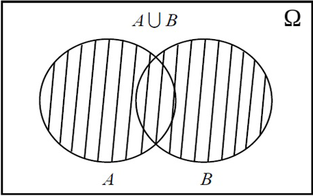

## Unión de eventos: $A \cup B$

<h4 class="fragment fade-in" data-fragment-index="2">Definición</h4>
<ul>
<li class="fragment fade-up text-justify" data-fragment-index="3" style="font-size: 28px;">
La <strong>unión</strong> $A \cup B$ representa la ocurrencia de <strong>al menos uno</strong> de los eventos $A$ o $B$.
</li>
<li class="fragment fade-up" data-fragment-index="4" style="font-size: 28px;">
$$A \cup B = \{\omega \in \Omega : \omega \in A \text{ o } \omega \in B\}$$
</li>
<li class="fragment fade-up text-justify" data-fragment-index="5" style="font-size: 26px;">
Decimos que ocurre $A \cup B$ si ocurre $A$, o ocurre $B$, o ambos ocurren simultáneamente.
</li>
</ul>

Diagrama de Venn: $A \cup B$

