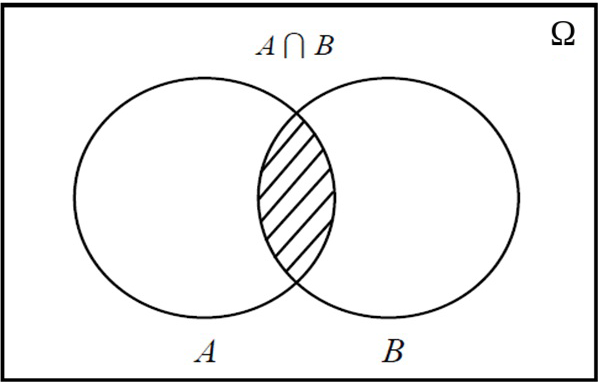

## Intersección de eventos: $A \cap B$

<h4 class="fragment fade-in" data-fragment-index="2">Definición</h4>
<ul>
<li class="fragment fade-up" data-fragment-index="3" style="font-size: 28px; text-align: justify;">
La <strong>intersección</strong> $A \cap B$ representa la ocurrencia <strong>simultánea</strong> de los eventos $A$ y $B$.
</li>
<li class="fragment fade-up" data-fragment-index="4" style="font-size: 28px;">
$$A \cap B = \{\omega \in \Omega : \omega \in A \text{ y } \omega \in B\}$$
</li>
<li class="fragment fade-up" data-fragment-index="5" style="font-size: 26px; text-align: justify;">
Decimos que ocurre $A \cap B$ solo si ocurren <em>ambos</em> $A$ y $B$ al mismo tiempo.
</li>
</ul>

Diagrama de Venn: $A \cap B$

