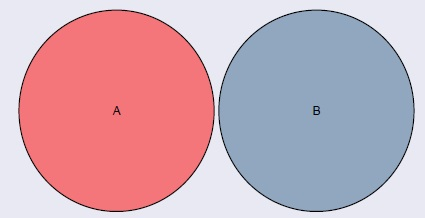

## Eventos disjuntos (mutuamente excluyentes)

<h4 class="fragment fade-in" data-fragment-index="2">Definición</h4>
<ul>
<li class="fragment fade-up" data-fragment-index="3" style="font-size: 28px; text-align: justify;">
Dos eventos $A$ y $B$ son <strong>disjuntos</strong> (o mutuamente excluyentes) si no tienen elementos en común:
$$A \cap B = \emptyset$$
</li>
<li class="fragment fade-up" data-fragment-index="4" style="font-size: 28px; text-align: justify;">
Si ocurre $A$, es imposible que ocurra $B$, y viceversa.
</li>
<li class="fragment fade-up" data-fragment-index="5" style="font-size: 26px;">
Ejemplo con un dado ($\Omega = \{1,2,3,4,5,6\}$): 
$A = \{2, 4, 6\}$ y $C = \{1\}$ son disjuntos porque $A \cap C = \emptyset$.
</li>
</ul>

Diagrama de Venn: eventos disjuntos

