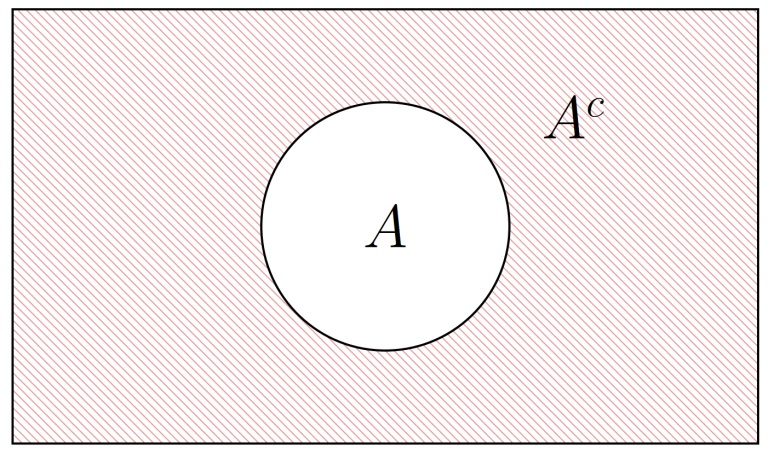

## Complemento de un evento: $A^c$

<h4 class="fragment fade-in" data-fragment-index="2">Definición</h4>
<ul>
<li class="fragment fade-up" data-fragment-index="3" style="font-size: 28px; text-align: justify;">
El <strong>complemento</strong> de $A$, denotado $A^c$ (o $A'$), es el conjunto de todos los resultados de $\Omega$ que <strong>no</strong> pertenecen a $A$:
$$A^c = \{\omega \in \Omega : \omega \notin A\}$$
</li>
<li class="fragment fade-up" data-fragment-index="4" style="font-size: 28px;">
Se cumple siempre:
$$A \cup A^c = \Omega \qquad A \cap A^c = \emptyset$$
</li>
<li class="fragment fade-up" data-fragment-index="5" style="font-size: 26px;">
Ejemplo: $A = \{2, 4, 6\}$ $\Rightarrow$ $A^c = \{1, 3, 5\}$
</li>
</ul>

Diagrama de Venn: complemento $A^c$

