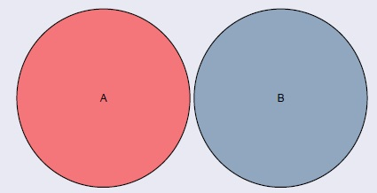
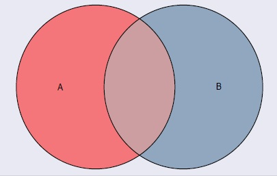

## Clase 6 {.center .middle}

## Contenido

<h3 class="fragment fade-in" data-fragment-index="1" style="font-size: 34px; margin-bottom: 14px;">Conceptos fundamentales</h3>
<ul>
<li class="fragment fade-in" data-fragment-index="2">Experimento aleatorio.</li>
<li class="fragment fade-in" data-fragment-index="3">Espacio muestral.</li>
<li class="fragment fade-in" data-fragment-index="4">Eventos y tipos de eventos.</li>
<li class="fragment fade-in" data-fragment-index="5">Espacios discretos y continuos.</li>
</ul>

<h3 class="fragment fade-in" data-fragment-index="6" style="font-size: 34px; margin-bottom: 14px;">Álgebra de eventos</h3>
<ul>
<li class="fragment fade-in" data-fragment-index="7">Unión, intersección y complemento.</li>
<li class="fragment fade-in" data-fragment-index="8">Diferencia y diferencia simétrica.</li>
<li class="fragment fade-in" data-fragment-index="9">Leyes de De Morgan y propiedades.</li>
<li class="fragment fade-in" data-fragment-index="10">Ejercicios integradores.</li>
</ul>

## Experimento aleatorio, espacio muestral y eventos

<ul>
<li class="fragment fade-up" data-fragment-index="2" style="font-size: 30px; text-align: justify;">
En la vida cotidiana nos enfrentamos constantemente a situaciones cuyo resultado no podemos predecir con certeza.
</li>
<li class="fragment fade-up" data-fragment-index="3" style="font-size: 30px; text-align: justify;">
¿Cuál será el resultado de lanzar una moneda?
</li>
<li class="fragment fade-up" data-fragment-index="4" style="font-size: 30px; text-align: justify;">
¿Qué tipo de sangre tendrá el próximo donante?
</li>
<li class="fragment fade-up" data-fragment-index="5" style="font-size: 30px; text-align: justify;">
¿Cuántos días vivirá una nueva variedad de planta bajo ciertas condiciones?
</li>
</ul>

<ul>
<li class="fragment fade-in" data-fragment-index="7" style="font-size: 30px; text-align: justify;">
La <strong>probabilidad</strong> es la rama de las matemáticas que estudia y cuantifica la incertidumbre de estos fenómenos.
</li>
<li class="fragment fade-in" data-fragment-index="8" style="font-size: 30px; text-align: justify;">
Para construir ese lenguaje formal, necesitamos definir tres conceptos fundamentales:
</li>
<li class="fragment fade-in" data-fragment-index="9" style="font-size: 30px;">
🎲 <strong>Experimento aleatorio</strong>
</li>
<li class="fragment fade-in" data-fragment-index="10" style="font-size: 30px;">
📋 <strong>Espacio muestral</strong>
</li>
<li class="fragment fade-in" data-fragment-index="11" style="font-size: 30px;">
🎯 <strong>Eventos</strong>
</li>
</ul>

## Motivación

¿Cara o Sello?

No podemos saber de antemano cuál será el resultado, pero sí podemos <strong>listar todos los resultados posibles</strong> y asignarles probabilidades.

## Experimento aleatorio

  
Definición

  

Un <strong>experimento aleatorio</strong> es aquel que, aun siendo realizado bajo condiciones fijas y controladas, puede producir diferentes resultados y no es posible predecir con certeza cuál ocurrirá.

  

## Características del experimento aleatorio

<ul>
<li class="fragment fade-up" style="background: #a78bfa; color: white; font-size: 30px; margin-bottom: 8px;">
Se puede repetir bajo las mismas condiciones.
</li>
<li class="fragment fade-up" style="background: #3b82f6; color: white; font-size: 30px; margin-bottom: 8px;">
El resultado de cada repetición es incierto.
</li>
<li class="fragment fade-up" style="background: #59A14F; color: white; font-size: 30px; margin-bottom: 8px;">
El conjunto de todos los resultados posibles es conocido de antemano.
</li>
</ul>

## Ejemplos de experimentos aleatorios

<ul>
<li class="fragment fade-up" data-fragment-index="2" style="font-size: 30px;">
🪙 Lanzar una moneda y observar el resultado.
</li>
<li class="fragment fade-up" data-fragment-index="3" style="font-size: 30px;">
🎲 Lanzar un dado y observar la cara superior.
</li>
<li class="fragment fade-up" data-fragment-index="4" style="font-size: 30px;">
🩸 Seleccionar un donador de sangre y verificar su tipo sanguíneo.
</li>
</ul>

<ul>
<li class="fragment fade-in" data-fragment-index="6" style="font-size: 30px;">
🎓 Sortear un estudiante y preguntarle sobre su hábito de fumar.
</li>
<li class="fragment fade-in" data-fragment-index="7" style="font-size: 30px;">
💡 Seleccionar una lámpara de un lote y medir su tiempo de vida.
</li>
<li class="fragment fade-in" data-fragment-index="8" style="font-size: 30px;">
🌱 Plantar una semilla y registrar si germina o no.
</li>
</ul>

## Espacio muestral

  
Definición

  

El <strong>espacio muestral</strong> es el conjunto de <strong>todos los resultados posibles</strong> de un experimento aleatorio. Se denota por $\Omega$.

  

Cada elemento $\omega \in \Omega$ se denomina <strong>punto muestral</strong> o <strong>resultado elemental</strong>.

## Ejemplos de espacios muestrales

<ul>
<li class="fragment fade-up" data-fragment-index="2" style="font-size: 28px;">
🎲 <strong>Lanzar un dado</strong> y observar la cara superior:
$$\Omega = \{1, 2, 3, 4, 5, 6\}$$
</li>
<li class="fragment fade-up" data-fragment-index="3" style="font-size: 28px;">
🩸 <strong>Tipo sanguíneo</strong> de un donador:
$$\Omega = \{A, B, O, AB\}$$
</li>
<li class="fragment fade-up" data-fragment-index="4" style="font-size: 28px;">
🚬 <strong>Hábito de fumar</strong> de un estudiante:
$$\Omega = \{Sí, No\}$$
</li>
</ul>

<ul>
<li class="fragment fade-in" data-fragment-index="6" style="font-size: 28px;">
💡 <strong>Tiempo de vida</strong> de una lámpara (en horas):
$$\Omega = \{t \in \mathbb{R} : t \geq 0\}$$
</li>
<li class="fragment fade-in" data-fragment-index="7" style="font-size: 28px; text-align: justify;">
Los espacios muestrales pueden ser <strong>discretos</strong> (finitos o contablemente infinitos) o <strong>continuos</strong> (no contables).
</li>
</ul>

## Ejercicio: lanzar una moneda dos veces

<h4 class="fragment fade-in" data-fragment-index="2">Enunciado</h4>
<ul>
<li class="fragment fade-up" data-fragment-index="3" style="font-size: 28px; text-align: justify;">
Se lanza una moneda dos veces. Si $C$ indica cara y $S$ indica sello, ¿cuál es el espacio muestral?
</li>
</ul>

<h4 class="fragment fade-in" data-fragment-index="5">Solución</h4>
<ul>
<li class="fragment fade-in" data-fragment-index="6" style="font-size: 28px;">
$$\Omega = \{\omega_1, \omega_2, \omega_3, \omega_4\}$$
</li>
<li class="fragment fade-in" data-fragment-index="7" style="font-size: 26px;">
donde:
</li>
<li class="fragment fade-in" data-fragment-index="8" style="font-size: 26px;">
$\omega_1 = (C, C)$
</li>
<li class="fragment fade-in" data-fragment-index="9" style="font-size: 26px;">
$\omega_2 = (C, S)$
</li>
<li class="fragment fade-in" data-fragment-index="10" style="font-size: 26px;">
$\omega_3 = (S, C)$
</li>
<li class="fragment fade-in" data-fragment-index="11" style="font-size: 26px;">
$\omega_4 = (S, S)$
</li>
</ul>

## Eventos

  
Definición

  

Un <strong>evento</strong> (o suceso) es cualquier <strong>subconjunto</strong> del espacio muestral $\Omega$.

  

<ul>
<li class="fragment fade-in" data-fragment-index="4" style="font-size: 28px;">
<strong>Notación:</strong> los eventos se denotan con letras mayúsculas $A, B, C, \ldots$
</li>
<li class="fragment fade-in" data-fragment-index="5" style="font-size: 28px;">
<strong>Evento imposible:</strong> $\emptyset$ (conjunto vacío — nunca ocurre).
</li>
<li class="fragment fade-in" data-fragment-index="6" style="font-size: 28px;">
<strong>Evento seguro:</strong> $\Omega$ (espacio muestral completo — siempre ocurre).
</li>
</ul>

## Ejemplos de eventos

<h4 class="fragment fade-in" data-fragment-index="2" style="font-size: 26px;">Experimento: lanzar un dado. $\Omega = \{1,2,3,4,5,6\}$</h4>
<ul>
<li class="fragment fade-up" data-fragment-index="3" style="font-size: 26px;">
$A$: que salga número par
$$A = \{2, 4, 6\} \subset \Omega$$
</li>
<li class="fragment fade-up" data-fragment-index="4" style="font-size: 26px;">
$B$: que salga un número mayor que 3
$$B = \{4, 5, 6\} \subset \Omega$$
</li>
<li class="fragment fade-up" data-fragment-index="5" style="font-size: 26px;">
$C$: que salga exactamente 1
$$C = \{1\} \subset \Omega$$
</li>
</ul>

<h4 class="fragment fade-in" data-fragment-index="7" style="font-size: 26px;">Evento imposible y evento seguro</h4>
<ul>
<li class="fragment fade-in" data-fragment-index="8" style="font-size: 26px;">
$D$: que salga un número mayor que 10
$$D = \emptyset \quad \text{(evento imposible)}$$
</li>
<li class="fragment fade-in" data-fragment-index="9" style="font-size: 26px;">
$E$: que salga algún número entre 1 y 6
$$E = \Omega \quad \text{(evento seguro)}$$
</li>
</ul>

## Ejercicio: artículos de una fábrica

<h4 class="fragment fade-in" data-fragment-index="2">Enunciado</h4>
<ul>
<li class="fragment fade-up" data-fragment-index="3" style="font-size: 26px; text-align: justify;">
De la línea de producción de una fábrica se retiran <strong>tres artículos</strong>, y cada uno es clasificado como <strong>Bueno (B)</strong> o <strong>Defectuoso (D)</strong>.
</li>
<li class="fragment fade-up" data-fragment-index="4" style="font-size: 26px; text-align: justify;">
¿Cuál es el espacio muestral? Describa el evento $A$: "obtener exactamente dos artículos defectuosos".
</li>
</ul>

<h4 class="fragment fade-in" data-fragment-index="6">Solución</h4>
<ul>
<li class="fragment fade-in" data-fragment-index="7" style="font-size: 22px;">
$$\Omega = \{BBB,\; BBD,\; BDB,\; DBB,\; BDD,\; DBD,\; DDB,\; DDD\}$$
</li>
<li class="fragment fade-in" data-fragment-index="8" style="font-size: 26px;">
El evento $A$ (exactamente dos defectuosos):
$$A = \{BDD,\; DBD,\; DDB\}$$
</li>
</ul>

## Operaciones con eventos

  
¿Por qué necesitamos operar con eventos?

  

Al igual que con conjuntos, podemos combinar eventos para describir situaciones más complejas. Las operaciones fundamentales son: <strong>unión</strong>, <strong>intersección</strong>, <strong>complemento</strong> y <strong>diferencia</strong>.

  

## Unión de eventos: $A \cup B$

<h4 class="fragment fade-in" data-fragment-index="2">Definición</h4>
<ul>
<li class="fragment fade-up" data-fragment-index="3" style="font-size: 28px; text-align: justify;">
La <strong>unión</strong> $A \cup B$ representa la ocurrencia de <strong>al menos uno</strong> de los eventos $A$ o $B$.
</li>
<li class="fragment fade-up" data-fragment-index="4" style="font-size: 28px;">
$$A \cup B = \{\omega \in \Omega : \omega \in A \text{ o } \omega \in B\}$$
</li>
<li class="fragment fade-up" data-fragment-index="5" style="font-size: 26px; text-align: justify;">
Decimos que ocurre $A \cup B$ si ocurre $A$, o ocurre $B$, o ambos ocurren simultáneamente.
</li>
</ul>

Diagrama de Venn: $A \cup B$

## Unión de tres eventos: $A \cup B \cup C$

Diagrama de Venn: $A \cup B \cup C$

## Intersección de eventos: $A \cap B$

<h4 class="fragment fade-in" data-fragment-index="2">Definición</h4>
<ul>
<li class="fragment fade-up" data-fragment-index="3" style="font-size: 28px; text-align: justify;">
La <strong>intersección</strong> $A \cap B$ representa la ocurrencia <strong>simultánea</strong> de los eventos $A$ y $B$.
</li>
<li class="fragment fade-up" data-fragment-index="4" style="font-size: 28px;">
$$A \cap B = \{\omega \in \Omega : \omega \in A \text{ y } \omega \in B\}$$
</li>
<li class="fragment fade-up" data-fragment-index="5" style="font-size: 26px; text-align: justify;">
Decimos que ocurre $A \cap B$ solo si ocurren <em>ambos</em> $A$ y $B$ al mismo tiempo.
</li>
</ul>

Diagrama de Venn: $A \cap B$

## Intersección de tres eventos: $A \cap B \cap C$

Diagrama de Venn: $A \cap B \cap C$

## Eventos disjuntos (mutuamente excluyentes)

<h4 class="fragment fade-in" data-fragment-index="2">Definición</h4>
<ul>
<li class="fragment fade-up" data-fragment-index="3" style="font-size: 28px; text-align: justify;">
Dos eventos $A$ y $B$ son <strong>disjuntos</strong> (o mutuamente excluyentes) si no tienen elementos en común:
$$A \cap B = \emptyset$$
</li>
<li class="fragment fade-up" data-fragment-index="4" style="font-size: 28px; text-align: justify;">
Si ocurre $A$, es imposible que ocurra $B$, y viceversa.
</li>
<li class="fragment fade-up" data-fragment-index="5" style="font-size: 26px;">
Ejemplo con un dado ($\Omega = \{1,2,3,4,5,6\}$): 
$A = \{2, 4, 6\}$ y $C = \{1\}$ son disjuntos porque $A \cap C = \emptyset$.
</li>
</ul>

Diagrama de Venn: eventos disjuntos

## Complemento de un evento: $A^c$

<h4 class="fragment fade-in" data-fragment-index="2">Definición</h4>
<ul>
<li class="fragment fade-up" data-fragment-index="3" style="font-size: 28px; text-align: justify;">
El <strong>complemento</strong> de $A$, denotado $A^c$ (o $A'$), es el conjunto de todos los resultados de $\Omega$ que <strong>no</strong> pertenecen a $A$:
$$A^c = \{\omega \in \Omega : \omega \notin A\}$$
</li>
<li class="fragment fade-up" data-fragment-index="4" style="font-size: 28px;">
Se cumple siempre:
$$A \cup A^c = \Omega \qquad A \cap A^c = \emptyset$$
</li>
<li class="fragment fade-up" data-fragment-index="5" style="font-size: 26px;">
Ejemplo: $A = \{2, 4, 6\}$ $\Rightarrow$ $A^c = \{1, 3, 5\}$
</li>
</ul>

Diagrama de Venn: complemento $A^c$

## Ejemplo: operaciones con eventos

<h4 class="fragment fade-in" data-fragment-index="2" style="font-size: 24px;">Dado: $\Omega = \{1,2,3,4,5,6\}$, $A = \{2,4,6\}$, $B = \{4,5,6\}$, $C = \{1\}$</h4>
<ul>
<li class="fragment fade-up" data-fragment-index="3" style="font-size: 24px;">
Número par <strong>y</strong> mayor que 3:
$$A \cap B = \{4, 6\}$$
</li>
<li class="fragment fade-up" data-fragment-index="4" style="font-size: 24px;">
Número par <strong>e</strong> igual a 1:
$$A \cap C = \emptyset$$
</li>
<li class="fragment fade-up" data-fragment-index="5" style="font-size: 24px;">
Número par <strong>o</strong> mayor que 3:
$$A \cup B = \{2, 4, 5, 6\}$$
</li>
</ul>

<ul>
<li class="fragment fade-in" data-fragment-index="7" style="font-size: 24px;">
Número par <strong>o</strong> igual a 1:
$$A \cup C = \{1, 2, 4, 6\}$$
</li>
<li class="fragment fade-in" data-fragment-index="8" style="font-size: 24px;">
<strong>No</strong> salga un número par:
$$A^c = \{1, 3, 5\}$$
</li>
<li class="fragment fade-in" data-fragment-index="9" style="font-size: 24px;">
Número <strong>no</strong> par <strong>y no</strong> mayor que 3:
$$(A \cup B)^c = \{1, 3\}$$
</li>
</ul>

## Propiedades de las operaciones con eventos

<h4 class="fragment fade-in" data-fragment-index="2" style="font-size: 24px;">Propiedades de identidad</h4>
<ul>
<li class="fragment fade-up" data-fragment-index="3" style="font-size: 24px;">$A \cup \emptyset = A$</li>
<li class="fragment fade-up" data-fragment-index="4" style="font-size: 24px;">$A \cup \Omega = \Omega$</li>
<li class="fragment fade-up" data-fragment-index="5" style="font-size: 24px;">$A \cap \Omega = A$</li>
<li class="fragment fade-up" data-fragment-index="6" style="font-size: 24px;">$A \cap \emptyset = \emptyset$</li>
</ul>
<h4 class="fragment fade-in" data-fragment-index="7" style="font-size: 24px; margin-top: 12px;">Propiedades de complemento</h4>
<ul>
<li class="fragment fade-up" data-fragment-index="8" style="font-size: 24px;">$A \cup A^c = \Omega$</li>
<li class="fragment fade-up" data-fragment-index="9" style="font-size: 24px;">$A \cap A^c = \emptyset$</li>
<li class="fragment fade-up" data-fragment-index="10" style="font-size: 24px;">$(A^c)^c = A$</li>
</ul>

<h4 class="fragment fade-in" data-fragment-index="12" style="font-size: 24px;">Propiedades conmutativas y asociativas</h4>
<ul>
<li class="fragment fade-in" data-fragment-index="13" style="font-size: 24px;">$A \cup B = B \cup A$</li>
<li class="fragment fade-in" data-fragment-index="14" style="font-size: 24px;">$A \cap B = B \cap A$</li>
<li class="fragment fade-in" data-fragment-index="15" style="font-size: 24px;">$(A \cup B) \cup C = A \cup (B \cup C)$</li>
<li class="fragment fade-in" data-fragment-index="16" style="font-size: 24px;">$(A \cap B) \cap C = A \cap (B \cap C)$</li>
</ul>
<h4 class="fragment fade-in" data-fragment-index="17" style="font-size: 24px; margin-top: 12px;">Propiedades distributivas</h4>
<ul>
<li class="fragment fade-in" data-fragment-index="18" style="font-size: 24px;">$A \cup (B \cap C) = (A \cup B) \cap (A \cup C)$</li>
<li class="fragment fade-in" data-fragment-index="19" style="font-size: 24px;">$A \cap (B \cup C) = (A \cap B) \cup (A \cap C)$</li>
</ul>

## Leyes de De Morgan

  
Enunciado

  

Las Leyes de De Morgan establecen cómo se calcula el complemento de una unión o intersección de eventos.

  

<h4 class="fragment fade-in" data-fragment-index="4" style="font-size: 26px;">Primera Ley</h4>

$$(A \cup B)^c = A^c \cap B^c$$

El complemento de la unión es la intersección de los complementos.

<h4 class="fragment fade-in" data-fragment-index="8" style="font-size: 26px;">Segunda Ley</h4>

$$(A \cap B)^c = A^c \cup B^c$$

El complemento de la intersección es la unión de los complementos.

## Ejercicio integrador

<h4 class="fragment fade-in" data-fragment-index="2">Enunciado</h4>
<ul>
<li class="fragment fade-up" data-fragment-index="3" style="font-size: 26px; text-align: justify;">
Se lanza un dado. Sean los eventos:
</li>
<li class="fragment fade-up" data-fragment-index="4" style="font-size: 26px;">
$A = \{1, 2, 3\}$ (número menor que 4)
</li>
<li class="fragment fade-up" data-fragment-index="5" style="font-size: 26px;">
$B = \{2, 4, 6\}$ (número par)
</li>
<li class="fragment fade-up" data-fragment-index="6" style="font-size: 26px; text-align: justify;">
Calcule: $A \cup B$, $A \cap B$, $A^c$, $(A \cup B)^c$ y verifique la primera Ley de De Morgan.
</li>
</ul>

<h4 class="fragment fade-in" data-fragment-index="8">Solución</h4>
<ul>
<li class="fragment fade-in" data-fragment-index="9" style="font-size: 24px;">
$A \cup B = \{1, 2, 3, 4, 6\}$
</li>
<li class="fragment fade-in" data-fragment-index="10" style="font-size: 24px;">
$A \cap B = \{2\}$
</li>
<li class="fragment fade-in" data-fragment-index="11" style="font-size: 24px;">
$A^c = \{4, 5, 6\}$
</li>
<li class="fragment fade-in" data-fragment-index="12" style="font-size: 24px;">
$(A \cup B)^c = \{5\}$
</li>
<li class="fragment fade-in" data-fragment-index="13" style="font-size: 24px;">
$A^c \cap B^c = \{4,5,6\} \cap \{1,3,5\} = \{5\}$ ✓
</li>
</ul>

## Resumen

<ul>
<li class="fragment fade-up" style="background: #a78bfa; color: white; font-size: 28px; margin-bottom: 8px;">
🎲 <strong>Experimento aleatorio:</strong> resultado incierto aun bajo condiciones fijas.
</li>
<li class="fragment fade-up" style="background: #3b82f6; color: white; font-size: 28px; margin-bottom: 8px;">
📋 <strong>Espacio muestral $\Omega$:</strong> conjunto de todos los resultados posibles.
</li>
<li class="fragment fade-up" style="background: #59A14F; color: white; font-size: 28px; margin-bottom: 8px;">
🎯 <strong>Evento:</strong> cualquier subconjunto de $\Omega$.
</li>
<li class="fragment fade-up" style="background: #F28E2B; color: white; font-size: 28px; margin-bottom: 8px;">
🔗 <strong>Unión $A \cup B$:</strong> al menos uno de los eventos ocurre.
</li>
<li class="fragment fade-up" style="background: #B07AA1; color: white; font-size: 28px; margin-bottom: 8px;">
🔀 <strong>Intersección $A \cap B$:</strong> ambos eventos ocurren simultáneamente.
</li>
<li class="fragment fade-up" style="background: #76B7B2; color: white; font-size: 28px; margin-bottom: 8px;">
🔄 <strong>Complemento $A^c$:</strong> todo lo que no está en $A$.
</li>
</ul>

---

## Diferencia de eventos: $A \setminus B$

<h4 class="fragment fade-in" data-fragment-index="2">Definición</h4>
<ul>
<li class="fragment fade-up" data-fragment-index="3" style="font-size: 28px; text-align: justify;">
La <strong>diferencia</strong> $A \setminus B$ (también escrita $A - B$) es el conjunto de resultados que pertenecen a $A$ pero <strong>no</strong> pertenecen a $B$:
$$A \setminus B = \{\omega \in \Omega : \omega \in A \text{ y } \omega \notin B\}$$
</li>
<li class="fragment fade-up" data-fragment-index="4" style="font-size: 28px; text-align: justify;">
Equivalentemente: $A \setminus B = A \cap B^c$
</li>
<li class="fragment fade-up" data-fragment-index="5" style="font-size: 26px;">
<strong>Ejemplo:</strong> $\Omega = \{1,2,3,4,5,6\}$, $A = \{2,4,6\}$, $B = \{4,5,6\}$
$$A \setminus B = \{2\}$$
</li>
</ul>

Diagrama de Venn: $A \setminus B$

La región sombreada corresponde a los elementos de $A$ que no están en $B$.

## Diferencia simétrica: $A \triangle B$

<h4 class="fragment fade-in" data-fragment-index="2">Definición</h4>
<ul>
<li class="fragment fade-up" data-fragment-index="3" style="font-size: 28px; text-align: justify;">
La <strong>diferencia simétrica</strong> $A \triangle B$ contiene los resultados que pertenecen a <em>exactamente uno</em> de los dos eventos, pero no a ambos:
$$A \triangle B = (A \setminus B) \cup (B \setminus A)$$
</li>
<li class="fragment fade-up" data-fragment-index="4" style="font-size: 28px;">
Equivalentemente:
$$A \triangle B = (A \cup B) \setminus (A \cap B)$$
</li>
</ul>

<h4 class="fragment fade-in" data-fragment-index="6" style="font-size: 26px;">Ejemplo con un dado</h4>
<ul>
<li class="fragment fade-up" data-fragment-index="7" style="font-size: 26px; text-align: justify;">
$\Omega = \{1,2,3,4,5,6\}$, $A = \{2,4,6\}$, $B = \{4,5,6\}$
</li>
<li class="fragment fade-up" data-fragment-index="8" style="font-size: 26px;">
$A \setminus B = \{2\}$, $\quad B \setminus A = \{5\}$
</li>
<li class="fragment fade-up" data-fragment-index="9" style="font-size: 26px;">
$$A \triangle B = \{2, 5\}$$
</li>
<li class="fragment fade-up" data-fragment-index="10" style="font-size: 24px; text-align: justify;">
Interpretación: salir un número que es par <strong>o</strong> mayor que 3, pero <strong>no ambas</strong> cosas a la vez.
</li>
</ul>

## Partición del espacio muestral

  
Definición formal

  

Una colección de eventos $\{A_1, A_2, \ldots, A_n\}$ forma una <strong>partición</strong> de $\Omega$ si:

<ul>
<li>
<strong>Mutuamente excluyentes:</strong> $A_i \cap A_j = \emptyset$ para todo $i \neq j$
</li>
<li>
<strong>Exhaustivos:</strong> $A_1 \cup A_2 \cup \cdots \cup A_n = \Omega$
</li>
<li>
<strong>No vacíos:</strong> $A_i \neq \emptyset$ para todo $i$
</li>
</ul>
  

<strong>Ejemplo agrícola (tipos de suelo):</strong> Al clasificar el suelo de una parcela, los eventos $A_1 = \{\text{Arenoso}\}$, $A_2 = \{\text{Arcilloso}\}$, $A_3 = \{\text{Limoso}\}$, $A_4 = \{\text{Franco}\}$ forman una partición de $\Omega$ si cada parcela pertenece a exactamente una categoría.

## Partición — ejemplo con clima

<h4 class="fragment fade-in" data-fragment-index="2">Experimento</h4>
<ul>
<li class="fragment fade-up" data-fragment-index="3" style="font-size: 28px; text-align: justify;">
Se selecciona aleatoriamente una región cafetera de Colombia y se registra su <strong>tipo de clima</strong>.
</li>
<li class="fragment fade-up" data-fragment-index="4" style="font-size: 28px;">
$$\Omega = \{\text{Cálido}, \text{Templado}, \text{Frío}\}$$
</li>
<li class="fragment fade-up" data-fragment-index="5" style="font-size: 26px; text-align: justify;">
Definamos: $A_1 = \{\text{Cálido}\}$, $A_2 = \{\text{Templado}\}$, $A_3 = \{\text{Frío}\}$
</li>
</ul>

<h4 class="fragment fade-in" data-fragment-index="7">¿Es una partición?</h4>
<ul>
<li class="fragment fade-up" data-fragment-index="8" style="font-size: 26px;">
$A_1 \cap A_2 = \emptyset$, $A_1 \cap A_3 = \emptyset$, $A_2 \cap A_3 = \emptyset$ ✓
</li>
<li class="fragment fade-up" data-fragment-index="9" style="font-size: 26px;">
$A_1 \cup A_2 \cup A_3 = \Omega$ ✓
</li>
<li class="fragment fade-up" data-fragment-index="10" style="font-size: 26px;">
$A_i \neq \emptyset$ para $i = 1, 2, 3$ ✓
</li>
<li class="fragment fade-up" data-fragment-index="11" style="font-size: 26px; text-align: justify; color: #59A14F;">
<strong>Conclusión:</strong> $\{A_1, A_2, A_3\}$ es una partición de $\Omega$. Cada región pertenece a exactamente un tipo climático.
</li>
</ul>

## Ejercicio: cultivo de café

<h4 class="fragment fade-in" data-fragment-index="2">Enunciado</h4>
<ul>
<li class="fragment fade-up" data-fragment-index="3" style="font-size: 26px; text-align: justify;">
Se selecciona aleatoriamente una planta de un cafetal y se clasifica su <strong>estado fitosanitario</strong>: Sana (Sa), con Plaga (Pl), con Enfermedad (En) o con Deficiencia nutricional (De).
</li>
<li class="fragment fade-up" data-fragment-index="4" style="font-size: 26px; text-align: justify;">
<strong>a)</strong> Defina el espacio muestral $\Omega$.
</li>
<li class="fragment fade-up" data-fragment-index="5" style="font-size: 26px; text-align: justify;">
<strong>b)</strong> Defina 4 eventos de interés agronómico y expréselos como subconjuntos de $\Omega$.
</li>
<li class="fragment fade-up" data-fragment-index="6" style="font-size: 26px; text-align: justify;">
<strong>c)</strong> ¿Forman los cuatro estados una partición de $\Omega$?
</li>
</ul>

<h4 class="fragment fade-in" data-fragment-index="8" style="font-size: 26px;">Contexto agronómico</h4>
<ul>
<li class="fragment fade-in" data-fragment-index="9" style="font-size: 24px; text-align: justify;">
En Colombia, el café (<em>Coffea arabica</em>) es el principal cultivo de exportación. El monitoreo fitosanitario en zonas cálidas-húmedas es esencial para detectar la broca y la roya del café.
</li>
<li class="fragment fade-in" data-fragment-index="10" style="font-size: 24px; text-align: justify;">
Este ejercicio ilustra cómo la probabilidad permite modelar la incertidumbre en diagnósticos de campo.
</li>
</ul>

## Solución: cultivo de café

<h4 class="fragment fade-in" data-fragment-index="2">Espacio muestral y eventos</h4>
<ul>
<li class="fragment fade-up" data-fragment-index="3" style="font-size: 26px;">
$$\Omega = \{\text{Sa}, \text{Pl}, \text{En}, \text{De}\}$$
</li>
<li class="fragment fade-up" data-fragment-index="4" style="font-size: 24px;">
$A$: "la planta está sana" $= \{\text{Sa}\}$
</li>
<li class="fragment fade-up" data-fragment-index="5" style="font-size: 24px;">
$B$: "la planta tiene algún problema" $= \{\text{Pl}, \text{En}, \text{De}\}$
</li>
<li class="fragment fade-up" data-fragment-index="6" style="font-size: 24px;">
$C$: "la planta tiene plaga o enfermedad" $= \{\text{Pl}, \text{En}\}$
</li>
<li class="fragment fade-up" data-fragment-index="7" style="font-size: 24px;">
$D$: "la planta tiene deficiencia nutricional" $= \{\text{De}\}$
</li>
</ul>

<h4 class="fragment fade-in" data-fragment-index="9">¿Forman partición?</h4>
<ul>
<li class="fragment fade-up" data-fragment-index="10" style="font-size: 24px; text-align: justify;">
Los cuatro estados elementales $\{\text{Sa}\}$, $\{\text{Pl}\}$, $\{\text{En}\}$, $\{\text{De}\}$ sí forman una partición de $\Omega$:
</li>
<li class="fragment fade-up" data-fragment-index="11" style="font-size: 24px;">
Son mutuamente excluyentes: $\{\text{Sa}\} \cap \{\text{Pl}\} = \emptyset$, etc.
</li>
<li class="fragment fade-up" data-fragment-index="12" style="font-size: 24px;">
Son exhaustivos: su unión es $\Omega$ ✓
</li>
<li class="fragment fade-up" data-fragment-index="13" style="font-size: 24px; text-align: justify;">
Nótese que $B = A^c$, es decir, "tener algún problema" es el complemento de "estar sana".
</li>
</ul>

## Ejercicio: lanzar dos dados

<h4 class="fragment fade-in" data-fragment-index="2">Enunciado</h4>
<ul>
<li class="fragment fade-up" data-fragment-index="3" style="font-size: 26px; text-align: justify;">
Se lanzan dos dados distintos y se registra el par $(d_1, d_2)$ de resultados.
</li>
<li class="fragment fade-up" data-fragment-index="4" style="font-size: 26px;">
<strong>a)</strong> ¿Cuántos elementos tiene $\Omega$?
</li>
<li class="fragment fade-up" data-fragment-index="5" style="font-size: 26px;">
<strong>b)</strong> Defina $A$ = "la suma es 7".
</li>
<li class="fragment fade-up" data-fragment-index="6" style="font-size: 26px;">
<strong>c)</strong> Defina $B$ = "ambos dados muestran número par".
</li>
<li class="fragment fade-up" data-fragment-index="7" style="font-size: 26px;">
<strong>d)</strong> Calcule $A \cap B$ e interprete.
</li>
</ul>

<h4 class="fragment fade-in" data-fragment-index="9" style="font-size: 24px;">Tabla del espacio muestral (primeras filas)</h4>

<table style="border-collapse: collapse; width: 100%; font-size: 19px;">
<tr style="background:#a78bfa; color:white;"><th>$d_1 \backslash d_2$</th><th>1</th><th>2</th><th>3</th><th>4</th><th>5</th><th>6</th></tr>
<tr><td style="font-weight:bold;">1</td><td>(1,1)</td><td>(1,2)</td><td>(1,3)</td><td>(1,4)</td><td>(1,5)</td><td>(1,6)</td></tr>
<tr style="background:#f3f4f6;"><td style="font-weight:bold;">2</td><td>(2,1)</td><td>(2,2)</td><td>(2,3)</td><td>(2,4)</td><td>(2,5)</td><td>(2,6)</td></tr>
<tr><td style="font-weight:bold;">3</td><td>(3,1)</td><td>(3,2)</td><td>(3,3)</td><td>(3,4)</td><td>(3,5)</td><td>(3,6)</td></tr>
<tr style="background:#f3f4f6;"><td style="font-weight:bold;">4</td><td>(4,1)</td><td>(4,2)</td><td>(4,3)</td><td>(4,4)</td><td>(4,5)</td><td>(4,6)</td></tr>
<tr><td style="font-weight:bold;">5</td><td>(5,1)</td><td>(5,2)</td><td>(5,3)</td><td>(5,4)</td><td>(5,5)</td><td>(5,6)</td></tr>
<tr style="background:#f3f4f6;"><td style="font-weight:bold;">6</td><td>(6,1)</td><td>(6,2)</td><td>(6,3)</td><td>(6,4)</td><td>(6,5)</td><td>(6,6)</td></tr>
</table>

## Solución: lanzar dos dados

<h4 class="fragment fade-in" data-fragment-index="2">Evento $A$: "suma = 7"</h4>
<ul>
<li class="fragment fade-up" data-fragment-index="3" style="font-size: 24px;">
$|\Omega| = 6 \times 6 = 36$ elementos.
</li>
<li class="fragment fade-up" data-fragment-index="4" style="font-size: 24px;">
$$A = \{(1,6),(2,5),(3,4),(4,3),(5,2),(6,1)\}$$
</li>
<li class="fragment fade-up" data-fragment-index="5" style="font-size: 24px;">
$|A| = 6$
</li>
</ul>
<h4 class="fragment fade-in" data-fragment-index="6" style="font-size: 24px; margin-top: 12px;">Evento $B$: "ambos pares"</h4>
<ul>
<li class="fragment fade-up" data-fragment-index="7" style="font-size: 24px;">
$$B = \{(2,2),(2,4),(2,6),(4,2),(4,4),(4,6),(6,2),(6,4),(6,6)\}$$
</li>
<li class="fragment fade-up" data-fragment-index="8" style="font-size: 24px;">
$|B| = 9$
</li>
</ul>

<h4 class="fragment fade-in" data-fragment-index="10">Intersección $A \cap B$</h4>
<ul>
<li class="fragment fade-up" data-fragment-index="11" style="font-size: 24px; text-align: justify;">
Un resultado está en $A \cap B$ si la suma es 7 <strong>y</strong> ambos dados son pares.
</li>
<li class="fragment fade-up" data-fragment-index="12" style="font-size: 24px; text-align: justify;">
La suma de dos números pares siempre es par, pero 7 es impar.
</li>
<li class="fragment fade-up" data-fragment-index="13" style="font-size: 24px;">
$$A \cap B = \emptyset$$
</li>
<li class="fragment fade-up" data-fragment-index="14" style="font-size: 24px; color: #59A14F;">
<strong>Conclusión:</strong> $A$ y $B$ son eventos mutuamente excluyentes.
</li>
</ul>

## Espacio muestral continuo en agronomía

  
Ejemplo: maduración del mango

  

En una finca de clima cálido del Tolima, se selecciona aleatoriamente un fruto de mango (<em>Mangifera indica</em>) y se registra su <strong>tiempo de maduración</strong> (en días) desde la floración.

  

<ul>
<li class="fragment fade-up" data-fragment-index="4" style="font-size: 26px;">
El espacio muestral es un intervalo continuo:
$$\Omega = [60,\; 120] \subset \mathbb{R}$$
</li>
<li class="fragment fade-up" data-fragment-index="5" style="font-size: 26px; text-align: justify;">
Cada valor $\omega \in [60, 120]$ representa un tiempo de maduración posible.
</li>
<li class="fragment fade-up" data-fragment-index="6" style="font-size: 26px;">
$\Omega$ contiene infinitos (no contables) puntos muestrales.
</li>
</ul>

<h4 class="fragment fade-in" data-fragment-index="8" style="font-size: 24px;">Eventos de interés</h4>
<ul>
<li class="fragment fade-up" data-fragment-index="9" style="font-size: 24px;">
$A$: "maduración temprana" $= [60, 80]$
</li>
<li class="fragment fade-up" data-fragment-index="10" style="font-size: 24px;">
$B$: "maduración tardía" $= (100, 120]$
</li>
<li class="fragment fade-up" data-fragment-index="11" style="font-size: 24px;">
$C$: "maduración normal" $= (80, 100]$
</li>
<li class="fragment fade-up" data-fragment-index="12" style="font-size: 24px; text-align: justify;">
Nótese que $\{A, C, B\}$ forma una <strong>partición</strong> de $\Omega$, ya que son exhaustivos y mutuamente excluyentes.
</li>
</ul>

## Ejercicio: semillas de arroz — enunciado

<h4 class="fragment fade-in" data-fragment-index="2">Enunciado</h4>
<ul>
<li class="fragment fade-up" data-fragment-index="3" style="font-size: 26px; text-align: justify;">
En un ensayo de laboratorio se seleccionan <strong>4 semillas de arroz</strong> (<em>Oryza sativa</em>) de un lote de clima cálido. Cada semilla se clasifica como <strong>Viable (V)</strong> o <strong>No viable (N)</strong> según prueba de germinación.
</li>
<li class="fragment fade-up" data-fragment-index="4" style="font-size: 26px; text-align: justify;">
<strong>a)</strong> Construya el espacio muestral $\Omega$ usando un árbol de posibilidades.
</li>
<li class="fragment fade-up" data-fragment-index="5" style="font-size: 26px; text-align: justify;">
<strong>b)</strong> Defina el evento $A$ = "exactamente 2 semillas son viables" y liste sus elementos.
</li>
<li class="fragment fade-up" data-fragment-index="6" style="font-size: 26px; text-align: justify;">
<strong>c)</strong> Defina el evento $B$ = "al menos 3 semillas son viables" y liste sus elementos.
</li>
</ul>

<h4 class="fragment fade-in" data-fragment-index="8" style="font-size: 24px;">Contexto</h4>
<ul>
<li class="fragment fade-in" data-fragment-index="9" style="font-size: 24px; text-align: justify;">
El arroz es el principal cereal de consumo en Colombia. El control de calidad de semillas es fundamental para garantizar buenos rendimientos en los Llanos Orientales y la Costa Atlántica.
</li>
<li class="fragment fade-in" data-fragment-index="10" style="font-size: 24px; text-align: justify;">
$|\Omega| = 2^4 = 16$ resultados posibles.
</li>
</ul>

## Solución: semillas de arroz

<h4 class="fragment fade-in" data-fragment-index="2" style="font-size: 22px;">Espacio muestral completo $\Omega$</h4>

$\Omega = \{$VVVV, VVVN, VVNV, VVNN,

VNVV, VNVN, VNNV, VNNN,

NVVV, NVVN, NVNV, NVNN,

NNVV, NNVN, NNNV, NNNN$\}$

<h4 class="fragment fade-in" data-fragment-index="5" style="font-size: 24px;">Eventos</h4>
<ul>
<li class="fragment fade-up" data-fragment-index="6" style="font-size: 22px;">
<strong>$A$ (exactamente 2 viables):</strong>
$$A = \{\text{VVNN, VNVN, VNNV, NVVN, NVNV, NNVV}\}$$
$|A| = \binom{4}{2} = 6$
</li>
<li class="fragment fade-up" data-fragment-index="7" style="font-size: 22px;">
<strong>$B$ (al menos 3 viables):</strong>
$$B = \{\text{VVVN, VVNV, VNVV, NVVV, VVVV}\}$$
$|B| = \binom{4}{3} + \binom{4}{4} = 4 + 1 = 5$
</li>
<li class="fragment fade-up" data-fragment-index="8" style="font-size: 22px; text-align: justify;">
$A \cap B = \emptyset$ ya que no es posible tener exactamente 2 viables y al menos 3 viables al mismo tiempo.
</li>
</ul>

## Ejercicio: temperaturas en cultivo de fresa

<h4 class="fragment fade-in" data-fragment-index="2">Enunciado</h4>
<ul>
<li class="fragment fade-up" data-fragment-index="3" style="font-size: 26px; text-align: justify;">
En un cultivo de fresa (<em>Fragaria ananassa</em>) en la Sabana de Bogotá (clima frío, 2600 m.s.n.m.), se registra durante <strong>3 días consecutivos</strong> si ocurre helada: <strong>Sí (H)</strong> o <strong>No (N)</strong>.
</li>
<li class="fragment fade-up" data-fragment-index="4" style="font-size: 26px; text-align: justify;">
<strong>a)</strong> Defina el espacio muestral $\Omega$.
</li>
<li class="fragment fade-up" data-fragment-index="5" style="font-size: 26px; text-align: justify;">
<strong>b)</strong> Defina $A$ = "ocurre helada al menos un día".
</li>
<li class="fragment fade-up" data-fragment-index="6" style="font-size: 26px; text-align: justify;">
<strong>c)</strong> Defina $B$ = "no ocurre ninguna helada".
</li>
<li class="fragment fade-up" data-fragment-index="7" style="font-size: 26px; text-align: justify;">
<strong>d)</strong> Verifique que $B = A^c$.
</li>
</ul>

<h4 class="fragment fade-in" data-fragment-index="9">Solución</h4>
<ul>
<li class="fragment fade-up" data-fragment-index="10" style="font-size: 24px;">
$|\Omega| = 2^3 = 8$
</li>
<li class="fragment fade-up" data-fragment-index="11" style="font-size: 22px;">
$$\Omega = \{\text{HHH, HHN, HNH, HNN, NHH, NHN, NNH, NNN}\}$$
</li>
<li class="fragment fade-up" data-fragment-index="12" style="font-size: 22px;">
$B = \{\text{NNN}\}$ (ninguna helada)
</li>
<li class="fragment fade-up" data-fragment-index="13" style="font-size: 22px;">
$A = \Omega \setminus \{\text{NNN}\} = B^c$ ✓
</li>
<li class="fragment fade-up" data-fragment-index="14" style="font-size: 22px; text-align: justify; color: #3b82f6;">
Las heladas son el principal riesgo climático para la fresa en la Sabana de Bogotá, lo que hace esencial modelar su probabilidad de ocurrencia.
</li>
</ul>

## Álgebra de eventos — resumen gráfico

Todas las operaciones fundamentales sobre eventos

$A \cup B$

Al menos uno ocurre

$A \cap B$

Ambos ocurren

$A^c$

$A$ no ocurre

$A \setminus B$

$A$ pero no $B$

$A \triangle B$

Exactamente uno

<strong>Recuerde:</strong> todas estas operaciones producen nuevos <em>subconjuntos</em> de $\Omega$, es decir, nuevos eventos. La probabilidad se asigna a cada uno de estos subconjuntos.

## Propiedades de De Morgan — demostración visual

<h4 class="fragment fade-in" data-fragment-index="2" style="font-size: 24px;">$(A \cup B)^c = A^c \cap B^c$</h4>
<ul>
<li class="fragment fade-up" data-fragment-index="3" style="font-size: 22px; text-align: justify;">
Paso 1: $A \cup B$ cubre todo lo que está en $A$ <strong>o</strong> en $B$.
</li>
<li class="fragment fade-up" data-fragment-index="4" style="font-size: 22px; text-align: justify;">
Paso 2: $(A \cup B)^c$ es lo que queda fuera de ambos = la zona exterior a los dos círculos en el diagrama de Venn.
</li>
<li class="fragment fade-up" data-fragment-index="5" style="font-size: 22px; text-align: justify;">
Paso 3: $A^c \cap B^c$ también es la zona exterior a ambos círculos. ✓
</li>
</ul>

Mnemotecnia: "el complemento de la unión es la intersección de los complementos".

<h4 class="fragment fade-in" data-fragment-index="8" style="font-size: 24px;">$(A \cap B)^c = A^c \cup B^c$</h4>
<ul>
<li class="fragment fade-up" data-fragment-index="9" style="font-size: 22px; text-align: justify;">
Paso 1: $A \cap B$ es solo la zona central (intersección) del diagrama de Venn.
</li>
<li class="fragment fade-up" data-fragment-index="10" style="font-size: 22px; text-align: justify;">
Paso 2: $(A \cap B)^c$ cubre todo excepto esa zona central.
</li>
<li class="fragment fade-up" data-fragment-index="11" style="font-size: 22px; text-align: justify;">
Paso 3: $A^c \cup B^c$ incluye lo que no está en $A$ <strong>más</strong> lo que no está en $B$, que es exactamente todo excepto la intersección. ✓
</li>
</ul>

Mnemotecnia: "el complemento de la intersección es la unión de los complementos".

## Ejercicio De Morgan en cultivos

<h4 class="fragment fade-in" data-fragment-index="2">Contexto agronómico</h4>
<ul>
<li class="fragment fade-up" data-fragment-index="3" style="font-size: 26px; text-align: justify;">
En un cultivo de maíz (<em>Zea mays</em>) de clima cálido en el Huila, se define:
</li>
<li class="fragment fade-up" data-fragment-index="4" style="font-size: 26px;">
$A$ = "la planta presenta plaga"
</li>
<li class="fragment fade-up" data-fragment-index="5" style="font-size: 26px;">
$B$ = "la planta está en estrés hídrico (sequía)"
</li>
<li class="fragment fade-up" data-fragment-index="6" style="font-size: 26px; text-align: justify;">
Interprete en contexto agronómico los eventos $(A \cup B)^c$ y $(A \cap B)^c$.
</li>
</ul>

<h4 class="fragment fade-in" data-fragment-index="8">Interpretaciones (Leyes de De Morgan)</h4>
<ul>
<li class="fragment fade-up" data-fragment-index="9" style="font-size: 24px; text-align: justify;">
$(A \cup B)^c = A^c \cap B^c$: la planta <strong>no tiene plaga</strong> <em>y</em> <strong>no tiene estrés hídrico</strong> — condición ideal de cultivo.
</li>
<li class="fragment fade-up" data-fragment-index="10" style="font-size: 24px; text-align: justify;">
$(A \cap B)^c = A^c \cup B^c$: la planta <strong>no sufre simultáneamente</strong> plaga y sequía — es decir, al menos uno de los dos problemas está ausente.
</li>
<li class="fragment fade-up" data-fragment-index="11" style="font-size: 22px; text-align: justify; color: #59A14F;">
<strong>Importancia:</strong> en manejo integrado de cultivos, identificar plantas libres de ambos estreses permite priorizar recursos de riego y control fitosanitario.
</li>
</ul>

## Ejercicio final integrador — cultivo de maíz (enunciado)

<h4 class="fragment fade-in" data-fragment-index="2">Situación</h4>
<ul>
<li class="fragment fade-up" data-fragment-index="3" style="font-size: 24px; text-align: justify;">
Se clasifica el estado de una planta de maíz según <strong>dos criterios independientes</strong>: estado hídrico (Bien hidratada = H, Estresada = E) y estado fitosanitario (Sana = S, con Plaga = P, con Enfermedad = F).
</li>
<li class="fragment fade-up" data-fragment-index="4" style="font-size: 24px; text-align: justify;">
<strong>a)</strong> Construya el espacio muestral $\Omega$.
</li>
<li class="fragment fade-up" data-fragment-index="5" style="font-size: 24px; text-align: justify;">
<strong>b)</strong> Defina los 5 eventos: $A$="sana", $B$="con plaga", $C$="bien hidratada", $D$="estresada con problema", $E$="sana o hidratada".
</li>
</ul>

<h4 class="fragment fade-in" data-fragment-index="7">Eventos a calcular</h4>
<ul>
<li class="fragment fade-up" data-fragment-index="8" style="font-size: 24px;">
<strong>c)</strong> $A \cup C$ (sana o bien hidratada)
</li>
<li class="fragment fade-up" data-fragment-index="9" style="font-size: 24px;">
<strong>d)</strong> $B \cap D$ (con plaga y estresada)
</li>
<li class="fragment fade-up" data-fragment-index="10" style="font-size: 24px;">
<strong>e)</strong> $A^c$ (no sana)
</li>
<li class="fragment fade-up" data-fragment-index="11" style="font-size: 24px;">
<strong>f)</strong> $(A \cup B)^c$ (sin plaga y sin enfermedad... ¿es correcto esto?)
</li>
<li class="fragment fade-up" data-fragment-index="12" style="font-size: 24px;">
<strong>g)</strong> $C \setminus B$ (bien hidratada pero sin plaga)
</li>
<li class="fragment fade-up" data-fragment-index="13" style="font-size: 24px;">
<strong>h)</strong> $A \triangle C$ (sana o hidratada, pero no ambas)
</li>
</ul>

## Solución ejercicio final — parte 1

<h4 class="fragment fade-in" data-fragment-index="2" style="font-size: 22px;">Espacio muestral y eventos base</h4>
<ul>
<li class="fragment fade-up" data-fragment-index="3" style="font-size: 20px;">
$\Omega = \{(H,S),\,(H,P),\,(H,F),\,(E,S),\,(E,P),\,(E,F)\}$, $|\Omega|=6$
</li>
<li class="fragment fade-up" data-fragment-index="4" style="font-size: 20px;">
$A = \{(H,S),(E,S)\}$ (sana)
</li>
<li class="fragment fade-up" data-fragment-index="5" style="font-size: 20px;">
$B = \{(H,P),(E,P)\}$ (plaga)
</li>
<li class="fragment fade-up" data-fragment-index="6" style="font-size: 20px;">
$C = \{(H,S),(H,P),(H,F)\}$ (bien hidratada)
</li>
<li class="fragment fade-up" data-fragment-index="7" style="font-size: 20px;">
$D = \{(E,P),(E,F)\}$ (estresada con problema)
</li>
<li class="fragment fade-up" data-fragment-index="8" style="font-size: 20px;">
$E = A \cup C = \{(H,S),(E,S),(H,P),(H,F)\}$
</li>
</ul>

<h4 class="fragment fade-in" data-fragment-index="10" style="font-size: 22px;">Operaciones c), d), e)</h4>
<ul>
<li class="fragment fade-up" data-fragment-index="11" style="font-size: 20px;">
$A \cup C = \{(H,S),(E,S),(H,P),(H,F)\}$
</li>
<li class="fragment fade-up" data-fragment-index="12" style="font-size: 20px;">
$B \cap D = \{(E,P)\}$ (plaga y estresada)
</li>
<li class="fragment fade-up" data-fragment-index="13" style="font-size: 20px;">
$A^c = \{(H,P),(H,F),(E,P),(E,F)\}$ (con plaga o enfermedad)
</li>
</ul>

## Solución ejercicio final — parte 2

<h4 class="fragment fade-in" data-fragment-index="2" style="font-size: 22px;">Operaciones f), g), h)</h4>
<ul>
<li class="fragment fade-up" data-fragment-index="3" style="font-size: 20px;">
$A \cup B = \{(H,S),(E,S),(H,P),(E,P)\}$
</li>
<li class="fragment fade-up" data-fragment-index="4" style="font-size: 20px;">
$(A \cup B)^c = \{(H,F),(E,F)\}$ (planta con enfermedad, sin ser sana ni tener plaga)
</li>
<li class="fragment fade-up" data-fragment-index="5" style="font-size: 20px;">
$C \setminus B = \{(H,S),(H,F)\}$ (bien hidratada pero sin plaga)
</li>
<li class="fragment fade-up" data-fragment-index="6" style="font-size: 20px;">
$A \triangle C$: elementos en $A$ o $C$ pero no en ambos:
$A \setminus C = \{(E,S)\}$, $\; C \setminus A = \{(H,P),(H,F)\}$
$$A \triangle C = \{(E,S),(H,P),(H,F)\}$$
</li>
</ul>

<h4 class="fragment fade-in" data-fragment-index="8" style="font-size: 22px;">Verificación De Morgan</h4>
<ul>
<li class="fragment fade-up" data-fragment-index="9" style="font-size: 20px;">
$A^c = \{(H,P),(H,F),(E,P),(E,F)\}$
</li>
<li class="fragment fade-up" data-fragment-index="10" style="font-size: 20px;">
$B^c = \{(H,S),(H,F),(E,S),(E,F)\}$
</li>
<li class="fragment fade-up" data-fragment-index="11" style="font-size: 20px;">
$A^c \cap B^c = \{(H,F),(E,F)\} = (A \cup B)^c$ ✓
</li>
<li class="fragment fade-up" data-fragment-index="12" style="font-size: 20px; text-align: justify; color: #59A14F;">
<strong>Verificado:</strong> la primera Ley de De Morgan se cumple en este espacio muestral.
</li>
</ul>

## Tipos de espacios muestrales

<table style="border-collapse: collapse; width: 100%; font-size: 22px;">
<thead>
<tr style="background: #a78bfa; color: white;">
<th style="padding: 10px; text-align: left;">Tipo</th>
<th style="padding: 10px; text-align: left;">Característica</th>
<th style="padding: 10px; text-align: left;">Ejemplo agrícola</th>
</tr>
</thead>
<tbody>
<tr class="fragment fade-up" data-fragment-index="2">
<td style="padding: 10px; border-bottom: 1px solid #e5e7eb; font-weight: bold; color: #3b82f6;">Discreto finito</td>
<td style="padding: 10px; border-bottom: 1px solid #e5e7eb;">Número finito de resultados</td>
<td style="padding: 10px; border-bottom: 1px solid #e5e7eb;">Estado fitosanitario del café: $\{$Sana, Plaga, Enfermedad, Deficiencia$\}$</td>
</tr>
<tr class="fragment fade-up" data-fragment-index="3" style="background: #f9fafb;">
<td style="padding: 10px; border-bottom: 1px solid #e5e7eb; font-weight: bold; color: #59A14F;">Discreto infinito</td>
<td style="padding: 10px; border-bottom: 1px solid #e5e7eb;">Contablemente infinito</td>
<td style="padding: 10px; border-bottom: 1px solid #e5e7eb;">Número de riegos hasta que germina la semilla de papa: $\{1,2,3,\ldots\}$</td>
</tr>
<tr class="fragment fade-up" data-fragment-index="4">
<td style="padding: 10px; border-bottom: 1px solid #e5e7eb; font-weight: bold; color: #F28E2B;">Continuo acotado</td>
<td style="padding: 10px; border-bottom: 1px solid #e5e7eb;">Intervalo de la recta real</td>
<td style="padding: 10px; border-bottom: 1px solid #e5e7eb;">Tiempo de maduración del mango: $\Omega = [60, 120]$ días</td>
</tr>
<tr class="fragment fade-up" data-fragment-index="5" style="background: #f9fafb;">
<td style="padding: 10px; font-weight: bold; color: #B07AA1;">Continuo no acotado</td>
<td style="padding: 10px;">Semirrecta o recta real</td>
<td style="padding: 10px;">Producción de leche diaria en finca: $\Omega = [0, +\infty)$ litros</td>
</tr>
</tbody>
</table>

## Sigma-álgebra — introducción conceptual

  
¿Qué es una $\sigma$-álgebra?

  

Una <strong>$\sigma$-álgebra</strong> $\mathcal{F}$ sobre $\Omega$ es una familia de subconjuntos de $\Omega$ que satisface tres condiciones básicas de cierre.

  

<h4 class="fragment fade-in" data-fragment-index="4" style="font-size: 24px;">Condiciones (intuitivas)</h4>
<ul>
<li class="fragment fade-up" data-fragment-index="5" style="font-size: 22px; text-align: justify;">
<strong>1.</strong> El espacio completo pertenece: $\Omega \in \mathcal{F}$
</li>
<li class="fragment fade-up" data-fragment-index="6" style="font-size: 22px; text-align: justify;">
<strong>2.</strong> Si un evento está en $\mathcal{F}$, su complemento también: $A \in \mathcal{F} \Rightarrow A^c \in \mathcal{F}$
</li>
<li class="fragment fade-up" data-fragment-index="7" style="font-size: 22px; text-align: justify;">
<strong>3.</strong> Uniones contables de eventos en $\mathcal{F}$ también pertenecen a $\mathcal{F}$
</li>
</ul>

<h4 class="fragment fade-in" data-fragment-index="9" style="font-size: 24px;">¿Por qué importa?</h4>
<ul>
<li class="fragment fade-up" data-fragment-index="10" style="font-size: 22px; text-align: justify;">
La probabilidad se define formalmente sobre la pareja $(\Omega, \mathcal{F})$.
</li>
<li class="fragment fade-up" data-fragment-index="11" style="font-size: 22px; text-align: justify;">
Garantiza que todas las operaciones con eventos (unión, intersección, complemento) produzcan eventos a los que se pueda asignar probabilidad.
</li>
<li class="fragment fade-up" data-fragment-index="12" style="font-size: 22px; text-align: justify;">
Para espacios finitos (como los de esta clase), la $\sigma$-álgebra más rica es el conjunto de partes $\mathcal{P}(\Omega)$.
</li>
</ul>

## ¿Por qué importa $\Omega$ en investigación biológica?

<h4 class="fragment fade-in" data-fragment-index="2" style="font-size: 24px;">Motivación aplicada</h4>
<ul>
<li class="fragment fade-up" data-fragment-index="3" style="font-size: 24px; text-align: justify;">
Definir correctamente $\Omega$ es el <strong>primer paso indispensable</strong> en cualquier estudio probabilístico o estadístico.
</li>
<li class="fragment fade-up" data-fragment-index="4" style="font-size: 24px; text-align: justify;">
Un $\Omega$ mal definido conduce a probabilidades incorrectas, modelos inválidos y conclusiones erróneas.
</li>
<li class="fragment fade-up" data-fragment-index="5" style="font-size: 24px; text-align: justify;">
En agronomía, un $\Omega$ bien definido permite diseñar experimentos de campo con rigor estadístico.
</li>
</ul>

<h4 class="fragment fade-in" data-fragment-index="7" style="font-size: 24px;">Ejemplos de impacto</h4>
<ul>
<li class="fragment fade-up" data-fragment-index="8" style="font-size: 22px; text-align: justify;">
<strong>Ensayo de variedades de trigo</strong> (clima frío, Nariño): $\Omega$ = todas las combinaciones de rendimiento posibles por hectárea.
</li>
<li class="fragment fade-up" data-fragment-index="9" style="font-size: 22px; text-align: justify;">
<strong>Control de calidad de café</strong> (exportación): $\Omega$ = categorías de defectos según norma SCAA.
</li>
<li class="fragment fade-up" data-fragment-index="10" style="font-size: 22px; text-align: justify;">
<strong>Epidemiología vegetal</strong>: $\Omega$ = conjunto de estados posibles de infección en una parcela.
</li>
<li class="fragment fade-up" data-fragment-index="11" style="font-size: 22px; text-align: justify; color: #a78bfa;">
Sin $\Omega$ no hay probabilidad. Sin probabilidad no hay inferencia estadística.
</li>
</ul>

## Conexión con probabilidad — anticipo

  
¿Qué viene en la Clase 7?

  

Habiendo definido $\Omega$ y los eventos, el siguiente paso es <strong>asignar probabilidades</strong>. Formalmente, una función de probabilidad es una función $P: \mathcal{F} \to [0,1]$ que satisface los <em>axiomas de Kolmogórov</em>.

  

<h4 class="fragment fade-in" data-fragment-index="4" style="font-size: 24px;">Axiomas (anticipo)</h4>
<ul>
<li class="fragment fade-up" data-fragment-index="5" style="font-size: 22px;">
<strong>K1:</strong> $P(A) \geq 0$ para todo evento $A$
</li>
<li class="fragment fade-up" data-fragment-index="6" style="font-size: 22px;">
<strong>K2:</strong> $P(\Omega) = 1$
</li>
<li class="fragment fade-up" data-fragment-index="7" style="font-size: 22px;">
<strong>K3:</strong> Si $A \cap B = \emptyset$, entonces $P(A \cup B) = P(A) + P(B)$
</li>
</ul>

<h4 class="fragment fade-in" data-fragment-index="9" style="font-size: 24px;">Lo que ya tenemos (clase 6)</h4>
<ul>
<li class="fragment fade-up" data-fragment-index="10" style="font-size: 22px; text-align: justify;">
Sabemos definir $\Omega$ para experimentos discretos y continuos.
</li>
<li class="fragment fade-up" data-fragment-index="11" style="font-size: 22px; text-align: justify;">
Sabemos construir eventos y operar con ellos (unión, intersección, complemento, diferencia).
</li>
<li class="fragment fade-up" data-fragment-index="12" style="font-size: 22px; text-align: justify; color: #3b82f6;">
Estamos listos para asignar y calcular probabilidades sobre estos eventos.
</li>
</ul>

## Ejercicio de repaso — Verdadero o Falso

<strong>1.</strong> Si $A \subset B$, entonces $A \cap B = A$. ✓ Verdadero

<strong>2.</strong> El evento vacío $\emptyset$ es imposible, por lo que no pertenece a $\Omega$. ✗ Falso ($\emptyset \subset \Omega$)

<strong>3.</strong> Para cualquier evento $A$: $(A^c)^c = A$. ✓ Verdadero

<strong>4.</strong> Si $A \cap B = \emptyset$, entonces $A$ y $B$ son complementarios. ✗ Falso (falta $A \cup B = \Omega$)

<strong>5.</strong> $(A \cup B)^c = A^c \cap B^c$ es la primera Ley de De Morgan. ✓ Verdadero

## Resumen visual — conceptos principales

<table style="border-collapse: collapse; width: 100%; font-size: 20px;">
<thead>
<tr style="background: #1e3a5f; color: white;">
<th style="padding: 10px; text-align: left;">Concepto</th>
<th style="padding: 10px; text-align: left;">Definición</th>
<th style="padding: 10px; text-align: left;">Notación</th>
<th style="padding: 10px; text-align: left;">Ejemplo (maíz, Huila)</th>
</tr>
</thead>
<tbody>
<tr class="fragment fade-up" data-fragment-index="2" style="background: #faf5ff;">
<td style="padding: 8px; border-bottom: 1px solid #e5e7eb; font-weight: bold; color: #a78bfa;">Experimento aleatorio</td>
<td style="padding: 8px; border-bottom: 1px solid #e5e7eb;">Resultado incierto bajo condiciones fijas</td>
<td style="padding: 8px; border-bottom: 1px solid #e5e7eb;">—</td>
<td style="padding: 8px; border-bottom: 1px solid #e5e7eb;">Clasificar estado hídrico y sanitario</td>
</tr>
<tr class="fragment fade-up" data-fragment-index="3">
<td style="padding: 8px; border-bottom: 1px solid #e5e7eb; font-weight: bold; color: #3b82f6;">Espacio muestral</td>
<td style="padding: 8px; border-bottom: 1px solid #e5e7eb;">Todos los resultados posibles</td>
<td style="padding: 8px; border-bottom: 1px solid #e5e7eb;">$\Omega$</td>
<td style="padding: 8px; border-bottom: 1px solid #e5e7eb;">$\{(H,S),(H,P),(H,F),(E,S),(E,P),(E,F)\}$</td>
</tr>
<tr class="fragment fade-up" data-fragment-index="4" style="background: #f0fdf4;">
<td style="padding: 8px; border-bottom: 1px solid #e5e7eb; font-weight: bold; color: #59A14F;">Evento</td>
<td style="padding: 8px; border-bottom: 1px solid #e5e7eb;">Subconjunto de $\Omega$</td>
<td style="padding: 8px; border-bottom: 1px solid #e5e7eb;">$A, B, \ldots$</td>
<td style="padding: 8px; border-bottom: 1px solid #e5e7eb;">"planta sana": $\{(H,S),(E,S)\}$</td>
</tr>
<tr class="fragment fade-up" data-fragment-index="5">
<td style="padding: 8px; border-bottom: 1px solid #e5e7eb; font-weight: bold; color: #F28E2B;">Unión</td>
<td style="padding: 8px; border-bottom: 1px solid #e5e7eb;">Al menos uno ocurre</td>
<td style="padding: 8px; border-bottom: 1px solid #e5e7eb;">$A \cup B$</td>
<td style="padding: 8px; border-bottom: 1px solid #e5e7eb;">Sana o bien hidratada</td>
</tr>
<tr class="fragment fade-up" data-fragment-index="6" style="background: #fdf2f8;">
<td style="padding: 8px; border-bottom: 1px solid #e5e7eb; font-weight: bold; color: #B07AA1;">Intersección</td>
<td style="padding: 8px; border-bottom: 1px solid #e5e7eb;">Ambos ocurren</td>
<td style="padding: 8px; border-bottom: 1px solid #e5e7eb;">$A \cap B$</td>
<td style="padding: 8px; border-bottom: 1px solid #e5e7eb;">Sana y bien hidratada</td>
</tr>
<tr class="fragment fade-up" data-fragment-index="7" style="background: #f0f9ff;">
<td style="padding: 8px; font-weight: bold; color: #76B7B2;">Complemento</td>
<td style="padding: 8px;">Todo lo que no está en $A$</td>
<td style="padding: 8px;">$A^c$</td>
<td style="padding: 8px;">No sana = $\{(H,P),(H,F),(E,P),(E,F)\}$</td>
</tr>
</tbody>
</table>

## Bibliografía sugerida

<h4 class="fragment fade-in" data-fragment-index="2" style="font-size: 24px; color: #a78bfa;">Textos principales</h4>
<ul>
<li class="fragment fade-up" data-fragment-index="3" style="font-size: 22px; text-align: justify;">
<strong>Walpole, R. E., Myers, R. H., & Myers, S. L.</strong> (2012). <em>Probabilidad y estadística para ingeniería y ciencias</em> (9.ª ed.). Pearson.
 Capítulos 2–3: fundamentos de probabilidad y espacio muestral.
</li>
<li class="fragment fade-up" data-fragment-index="4" style="font-size: 22px; text-align: justify;">
<strong>Ross, S. M.</strong> (2014). <em>Introduction to Probability and Statistics for Engineers and Scientists</em> (5th ed.). Elsevier.
 Capítulo 3: axiomas de probabilidad y eventos.
</li>
</ul>

<h4 class="fragment fade-in" data-fragment-index="6" style="font-size: 24px; color: #3b82f6;">Textos complementarios</h4>
<ul>
<li class="fragment fade-up" data-fragment-index="7" style="font-size: 22px; text-align: justify;">
<strong>Devore, J. L.</strong> (2016). <em>Probabilidad y estadística para ingeniería y ciencias</em> (9.ª ed.). Cengage Learning.
 Capítulo 2: probabilidad.
</li>
<li class="fragment fade-up" data-fragment-index="8" style="font-size: 22px; text-align: justify;">
<strong>Montgomery, D. C., & Runger, G. C.</strong> (2018). <em>Applied Statistics and Probability for Engineers</em> (7th ed.). Wiley.
 Excelente para aplicaciones en ingeniería y ciencias agrarias.
</li>
<li class="fragment fade-up" data-fragment-index="9" style="font-size: 20px; text-align: justify; color: #76B7B2;">
<strong>Material UNAL:</strong> notas de clase del Departamento de Estadística, Sede Bogotá.
</li>
</ul>

## Experimentos aleatorios en agronomía colombiana

<h4 class="fragment fade-in" data-fragment-index="2" style="font-size: 24px;">Clima cálido</h4>
<ul>
<li class="fragment fade-up" data-fragment-index="3" style="font-size: 22px; text-align: justify;">
<strong>Café (Antioquia, Huila):</strong> clasificar calidad del grano: Supremo, Excelso, Pasilla.
$$\Omega = \{\text{Supremo}, \text{Excelso}, \text{Pasilla}\}$$
</li>
<li class="fragment fade-up" data-fragment-index="4" style="font-size: 22px; text-align: justify;">
<strong>Mango (Tolima):</strong> medir el peso del fruto en gramos.
$$\Omega = (0, +\infty) \subset \mathbb{R}$$
</li>
<li class="fragment fade-up" data-fragment-index="5" style="font-size: 22px; text-align: justify;">
<strong>Maíz (Llanos Orientales):</strong> registrar si una mazorca supera 250 g.
$$\Omega = \{\text{Sí}, \text{No}\}$$
</li>
</ul>

<h4 class="fragment fade-in" data-fragment-index="7" style="font-size: 24px;">Clima frío</h4>
<ul>
<li class="fragment fade-up" data-fragment-index="8" style="font-size: 22px; text-align: justify;">
<strong>Papa (Cundinamarca):</strong> seleccionar un tubérculo y clasificarlo: Primera, Segunda, Tercera.
$$\Omega = \{\text{Primera}, \text{Segunda}, \text{Tercera}\}$$
</li>
<li class="fragment fade-up" data-fragment-index="9" style="font-size: 22px; text-align: justify;">
<strong>Trigo (Boyacá):</strong> medir altura de planta en cm al momento de cosecha.
$$\Omega = [60, 130] \subset \mathbb{R}$$
</li>
<li class="fragment fade-up" data-fragment-index="10" style="font-size: 22px; text-align: justify;">
<strong>Fresa (Sabana de Bogotá):</strong> registrar días hasta primera cosecha.
$$\Omega = \{45, 46, 47, \ldots, 90\}$$
</li>
</ul>

## Conteo del espacio muestral — técnicas básicas

  
¿Cuántos elementos tiene $\Omega$?

  

Para espacios discretos finitos, calcular $|\Omega|$ es esencial antes de enumerar los eventos.

  

<h4 class="fragment fade-in" data-fragment-index="4" style="font-size: 24px;">Regla de la multiplicación</h4>
<ul>
<li class="fragment fade-up" data-fragment-index="5" style="font-size: 22px; text-align: justify;">
Si un experimento tiene $k$ etapas con $n_1, n_2, \ldots, n_k$ resultados respectivamente, el total de resultados es:
$$|\Omega| = n_1 \times n_2 \times \cdots \times n_k$$
</li>
<li class="fragment fade-up" data-fragment-index="6" style="font-size: 22px;">
<strong>Ejemplo:</strong> 4 semillas de arroz, cada una V o N:
$$|\Omega| = 2^4 = 16$$
</li>
</ul>

<h4 class="fragment fade-in" data-fragment-index="8" style="font-size: 24px;">Ejemplos agrícolas</h4>
<ul>
<li class="fragment fade-up" data-fragment-index="9" style="font-size: 22px; text-align: justify;">
Clasificar 3 plantas de café (Sana/Problema): $|\Omega| = 2^3 = 8$
</li>
<li class="fragment fade-up" data-fragment-index="10" style="font-size: 22px; text-align: justify;">
Registrar clima (3 tipos) y suelo (4 tipos) de una parcela: $|\Omega| = 3 \times 4 = 12$
</li>
<li class="fragment fade-up" data-fragment-index="11" style="font-size: 22px; text-align: justify;">
Dos dados: $|\Omega| = 6 \times 6 = 36$
</li>
</ul>

## Eventos elementales y no elementales

<h4 class="fragment fade-in" data-fragment-index="2">Evento elemental</h4>
<ul>
<li class="fragment fade-up" data-fragment-index="3" style="font-size: 26px; text-align: justify;">
Un <strong>evento elemental</strong> (o simple) contiene exactamente un punto muestral:
$$\{\omega\} \subset \Omega, \quad \omega \in \Omega$$
</li>
<li class="fragment fade-up" data-fragment-index="4" style="font-size: 26px;">
<strong>Ejemplo:</strong> $\Omega = \{1,2,3,4,5,6\}$
$$\{3\}, \{5\}, \{6\} \text{ son eventos elementales}$$
</li>
<li class="fragment fade-up" data-fragment-index="5" style="font-size: 24px; text-align: justify;">
Si $|\Omega| = n$, hay exactamente $n$ eventos elementales.
</li>
</ul>

<h4 class="fragment fade-in" data-fragment-index="7">Evento compuesto</h4>
<ul>
<li class="fragment fade-up" data-fragment-index="8" style="font-size: 26px; text-align: justify;">
Un <strong>evento compuesto</strong> contiene dos o más puntos muestrales.
</li>
<li class="fragment fade-up" data-fragment-index="9" style="font-size: 26px;">
<strong>Ejemplo:</strong> "salir par" $= \{2, 4, 6\}$
</li>
<li class="fragment fade-up" data-fragment-index="10" style="font-size: 24px; text-align: justify;">
Todo evento compuesto puede expresarse como unión de eventos elementales:
$$A = \{2,4,6\} = \{2\} \cup \{4\} \cup \{6\}$$
</li>
<li class="fragment fade-up" data-fragment-index="11" style="font-size: 24px; text-align: justify;">
El número total de eventos posibles (incluyendo $\emptyset$ y $\Omega$) en un espacio con $n$ elementos es $2^n$.
</li>
</ul>

## Subconjuntos notables de $\Omega$

<h4 class="fragment fade-in" data-fragment-index="2" style="font-size: 24px;">Número de subconjuntos</h4>
<ul>
<li class="fragment fade-up" data-fragment-index="3" style="font-size: 24px; text-align: justify;">
Si $|\Omega| = n$, entonces el número de posibles eventos (subconjuntos) es:
$$|\mathcal{P}(\Omega)| = 2^n$$
</li>
<li class="fragment fade-up" data-fragment-index="4" style="font-size: 24px;">
Para el dado: $|\Omega| = 6 \Rightarrow 2^6 = 64$ eventos posibles.
</li>
<li class="fragment fade-up" data-fragment-index="5" style="font-size: 24px;">
Para 4 semillas de arroz: $|\Omega| = 16 \Rightarrow 2^{16} = 65{,}536$ eventos posibles.
</li>
</ul>

<h4 class="fragment fade-in" data-fragment-index="7" style="font-size: 24px;">Ejemplo: estado fitosanitario del café</h4>
<ul>
<li class="fragment fade-up" data-fragment-index="8" style="font-size: 22px;">
$\Omega = \{\text{Sa}, \text{Pl}, \text{En}, \text{De}\}$, $|\Omega| = 4$
</li>
<li class="fragment fade-up" data-fragment-index="9" style="font-size: 22px;">
Número de eventos posibles: $2^4 = 16$
</li>
<li class="fragment fade-up" data-fragment-index="10" style="font-size: 22px; text-align: justify;">
Incluyen: $\emptyset$, $\{\text{Sa}\}$, $\{\text{Pl}\}$, $\{\text{En}\}$, $\{\text{De}\}$, $\{\text{Sa},\text{Pl}\}$, $\ldots$, $\Omega$
</li>
<li class="fragment fade-up" data-fragment-index="11" style="font-size: 22px; text-align: justify; color: #3b82f6;">
En la práctica, el investigador define solo los eventos que tienen interpretación agronómica relevante.
</li>
</ul>

## Relación de contenencia entre eventos

<h4 class="fragment fade-in" data-fragment-index="2">Definición</h4>
<ul>
<li class="fragment fade-up" data-fragment-index="3" style="font-size: 26px; text-align: justify;">
Decimos que $A$ está <strong>contenido</strong> en $B$ (se escribe $A \subset B$) si todo resultado de $A$ también pertenece a $B$:
$$A \subset B \iff (\omega \in A \Rightarrow \omega \in B)$$
</li>
<li class="fragment fade-up" data-fragment-index="4" style="font-size: 26px; text-align: justify;">
Si $A \subset B$, entonces la ocurrencia de $A$ <strong>implica</strong> la ocurrencia de $B$.
</li>
</ul>

<h4 class="fragment fade-in" data-fragment-index="6" style="font-size: 24px;">Ejemplo agronómico</h4>
<ul>
<li class="fragment fade-up" data-fragment-index="7" style="font-size: 24px; text-align: justify;">
En el cultivo de papa (clima frío, Boyacá), $\Omega = \{\text{Primera}, \text{Segunda}, \text{Tercera}\}$.
</li>
<li class="fragment fade-up" data-fragment-index="8" style="font-size: 24px;">
$A = \{\text{Primera}\}$, $\quad B = \{\text{Primera}, \text{Segunda}\}$
</li>
<li class="fragment fade-up" data-fragment-index="9" style="font-size: 24px;">
$A \subset B$ porque Primera $\in B$ ✓
</li>
<li class="fragment fade-up" data-fragment-index="10" style="font-size: 24px; text-align: justify;">
Interpretación: si el tubérculo es de Primera calidad, entonces también satisface la condición de ser Primera o Segunda.
</li>
<li class="fragment fade-up" data-fragment-index="11" style="font-size: 24px;">
Consecuencia útil: $A \subset B \Rightarrow A \cap B = A$ y $A \cup B = B$.
</li>
</ul>

## Igualdad de eventos

  
Definición

  

Dos eventos $A$ y $B$ son <strong>iguales</strong> ($A = B$) si y solo si $A \subset B$ y $B \subset A$, es decir, si tienen exactamente los mismos elementos.

  

<h4 class="fragment fade-in" data-fragment-index="4" style="font-size: 24px;">Verificación mediante De Morgan</h4>
<ul>
<li class="fragment fade-up" data-fragment-index="5" style="font-size: 22px; text-align: justify;">
Para verificar que $(A \cup B)^c = A^c \cap B^c$, se puede mostrar que cada conjunto está contenido en el otro.
</li>
<li class="fragment fade-up" data-fragment-index="6" style="font-size: 22px; text-align: justify;">
<strong>Paso 1:</strong> $(A \cup B)^c \subset A^c \cap B^c$: si $\omega \notin A \cup B$, entonces $\omega \notin A$ y $\omega \notin B$.
</li>
<li class="fragment fade-up" data-fragment-index="7" style="font-size: 22px; text-align: justify;">
<strong>Paso 2:</strong> $A^c \cap B^c \subset (A \cup B)^c$: si $\omega \notin A$ y $\omega \notin B$, entonces $\omega \notin A \cup B$.
</li>
</ul>

<h4 class="fragment fade-in" data-fragment-index="9" style="font-size: 24px;">Ejemplo numérico</h4>
<ul>
<li class="fragment fade-up" data-fragment-index="10" style="font-size: 22px;">
$\Omega = \{1,2,3,4,5,6\}$, $A = \{1,2\}$, $B = \{2,3\}$
</li>
<li class="fragment fade-up" data-fragment-index="11" style="font-size: 22px;">
$A \cup B = \{1,2,3\}$, $(A \cup B)^c = \{4,5,6\}$
</li>
<li class="fragment fade-up" data-fragment-index="12" style="font-size: 22px;">
$A^c = \{3,4,5,6\}$, $B^c = \{1,4,5,6\}$
</li>
<li class="fragment fade-up" data-fragment-index="13" style="font-size: 22px;">
$A^c \cap B^c = \{4,5,6\} = (A \cup B)^c$ ✓
</li>
</ul>

## Ejercicio: cultivo de papa en Boyacá

<h4 class="fragment fade-in" data-fragment-index="2">Enunciado</h4>
<ul>
<li class="fragment fade-up" data-fragment-index="3" style="font-size: 26px; text-align: justify;">
En un cultivo de papa (<em>Solanum tuberosum</em>) en clima frío de Boyacá, se seleccionan aleatoriamente <strong>dos tubérculos</strong> y se clasifica cada uno como: <strong>Primera (P)</strong>, <strong>Segunda (S)</strong> o <strong>Descarte (D)</strong>.
</li>
<li class="fragment fade-up" data-fragment-index="4" style="font-size: 26px;">
<strong>a)</strong> Construya $\Omega$.
</li>
<li class="fragment fade-up" data-fragment-index="5" style="font-size: 26px;">
<strong>b)</strong> Defina $A$ = "al menos un tubérculo es Primera".
</li>
<li class="fragment fade-up" data-fragment-index="6" style="font-size: 26px;">
<strong>c)</strong> Calcule $A^c$.
</li>
</ul>

<h4 class="fragment fade-in" data-fragment-index="8">Solución</h4>
<ul>
<li class="fragment fade-up" data-fragment-index="9" style="font-size: 20px;">
$|\Omega| = 3^2 = 9$
</li>
<li class="fragment fade-up" data-fragment-index="10" style="font-size: 20px;">
$\Omega = \{(P,P),(P,S),(P,D),(S,P),(S,S),(S,D),(D,P),(D,S),(D,D)\}$
</li>
<li class="fragment fade-up" data-fragment-index="11" style="font-size: 20px;">
$A = \{(P,P),(P,S),(P,D),(S,P),(D,P)\}$
</li>
<li class="fragment fade-up" data-fragment-index="12" style="font-size: 20px;">
$A^c$ = "ningún tubérculo es Primera":
$$A^c = \{(S,S),(S,D),(D,S),(D,D)\}$$
</li>
</ul>

## Propiedades de absorción e idempotencia

<h4 class="fragment fade-in" data-fragment-index="2" style="font-size: 24px;">Leyes de idempotencia</h4>
<ul>
<li class="fragment fade-up" data-fragment-index="3" style="font-size: 24px;">
$A \cup A = A$
</li>
<li class="fragment fade-up" data-fragment-index="4" style="font-size: 24px;">
$A \cap A = A$
</li>
<li class="fragment fade-up" data-fragment-index="5" style="font-size: 24px; text-align: justify; color: #59A14F;">
Unir o intersectar un evento consigo mismo no cambia el evento.
</li>
</ul>
<h4 class="fragment fade-in" data-fragment-index="6" style="font-size: 24px; margin-top: 12px;">Leyes de absorción</h4>
<ul>
<li class="fragment fade-up" data-fragment-index="7" style="font-size: 24px;">
Si $A \subset B$: $\quad A \cup B = B$
</li>
<li class="fragment fade-up" data-fragment-index="8" style="font-size: 24px;">
Si $A \subset B$: $\quad A \cap B = A$
</li>
</ul>

<h4 class="fragment fade-in" data-fragment-index="10" style="font-size: 24px;">Contexto: trigo en Boyacá</h4>
<ul>
<li class="fragment fade-up" data-fragment-index="11" style="font-size: 22px; text-align: justify;">
$\Omega = \{\text{Alto rendimiento}, \text{Medio rendimiento}, \text{Bajo rendimiento}\}$
</li>
<li class="fragment fade-up" data-fragment-index="12" style="font-size: 22px;">
$A = \{\text{Alto}\}$, $\quad B = \{\text{Alto}, \text{Medio}\}$
</li>
<li class="fragment fade-up" data-fragment-index="13" style="font-size: 22px;">
$A \subset B$ $\Rightarrow$ $A \cup B = B = \{\text{Alto}, \text{Medio}\}$
</li>
<li class="fragment fade-up" data-fragment-index="14" style="font-size: 22px;">
$A \cap B = A = \{\text{Alto}\}$
</li>
<li class="fragment fade-up" data-fragment-index="15" style="font-size: 22px; text-align: justify; color: #3b82f6;">
Cuando un evento implica al otro, las operaciones se simplifican elegantemente.
</li>
</ul>

## Aplicación: diseño de experimentos en campo

<h4 class="fragment fade-in" data-fragment-index="2" style="font-size: 24px;">Del experimento al modelo probabilístico</h4>
<ul>
<li class="fragment fade-up" data-fragment-index="3" style="font-size: 22px; text-align: justify;">
Todo <strong>diseño experimental</strong> en agronomía comienza con la definición precisa de:
</li>
<li class="fragment fade-up" data-fragment-index="4" style="font-size: 22px; text-align: justify;">
<strong>1. El experimento aleatorio</strong> — ¿qué se observa o mide?
</li>
<li class="fragment fade-up" data-fragment-index="5" style="font-size: 22px; text-align: justify;">
<strong>2. El espacio muestral</strong> $\Omega$ — ¿cuáles son todos los resultados posibles?
</li>
<li class="fragment fade-up" data-fragment-index="6" style="font-size: 22px; text-align: justify;">
<strong>3. Los eventos de interés</strong> — ¿qué condiciones o resultados queremos estudiar?
</li>
</ul>

<h4 class="fragment fade-in" data-fragment-index="8" style="font-size: 24px;">Ejemplo: ensayo de variedades de arroz</h4>
<ul>
<li class="fragment fade-up" data-fragment-index="9" style="font-size: 22px; text-align: justify;">
<strong>Experimento:</strong> sembrar 5 variedades de arroz en el Tolima y registrar cuál produce mayor rendimiento.
</li>
<li class="fragment fade-up" data-fragment-index="10" style="font-size: 22px;">
$\Omega = \{V_1, V_2, V_3, V_4, V_5\}$
</li>
<li class="fragment fade-up" data-fragment-index="11" style="font-size: 22px;">
$A$ = "variedad mejorada gana" $= \{V_3, V_4\}$
</li>
<li class="fragment fade-up" data-fragment-index="12" style="font-size: 22px; text-align: justify; color: #59A14F;">
Con $\Omega$ y los eventos definidos, el paso siguiente es asignar probabilidades basadas en datos históricos o modelos.
</li>
</ul>

## Diferencia de eventos — ejemplo con cultivo de arroz

<h4 class="fragment fade-in" data-fragment-index="2">Contexto</h4>
<ul>
<li class="fragment fade-up" data-fragment-index="3" style="font-size: 26px; text-align: justify;">
En un lote de arroz (clima cálido), se monitorean plantas para detectar dos problemas: <strong>Brusone</strong> (enfermedad fúngica) o <strong>Sogata</strong> (plaga de insecto).
</li>
<li class="fragment fade-up" data-fragment-index="4" style="font-size: 26px;">
$\Omega = \{\text{Sana}, \text{Brusone}, \text{Sogata}, \text{Ambos}\}$
</li>
<li class="fragment fade-up" data-fragment-index="5" style="font-size: 26px;">
$A = \{\text{Brusone}, \text{Ambos}\}$ (tiene Brusone)
</li>
<li class="fragment fade-up" data-fragment-index="6" style="font-size: 26px;">
$B = \{\text{Sogata}, \text{Ambos}\}$ (tiene Sogata)
</li>
</ul>

<h4 class="fragment fade-in" data-fragment-index="8">Operaciones</h4>
<ul>
<li class="fragment fade-up" data-fragment-index="9" style="font-size: 24px;">
$A \setminus B = \{\text{Brusone}\}$ — solo Brusone, sin Sogata
</li>
<li class="fragment fade-up" data-fragment-index="10" style="font-size: 24px;">
$B \setminus A = \{\text{Sogata}\}$ — solo Sogata, sin Brusone
</li>
<li class="fragment fade-up" data-fragment-index="11" style="font-size: 24px;">
$A \triangle B = \{\text{Brusone}, \text{Sogata}\}$ — exactamente uno de los dos problemas
</li>
<li class="fragment fade-up" data-fragment-index="12" style="font-size: 24px; text-align: justify; color: #59A14F;">
<strong>Importancia:</strong> identificar plantas con exactamente un problema permite focalizar el tratamiento (fungicida vs. insecticida) sin aplicar ambos a la vez.
</li>
</ul>

## Ejercicio de verificación — propiedades distributivas

<h4 class="fragment fade-in" data-fragment-index="2">Enunciado</h4>
<ul>
<li class="fragment fade-up" data-fragment-index="3" style="font-size: 26px; text-align: justify;">
Sea $\Omega = \{1,2,3,4,5,6,7,8\}$ el espacio muestral de un experimento agronómico codificado. Defina:
</li>
<li class="fragment fade-up" data-fragment-index="4" style="font-size: 26px;">
$A = \{1,2,3,4\}$, $B = \{3,4,5,6\}$, $C = \{5,6,7,8\}$
</li>
<li class="fragment fade-up" data-fragment-index="5" style="font-size: 26px;">
Verifique: $A \cap (B \cup C) = (A \cap B) \cup (A \cap C)$
</li>
</ul>

<h4 class="fragment fade-in" data-fragment-index="7">Solución</h4>
<ul>
<li class="fragment fade-up" data-fragment-index="8" style="font-size: 22px;">
$B \cup C = \{3,4,5,6,7,8\}$
</li>
<li class="fragment fade-up" data-fragment-index="9" style="font-size: 22px;">
$A \cap (B \cup C) = \{1,2,3,4\} \cap \{3,4,5,6,7,8\} = \{3,4\}$
</li>
<li class="fragment fade-up" data-fragment-index="10" style="font-size: 22px;">
$A \cap B = \{3,4\}$
</li>
<li class="fragment fade-up" data-fragment-index="11" style="font-size: 22px;">
$A \cap C = \emptyset$ (no comparten elementos)
</li>
<li class="fragment fade-up" data-fragment-index="12" style="font-size: 22px;">
$(A \cap B) \cup (A \cap C) = \{3,4\} \cup \emptyset = \{3,4\}$ ✓
</li>
<li class="fragment fade-up" data-fragment-index="13" style="font-size: 22px; color: #59A14F;">
La propiedad distributiva queda verificada.
</li>
</ul>

