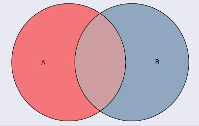

## Diferencia de eventos: $A \setminus B$

<h4 class="fragment fade-in" data-fragment-index="2">Definición</h4>
<ul>
<li class="fragment fade-up" data-fragment-index="3" style="font-size: 28px; text-align: justify;">
La <strong>diferencia</strong> $A \setminus B$ (también escrita $A - B$) es el conjunto de resultados que pertenecen a $A$ pero <strong>no</strong> pertenecen a $B$:
$$A \setminus B = \{\omega \in \Omega : \omega \in A \text{ y } \omega \notin B\}$$
</li>
<li class="fragment fade-up" data-fragment-index="4" style="font-size: 28px; text-align: justify;">
Equivalentemente: $A \setminus B = A \cap B^c$
</li>
<li class="fragment fade-up" data-fragment-index="5" style="font-size: 26px;">
<strong>Ejemplo:</strong> $\Omega = \{1,2,3,4,5,6\}$, $A = \{2,4,6\}$, $B = \{4,5,6\}$
$$A \setminus B = \{2\}$$
</li>
</ul>

Diagrama de Venn: $A \setminus B$

La región sombreada corresponde a los elementos de $A$ que no están en $B$.

