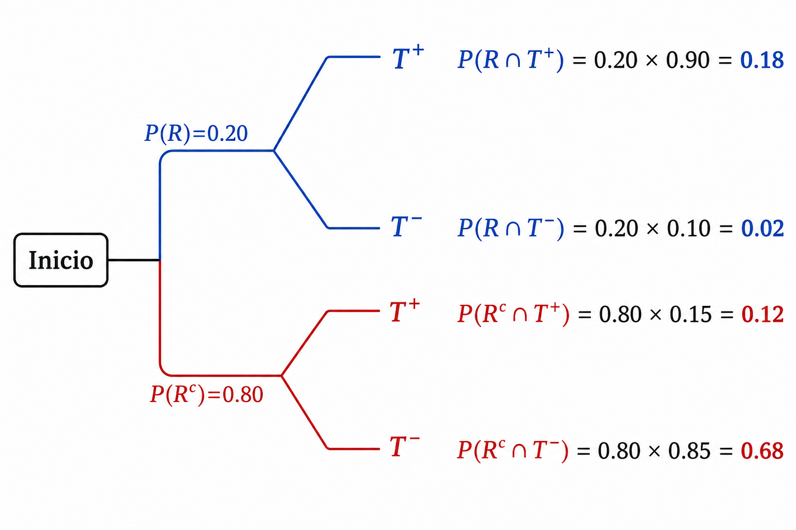

## Clase 8 {.center .middle}

## Contenido

<h3 class="fragment fade-in" data-fragment-index="1" style="font-size: 34px; margin-bottom: 14px;">Teorema de Bayes</h3>
<ul>
<li class="fragment fade-in" data-fragment-index="2">Problema inverso.</li>
<li class="fragment fade-in" data-fragment-index="3">Derivación paso a paso.</li>
<li class="fragment fade-in" data-fragment-index="4">Ley de probabilidad total.</li>
<li class="fragment fade-in" data-fragment-index="5">Probabilidades a priori y a posteriori.</li>
</ul>

<h3 class="fragment fade-in" data-fragment-index="6" style="font-size: 34px; margin-bottom: 14px;">Aplicaciones</h3>
<ul>
<li class="fragment fade-in" data-fragment-index="7">Terminología bayesiana.</li>
<li class="fragment fade-in" data-fragment-index="8">Árboles de probabilidad.</li>
<li class="fragment fade-in" data-fragment-index="9">Pruebas diagnósticas.</li>
<li class="fragment fade-in" data-fragment-index="10">Ejercicios de interpretación.</li>
</ul>

## La clase anterior...

<strong>Prob. Condicional</strong> 
$P(A \mid B) = \dfrac{P(A \cap B)}{P(B)}$ 
<em>Reduce el espacio muestral</em>

<strong>Regla Multiplicación</strong> 
$P(A \cap B) = P(A\mid B)\cdot P(B)$ 
<em>Eventos secuenciales</em>

<strong>Independencia</strong> 
$P(A \cap B) = P(A)\cdot P(B)$ 
<em>Sin influencia mutua</em>

<strong>Prob. Total</strong> 
$P(A) = \sum_i P(A\mid B_i)P(B_i)$ 
<em>Combinar particiones</em>

## {.center .middle}

Teorema de Bayes

Del resultado a la causa: razonamiento probabilístico inverso

Bioestadística Fundamental — Departamento de Estadística, UNAL Bogotá

## El problema inverso

<ul>
<li class="fragment fade-up" data-fragment-index="2" style="font-size: 28px; text-align: justify;">
En probabilidad clásica preguntamos: <strong>dada una causa, ¿cuál es la probabilidad del efecto?</strong>
</li>
<li class="fragment fade-up" data-fragment-index="3" style="font-size: 28px; text-align: justify;">
Por ejemplo: si una planta <em>es resistente</em> a una plaga, ¿cuál es la probabilidad de que la prueba de campo lo detecte?
</li>
<li class="fragment fade-up" data-fragment-index="4" style="font-size: 28px; text-align: justify;">
Sin embargo, en la práctica con frecuencia <strong>observamos el efecto</strong> y necesitamos inferir la causa más probable.
</li>
</ul>

<ul>
<li class="fragment fade-up" data-fragment-index="6" style="font-size: 28px; text-align: justify;">
Esta lógica <strong>de efecto a causa</strong> se denomina el <em>problema inverso</em>.
</li>
<li class="fragment fade-up" data-fragment-index="7" style="font-size: 28px; text-align: justify;">
El <strong>Teorema de Bayes</strong> proporciona la herramienta matemática exacta para resolverlo.
</li>
<li class="fragment fade-up" data-fragment-index="8" style="font-size: 28px; text-align: justify;">
Permite actualizar nuestras creencias sobre una hipótesis a la luz de nueva evidencia observada.
</li>
</ul>

## Motivación: una prueba diagnóstica positiva

  

<strong>Escenario:</strong> En un cultivo de café en el Huila, se aplica una prueba rápida para detectar la roya (<em>Hemileia vastatrix</em>). El resultado es <strong>positivo</strong>.

  

<ul style="margin-top: 30px;">
<li class="fragment fade-up" data-fragment-index="2" style="font-size: 32px; text-align: justify;">
La pregunta que surge de inmediato: <strong>¿la planta realmente tiene roya?</strong>
</li>
<li class="fragment fade-up" data-fragment-index="3" style="font-size: 32px; text-align: justify;">
Sabemos que ninguna prueba es perfecta: existe la posibilidad de <em>falsos positivos</em> y <em>falsos negativos</em>.
</li>
<li class="fragment fade-up" data-fragment-index="4" style="font-size: 32px; text-align: justify;">
La respuesta depende de tres factores: la <strong>sensibilidad</strong> de la prueba, su <strong>especificidad</strong> y la <strong>prevalencia</strong> de la enfermedad en la zona.
</li>
<li class="fragment fade-up" data-fragment-index="5" style="font-size: 32px; text-align: justify;">
El Teorema de Bayes integra estos tres factores en un único cálculo coherente.
</li>
</ul>

## Thomas Bayes (Contexto histórico)

<ul>
<li class="fragment fade-up" data-fragment-index="2" style="font-size: 28px; text-align: justify;">
<strong>Thomas Bayes</strong> (1702–1761) fue un ministro presbiteriano y matemático inglés.
</li>
<li class="fragment fade-up" data-fragment-index="3" style="font-size: 28px; text-align: justify;">
Su ensayo <em>"An Essay towards Solving a Problem in the Doctrine of Chances"</em> fue publicado póstumamente en 1763 por Richard Price.
</li>
<li class="fragment fade-up" data-fragment-index="4" style="font-size: 28px; text-align: justify;">
Bayes planteó el problema de la inferencia inversa: actualizar probabilidades a partir de evidencia.
</li>
</ul>

<ul>
<li class="fragment fade-up" data-fragment-index="6" style="font-size: 28px; text-align: justify;">
Pierre-Simon Laplace formalizó y generalizó el resultado en el siglo XIX, dándole su forma actual.
</li>
<li class="fragment fade-up" data-fragment-index="7" style="font-size: 28px; text-align: justify;">
Hoy el <strong>enfoque bayesiano</strong> es una de las dos grandes corrientes de la estadística moderna, junto con la estadística frecuentista.
</li>
<li class="fragment fade-up" data-fragment-index="8" style="font-size: 28px; text-align: justify;">
Sus aplicaciones van desde diagnóstico médico hasta inteligencia artificial y modelos de cambio climático.
</li>
</ul>

## Punto de partida: probabilidad Condicional

<strong>Definición:</strong> La probabilidad condicional de A dado B es:

$$P(A \mid B) = \frac{P(A \cap B)}{P(B)}, \quad P(B) > 0$$

<ul style="margin-top: 20px;">
<li class="fragment fade-up" data-fragment-index="2" style="text-align: justify;">
De modo simétrico:

 

$$P(B \mid A) = \dfrac{P(A \cap B)}{P(A)}$$

</li>
<li class="fragment fade-up" data-fragment-index="3" style="text-align: justify;">
Despejando $P(A \cap B)$ de ambas expresiones obtenemos la <strong>regla de la multiplicación</strong>:

$$P(A \cap B) = P(A \mid B)\,P(B) = P(B \mid A)\,P(A)$$

</li>
<li class="fragment fade-up" data-fragment-index="4" style="font-size:32px; text-align: justify;">
Esta igualdad es el <em>núcleo algebraico</em> del Teorema de Bayes.
</li>
</ul>

## Derivación del Teorema de Bayes

  

De la regla de multiplicación tenemos que:
$$P(A \cap B_i) = P(A \mid B_i)\,P(B_i) = P(B_i \mid A)\,P(A)$$

  

<ul style="margin-top: 15px;">
<li class="fragment fade-up" data-fragment-index="2" style="font-size: 28px; text-align: justify;">
 Despejando $P(B_i \mid A)$:

$$P(B_i \mid A) = \frac{P(A \mid B_i)\,P(B_i)}{P(A)}$$
</li>
<li class="fragment fade-up" data-fragment-index="3" style="font-size: 28px; text-align: justify;">
Sustituimos $P(A)$ usando la <strong>ley de probabilidad total</strong>:
$$P(A) = \sum_{j=1}^{k} P(A \mid B_j)\,P(B_j)$$
</li>
<li class="fragment fade-up" data-fragment-index="4" style="font-size: 32px; text-align: justify;">
Obtenemos así la <strong>forma completa</strong> del Teorema de Bayes.
</li>
</ul>

## Sustitución con la Ley de Probabilidad Total

  

$$\boxed{P(B_i \mid A) = \frac{P(A \mid B_i)\,P(B_i)}{\displaystyle\sum_{j=1}^{k} P(A \mid B_j)\,P(B_j)}}$$

  

<ul style="margin-top: 20px;">
<li class="fragment fade-up" data-fragment-index="2" style="font-size: 32px; text-align: justify;">
El <strong>numerador</strong> cuantifica cuánto contribuye la hipótesis $B_i$ a la ocurrencia del evento $A$.
</li>
<li class="fragment fade-up" data-fragment-index="3" style="font-size: 32px; text-align: justify;">
El <strong>denominador</strong> normaliza: garantiza que la suma de todas las probabilidades a posteriori sea 1.
</li>
<li class="fragment fade-up" data-fragment-index="4" style="font-size: 32px; text-align: justify;">
La fórmula es válida para cualquier partición $\{B_1, \ldots, B_k\}$ del espacio muestral.
</li>
</ul>

## El Teorema de Bayes:

  

Sea $\{B_1, B_2, \ldots, B_k\}$ una partición del espacio muestral $\Omega$ con $P(B_i) > 0$ para todo $i$. Sea $A$ un evento con $P(A) > 0$. Entonces, para cada $i = 1, 2, \ldots, k$:

$$P(B_i \mid A) = \frac{P(A \mid B_i)\,P(B_i)}{\sum_{j=1}^{k} P(A \mid B_j)\,P(B_j)}$$

  

<ul style="margin-top: 15px;">
<li class="fragment fade-up" data-fragment-index="3" style="font-size: 32px; text-align: justify;">
Las hipótesis $B_1, \ldots, B_k$ son <strong>mutuamente excluyentes y exhaustivas</strong>.
</li>
<li class="fragment fade-up" data-fragment-index="4" style="font-size: 32px; text-align: justify;">
El evento $A$ es la <strong>evidencia observada</strong> que actualiza la probabilidad de cada hipótesis.
</li>
</ul>

## Terminología Bayesiana

<strong style="color: #a78bfa;">Probabilidad a priori</strong>: $P(B_i)$ probabilidad de la hipótesis <em>antes</em> de observar la evidencia. Representa el conocimiento previo.

<strong style="color: #3b82f6;">Verosimilitud</strong>: $P(A \mid B_i)$ probabilidad de observar la evidencia $A$ <em>si</em> la hipótesis $B_i$ es verdadera.

<strong style="color: #59A14F;">Probabilidad a posteriori</strong>: $P(B_i \mid A)$ probabilidad de la hipótesis <em>después</em> de observar la videncia. Es la cantidad que calculamos con Bayes.

<strong style="color: #F28E2B;">Evidencia marginal</strong>: $P(A)$ constante de normalización que garantiza que las probabilidades sumen 1.

## Suma de Probabilidades a Posteriori

  

<strong>Propiedad:</strong> La suma de todas las probabilidades a posteriori es siempre igual a 1:
$$\sum_{i=1}^{k} P(B_i \mid A) = 1$$

  

<ul style="margin-top: 20px;">
<li class="fragment fade-up" data-fragment-index="2" style="font-size: 32px; text-align: justify;">
<strong>Demostración:</strong> $\displaystyle\sum_{i=1}^{k} P(B_i \mid A) = \frac{\sum_{i=1}^{k} P(A \mid B_i)\,P(B_i)}{P(A)} = \frac{P(A)}{P(A)} = 1$
</li>
<li class="fragment fade-up" data-fragment-index="3" style="font-size: 32px; text-align: justify;">
Esto confirma que las probabilidades a posteriori forman una <strong>distribución de probabilidad válida</strong> sobre las hipótesis.
</li>
<li class="fragment fade-up" data-fragment-index="4" style="font-size: 32px; text-align: justify;">
Esta verificación sirve como <strong>chequeo aritmético</strong> al resolver problemas con múltiples hipótesis.
</li>
</ul>

## Dos Hipótesis ($B$ y $B^c$)

Cuando la partición es binaria, el evento $B$ y su complemento $B^c$, el Teorema de Bayes toma la siguiente forma simplificada:

$$P(B \mid A) = \frac{P(A \mid B)\,P(B)}{P(A \mid B)\,P(B) + P(A \mid B^c)\,P(B^c)}$$

<ul style="margin-top: 15px;line-height: 1.8;">
<li class="fragment fade-up" data-fragment-index="2" style="font-size: 32px; text-align: justify;">
Aquí $P(B^c) = 1 - P(B)$, por lo que solo necesitamos tres parámetros: $P(B)$, $P(A|B)$ y $P(A|B^c)$.
</li>
<li class="fragment fade-up" data-fragment-index="3" style="font-size: 32px; text-align: justify;">
Esta es la forma más usada en <strong>diagnóstico</strong>: $B$ = "tiene la enfermedad", $A$ = "prueba positiva".
</li>
</ul>

## Forma Simplificada (Caso Binario)

  

$$P(B \mid A) = \frac{P(A \mid B)\,P(B)}{P(A \mid B)\,P(B) + P(A \mid B^c)\,P(B^c)}$$

  

Términos del numerador

<ul style="line-height: 1.8;">
<li class="fragment fade-up" data-fragment-index="3" style="font-size: 30px; text-align: justify;">
$P(B)$: prevalencia es la probabilidad previa de que $B$ sea verdadera.
</li>
<li class="fragment fade-up" data-fragment-index="4" style="font-size: 30px; text-align: justify;">
$P(A \mid B)$: sensibilidad es la probabilidad de observar $A$ cuando $B$ es verdadera.
</li>
</ul>

Términos del denominador adicional

<ul style="line-height: 1.8;">
<li class="fragment fade-up" data-fragment-index="6" style="font-size: 30px; text-align: justify;">
$P(B^c)$: probabilidad previa de que $B$ sea falsa.
</li>
<li class="fragment fade-up" data-fragment-index="7" style="font-size: 30px; text-align: justify;">
$P(A \mid B^c)$: tasa de falsos positivos.  
Es la probabilidad de $A$ cuando $B$ es falsa.
</li>
</ul>

## Árbol de Probabilidad

<ul style="line-height: 1.8;">
<li class="fragment fade-up" data-fragment-index="2" style="font-size: 32px; text-align: justify;">
<strong>Primer nivel:</strong> las ramas representan las hipótesis $B_1, \ldots, B_k$ con sus probabilidades a priori $P(B_i)$.
</li>
<li class="fragment fade-up" data-fragment-index="3" style="font-size: 32px; text-align: justify;">
<strong>Segundo nivel:</strong> desde cada $B_i$ salen ramas para $A$ y $A^c$ con las verosimilitudes $P(A \mid B_i)$ y $P(A^c \mid B_i)$.
</li>
<li class="fragment fade-up" data-fragment-index="4" style="font-size: 32px; text-align: justify;">
<strong>Probabilidades de caminos:</strong> el producto a lo largo de cada rama da $P(A \cap B_i) = P(A \mid B_i)\,P(B_i)$.
</li>
<li class="fragment fade-up" data-fragment-index="5" style="font-size: 32px; text-align: justify;">
<strong>Denominador:</strong> la suma de los caminos que llevan a $A$ da $P(A)$ (ley de probabilidad total).
</li>
<li class="fragment fade-up" data-fragment-index="6" style="font-size: 32px; text-align: justify;">
<strong>Bayes:</strong> dividimos el camino de interés entre la suma total de caminos hacia $A$.
</li>
</ul>

## Ejemplo 1: prueba de resistencia en café

En un cultivo de café en el Huila, se aplica una prueba para detectar resistencia genética a la roya. Se sabe que: <strong>20%</strong> de las plantas son resistentes (prevalencia). La prueba tiene <strong>sensibilidad del 90%</strong> y <strong>especificidad del 85%</strong>. Una planta muestra resultado positivo. ¿Cuál es la probabilidad de que sea realmente resistente?

<ul style="margin-top: 15px;line-height: 1.8;">
<li class="fragment fade-up" data-fragment-index="2" style="font-size: 30px; text-align: justify;">
Sea $R$ = Planta resistente y $T^+$ = prueba positiva.
</li>
<li class="fragment fade-up" data-fragment-index="3" style="font-size: 30px; text-align: justify;">
Nota:$P(A^c \mid B^c)$: especificidad es la probabilidad de observar $A^c$ cuando $B$ es falsa.
</li>

<li class="fragment fade-up" data-fragment-index="4" style="font-size: 30px; text-align: justify;">
Datos: $P(R) = 0.20$, $P(T^+ \mid R) = 0.90$, $P(T^- \mid R^c) = 0.85 \Rightarrow P(T^+ \mid R^c) = 0.15$.
</li>
<li class="fragment fade-up" data-fragment-index="5" style="font-size: 30px; text-align: justify;">
Queremos: $P(R \mid T^+) = ?$
</li>
</ul>

## Datos

<table class="fragment fade-up" data-fragment-index="1" style="font-size: 30px; margin: auto; border-collapse: collapse; width: 80%;">
<thead>
<tr style="background-color: #3b82f6; color: white;">
<th style="padding: 10px; border: 1px solid #ccc;">Parámetro</th>
<th style="padding: 10px; border: 1px solid #ccc;">Símbolo</th>
<th style="padding: 10px; border: 1px solid #ccc;">Valor</th>
<th style="padding: 10px; border: 1px solid #ccc;">Significado</th>
</tr>
</thead>
<tbody>
<tr class="fragment fade-up" data-fragment-index="2" style="background-color: #f0f9ff;">
<td style="padding: 8px; border: 1px solid #ccc;">Prevalencia</td>
<td style="padding: 8px; border: 1px solid #ccc;">$P(R)$</td>
<td style="padding: 8px; border: 1px solid #ccc;">0.20</td>
<td style="padding: 8px; border: 1px solid #ccc;">20% de plantas son resistentes</td>
</tr>
<tr class="fragment fade-up" data-fragment-index="3" style="background-color: white;">
<td style="padding: 8px; border: 1px solid #ccc;">No resistente</td>
<td style="padding: 8px; border: 1px solid #ccc;">$P(R^c)$</td>
<td style="padding: 8px; border: 1px solid #ccc;">0.80</td>
<td style="padding: 8px; border: 1px solid #ccc;">80% de plantas no son resistentes</td>
</tr>
<tr class="fragment fade-up" data-fragment-index="4" style="background-color: #f0f9ff;">
<td style="padding: 8px; border: 1px solid #ccc;">Sensibilidad</td>
<td style="padding: 8px; border: 1px solid #ccc;">$P(T^+ \mid R)$</td>
<td style="padding: 8px; border: 1px solid #ccc;">0.90</td>
<td style="padding: 8px; border: 1px solid #ccc;">90% de resistentes dan positivo</td>
</tr>
<tr class="fragment fade-up" data-fragment-index="5" style="background-color: white;">
<td style="padding: 8px; border: 1px solid #ccc;">Tasa falso positivo</td>
<td style="padding: 8px; border: 1px solid #ccc;">$P(T^+ \mid R^c)$</td>
<td style="padding: 8px; border: 1px solid #ccc;">0.15</td>
<td style="padding: 8px; border: 1px solid #ccc;">15% de no resistentes dan positivo</td>
</tr>
</tbody>
</table>

## Árbol de probabilidades

<ul style="line-height: 1.8;">
<li class="fragment fade-up" data-fragment-index="2" style="font-size: 30px; text-align: justify;">
<strong>$P(T^+)$</strong> = suma de caminos hacia $T^+$ = $0.18 + 0.12 = 0.30$
</li>
<li class="fragment fade-up" data-fragment-index="3" style="font-size: 30px; text-align: justify;">
Verificación: $0.18 + 0.02 + 0.12 + 0.68 = 1.00$ ✓
</li>
</ul>

## Solución Paso a Paso

  

Aplicamos el Teorema de Bayes:
$$P(R \mid T^+) = \frac{P(T^+ \mid R)\,P(R)}{P(T^+ \mid R)\,P(R) + P(T^+ \mid R^c)\,P(R^c)}$$

  

<ul style="margin-top: 15px;line-height: 1.8;">
<li class="fragment fade-up" data-fragment-index="2" style="font-size: 32px; text-align: justify;">
<strong>Numerador:</strong> $P(T^+ \mid R)\,P(R) = 0.90 \times 0.20 = 0.18$
</li>
<li class="fragment fade-up" data-fragment-index="3" style="font-size: 32px; text-align: justify;">
<strong>Denominador:</strong> $P(T^+) = 0.18 + 0.80 \times 0.15 = 0.18 + 0.12 = 0.30$
</li>
<li class="fragment fade-up" data-fragment-index="4" style="font-size: 32px; text-align: justify;">
<strong>Resultado:</strong> $P(R \mid T^+) = \dfrac{0.18}{0.30} = 0.60$
</li>
<li class="fragment fade-up" data-fragment-index="5" style="font-size: 32px; text-align: justify; color: #059669;">
Dado un resultado positivo, hay un <strong>60% de probabilidad</strong> de que la planta sea realmente resistente.
</li>
</ul>

## Interpretación:

<ul style="line-height:1.3;">
<li class="fragment fade-up" data-fragment-index="2" style="font-size: 30px; text-align: justify;">
A pesar de que la prueba tiene <strong>90% de sensibilidad</strong>, un resultado positivo solo indica resistencia con probabilidad <strong>60%</strong>.
</li>
<li class="fragment fade-up" data-fragment-index="3" style="font-size: 30px; text-align: justify;">
Esto se debe a la <strong>baja prevalencia</strong> (20%): la mayoría de plantas no son resistentes, por lo que muchos positivos provienen de falsos positivos.
</li>
</ul>

<ul style="line-height:1.3;">
<li class="fragment fade-up" data-fragment-index="5" style="font-size: 30px; text-align: justify;">
Este fenómeno se conoce como la <strong>paradoja de la prevalencia baja</strong>: las pruebas diagnósticas son menos informativas cuando la condición es rara.
</li>
<li class="fragment fade-up" data-fragment-index="6" style="font-size: 30px; text-align: justify;">
En la práctica agronómica, conocer la prevalencia regional es tan importante como la calidad del instrumento de medición.
</li>
</ul>

## Efecto de la Prevalencia en el VPP

<table class="fragment fade-up" data-fragment-index="1" style="font-size: 30px; margin: auto; border-collapse: collapse; width: 85%;">
<thead>
<tr style="background-color: #59A14F; color: white;">
<th style="padding: 10px; border: 1px solid #ccc;">Prevalencia $P(R)$</th>
<th style="padding: 10px; border: 1px solid #ccc;">Num. = $0.90 \times P(R)$</th>
<th style="padding: 10px; border: 1px solid #ccc;">Den. = Num. + $0.15 \times P(R^c)$</th>
<th style="padding: 10px; border: 1px solid #ccc;">$P(R \mid T^+)$</th>
</tr>
</thead>
<tbody>
<tr class="fragment fade-up" data-fragment-index="2" style="background-color: #f9fafb;">
<td style="padding: 8px; border: 1px solid #ccc;">5%</td>
<td style="padding: 8px; border: 1px solid #ccc;">0.0450</td>
<td style="padding: 8px; border: 1px solid #ccc;">0.0450 + 0.1425 = 0.1875</td>
<td style="padding: 8px; border: 1px solid #ccc; color: #dc2626;"><strong>24.0%</strong></td>
</tr>
<tr class="fragment fade-up" data-fragment-index="3" style="background-color: white;">
<td style="padding: 8px; border: 1px solid #ccc;">20%</td>
<td style="padding: 8px; border: 1px solid #ccc;">0.18</td>
<td style="padding: 8px; border: 1px solid #ccc;">0.18 + 0.12 = 0.30</td>
<td style="padding: 8px; border: 1px solid #ccc; color: #d97706;"><strong>60.0%</strong></td>
</tr>
<tr class="fragment fade-up" data-fragment-index="4" style="background-color: #f9fafb;">
<td style="padding: 8px; border: 1px solid #ccc;">50%</td>
<td style="padding: 8px; border: 1px solid #ccc;">0.450</td>
<td style="padding: 8px; border: 1px solid #ccc;">0.450 + 0.075 = 0.525</td>
<td style="padding: 8px; border: 1px solid #ccc; color: #059669;"><strong>85.7%</strong></td>
</tr>
<tr class="fragment fade-up" data-fragment-index="5" style="background-color: white;">
<td style="padding: 8px; border: 1px solid #ccc;">80%</td>
<td style="padding: 8px; border: 1px solid #ccc;">0.72</td>
<td style="padding: 8px; border: 1px solid #ccc;">0.72 + 0.03 = 0.75</td>
<td style="padding: 8px; border: 1px solid #ccc; color: #1d4ed8;"><strong>96.0%</strong></td>
</tr>
</tbody>
</table>
<li class="fragment fade-up" data-fragment-index="6" style="font-size: 30px; text-align: justify; margin-top: 20px;list-style-type: none;">
<strong>El VPP o valor predictivo positivo es la probabilidad de que ocurra el evento de interés dado que el resultado observado fue positivo.</strong>
</li>

## Sensibilidad

  

$$\text{Sensibilidad} = P(\text{test}^+ \mid \text{enfermo}) = \frac{VP}{VP + FN}$$

  

<ul style="margin-top: 20px;line-height: 2;">
<li class="fragment fade-up" data-fragment-index="2" style="font-size: 32px; text-align: justify;">
Mide la <strong>capacidad de la prueba para detectar casos verdaderos</strong> (enfermos o afectados).
</li>
<li class="fragment fade-up" data-fragment-index="3" style="font-size: 32px; text-align: justify;">
$VP$ = Verdaderos Positivos; $FN$ = Falsos Negativos (enfermos no detectados).
</li>
<li class="fragment fade-up" data-fragment-index="4" style="font-size: 32px; text-align: justify;">
Una prueba con alta sensibilidad tiene pocas <strong>pérdidas de casos reales</strong>, importante cuando el costo de no detectar es alto (p.ej., brotes de plaga).
</li>
</ul>

## Especificidad

  

$$\text{Especificidad} = P(\text{test}^- \mid \text{sano}) = \frac{VN}{VN + FP}$$

  

<ul style="margin-top: 20px;line-height: 2;">
<li class="fragment fade-up" data-fragment-index="2" style="font-size: 34px; text-align: justify;">
Mide la <strong>capacidad de la prueba para identificar correctamente los sanos</strong> (no afectados).
</li>
<li class="fragment fade-up" data-fragment-index="3" style="font-size: 34px; text-align: justify;">
$VN$ = Verdaderos Negativos; $FP$ = Falsos Positivos (sanos que dan positivo).
</li>
<li class="fragment fade-up" data-fragment-index="4" style="font-size: 34px; text-align: justify;">
Una prueba con alta especificidad tiene pocos <strong>falsos positivos</strong>, importante para evitar tratamientos innecesarios costosos.
</li>
</ul>

## VPP y VPN

Valor Predictivo Positivo (VPP)

$$\text{VPP} = P(\text{enfermo} \mid \text{test}^+) = \frac{VP}{VP + FP}$$

<ul style="line-height: 2;">
<li class="fragment fade-up" data-fragment-index="2" style="font-size: 30px; text-align: justify;">
De todos los que dan positivo, ¿qué fracción está realmente enferma?
</li>
<li class="fragment fade-up" data-fragment-index="3" style="font-size: 30px; text-align: justify;">
Es directamente la <strong>probabilidad a posteriori</strong> calculada con Bayes.
</li>
</ul>

Valor Predictivo Negativo (VPN)

$$\text{VPN} = P(\text{sano} \mid \text{test}^-) = \frac{VN}{VN + FN}$$

<ul style="line-height: 2;">
<li class="fragment fade-up" data-fragment-index="5" style="font-size: 30px; text-align: justify;">
De todos los que dan negativo, ¿qué fracción está realmente sana?
</li>
<li class="fragment fade-up" data-fragment-index="6" style="font-size: 30px; text-align: justify;">
También se calcula con Bayes: $P(\text{sano} \mid T^-) = \frac{P(T^- \mid \text{sano})\,P(\text{sano})}{P(T^-)}$
</li>
</ul>

## Tabla de Contingencia para prueba diagnóstica

<table style="font-size: 30px; margin: auto; border-collapse: collapse; width: 80%;">
<thead>
<tr style="background-color: #1e3a8a; color: white;">
<th style="padding: 10px; border: 2px solid #333;"> </th>
<th style="padding: 10px; border: 2px solid #333;">Enfermo ($D^+$)</th>
<th style="padding: 10px; border: 2px solid #333;">Sano ($D^-$)</th>
<th style="padding: 10px; border: 2px solid #333;">Total</th>
</tr>
</thead>
<tbody>
<tr class="fragment fade-up" data-fragment-index="2" style="background-color: #dbeafe;">
<td style="padding: 10px; border: 2px solid #333; font-weight: bold;">Test $+$</td>
<td style="padding: 10px; border: 2px solid #333; color: #059669;">VP (Verdadero Positivo)</td>
<td style="padding: 10px; border: 2px solid #333; color: #dc2626;">FP (Falso Positivo)</td>
<td style="padding: 10px; border: 2px solid #333;">VP + FP</td>
</tr>
<tr class="fragment fade-up" data-fragment-index="3" style="background-color: white;">
<td style="padding: 10px; border: 2px solid #333; font-weight: bold;">Test $-$</td>
<td style="padding: 10px; border: 2px solid #333; color: #dc2626;">FN (Falso Negativo)</td>
<td style="padding: 10px; border: 2px solid #333; color: #059669;">VN (Verdadero Negativo)</td>
<td style="padding: 10px; border: 2px solid #333;">FN + VN</td>
</tr>
<tr class="fragment fade-up" data-fragment-index="4" style="background-color: #f3f4f6;">
<td style="padding: 10px; border: 2px solid #333; font-weight: bold;">Total</td>
<td style="padding: 10px; border: 2px solid #333;">VP + FN</td>
<td style="padding: 10px; border: 2px solid #333;">FP + VN</td>
<td style="padding: 10px; border: 2px solid #333;">$n$</td>
</tr>
</tbody>
</table>

<ul style="font-size: 30px;line-height: 2;margin-top: 20px; color: #052552; text-align: justify;">

  <li class="fragment fade-up" data-fragment-index="5">
    Sensibilidad $= \frac{VP}{VP+FN}$
  </li>

  <li class="fragment fade-up" data-fragment-index="6">
    Especificidad $= \frac{VN}{VN+FP}$
  </li>

  <li class="fragment fade-up" data-fragment-index="7">
    VPP $= \frac{VP}{VP+FP}$
  </li>

  <li class="fragment fade-up" data-fragment-index="8">
    VPN $= \frac{VN}{VN+FN}$
  </li>

</ul>

## Relación entre VPP y el Teorema de Bayes

El VPP es exactamente la probabilidad a posteriori de estar enfermo dado un resultado positivo:

$$\text{VPP} = P(D^+ \mid T^+) = \frac{P(T^+ \mid D^+)\,P(D^+)}{P(T^+ \mid D^+)\,P(D^+) + P(T^+ \mid D^-)\,P(D^-)}$$

 
donde $P(T^+ \mid D^+) = \text{Sensibilidad}$ y $P(T^+ \mid D^-) = 1 - \text{Especificidad}$.

<ul style="margin-top: 15px;line-height: 2;">
<li class="fragment fade-up" data-fragment-index="2" style="font-size: 32px; text-align: justify;">
El VPN es la probabilidad a posteriori de estar sano dado resultado negativo: $P(D^- \mid T^-)$.
</li>
<li class="fragment fade-up" data-fragment-index="3" style="font-size: 32px; text-align: justify;">
Ambos dependen de la <strong>prevalencia</strong> $P(D^+)$, que actúa como probabilidad a priori.
</li>
</ul>

## Ejemplo 2: hongos en cultivo de maíz

  

En una región del Tolima con cultivo de maíz, la prevalencia de <em>Aspergillus</em> (hongo) es del <strong>30%</strong>. Se usa una prueba rápida con sensibilidad <strong>88%</strong> y especificidad <strong>80%</strong>. Calcular VPP y VPN.

  

<ul style="margin-top: 15px;line-height:3;">
<li class="fragment fade-up" data-fragment-index="2" style="font-size: 30px; text-align: justify;">
Sea $H$ = Planta infectada, $T^+$ = Prueba positiva.
</li>
<li class="fragment fade-up" data-fragment-index="3" style="font-size: 30px; text-align: justify;">
$P(H) = 0.30$, $P(T^+ \mid H) = 0.88$, $P(T^- \mid H^c) = 0.80 \Rightarrow P(T^+ \mid H^c) = 0.20$.
</li>
<li class="fragment fade-up" data-fragment-index="4" style="font-size: 28px; text-align: justify;">
<strong>VPP:</strong> $\dfrac{0.88 \times 0.30}{0.88 \times 0.30 + 0.20 \times 0.70} = \dfrac{0.264}{0.264 + 0.140} = \dfrac{0.264}{0.404} \approx 0.653$
</li>
<li class="fragment fade-up" data-fragment-index="5" style="font-size: 28px; text-align: justify;">
<strong>VPN:</strong> $\dfrac{0.80 \times 0.70}{0.80 \times 0.70 + 0.12 \times 0.30} = \dfrac{0.560}{0.560 + 0.036} = \dfrac{0.560}{0.596} \approx 0.940$
</li>
</ul>

## Interpretación:

VPP = 65.3%

<ul style="line-height:1.8;">
<li class="fragment fade-up" data-fragment-index="2" style="font-size: 30px; text-align: justify;">
De cada 100 plantas con prueba positiva, aproximadamente <strong>65</strong> están realmente infectadas.
</li>
<li class="fragment fade-up" data-fragment-index="3" style="font-size: 30px; text-align: justify;">
El 35% restante son <strong>falsos positivos</strong>: plantas sanas que arrojaron positivo.
</li>
<li class="fragment fade-up" data-fragment-index="4" style="font-size: 30px; text-align: justify;">
Recomendación: confirmar con una segunda prueba antes de aplicar fungicida.
</li>
</ul>

VPN = 94.0%

<ul style="line-height:1.8;">
<li class="fragment fade-up" data-fragment-index="6" style="font-size: 30px; text-align: justify;">
De cada 100 plantas con prueba negativa, aproximadamente <strong>94</strong> están realmente sanas.
</li>
<li class="fragment fade-up" data-fragment-index="7" style="font-size: 30px; text-align: justify;">
Un resultado negativo es muy confiable, ya que pocas plantas infectadas pasarán desapercibidas.
</li>
<li class="fragment fade-up" data-fragment-index="8" style="font-size: 30px; text-align: justify;">
El VPN es alto en parte porque la prevalencia (30%) no es extremadamente alta.
</li>
</ul>

## Generalización a $k$ Hipótesis

  

Para una partición $\{B_1, B_2, \ldots, B_k\}$ con $k > 2$:
$$P(B_i \mid A) = \frac{P(A \mid B_i)\,P(B_i)}{\displaystyle\sum_{j=1}^{k} P(A \mid B_j)\,P(B_j)}, \quad i = 1, 2, \ldots, k$$

  

<ul style="margin-top: 10px;line-height:2;">
<li class="fragment fade-up" data-fragment-index="2" style="font-size: 32px; text-align: justify;">
Las hipótesis pueden representar: <strong>orígenes diferentes</strong> de una muestra, <strong>variedades</strong> de una especie, <strong>regiones</strong> de producción, etc.
</li>
<li class="fragment fade-up" data-fragment-index="3" style="font-size: 32px; text-align: justify;">
El cálculo es idéntico para cada hipótesis, solo cambia el numerador.
</li>
<li class="fragment fade-up" data-fragment-index="4" style="font-size: 32px; text-align: justify;">
<strong>Verificación:</strong> $\sum_{i=1}^k P(B_i \mid A) = 1 \rightarrow$  siempre debemos comprobarlo.
</li>
</ul>

## Ejemplo 3: origen del lote de semillas de papa

  

Un lote de semillas de papa puede provenir de tres proveedores: $B_1$ (Cundinamarca), $B_2$ (Boyacá) y $B_3$ (Nariño). Se selecciona una semilla al azar y <strong>germina</strong> (evento $A$). ¿Cuál proveedor es más probable?

  

<table class="fragment fade-up" data-fragment-index="2" style="font-size: 32px; margin: auto; border-collapse: collapse; width: 75%;">
<thead>
<tr style="background-color: #59A14F; color: white;">
<th style="padding: 8px; border: 1px solid #ccc;">Proveedor</th>
<th style="padding: 8px; border: 1px solid #ccc;">$P(B_i)$ (participación)</th>
<th style="padding: 8px; border: 1px solid #ccc;">$P(A \mid B_i)$ (tasa germinación)</th>
</tr>
</thead>
<tbody>
<tr class="fragment fade-up" data-fragment-index="3" style="background-color: #f0fdf4;">
<td style="padding: 8px; border: 1px solid #ccc;">$B_1$ C/marca</td>
<td style="padding: 8px; border: 1px solid #ccc;">0.50</td>
<td style="padding: 8px; border: 1px solid #ccc;">0.80</td>
</tr>
<tr class="fragment fade-up" data-fragment-index="4" style="background-color: white;">
<td style="padding: 8px; border: 1px solid #ccc;">$B_2$ Boyacá</td>
<td style="padding: 8px; border: 1px solid #ccc;">0.30</td>
<td style="padding: 8px; border: 1px solid #ccc;">0.70</td>
</tr>
<tr class="fragment fade-up" data-fragment-index="5" style="background-color: #f0fdf4;">
<td style="padding: 8px; border: 1px solid #ccc;">$B_3$ Nariño</td>
<td style="padding: 8px; border: 1px solid #ccc;">0.20</td>
<td style="padding: 8px; border: 1px solid #ccc;">0.60</td>
</tr>
</tbody>
</table>

## Solución 

<!-- Columna izquierda -->

<ul style="padding-left: 0;">

<li style="list-style-type: none;">

<h4 style="font-size: 30px; color: #a78bfa;">
Árbol de probabilidades
</h4>

<pre>
                   ┌─ Germina (A):  0.50 × 0.80 = 0.40
P(B₁)=0.50 ────────┤
                   └─ No germina:  0.50 × 0.20 = 0.10

                   ┌─ Germina (A):  0.30 × 0.70 = 0.21
P(B₂)=0.30 ────────┤
                   └─ No germina:  0.30 × 0.30 = 0.09

                   ┌─ Germina (A):  0.20 × 0.60 = 0.12
P(B₃)=0.20 ────────┤
                   └─ No germina:  0.20 × 0.40 = 0.08
</pre>

<strong>Verificación:</strong> 
$0.40 + 0.10 + 0.21 + 0.09 + 0.12 + 0.08 = 1.00$

</li>
</ul>

<!-- Columna derecha -->

<h4 style="font-size: 30px; color: #3b82f6;">
Calculando el denominador por ley de Probabilidad Total:
</h4>
<ul style="padding-left: 0;">
<li class="fragment fade-up" data-fragment-index="5" style="font-size: 28px; text-align: center;list-style-type: none;">
$$P(A)=\sum_{j=1}^{3} P(A \mid B_j)\,P(B_j)$$
</li>
<li class="fragment fade-up" data-fragment-index="6" style="font-size: 28px; list-style-type: none;">
$P(A \mid B_1)\,P(B_1)=0.80 \times 0.50=0.40$
</li>
<li class="fragment fade-up" data-fragment-index="7" style="font-size: 28px; list-style-type: none;">
$P(A \mid B_2)\,P(B_2)=0.70 \times 0.30=0.21$
</li>
<li class="fragment fade-up" data-fragment-index="8" style="font-size: 28px; list-style-type: none;">
$P(A \mid B_3)\,P(B_3)=0.60 \times 0.20=0.12$
</li>
<li class="fragment fade-up" data-fragment-index="9" style="font-size: 28px; color: #1e40af; list-style-type: none; margin-top: 15px;">
$\therefore P(A)=0.40+0.21+0.12=\mathbf{0.73}$
</li>
</ul>

## Cálculo de $P(B_i \mid A)$

<ul>

<li class="fragment fade-up" data-fragment-index="2" style="font-size: 26px; text-align: justify;list-style-type: none;">
$$P(B_1 \mid A) = \frac{0.40}{0.73} \approx 0.5479$$
</li>
<li class="fragment fade-up" data-fragment-index="3" style="font-size: 26px; text-align: justify;list-style-type: none;">
$$P(B_2 \mid A) = \frac{0.21}{0.73} \approx 0.2877$$
</li>
<li class="fragment fade-up" data-fragment-index="4" style="font-size: 26px; text-align: justify;list-style-type: none;">
$$P(B_3 \mid A) = \frac{0.12}{0.73} \approx 0.1644$$
</li>
<li class="fragment fade-up" data-fragment-index="5" style="font-size: 26px; text-align: justify; color: #059669;list-style-type: none; margin-top: 15px;">
<strong>Verificación:</strong> $0.5479 + 0.2877 + 0.1644 = 1.00$
</li>
</ul>

<ul>
<table class="fragment fade-up" data-fragment-index="7" style="font-size: 24px; margin: auto; border-collapse: collapse; width: 80%;">
<thead>
<tr style="background-color: #F28E2B; color: white;">
<th style="padding: 10px; border: 1px solid #ccc;">Proveedor</th>
<th style="padding: 10px; border: 1px solid #ccc;">A priori $P(B_i)$</th>
<th style="padding: 10px; border: 1px solid #ccc;">Verosimilitud $P(A|B_i)$</th>
<th style="padding: 10px; border: 1px solid #ccc;">Producto</th>
<th style="padding: 10px; border: 1px solid #ccc;">A posteriori $P(B_i|A)$</th>
</tr>
</thead>
<tbody>
<tr class="fragment fade-up" data-fragment-index="8" style="background-color: #fff7ed;">
<td style="padding: 8px; border: 1px solid #ccc;">$B_1$ Cundinamarca</td>
<td style="padding: 8px; border: 1px solid #ccc;">0.50</td>
<td style="padding: 8px; border: 1px solid #ccc;">0.80</td>
<td style="padding: 8px; border: 1px solid #ccc;">0.40</td>
<td style="padding: 8px; border: 1px solid #ccc; font-weight: bold;">54.79%</td>
</tr>
<tr class="fragment fade-up" data-fragment-index="9" style="background-color: white;">
<td style="padding: 8px; border: 1px solid #ccc;">$B_2$ Boyacá</td>
<td style="padding: 8px; border: 1px solid #ccc;">0.30</td>
<td style="padding: 8px; border: 1px solid #ccc;">0.70</td>
<td style="padding: 8px; border: 1px solid #ccc;">0.21</td>
<td style="padding: 8px; border: 1px solid #ccc; font-weight: bold;">28.77%</td>
</tr>
<tr class="fragment fade-up" data-fragment-index="10" style="background-color: #fff7ed;">
<td style="padding: 8px; border: 1px solid #ccc;">$B_3$ Nariño</td>
<td style="padding: 8px; border: 1px solid #ccc;">0.20</td>
<td style="padding: 8px; border: 1px solid #ccc;">0.60</td>
<td style="padding: 8px; border: 1px solid #ccc;">0.12</td>
<td style="padding: 8px; border: 1px solid #ccc; font-weight: bold;">16.44%</td>
</tr>
<tr class="fragment fade-up" data-fragment-index="11" style="background-color: #fef3c7;">
<td style="padding: 8px; border: 1px solid #ccc; font-weight: bold;">Total</td>
<td style="padding: 8px; border: 1px solid #ccc; font-weight: bold;">1.00</td>
<td style="padding: 8px; border: 1px solid #ccc;">—</td>
<td style="padding: 8px; border: 1px solid #ccc; font-weight: bold;">0.73</td>
<td style="padding: 8px; border: 1px solid #ccc; font-weight: bold; color: #059669;">100.00%</td>
</tr>
</tbody>
</table>

</ul>

## Interpretación:

<ul style="line-height:1.4;">
<li class="fragment fade-up" data-fragment-index="2" style="font-size: 30px; text-align: justify;">
A priori, el proveedor $B_1$ (Cundinamarca) tenía un <strong>50% de probabilidad</strong> de ser el origen, mientras que $B_3$ (Nariño) solo tenía un <strong>20%</strong>.
</li>
<li class="fragment fade-up" data-fragment-index="3" style="font-size: 30px; text-align: justify;">
Al observar que la semilla <strong>germinó</strong>, las probabilidades se actualizaron: $B_1$ sube a <strong>54,8%</strong>.
</li>
</ul>

<ul style="line-height:1.4;">
<li class="fragment fade-up" data-fragment-index="5" style="font-size: 30px; text-align: justify;">
La germinación que más peso tiene es a favor de $B_1$ porque tiene la mayor tasa de germinación (80%) y la mayor participación (50%).
</li>
<li class="fragment fade-up" data-fragment-index="6" style="font-size: 30px; text-align: justify;">
<strong>Conclusión práctica:</strong> Dado que la semilla germinó, es más probable que provenga de Cundinamarca; la probabilidad de Nariño disminuye ligeramente.
</li>
</ul>

## Ejemplo 4: zonas de cultivo de arroz

  

Se monitorean cuatro zonas arroceras del Tolima y Meta. Se selecciona aleatoriamente una planta que muestra <strong>síntomas de piricularia</strong> (hongo). ¿De qué zona proviene con mayor probabilidad?

  

<table class="fragment fade-up" data-fragment-index="2" style="font-size: 30px; margin: auto; border-collapse: collapse; width: 78%;">
<thead>
<tr style="background-color: #76B7B2; color: white;">
<th style="padding: 8px; border: 1px solid #ccc;">Zona</th>
<th style="padding: 8px; border: 1px solid #ccc;">$P(Z_i)$</th>
<th style="padding: 8px; border: 1px solid #ccc;">$P(\text{piricularia} \mid Z_i)$</th>
</tr>
</thead>
<tbody>
<tr class="fragment fade-up" data-fragment-index="3"><td style="padding: 7px; border: 1px solid #ccc;">$Z_1$ Espinal</td><td style="padding: 7px; border: 1px solid #ccc;">0.35</td><td style="padding: 7px; border: 1px solid #ccc;">0.12</td></tr>
<tr class="fragment fade-up" data-fragment-index="4"><td style="padding: 7px; border: 1px solid #ccc;">$Z_2$ Purificación</td><td style="padding: 7px; border: 1px solid #ccc;">0.25</td><td style="padding: 7px; border: 1px solid #ccc;">0.18</td></tr>
<tr class="fragment fade-up" data-fragment-index="5"><td style="padding: 7px; border: 1px solid #ccc;">$Z_3$ Villavicencio</td><td style="padding: 7px; border: 1px solid #ccc;">0.25</td><td style="padding: 7px; border: 1px solid #ccc;">0.22</td></tr>
<tr class="fragment fade-up" data-fragment-index="6"><td style="padding: 7px; border: 1px solid #ccc;">$Z_4$ Granada</td><td style="padding: 7px; border: 1px solid #ccc;">0.15</td><td style="padding: 7px; border: 1px solid #ccc;">0.25</td></tr>
</tbody>
</table>

## Solución 

<ul>
<li class="fragment fade-up" data-fragment-index="2" style="font-size: 24px; text-align: justify; list-style-type: none;">
<strong>Denominador</strong>
</li>
<li class="fragment fade-up" data-fragment-index="3" style="font-size: 24px; text-align: justify;list-style-type: none;">
$P(\text{piricularia})  = P(A)= \sum_{j=1}^4 P(A \mid Z_j)\,P(Z_j)$
</li>
<li class="fragment fade-up" data-fragment-index="4" style="font-size: 24px; list-style-type: none;">
Donde:  
$P(\text{piricularia} \mid Z_1) = 0.12$, $P(\text{piricularia} \mid Z_2) = 0.18$, $P(\text{piricularia} \mid Z_3) = 0.22$, $P(\text{piricularia} \mid Z_4) = 0.25$.
</li>

<li class="fragment fade-up" data-fragment-index="5" style="font-size: 22px; text-align: justify;list-style-type: none;">
$P(A)=0.35(0.12)+0.25(0.18)+0.25(0.22)+0.15(0.25)= 0.0420+0.0450+0.0550+0.0375 = 0.1795$
</li>
<li class="fragment fade-up" data-fragment-index="6" style="font-size: 24px; list-style-type: none;">
Por lo tanto:
</li>
<li class="fragment fade-up" data-fragment-index="7" style="font-size: 24px; text-align: justify;list-style-type: none;">
$P(Z_1 \mid A) = 0.0420/0.1795 \approx 23.4\%$
</li>
<li class="fragment fade-up" data-fragment-index="8" style="font-size: 24px; text-align: justify;list-style-type: none;">
$P(Z_2 \mid A) = 0.0450/0.1795 \approx 25.1\%$
</li>
<li class="fragment fade-up" data-fragment-index="9" style="font-size: 24px; text-align: justify;list-style-type: none;">
$P(Z_3 \mid A) = 0.0550/0.1795 \approx 30.6\%$
</li>
<li class="fragment fade-up" data-fragment-index="10" style="font-size: 24px; text-align: justify;list-style-type: none;">
$P(Z_4 \mid A) = 0.0375/0.1795 \approx 20.9\%$
</li>
<li class="fragment fade-up" data-fragment-index="11" style="font-size: 24px; text-align: justify;list-style-type: none;">
Suma de todas las probabilidades = 100% ✓
</li>

<li class="fragment fade-up" data-fragment-index="12" style="font-size: 24px; text-align: justify; color: #059669;list-style-type: none; margin-top: 15px;">
<strong>Conclusión:</strong> Dado que la planta presenta piricularia, la zona más probable es <strong>Villavicencio ($Z_3$)</strong> con ~30.6%, a pesar de que $Z_1$ era la de mayor participación a priori.
</li>
</ul>

## Actualización Bayesiana Secuencial

<ul>
<li class="fragment fade-up" data-fragment-index="2" style="font-size: 28px; text-align: justify;">
El Teorema de Bayes puede aplicarse de forma <strong>iterativa</strong>: la probabilidad a posteriori del primer análisis se convierte en la probabilidad a priori del segundo.
</li>
<li class="fragment fade-up" data-fragment-index="3" style="font-size: 28px; text-align: justify;">
Principio: <strong>"la posteriori de hoy es la priori de mañana"</strong>.
</li>
</ul>

<ul>
<li class="fragment fade-up" data-fragment-index="5" style="font-size: 28px; text-align: justify;">
Cada nueva observación (prueba, experimento, medición) <strong>refina</strong> la distribución de probabilidad sobre las hipótesis.
</li>
<li class="fragment fade-up" data-fragment-index="6" style="font-size: 28px; text-align: justify;">
Con suficientes observaciones, las probabilidades a posteriori convergen hacia la hipótesis verdadera, independientemente de la priori inicial.
</li>
</ul>

## Principio fundamental de la actualización secuencial:

  

$$P_{\text{nueva priori}}(B_i) \leftarrow P(B_i \mid A_1) \quad \Rightarrow \quad P(B_i \mid A_1, A_2) = \frac{P(A_2 \mid B_i)\,P(B_i \mid A_1)}{\sum_j P(A_2 \mid B_j)\,P(B_j \mid A_1)}$$

  

<ul style="margin-top: 15px;line-height:1.4;">
<li class="fragment fade-up" data-fragment-index="2" style="font-size: 30px; text-align: justify;">
Las observaciones $A_1$ y $A_2$ deben ser <strong>condicionalmente independientes</strong> dado cada $B_i$ para que la actualización sea válida.
</li>
<li class="fragment fade-up" data-fragment-index="3" style="font-size: 30px; text-align: justify;">
En diagnóstico de cultivos, dos pruebas realizadas en días distintos sobre la misma planta pueden cumplir este supuesto si los factores ambientales no correlacionan los errores.
</li>
<li class="fragment fade-up" data-fragment-index="4" style="font-size: 30px; text-align: justify;">
La actualización secuencial es <strong>equivalente</strong> a aplicar Bayes una sola vez con toda la evidencia simultánea.
</li>
</ul>

## Ejemplo 5: dos pruebas en secuencia sobre un cultivo

En un cultivo de fresa en Cundinamarca, se sospecha infección por <em>Botrytis cinerea</em> (moho gris). La prevalencia regional es 25%. Se dispone de dos pruebas independientes, cada una con sensibilidad 85% y especificidad 90%. Ambas dan resultado positivo. Calcular la probabilidad de infección.

<ul style="margin-top: 15px;line-height:1.4;">
<li class="fragment fade-up" data-fragment-index="2" style="font-size: 30px; text-align: justify;">
<strong>Paso 1</strong>, apriori inicial: $P(I) = 0.25$, $P(T_1^+ \mid I) = 0.85$, $P(T_1^+ \mid I^c) = 0.10$.
</li>
<li class="fragment fade-up" data-fragment-index="3" style="font-size: 30px; text-align: justify;">
Denominador: $0.85 \times 0.25 + 0.10 \times 0.75 = 0.2125 + 0.0750 = 0.2875$
</li>
<li class="fragment fade-up" data-fragment-index="4" style="font-size: 30px; text-align: justify;">
<strong>Posteriori 1:</strong> $P(I \mid T_1^+) = 0.2125 / 0.2875 \approx 0.7391$
</li>
</ul>

## Solución

<ul style="margin-top: 20px;">
<li class="fragment fade-up" data-fragment-index="1" style="font-size: 34px; text-align: justify;">
<strong>Paso 2</strong>, Nueva priori: $P'(I) = 0.7391$ (posteriori del paso 1).
</li>
<li class="fragment fade-up" data-fragment-index="2" style="font-size: 34px; text-align: justify;">
Nueva denominador: $0.85 \times 0.7391 + 0.10 \times 0.2609 = 0.6282 + 0.0261 = 0.6543$
</li>
<li class="fragment fade-up" data-fragment-index="3" style="font-size: 34px; text-align: justify;">
<strong>Posteriori 2:</strong> $P(I \mid T_1^+, T_2^+) = 0.6282 / 0.6543 \approx 0.9601$
</li>
<li class="fragment fade-up" data-fragment-index="4" style="font-size: 34px; text-align: justify; color: #059669;">
<strong>Interpretación:</strong> Después de dos pruebas positivas, la probabilidad de infección sube de 25% a 96%, mostrando el poder acumulativo de la evidencia.
</li>
<li class="fragment fade-up" data-fragment-index="5" style="font-size: 34px; text-align: justify;">
Resumen: $P(I) = 25\% \xrightarrow{T_1^+} 73.9\% \xrightarrow{T_2^+} 96.0\%$
</li>
</ul>

## Ventaja del Enfoque Bayesiano

Incorporar conocimiento previo

<ul style="line-height:1.4;">
<li class="fragment fade-up" data-fragment-index="2" style="font-size: 30px; text-align: justify;">
La probabilidad a priori permite integrar <strong>datos históricos, experimentos anteriores o conocimiento experto</strong> en el análisis.
</li>
<li class="fragment fade-up" data-fragment-index="3" style="font-size: 30px; text-align: justify;">
En agronomía: tasas de incidencia históricas de plagas, resultados de temporadas anteriores, datos de otras regiones similares.
</li>
</ul>

Aprendizaje continuo

<ul>
<li class="fragment fade-up" data-fragment-index="5" style="font-size: 30px; text-align: justify;">
La actualización secuencial permite <strong>aprender a medida que llegan nuevos datos</strong> sin necesidad de reiniciar el análisis.
</li>
<li class="fragment fade-up" data-fragment-index="6" style="font-size: 30px; text-align: justify;">
Esto es útil en monitoreo continuo de cultivos, ensayos adaptativos y sistemas de alerta temprana.
</li>
</ul>

## Razón de Verosimilitudes

  

<strong>Forma de cuotas (odds form) del Teorema de Bayes:</strong>
$$\underbrace{\frac{P(B \mid A)}{P(B^c \mid A)}}_{\text{Cuota a posteriori}} = \underbrace{\frac{P(A \mid B)}{P(A \mid B^c)}}_{\text{Razón de verosimilitudes (LR)}} \times \underbrace{\frac{P(B)}{P(B^c)}}_{\text{Cuota a priori}}$$

  

<ul style="margin-top: 15px;line-height:1.8;">
<li class="fragment fade-up" data-fragment-index="2" style="font-size: 30px; text-align: justify;">
La <strong>razón de verosimilitudes (LR)</strong> mide cuánto cambia la cuota de una hipótesis al observar $A$.
</li>
<li class="fragment fade-up" data-fragment-index="3" style="font-size: 30px; text-align: justify;">
LR $> 1$: la evidencia favorece $B$. LR $= 1$: la evidencia no aporta. LR $< 1$: la evidencia favorece $B^c$.
</li>
<li class="fragment fade-up" data-fragment-index="4" style="font-size: 30px; text-align: justify;">
Para el ejemplo del café: LR $= 0.90 / 0.15 = 6.0\rightarrow$ la prueba es positiva lo que quiere decir que multiplica por 6 las cuotas de que la planta sea resistente.
</li>
</ul>

## {.center .middle}

Aplicaciones

Aplicaciones del teorema de Bayes en el área biologica

## Diagnóstico de enfermedades en cultivos

  

El VPP y el VPN calculados con el Teorema de Bayes orientan la toma de decisiones en campo.

  

<ul style="margin-top: 15px;line-height:1.8;">
<li class="fragment fade-up" data-fragment-index="2" style="font-size: 32px; text-align: justify;">
<strong>Café:</strong> roya (<em>Hemileia vastatrix</em>), antracnosis (<em>Colletotrichum</em>): pruebas moleculares o visuales.
</li>
<li class="fragment fade-up" data-fragment-index="3" style="font-size: 32px; text-align: justify;">
<strong>Arroz:</strong> piricularia, pudrición de vaina: la prevalencia varía mucho entre variedades y regiones.
</li>
<li class="fragment fade-up" data-fragment-index="4" style="font-size: 32px; text-align: justify;">
<strong>Papa / Fresa:</strong> <em>Phytophthora</em>, <em>Botrytis</em>: baja temperatura aumenta el riesgo, prevalencia mayor en épocas lluviosas.
</li>
<li class="fragment fade-up" data-fragment-index="5" style="font-size: 32px; text-align: justify;">
El conocimiento de la prevalencia regional es el dato más crítico para el cálculo bayesiano correcto.
</li>
</ul>

## Control de calidad en lotes de semillas

<ul>
<li class="fragment fade-up" data-fragment-index="2" style="font-size: 30px; text-align: justify;">
En certificación de semillas de papa, trigo o maíz, se muestrea una fracción del lote y se prueba germinación o presencia de patógenos.
</li>
<li class="fragment fade-up" data-fragment-index="3" style="font-size: 30px; text-align: justify;">
El teorema de Bayes permite estimar la probabilidad de que <strong>el lote completo sea de alta calidad</strong> dado el resultado de la muestra.
</li>
</ul>

<ul>
<li class="fragment fade-up" data-fragment-index="5" style="font-size: 30px; text-align: justify;">
Las hipótesis corresponden al <strong>porcentaje de semillas defectuosas</strong>: bajo, medio o alto.
</li>
<li class="fragment fade-up" data-fragment-index="6" style="font-size: 30px; text-align: justify;">
La evidencia es el número de semillas defectuosas encontradas en la muestra.
</li>
<li class="fragment fade-up" data-fragment-index="7" style="font-size: 30px; text-align: justify;">
Las probabilidades a priori pueden fijarse con base en el historial de cada proveedor certificado.
</li>
</ul>

## Estimación de prevalencia de plagas por zona climática

<ul style="margin-top: 20px;">
<li class="fragment fade-up" data-fragment-index="1" style="font-size: 30px; text-align: justify;">
Las plagas como el <em>gusano cogollero</em> (<em>Spodoptera frugiperda</em>) en maíz tienen prevalencias que varían con la altitud y temperatura.
</li>
<li class="fragment fade-up" data-fragment-index="2" style="font-size: 30px; text-align: justify;">
Zonas cálidas (< 1000 m.s.n.m.) como el Tolima presentan mayor presión de plaga que zonas frías (> 2000 m.s.n.m.) como Nariño.
</li>
<li class="fragment fade-up" data-fragment-index="3" style="font-size: 30px; text-align: justify;">
Incorporar la zona climática como variable en la probabilidad a priori <strong>mejora sustancialmente</strong> la exactitud diagnóstica.
</li>
<li class="fragment fade-up" data-fragment-index="4" style="font-size: 30px; text-align: justify;">
Esto se implementa como un modelo bayesiano jerárquico en estudios epidemiológicos agrícolas modernos.
</li>
</ul>

## Selección de tratamientos fitosanitarios

El razonamiento bayesiano guía la <strong>toma de decisiones bajo incertidumbre</strong>:

<ul style="margin-top: 15px;padding-left:100px;">
<li class="fragment fade-up" data-fragment-index="2" style="font-size: 30px; text-align: justify;list-style-type: none;">
$H_1$ = "el patógeno es hongo".
</li>
<li class="fragment fade-up" data-fragment-index="3" style="font-size: 30px; text-align: justify;list-style-type: none;">
$H_2$ = "el patógeno es bacteria".
</li>
<li class="fragment fade-up" data-fragment-index="4" style="font-size: 30px; text-align: justify;list-style-type: none;">
$H_3$ = "el patógeno es virus".
</li>
</ul>
<ol>
<li class="fragment fade-up" data-fragment-index="5" style="font-size: 30px; text-align: justify;">
Observamos síntomas en el cultivo de mango (manchas foliares): calculamos $P(H_i \mid \text{síntomas})$.
</li>
<li class="fragment fade-up" data-fragment-index="6" style="font-size: 30px; text-align: justify;">
Seleccionamos el tratamiento (fungicida, bactericida o control de vectores) que maximiza la probabilidad de éxito dado el diagnóstico más probable.
</li>
<li class="fragment fade-up" data-fragment-index="7" style="font-size: 30px; text-align: justify;">
Con nueva evidencia (laboratorio, evolución de síntomas) se actualiza el diagnóstico y se ajusta el tratamiento.
</li>
</ol>

## Ensayos y Experimentos de Campo

Ensayos clínicos (adaptación a biología)

<ul>
<li class="fragment fade-up" data-fragment-index="2" style="font-size: 30px; text-align: justify;list-style-type: none;">
Los ensayos adaptativos usan la actualización bayesiana para modificar la asignación de tratamientos a medida que se acumulan datos.
</li>
<li class="fragment fade-up" data-fragment-index="3" style="font-size: 30px; text-align: justify;list-style-type: none;">
Permite detener el ensayo antes de lo planeado si un tratamiento es claramente superior o inferior.
</li>
</ul>

Experimentos de campo

<ul>
<li class="fragment fade-up" data-fragment-index="5" style="font-size: 30px; text-align: justify;list-style-type: none;">
Al evaluar variedades de café resistentes, la priori puede construirse con datos de experimentos previos en zonas similares.
</li>
<li class="fragment fade-up" data-fragment-index="6" style="font-size: 30px; text-align: justify;list-style-type: none;">
Cada temporada de cultivo aporta nueva evidencia que refina la estimación de la efectividad de la variedad.
</li>
</ul>

## Limitaciones del teorema de Bayes

  

El teorema es matemáticamente exacto, pero sus resultados son tan buenos como la calidad de los datos de entrada.

  

<ul style="margin-top: 15px;">
<li class="fragment fade-up" data-fragment-index="2" style="font-size: 34px; text-align: justify;">
<strong>Sensibilidad y especificidad incorrectas:</strong> si los parámetros de la prueba son imprecisos o corresponden a otra población, el resultado es erróneo.
</li>
<li class="fragment fade-up" data-fragment-index="3" style="font-size: 34px; text-align: justify;">
<strong>Prevalencia desactualizada:</strong> cambios estacionales o por nuevas variedades de patógeno pueden hacer que la priori sea obsoleta.
</li>
<li class="fragment fade-up" data-fragment-index="4" style="font-size: 34px; text-align: justify;">
<strong>Partición incompleta:</strong> si no se consideran todas las hipótesis posibles, el denominador es incorrecto.
</li>
<li class="fragment fade-up" data-fragment-index="5" style="font-size: 34px; text-align: justify;">
<strong>Subjetividad de la priori:</strong> distintos expertos pueden asignar probabilidades a priori diferentes, llevando a conclusiones distintas con los mismos datos.
</li>
</ul>

## Bayes vs Frecuentismo 
<h4> Diferencias Conceptuales </h4>

Enfoque Frecuentista

<ul>
<li class="fragment fade-up" data-fragment-index="2" style="font-size: 30px; text-align: justify;">
La probabilidad es la <strong>frecuencia relativa</strong> de un evento a largo plazo en repeticiones del experimento.
</li>
<li class="fragment fade-up" data-fragment-index="3" style="font-size: 30px; text-align: justify;">
Los parámetros son fijos pero desconocidos (<strong>no tienen distribución de probabilidad</strong>).
</li>
<li class="fragment fade-up" data-fragment-index="4" style="font-size: 30px; text-align: justify;">
El conocimiento previo no entra formalmente en el análisis estadístico.
</li>
</ul>

Enfoque Bayesiano

<ul>
<li class="fragment fade-up" data-fragment-index="6" style="font-size: 30px; text-align: justify;">
La probabilidad representa <strong>grado de creencia</strong> sobre la veracidad de una hipótesis.
</li>
<li class="fragment fade-up" data-fragment-index="7" style="font-size: 30px; text-align: justify;">
Los parámetros tienen <strong>distribuciones de probabilidad</strong> que se actualizan con los datos.
</li>
<li class="fragment fade-up" data-fragment-index="8" style="font-size: 30px; text-align: justify;">
El conocimiento previo se incorpora explícitamente a través de la distribución a priori.
</li>
</ul>

## Fórmulas y conceptos clave 

Teorema de Bayes

$$P(B_i|A) = \frac{P(A|B_i)P(B_i)}{\sum_j P(A|B_j)P(B_j)}$$

<ul>
<li class="fragment fade-up" data-fragment-index="2" style="font-size: 30px;">$P(B_i)\rightarrow$  a priori</li>
<li class="fragment fade-up" data-fragment-index="3" style="font-size: 30px;">$P(A|B_i)\rightarrow$ verosimilitud</li>
<li class="fragment fade-up" data-fragment-index="4" style="font-size: 30px;">$P(B_i|A)\rightarrow$  a posteriori</li>
</ul>

Diagnóstico y Valores Predictivos

$$\text{VPP} = \frac{\text{Sensib} \times P(D)}{\text{Sensib} \times P(D) + (1-\text{Espec}) \times P(D^c)}$$
$$\text{VPN} = \frac{\text{Espec} \times P(D^c)}{\text{Espec} \times P(D^c) + (1-\text{Sensib}) \times P(D)}$$

<ul>
<li class="fragment fade-up" data-fragment-index="6" style="font-size: 28px;">VPP y VPN dependen de la prevalencia</li>
<li class="fragment fade-up" data-fragment-index="7" style="font-size: 28px;">Actualización secuencial: posteriori → nueva priori</li>
</ul>

## Esquema General

Ciclo de aprendizaje bayesiano

$\underbrace{P(B_i)}_{\text{Conocimiento previo}} \xrightarrow{\text{Nueva evidencia } A} \underbrace{P(B_i \mid A)}_{\text{Conocimiento actualizado}} \xrightarrow{\text{Nueva evidencia } A'} \underbrace{P(B_i \mid A, A')}_{\text{Conocimiento refinado}} \xrightarrow{\cdots}$

<ul style="margin-top: 20px;">
<li class="fragment fade-up" data-fragment-index="2" style="font-size: 30px; text-align: justify;">
<strong style="color: #59A14F;">Inicio:</strong> definir las hipótesis y asignar probabilidades a priori basadas en conocimiento previo o datos históricos.
</li>
<li class="fragment fade-up" data-fragment-index="3" style="font-size: 30px; text-align: justify;">
<strong style="color: #F28E2B;">Observación:</strong> recopilar datos o resultados de pruebas y calcular las verosimilitudes.
</li>
<li class="fragment fade-up" data-fragment-index="4" style="font-size: 30px; text-align: justify;">
<strong style="color: #B07AA1;">Actualización:</strong> aplicar el Teorema de Bayes para obtener la distribución a posteriori.
</li>
<li class="fragment fade-up" data-fragment-index="5" style="font-size: 30px; text-align: justify;">
<strong style="color: #76B7B2;">Decisión:</strong> usar la distribución a posteriori para tomar decisiones agronómicas informadas y planificar la siguiente observación.
</li>
</ul>

## Conexión teorema de Bayes con Distribuciones de Probabilidad

  

<strong>Próximas clases:</strong> Las distribuciones de probabilidad (Bernoulli, Binomial, Poisson, Normal) proporcionan modelos para calcular las verosimilitudes $P(A \mid B_i)$ de forma sistemática.

  

<ul style="margin-top: 20px;">
<li class="fragment fade-up" data-fragment-index="2" style="font-size: 30px; text-align: justify;">
<strong style="color: #59A14F;">Distribución Binomial:</strong> número de plantas enfermas en una muestra, dado que cada planta tiene probabilidad $p$ de estar enferma.
</li>
<li class="fragment fade-up" data-fragment-index="3" style="font-size: 30px; text-align: justify;">
<strong style="color: #F28E2B;">Distribución Poisson:</strong> número de insectos plaga por unidad de área en un cultivo.
</li>
<li class="fragment fade-up" data-fragment-index="4" style="font-size: 30px; text-align: justify;">
<strong style="color: #B07AA1;">Distribución Normal:</strong> medidas continuas como rendimiento por hectárea — permite calcular verosimilitudes para hipótesis sobre la media del cultivo.
</li>
<li class="fragment fade-up" data-fragment-index="5" style="font-size: 30px; text-align: justify;">
En cada caso, el Teorema de Bayes sigue siendo el <strong>puente entre los datos y las conclusiones sobre las hipótesis</strong>.
</li>
</ul>

## {.center .middle}

Reglas de conteo

Permutaciones, Combinaciones y sus aplicaciones

## Motivación: reglas de conteo

Para aplicar la probabilidad clásica $P(A) = \frac{|A|}{|\Omega|}$, necesitamos <strong>contar</strong> el número de resultados posibles. Las reglas de conteo son herramientas sistemáticas para hacer esto sin listar cada elemento.

  

Tres herramientas fundamentales:

<ul style="padding-left:16px; font-size: 32px;"> 
<li class="fragment fade-in" data-fragment-index="4">principio multiplicativo.</li>
<li class="fragment fade-in" data-fragment-index="5">permutaciones.</li>
<li class="fragment fade-in" data-fragment-index="6">combinaciones.</li>
</ul>

## Principio fundamental del conteo

  
Regla del producto

  

Si un experimento tiene <strong>$k$ etapas</strong> con $n_1, n_2, \ldots, n_k$ opciones respectivamente, el número total de resultados posibles es:
$$N = n_1 \times n_2 \times \cdots \times n_k$$

  

## Ejemplo 6: variedad × riego × suelo

Un agricultor de maíz debe elegir entre:

<ul>
<li class="fragment fade-up" data-fragment-index="4" style="font-size: 30px;list-style-type: none;">
<strong>3 variedades</strong>: V1, V2, V3
</li>
<li class="fragment fade-up" data-fragment-index="5" style="font-size: 30px;list-style-type: none;">
<strong>2 sistemas de riego</strong>: goteo, aspersión
</li>
<li class="fragment fade-up" data-fragment-index="6" style="font-size: 30px;list-style-type: none;">
<strong>4 tipos de suelo</strong>: arcilloso, arenoso, franco, limoso
</li>
</ul>

¿Cuántas combinaciones de tratamiento posibles hay?

<h4 class="fragment fade-in" data-fragment-index="9">Solución</h4>
<ul>
<li class="fragment fade-in" data-fragment-index="10" style="font-size: 30px;list-style-type: none;">
$n_1 = 3$, $n_2 = 2$, $n_3 = 4$
</li>
<li class="fragment fade-in" data-fragment-index="11" style="font-size: 30px;list-style-type: none;">
$$N = 3 \times 2 \times 4 = 24 \text{ combinaciones}$$
</li>
</ul>

Cada uno de los 24 tratamientos es un resultado elemental del espacio muestral.

## Diagrama de árbol: variedad × riego

Árbol para 3 variedades × 2 sistemas de riego (primeras dos etapas)

<ul>
<li class="fragment fade-in" data-fragment-index="3" style="font-size: 28px;list-style-type: none;">V1 → Goteo → (V1, G)</li>
<li class="fragment fade-in" data-fragment-index="4" style="font-size: 28px;list-style-type: none;">V1 → Aspersión → (V1, A)</li>
<li class="fragment fade-in" data-fragment-index="5" style="font-size: 28px;list-style-type: none;">V2 → Goteo → (V2, G)</li>
<li class="fragment fade-in" data-fragment-index="6" style="font-size: 28px;list-style-type: none;">V2 → Aspersión → (V2, A)</li>
<li class="fragment fade-in" data-fragment-index="7" style="font-size: 28px;list-style-type: none;">V3 → Goteo → (V3, G)</li>
<li class="fragment fade-in" data-fragment-index="8" style="font-size: 28px;list-style-type: none;">V3 → Aspersión → (V3, A)</li>
</ul>

<ul>
<li class="fragment fade-in" data-fragment-index="10" style="font-size: 30px; text-align: justify;list-style-type: none;">
El árbol muestra $3 \times 2 = 6$ combinaciones en dos etapas.
</li>
<li class="fragment fade-in" data-fragment-index="11" style="font-size: 30px; text-align: justify;list-style-type: none;">
Al agregar la tercera etapa (4 suelos), cada rama se multiplica por 4: $6 \times 4 = 24$.
</li>
<li class="fragment fade-in" data-fragment-index="12" style="font-size: 30px; text-align: justify;list-style-type: none;">
Los árboles son útiles para visualizar; el principio multiplicativo es más eficiente para contar.
</li>
</ul>

## Permutaciones:

  
Definición

  

Una <strong>permutación</strong> es un arreglo <strong>ordenado</strong> de objetos. El <strong>orden importa</strong>: dos arreglos con los mismos elementos en distinto orden son permutaciones diferentes.

  

Número de permutaciones de $n$ objetos distintos:
$$P_n = n! = n \times (n-1) \times \cdots \times 2 \times 1$$

## Ejemplo 7: ordenar variedades de arroz

Un investigador tiene 4 variedades de arroz: IR8, FEDEARROZ, ORYZICA, COLOMBIA. Desea ordenarlas en una hilera de ensayo. ¿De cuántas formas puede hacerlo?

<h4 class="fragment fade-in" data-fragment-index="5">Solución</h4>
<ul>
<li class="fragment fade-in" data-fragment-index="6" style="font-size: 30px;list-style-type: none;">
$n = 4$
</li>
<li class="fragment fade-in" data-fragment-index="7" style="font-size: 30px;list-style-type: none;">
$$P_4 = 4! = 4 \times 3 \times 2 \times 1 = 24 \text{ formas}$$
</li>
<li class="fragment fade-in" data-fragment-index="8" style="font-size: 30px; text-align: justify;list-style-type: none;">
Cada orden produce una configuración experimental diferente.
</li>
</ul>

## Permutaciones de $r$ elementos tomados de $n$

  
Definición

  

$$P(n, r) = \frac{n!}{(n-r)!}$$

Número de formas de seleccionar y <strong>ordenar</strong> $r$ objetos de un conjunto de $n$ objetos distintos.

  

## Ejemplo 8: asignación de parcelas

Hay 8 parcelas disponibles y se deben asignar 3 tratamientos distintos (T1, T2, T3), uno a cada parcela, en un orden específico. ¿De cuántas maneras se pueden ordenar?

<h4 class="fragment fade-in" data-fragment-index="5">Solución</h4>
<ul>
<li class="fragment fade-in" data-fragment-index="6" style="font-size: 30px;list-style-type: none;">
$n = 8$, $r = 3$
</li>
<li class="fragment fade-in" data-fragment-index="7" style="font-size: 30px;list-style-type: none;">
$$P(8,3) = \frac{8!}{(8-3)!} = \frac{8!}{5!} = 8 \times 7 \times 6 = 336$$
</li>
</ul>

Hay 336 formas distintas de asignar los 3 tratamientos ordenadamente.

## Permutaciones con repetición

Fórmula

Si se tienen $n$ objetos donde hay $n_1$ iguales del tipo 1, $n_2$ del tipo 2, ..., $n_k$ del tipo $k$, con $n_1 + n_2 + \cdots + n_k = n$:
$$P = \frac{n!}{n_1!\, n_2!\, \cdots\, n_k!}$$

## Ejemplo 9: organizar plantas en hilera

Se tienen 7 plantas: 3 Sanas (S), 2 con plaga (P) y 2 con deficiencia (D). Si se organizan en una hilera. ¿Cuántos arreglos distintos existen?

<h4 class="fragment fade-in" data-fragment-index="5">Solución</h4>
<ul>
<li class="fragment fade-in" data-fragment-index="6" style="font-size: 30px;list-style-type: none;">
$n = 7$, $n_1 = 3$ (S), $n_2 = 2$ (P), $n_3 = 2$ (D)
</li>
<li class="fragment fade-in" data-fragment-index="7" style="font-size: 30px;list-style-type: none;">
$$P = \frac{7!}{3!\,2!\,2!} = \frac{5040}{6 \times 2 \times 2} = \frac{5040}{24} = 210$$
</li>
</ul>

Existen 210 arreglos distintos en la hilera.

## Combinaciones:

Definición

Una <strong>combinación</strong> es una selección de $r$ objetos de un conjunto de $n$, donde el <strong>orden NO importa</strong>. Dos selecciones con los mismos elementos en distinto orden son la misma combinación.
$$\binom{n}{r} = \frac{n!}{r!\,(n-r)!}$$

## Ejemplo 10: variedades de maíz.

Un ingeniero agrónomo tiene disponibles 10 variedades de maíz para un ensayo experimental y necesita escoger 3 variedades para sembrarlas en una parcela piloto. ¿Cuántas combinaciones de variedades puede elegir?

<h4 class="fragment fade-in" data-fragment-index="5">Solución</h4>
<ul>
<li class="fragment fade-in" data-fragment-index="6" style="font-size: 30px;list-style-type: none;">
$n = 10$, $r = 3$
</li>
<li class="fragment fade-in" data-fragment-index="7" style="font-size: 30px;list-style-type: none;">
Formula:
$\binom{n}{r} = \frac{n!}{r!(n-r)!}$
</li>
<li class="fragment fade-in" data-fragment-index="8" style="font-size: 30px;list-style-type: none;">
Reemplazando:
$\frac{10!}{3!(10-3)!} = \frac{10!}{3! \cdot 7!}
= \frac{10 \times 9 \times 8}{3 \times 2 \times 1} = 120$
</li>
</ul>

El agrónomo puede formar 120 grupos diferentes de 3 variedades de maíz.

## Permutaciones vs Combinaciones

<h4 class="fragment fade-in" data-fragment-index="2" style="color: #a78bfa;">Permutaciones (orden importa)</h4>
<ul>
<li class="fragment fade-up" data-fragment-index="3" style="font-size: 30px;list-style-type: none;">
$\{A, B, C\}$ y $\{B, A, C\}$ son <strong>diferentes</strong>.
</li>
<li class="fragment fade-up" data-fragment-index="4" style="font-size: 30px; text-align: justify;list-style-type: none;">
Ejemplo: asignar el <em>primer</em>, <em>segundo</em> y <em>tercer</em> lugar en un concurso de variedades.
</li>
</ul>

<h4 class="fragment fade-in" data-fragment-index="6" style="color: #3b82f6;">Combinaciones (orden no importa)</h4>
<ul>
<li class="fragment fade-in" data-fragment-index="7" style="font-size: 30px;list-style-type: none;">
$\{A, B, C\}$ y $\{B, A, C\}$ son <strong>iguales</strong>.
</li>
<li class="fragment fade-in" data-fragment-index="8" style="font-size: 30px; text-align: justify;list-style-type: none;">
Ejemplo: elegir 3 variedades de 8 para incluir en un ensayo (sin importar el orden).
</li>
</ul>

Relación: $P(n,r) = \binom{n}{r} \times r!$

## Propiedades del coeficiente binomial

<strong>Propiedad 1: </strong> Hay una sola forma de escoger 0 elementos de un conjunto. También hay una sola forma de escoger todos los elementos.
 

$\displaystyle\binom{n}{0} = 1$ y $\displaystyle\binom{n}{n} = 1$

 

<strong>Propiedad 2: </strong>  
Escoger $r$ elementos es equivalente a escoger los $n-r$ elementos que se quedan fuera.

 

$\displaystyle\binom{n}{r} = \binom{n}{n-r}$

<li class="fragment fade-up" data-fragment-index="6" style="font-size: 28px;list-style-type: none;text-align: justify;">
<strong>Propiedad 3: </strong>  
Escoger un solo elemento de un conjunto de n elementos puede hacerse de n maneras.  

$$\displaystyle\binom{n}{1} = n$$

</li>

<h4 class="fragment fade-in" data-fragment-index="7" style="font-size: 28px;">Identidad de Pascal</h4>
<li class="fragment fade-in" data-fragment-index="8" style="font-size: 28px; text-align: justify;list-style-type: none;">
El número de formas de escoger $r$ elementos de un conjunto de $n$ elementos es igual a la suma de:
</li>

$$\binom{n}{r} = \binom{n-1}{r-1} + \binom{n-1}{r}$$

Sirve para calcular combinaciones sin usar factoriales grandes.

## Combinaciones aplicadas a probabilidad clásica

Cuando los elementos se seleccionan sin orden, usamos combinaciones en el numerador y denominador de: $$P(A) = \frac{|A|}{|\Omega|}$$.

**Ejemplo**: De un lote de 10 plantas de café (7 sanas, 3 con plaga) al seleccionar 3 al azar. ¿Cuál es la probabilidad de que las 3 sean sanas?

$$P(\text{3 sanas}) = \frac{\binom{7}{3}}{\binom{10}{3}} = \frac{35}{120} \approx 0.292$$

## Ejemplo 11: muestrear plantas de arroz

Un lote de 20 plantas de arroz contiene 14 sanas y 6 con enfermedad. Se seleccionan 5 plantas al azar para inspección. Calcule:

<ol style="padding-left:50px">
<li class="fragment fade-up" data-fragment-index="4" style="font-size: 28px; text-align: justify;">
número total de selecciones posibles,
</li>
<li class="fragment fade-up" data-fragment-index="5" style="font-size: 26px; text-align: justify;">$P(\text{exactamente 2 enfermas})$.</li>
</ol>

<h4 class="fragment fade-in" data-fragment-index="6">Solución</h4>
<ul>
<li class="fragment fade-in" data-fragment-index="7" style="font-size: 25px;list-style-type: none;text-align: justify;">
a) $|\Omega| = \binom{20}{5} = 15504$
</li>
<li class="fragment fade-in" data-fragment-index="8" style="font-size: 24px;list-style-type: none;text-align: justify;">
b) Seleccionar 2 enfermas de 6 y 3 sanas de 14:
$$|A| = \binom{6}{2} \times \binom{14}{3} = 15 \times 364 = 5460$$
</li>
<li class="fragment fade-in" data-fragment-index="9" style="font-size: 25px;list-style-type: none;text-align: justify;">
$$P(A) = \frac{5460}{15504} \approx 0.352$$
</li>
</ul>

## Tabla comparativa: tres enfoques de probabilidad

<table class="fragment fade-in" data-fragment-index="1" style="font-size: 30px; width: 110%; border-collapse: collapse;">
<tr style="background:#a78bfa; color:white;">
<th style="padding:8px;">Enfoque</th>
<th style="padding:8px;">Definición</th>
<th style="padding:8px;">Requiere</th>
<th style="padding:8px;">Limitación</th>
</tr>
<tr style="background:#f3f4f6;">
<td style="padding:8px;"><strong>Clásico</strong></td>
<td style="padding:8px;">$|A|/|\Omega|$</td>
<td style="padding:8px;">Equiprobabilidad</td>
<td style="padding:8px;">$\Omega$ finito</td>
</tr>
<tr>
<td style="padding:8px;"><strong>Frecuentista</strong></td>
<td style="padding:8px;">$\lim f_A/n$</td>
<td style="padding:8px;">Repetición</td>
<td style="padding:8px;">$n \to \infty$ irreal</td>
</tr>
<tr style="background:#f3f4f6;">
<td style="padding:8px;"><strong>Axiomático</strong></td>
<td style="padding:8px;">3 axiomas</td>
<td style="padding:8px;">Consistencia formal</td>
<td style="padding:8px;">No asigna valores</td>
</tr>
</table>

## Resumen:

<ul>
<h4 style="color: blue; font-size: 32px; margin-bottom: 8px; padding: 8px;">Teorema de Bayes</h4>
<li class="fragment fade-up" style="background: #a78bfa; color: white; font-size: 26px; margin-bottom: 8px; padding: 8px;">
<strong>Prob. condicional:</strong> $P(A \mid B) = \dfrac{P(A \cap B)}{P(B)}$
</li>
<li class="fragment fade-up" style="background: #3b82f6; color: white; font-size: 26px; margin-bottom: 8px; padding: 8px;">
<strong>Prob. total:</strong> $P(B) = \sum_{i} P(B \mid A_i)\,P(A_i)$
</li>
<li class="fragment fade-up" style="background: #59A14F; color: white; font-size: 26px; margin-bottom: 8px; padding: 8px;">
<strong>Fórmula:</strong> $P(A_i \mid B) = \dfrac{P(B \mid A_i)\,P(A_i)}{\sum_j P(B \mid A_j)\,P(A_j)}$
</li>
<li class="fragment fade-up" style="background: #F28E2B; color: white; font-size: 26px; margin-bottom: 8px; padding: 8px;">
<strong>Prior</strong> $P(A_i)$ → <strong>Posterior</strong> $P(A_i \mid B)$
</li>
</ul>

<ul>
<h4 style="color: #223392; font-size: 32px; margin-bottom: 8px; padding: 8px;">Reglas de conteo</h4>
<li class="fragment fade-up" style="background: #a78bfa; color: white; font-size: 26px; margin-bottom: 8px; padding: 8px;">
<strong>Principio multiplicativo:</strong> $N = n_1 \times n_2 \times \cdots \times n_k$
</li>
<li class="fragment fade-up" style="background: #3b82f6; color: white; font-size: 26px; margin-bottom: 8px; padding: 8px;">
<strong>Permutaciones (todo):</strong> $P_n = n!$
</li>
<li class="fragment fade-up" style="background: #59A14F; color: white; font-size: 26px; margin-bottom: 8px; padding: 8px;">
<strong>Permutaciones ($r$ de $n$):</strong> $P(n,r) = \frac{n!}{(n-r)!}$
</li>
<li class="fragment fade-up" style="background: #F28E2B; color: white; font-size: 26px; margin-bottom: 8px; padding: 8px;">
<strong>Permutaciones con repetición:</strong> $\frac{n!}{n_1!\cdots n_k!}$
</li>
<li class="fragment fade-up" style="background: #B07AA1; color: white; font-size: 26px; margin-bottom: 8px; padding: 8px;">
<strong>Combinaciones:</strong> $\binom{n}{r} = \frac{n!}{r!(n-r)!}$
</li>
</ul>

## Ejemplo: semillas de café con conteo y probabilidad

<h4 class="fragment fade-in" data-fragment-index="2">Enunciado</h4>
<ul>
<li class="fragment fade-up" data-fragment-index="3" style="font-size: 28px; text-align: justify;list-style-type: none;">
Un vivero de café (clima cálido) tiene 5 variedades: Castillo, Colombia, Cenicafé 1, Tabi, Bourbon. Se deben elegir 2 variedades para un ensayo comparativo.
</li>
<li class="fragment fade-up" data-fragment-index="4" style="font-size: 28px;list-style-type: none; text-align: justify;">
a) ¿Cuántas selecciones posibles hay?
</li>
<li class="fragment fade-up" data-fragment-index="5" style="font-size: 28px;list-style-type: none; text-align: justify;">
b) Si se elige al azar, ¿cuál es la probabilidad de que Castillo quede incluida?
</li>
</ul>

<h4 class="fragment fade-in" data-fragment-index="7">Solución</h4>
<ul>
<li class="fragment fade-in" data-fragment-index="8" style="font-size: 28px;list-style-type: none; text-align: justify;">
a) $\binom{5}{2} = \frac{5!}{2!\,3!} = 10$ selecciones posibles.
</li>
<li class="fragment fade-in" data-fragment-index="9" style="font-size: 28px;list-style-type: none; text-align: justify;">
b) Si Castillo queda fija, elegimos 1 de las 4 restantes: $\binom{4}{1} = 4$ casos favorables.
</li>
<li class="fragment fade-in" data-fragment-index="10" style="font-size: 28px;list-style-type: none; text-align: justify;">
$$P(\text{Castillo incluida}) = \frac{4}{10} = 0.40$$
</li>
</ul>

## Ejemplo: probabilidad con principio multiplicativo

<h4 class="fragment fade-in" data-fragment-index="2">Enunciado</h4>
<ul>
<li class="fragment fade-up" data-fragment-index="3" style="font-size: 28px; text-align: justify;list-style-type: none;">
Un investigador crea códigos de identificación para parcelas de arroz usando: 1 letra (A, B, C) seguida de 2 dígitos (0–9). ¿Cuántos códigos hay? Si elige uno al azar, ¿cuál es la probabilidad de que empiece con B?
</li>
</ul>

<h4 class="fragment fade-in" data-fragment-index="5">Solución</h4>
<ul>
<li class="fragment fade-in" data-fragment-index="6" style="font-size: 28px;list-style-type: none; text-align: justify;">
Total: $3 \times 10 \times 10 = 300$ códigos.
</li>
<li class="fragment fade-in" data-fragment-index="7" style="font-size: 28px;list-style-type: none; text-align: justify;">
Códigos con B: $1 \times 10 \times 10 = 100$.
</li>
<li class="fragment fade-in" data-fragment-index="8" style="font-size: 28px;list-style-type: none; text-align: justify;">
$$P(\text{empieza con B}) = \frac{100}{300} = \frac{1}{3} \approx 0.333$$
</li>
</ul>

## Cuándo usar cada herramienta de conteo

<table class="fragment fade-in" data-fragment-index="1" style="font-size: 32px; width: 105%; border-collapse: collapse;">
<tr style="background:#3b82f6; color:white;">
<th style="padding:8px;">Situación</th>
<th style="padding:8px;">¿Orden importa?</th>
<th style="padding:8px;">¿Repetición?</th>
<th style="padding:8px;">Herramienta</th>
</tr>
<tr style="background:#f3f4f6;">
<td style="padding:8px;">Ordenar $n$ objetos distintos</td>
<td style="padding:8px;">Sí</td>
<td style="padding:8px;">No</td>
<td style="padding:8px;">$n!$</td>
</tr>
<tr>
<td style="padding:8px;">Elegir y ordenar $r$ de $n$</td>
<td style="padding:8px;">Sí</td>
<td style="padding:8px;">No</td>
<td style="padding:8px;">$P(n,r)$</td>
</tr>
<tr style="background:#f3f4f6;">
<td style="padding:8px;">Ordenar con grupos repetidos</td>
<td style="padding:8px;">Sí</td>
<td style="padding:8px;">Sí</td>
<td style="padding:8px;">$\frac{n!}{n_1!\cdots n_k!}$</td>
</tr>
<tr>
<td style="padding:8px;">Elegir $r$ de $n$ sin orden</td>
<td style="padding:8px;">No</td>
<td style="padding:8px;">No</td>
<td style="padding:8px;">$\binom{n}{r}$</td>
</tr>
<tr style="background:#f3f4f6;">
<td style="padding:8px;">Etapas independientes</td>
<td style="padding:8px;">—</td>
<td style="padding:8px;">—</td>
<td style="padding:8px;">Principio multiplicativo</td>
</tr>
</table>

## Ejercicio de repaso Verdadero o Falso

<ul>
<li class="fragment fade-up" data-fragment-index="2" style="font-size: 32px; text-align: justify;list-style-type: none;">
1. $P(A) = 1.2$ es un valor de probabilidad válido. <strong>Falso</strong>
</li>
<li class="fragment fade-up" data-fragment-index="3" style="font-size: 32px; text-align: justify;list-style-type: none;">
2. Si $P(A) = 0$, entonces $A = \emptyset$. <strong>Falso</strong>
</li>
<li class="fragment fade-up" data-fragment-index="4" style="font-size: 32px; text-align: justify;list-style-type: none;">
3. $\binom{8}{3} = \binom{8}{5}$. <strong>Verdadero</strong>
</li>
</ul>

<ul>
<li class="fragment fade-in" data-fragment-index="9" style="font-size: 32px; text-align: justify;list-style-type: none;">
4. $P(3,2) = \binom{3}{2}$.  
<strong>Falso</strong> ($P(3,2)=6$ y $\binom{3}{2}=3$)
</li>
<li class="fragment fade-in" data-fragment-index="10" style="font-size: 32px; text-align: justify;">
5. Si $A$ y $B$ son disjuntos: $P(A \cup B) = P(A) + P(B)$. <strong>Verdadero</strong>
</li>
</ul>

## Aplicaciones en biología y agronomía

<h4 class="fragment fade-in" data-fragment-index="2" style="font-size: 30px;">Conteo en investigación agrícola</h4>
<ul>
<li class="fragment fade-up" data-fragment-index="3" style="font-size: 30px; text-align: justify;">
Diseño de experimentos: cuántas combinaciones de tratamientos son posibles.
</li>
<li class="fragment fade-up" data-fragment-index="4" style="font-size: 30px; text-align: justify;">
Muestreo: ¿de cuántas formas puedo tomar una muestra representativa?
</li>
<li class="fragment fade-up" data-fragment-index="5" style="font-size: 30px; text-align: justify;">
Control de calidad: probabilidad de encontrar defectos en una muestra.
</li>
</ul>

<h4 class="fragment fade-in" data-fragment-index="7" style="font-size: 30px;">Probabilidad en genética vegetal</h4>
<ul>
<li class="fragment fade-in" data-fragment-index="8" style="font-size: 30px; text-align: justify;">
Cruzamiento de variedades: contar genotipos posibles.
</li>
<li class="fragment fade-in" data-fragment-index="9" style="font-size: 30px; text-align: justify;">
Herencia mendeliana: probabilidad de obtener cierto fenotipo.
</li>
<li class="fragment fade-in" data-fragment-index="10" style="font-size: 30px; text-align: justify;">
Selección de individuos para cruzamiento: combinaciones relevantes.
</li>
</ul>

## Bibliografía sugerida

<ul>
<li class="fragment fade-up" style="font-size: 28px; text-align: justify;">
Walpole, R. E., Myers, R. H., Myers, S. L. y Ye, K. (2012). <em>Probabilidad y Estadística para Ingeniería y Ciencias</em>, 9ª ed. Pearson. Capítulos 2 y 3.
</li>
<li class="fragment fade-up" style="font-size: 28px; text-align: justify; margin-top: 10px;">
Devore, J. L. (2016). <em>Probabilidad y Estadística para Ingeniería y Ciencias</em>, 9ª ed. Cengage. Capítulo 2.
</li>
<li class="fragment fade-up" style="font-size: 28px; text-align: justify; margin-top: 10px;">
Ross, S. M. (2014). <em>Introducción a la Probabilidad y la Estadística para Ingenieros y Científicos</em>, 4ª ed. Academic Press. Capítulos 2 y 3.
</li>
</ul>

